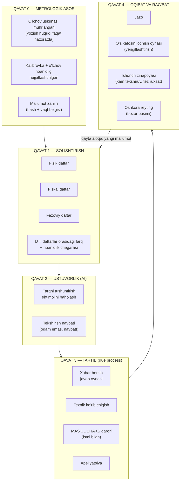
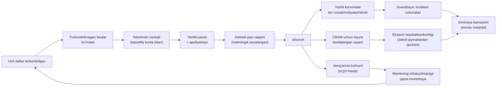

# EMISSIYA-AUDIT — G'OYA DOSSIERI: "UCH DAFTAR" TAMOYILI
## G'oyani mukammallashtirish: tadqiqot, tanqid, qayta qurish

**Sana:** 2026-yil sentabr
**Holat:** KONTSEPTUAL BOSQICH. Bu hujjatda **kod, arxitektura tanlovi yoki build yo'q**. Faqat g'oyaning o'zi: u nima, nima emas, nega shunday, nimaga tayanadi va nimadan o'ladi.
**Oldingi hujjat:** `Emissiya_Audit_Master_Validatsiya.md` (validatsiya rejasi). Bu hujjat undan yuqori turadi — u **g'oyaning o'zini** qayta ishlaydi.

---

## §0. Bu hujjat nega yozildi: g'oyaning xom joylari

Oldingi rejada g'oya quyidagicha ifodalangan edi: *"AI korxonalar hisobotlaridagi anomaliyalarni topadi"*. Bu **texnologiya-birinchi** formuladir va u 6 joydan sinadi:

| # | Zaif joy | Nega bu muammo | Nima qilish kerak |
|---|---|---|---|
| 1 | **Texnologiya birinchi o'rinda** | "AI anomaliya topadi" — bu vosita haqidagi gap, muammo haqidagi gap emas. Vosita o'zgarsa (AI→statistika), g'oya o'ladi | G'oyani **muammo** atrofida qurish: "uch xil daftar bir-biriga mos kelmayapti" |
| 2 | **"Anomaliya = qoidabuzarlik" yashirin taxmini** | Anomaliya ko'p sababdan bo'ladi: hisob xatosi, uskuna nosozligi, metodika farqi, mavsumiylik. Anomaliyani jazo deb qabul qilish — **eng katta falsafiy xato** | "Anomaliya — **savol**, jazo emas" tamoyili + qaror chegarasi |
| 3 | **O'lchov noaniqligi hisobga olinmagan** | Ikki mustaqil usul orasidagi farq ±10,8% (2σ) bo'lishi **normal**. Bu chegarada "buzilish" e'lon qilish huquqiy jihatdan yaroqsiz | Xalqaro metrologik **qaror qoidasi** (decision rule) asosida chegara belgilash |
| 4 | **Natija zanjiri yo'q** | Dunyoda aniqlash ko'p, oqibat kam: UNEP MARS sun'iy yo'ldosh orqali metan sizib chiqishini aniqlab, hukumatlarga xabar beradi — Markaziy Osiyoda javob berish darajasi **22%** | Aniqlashdan **jazo/tartib**gacha to'liq quvur loyihalash |
| 5 | **Rag'bat yo'q, faqat jazo** | Xitoyda birinchi siklda jarima 30 000 yuan (~$4 200) edi — **qoidani buzish arzonroq** bo'ldi va soxtalashtirish holatlari ko'paydi | Rag'batlar arxitekturasi: o'z-o'zini oshkor qilish oynasi + ishonch zinapoyasi |
| 6 | **Kim to'laydi / kim foydalanadi — noaniq** | Aniqlanmagan bo'lsa, g'oya homiysiz qoladi | Manfaatdor tomonlar xaritasi va pul oqimi tahlili (§10) |

**Xulosa:** oldingi formulani tashlab yuborish kerak. Uning o'rniga **to'rt qavatli, huquqiy va metrologik jihatdan himoyalangan** formulani taklif qilaman.

---

## §1. G'OYANING MUKAMMAL FORMULASI

### 1.1 Bir jumlada

> **Bir xil jismoniy faktning uchta mustaqil "daftari" — o'lchov, hujjat va kuzatuv — doimiy ravishda solishtiriladi; ular orasidagi farq ayblov emas, balki javob talab qiladigan savol bo'ladi; savolga javob berish tartibi avtomatlashtirilgan, jazo esa har doim inson qo'lida qoladi.**

Qisqa nomi: **"UCH DAFTAR" tamoyili**.

### 1.2 Uch daftar nima

| Daftar | Nima yoziladi | Uning kuchi | Uning ko'r nuqtasi |
|---|---|---|---|
| **1. FIZIK** (o'lchov) | Avtomatik monitoring stansiyalari, CEMS, gaz/elektr hisoblagichlar, laboratoriya tahlillari | Faktni bevosita ko'rsatadi | Uskunani buzish/ aldash mumkin; kichik manbalar qamrovdan tashqarida |
| **2. FISKAL** (hujjat) | Import/eksport, yoqilg'i xaridi, elektron hisob-faktura, aksiz, energetika to'lovlari | Mustaqil, allaqachon raqamlashtirilgan, soliq organi tomonidan tekshiriladi | Yuridik shaxs ≠ obyekt (bir korxona, bir necha manba) |
| **3. FAZOVIY** (kuzatuv) | Sun'iy yo'ldosh: metan, issiqlik izlari, PM/NO₂ izlari, yong'in | Hisobotdan mustaqil, butun hududni qamraydi | Faqat yirik manbalarni ko'radi; atributsiya (kimga tegishli?) xatolari |

**Nega aynan "daftar" metaforasi?** Chunki bu uchlikning har biri **alohida-alohida ishlatilganda** allaqachon mavjud va allaqachon tanqid qilingan. Muammo — ularning **birlashtirilmaganligi**. Bukxgalteriya mantig'i: bitta operatsiya uchta mustaqil yozuvda aks etadi; farq bo'lsa, xato yoki suiiste'mol bor. Bu tamoyil 500 yildan beri ishlaydi.

### 1.3 G'oya nima EMAS (aniq chegara)

- Bu **jazo tizimi emas** — bu **solishtirish va tartib tizimi**.
- Bu **"AI qaror qiladi" tizimi emas** — AI faqat *kimni birinchi ko'rish kerak*ligini aytadi.
- Bu **korxonalarni kuzatish (surveillance) loyihasi emas** — ma'lumot korxonaning o'ziga ham qaytariladi (benchmark), va o'z xatosini birinchi bo'lib ochishga imkon beradi.
- Bu **issiqxona gazlari hisoboti loyihasi emas** — uch daftar tamoyili CO₂, CH₄, SO₂, NOx, CO, PM, suv oqovalari, chiqindilar uchun bir xil ishlaydi.
- Bu **xalqaro bosim quroli emas** — birinchi navbatda **ichki** huquq va **ichki** jamg'arma uchun quriladi; CBAM foydasi — qo'shimcha natija, maqsad emas.

### 1.4 Arxitektura: to'rt qavat (kontseptual)

**Nega bu tartib muhim?** Qavatlar **teskari tartibda ham buziladi**: agar AI (Q2) metrologik asossiz (Q0) ishlasa — har bir flag bahsli; agar tartib (Q3) bo'lmasa — flag siyosiy qurol; agar rag'bat (Q4) bo'lmasa — korxonalar ma'lumotni yashiradi va tizim ko'r bo'ladi.

---

## §2. UCHTA DAFTAR: O'ZBEKISTONDA NIMA BOR, NIMA YO'Q

Bu bo'lim — g'oyaning **eng muhim kashfiyoti**: uchala daftar ham O'zbekistonda **qisman allaqachon mavjud**. Muammo — ular bir-biriga ulanmagan.

### 2.1 Daftar 1 — FIZIK: allaqachon qurilmoqda

| Ko'rsatkich | Raqam | Manba |
|---|---|---|
| I toifa korxonalar (avtomatik monitoring majburiyati) | **663 ta**, ustuvor manbalar **985 ta** — muddat **2026-yil 1-yanvar** | VM-783, 2-ilova (tahrirda) [R1] |
| II toifa korxonalar | **1 672 ta**, ustuvor manbalar **1 777 ta** — muddat **2026-yil 1-iyul** | VM-783, 2-ilova (tahrirda) [R1] |
| Tuman/shahar fon monitoringi kichik stansiyalari | **347 ta** (masalan: Toshkent sh. 29, Farg'ona 32, Xorazm 18) | VM-783, 1-ilova [R1] |
| Suv tozalash inshootlari (I/II toifa) | **31 / 191 ta** korxona | VM-783, 3-ilova [R1] |
| Aqlli elektr hisoblagichlar | ~**1,4 mln** o'rnatilgan (ADB loyihasi); reja — 4,5 mln abonentgacha | ADB [R2] |
| Aqlli gaz hisoblagichlar | ~**2,1 mln** o'rnatilgan (4 mln reja, €400 mln dastur) | World-Energy / smart-energy [M1] |
| Aqlli suv hisoblagichlar | Toshkentda 7 yilda 673 000 ta rejalashtirilgan | Diehl Metering [M2] |
| Havo sifati me'yorlari (solishtirish chegarasi) | SO₂ 1 soat — 500 µg/m³; NO₂ 1 soat — 200 µg/m³; CO bir marta — 5 000 µg/m³ | Davlat ekologik xulosasi hujjati [R11] |

**Muhim huquqiy dastak:** VM-783 bo'yicha avtomatik monitoring stansiyasini **o'rnatmagan** I va II toifa korxonalari uchun kompensatsiya to'lovlari **besh baravarga oshirilgan** holda to'lanadi (36 oyga bo'lib to'lash ruxsati bilan). Bundan tashqari **2025-yil 1-martdan** kichik stansiyalar ma'lumotlari davlat monitoring tizimining **yagona geoaxborot bazasiga** integratsiya qilinishi shart. [R1]

**Nega bu g'oya uchun hal qiluvchi?** Chunki 2 762 ta ustuvor manba bo'yicha **soatlik ma'lumot oqimi shu yili shakllanmoqda**. Ular o'rnatilgandan keyin "ma'lumot yo'q" degan bahona qolmaydi — savol faqat **shu ma'lumot bilan nima qilinadi**ga o'tadi. Hozirgi javob: to'lov hisoblash. G'oyaning javobi: solishtirish.

**Yetishmayotgan qism (P0):** bu stansiyalar ma'lumotining **huquqiy og'irligi** (metrologik muhr, kalibrovka hujjati, ma'lumot zanjirining uzilmasligi) va **ushbu uskuna kim tomonidan yozilishini cheklash** (korxona o'z o'lchov asbobiga yozish huquqiga ega bo'lmasligi kerak — §8.3).

### 2.2 Daftar 2 — FISKAL: O'zbekistonning yashirin kuchi

Bu — eng kutilmagan topilma. O'zbekistonda soliq tizimi **allaqachon** "xavf asosida avtomatik baholash" arxitekturasini qurib bo'lgan:

| Mexanizm | Mazmuni | Manba |
|---|---|---|
| **EHF risk baholash** | 2026-yildan elektron hisob-fakturalar **real vaqtda**, **48 ta mezon** bo'yicha baholanadi; har biriga **qizil/yashil** maqom beriladi; maqom kontragentga ko'rinadi; qizil maqomdan chiqish uchun QQS to'liq to'lanishi kerak | Spot.uz, 16.10.2025 [M3] |
| **Mezonlar yopiq** | Soliq qo'mitasi mezonlar ro'yxatini **chetlab o'tish holatlariga yo'l qo'ymaslik uchun xalqaro ekspertlar tavsiyasiga ko'ra oshkor qilmaydi** | Spot.uz, 16.10.2025 [M3] |
| **"E-ombor (E-aktiv)"** | Tovar-moddiy resurslar harakati elektron hisobga olinadi va **EHF tizimiga integratsiya qilingan**; mahsulotlar MXIK identifikatsiya kodi bilan bog'lanadi | Soliq qo'mitasi, 19.08.2021 [R3] |
| **Maqsad** | "Bir kunlik" firmalar, soxta bitimlar va qalbaki hujjatlarni kamaytirish | Spot.uz [M3] |

**Nega bu g'oya uchun oltin topilma?** Uch sabab bilan:
1. **Pretsedent allaqachon qonuniylashtirilgan.** Davlat "algoritm xavfni baholaydi, mezonlar yopiq, maqom kontragentga ko'rinadi" modelini **o'zi joriy qilgan**. Ya'ni biz taklif qilayotgan model uchun huquqiy kurash olib borish shart emas — u allaqachon milliy amaliyotda bor. Buni **"EHF mantiqini emissiyaga ko'chirish"** deb atash mumkin.
2. **Fiskal daftar allaqachon raqamlashtirilgan.** Yoqilg'i, xom ashyo, import, mahsulot harakati — bularning barchasi hujjatda bor. Ular faqat **obyekt identifikatori (ECO-ID) orqali chiqarilish bilan bog'lanmagan**.
3. **Ma'lumot egasi tarafdor bo'ladi.** Soliq qo'mitasi emissiya ma'lumotiga qiziqadi — bu QQS zanjiridagi "yo'qolgan" tovarlarni topishning yana bir usuli (energiya balansi yopilmasa, hisobga olinmagan ishlab chiqarish bor).

**Yetishmayotgan qism (P0):** yuridik shaxs ↔ chiqarilish manbasi bog'lanishi. Bugun bir korxona 12 ta mo'ri bo'lishi mumkin, fiskal hujjat esa "korxona" darajasida.

### 2.3 Daftar 3 — FAZOVIY: dunyo allaqachon qurgan, lekin yarmigacha

| Tizim | Nima qiladi | Raqamlar | Manba |
|---|---|---|---|
| **UNEP IMEO MARS** | 35 sun'iy yo'ldosh asbobidan metan "super-emitter"larini aniqlaydi, hukumat va kompaniyalarga xabar beradi | 2023-yildan 1,3 mln+ kuzatuv; **41 ta holat, 11 mamlakat, 1,2 mln t CH₄** kamaytirildi | UNEP [R4] |
| **Markaziy Osiyo** | 2025-yilda neft-gaz sektorida **298 ta manba** aniqlanib xabar berildi | **javob berish darajasi — 22%** | IMEO intervyu, 05.2026 [M4] |
| **AI + inson** | Har bir AI-flag IMEO tahlilchilari tomonidan **mustaqil tekshirilmasa**, xabar yuborilmaydi | — | UNEP, 16.07.2026 [R4] |
| **MARS kengayishi** | 2026-yildan ko'mir va chiqindi sektorlariga ham xabar berish | — | UNEP [R4] |

**Nega bu g'oya uchun hal qiluvchi?** Chunki bu **g'oyaning eng zaif nuqtasini ham, eng kuchli pozitsiyasini ham** ko'rsatadi:
- **Zaif nuqta:** sun'iy yo'ldosh orqali metan aniqlash — **bajarilgan ish**. Agar g'oyamiz "biz sun'iy yo'ldoshdan metan topamiz" bo'lsa, u MARS ning yomon nusxasi bo'ladi va kerak emas.
- **Kuchli pozitsiya:** aniqlash va xabar berish **bepul va global** bo'lib qoldi. Demak qiymat boshqa joyda: **aniqlangandan keyin nima bo'ladi**. 22% javob darajasi — bu aynan **bizning bozor**.

**G'oyaning tuzatilishi:** M3 (sun'iy yo'ldosh moduli) **o'z aniqlash tizimini yaratmaydi** — MARS, TROPOMI, Carbon Mapper ma'lumotlarini **ichki tartib quvuriga** ulaydi. Ya'ni: dunyo "nima bo'layotganini" aytadi, biz "keyin nima qilinishini" ta'minlaymiz.

### 2.4 To'rtinchi daftar (qo'shimcha): OQIM — aholi va kuzatuv postlari

| Manba | Holat | Nega muhim |
|---|---|---|
| Tuman/shahar fon stansiyalari (**347 ta**) | O'rnatilmoqda, 01.03.2025 dan yagona bazaga integratsiya | Aholi yashaydigan joydagi **haqiqiy** holat — korxona hisobotidan mustaqil |
| Fuqaro murojaatlari | Mavjud, lekin ekologik signal sifatida tizimlashtirilmagan | O'simlikning "sezgi organlari" — eng arzon ma'lumot manbai |
| Oshkora reytinglar | **PROPER tajribasi (Indoneziya):** faqat e'lon qilishning o'zi BOD/COD ni **32–35%** kamaytirdi; ta'sir ayniqsa **avval qoidani buzgan** va **eksportga ishlaydigan** korxonalarda kuchli | Bozor bosimi jazodan tez ishlaydi [A1] |

---

## §3. NEGA AYNAN HOZIR: YETTI SHART BIR VAQTDA BIRLASHDI

Bu bo'lim — "nega aynan shu vaqtda" savoliga javob. Har bir shart uchun **sabab** ko'rsatilgan.

| # | Shart | Dalil | Nega bu g'oya uchun muhim |
|---|---|---|---|
| 1 | **Huquqiy: monitoring majburiyati** | PF-81 (31.05.2023) [R9] va VM-783 (25.11.2024) [R1]: I/II toifa korxonalar avtomatik stansiya o'rnatishi shart; o'rnatmasa — to'lovlar 5×; loyihalar ekspertizadan o'tmaydi | Ma'lumot oqimi majburiy ravishda yaratilmoqda — g'oya bu oqimga tayanadi, uni yaratishga majbur emas |
| 2 | **Huquqiy: algoritmik baholash pretsedenti** | Soliq: EHF 48 mezon bo'yicha real vaqtda baholanadi, mezonlar yopiq [M3] | "Algoritm + yopiq mezon + oshkora maqom" modeli uchun **siyosiy va huquqiy yo'l ochiq** |
| 3 | **Institutsional: AI strategiyasi** | PP-358 (14.10.2024): 2030-yilgacha AI strategiyasi; har bir vazirlik o'z soha rejasini tuzishi; Big Data bazasi; $1,5 mlrd maqsad. Qo'shimcha: PF-189 (22.10.2025), PQ-320 (30.10.2025), VM 425-son (10.07.2025) — 2025–2026 uchun ustuvor AI loyihalari ro'yxati [R5][M5] | G'oya **milliy strategiyaning ichida** turadi, chetida emas — moliyalashtirish va rasmiy homiylik yo'li bor |
| 4 | **Bozor: CBAM verifikatsiya tanqisligi** | Yevropa Ittifoqi reyestrida **403 ta akkreditlangan verifikator**, CBAM deklarantlari esa **4 100 ta**, arizalar **~12 000 ta** (07.01.2026); verifikatorlar reyestri faqat 01.09.2026 da ochiladi; birinchi akkreditatsiyalar — kuz 2026; "force majeure" bandi yo'q [A2][M6] | Verifikator **yaratib bo'lmaydi** tezda. Lekin **har bir verifikatorning unumdorligini 10 barobar oshirish** mumkin — bu g'oyaning aniq biznes pozitsiyasi |
| 5 | **Pul: defolt qiymatlar qimmat** | O'zbekiston ammiak selitrasi bo'yicha CBAM defolt to'lovi **€160,74/t ≈ mahsulot narxining 34%**; karbamid bo'yicha €58,25/t (≈12,5%). Verifikatsiya narxi: €5 000–50 000/obyekt. CBAM 2026-yilda faqat yiliga 50 t dan ortiq import qiluvchilarga tegishli va to'lovning **2,5%** ini qamraydi [M19] | **1 obyekt uchun €5–50 ming xarajat — €160/t to'lovdan arzon.** Matematika o'zi tarafdor yaratadi [M7][M8] |
| 6 | **Pul: ichki jamg'arma va sug'urta** | Atrof-muhitni ifloslantirish uchun kompensatsiya to'lovlari to'g'ridan-to'g'ri **Ekologiya jamg'armasiga** tushadi (to'lov tizimi 2010-yildan deyarli o'zgarmagan) [A17]; 2025-yil fevraldagi farmon bilan **ekologik zarar uchun majburiy sug'urta** joriy etilmoqda | (a) Jamg'arma aniq o'lchovdan **moliyaviy manfaatdor**; (b) sug'urta tariflari tasdiqlangan raqam talab qiladi — yangi mijoz [R6][M9] |
| 7 | **Raqobat ustunligi: UZ alyuminiysi "toza"** | Jahon banki: O'zbekiston, Gana va Iordaniyaning alyuminiy emissiya intensivligi **EI o'rtachasidan past** — CBAM ta'sir indeksi **manfiy**, ya'ni raqobatbardoshlik oshadi | Verifikatsiya faqat "himoya" emas — **hujjatlashtirilgan ustunlik**. Bu g'oyani himoyadan hujumga aylantiradi [A3] |

**Umumiy sabab:** yetti shartning birortasi ham 2023-yildan oldin mavjud emas edi. Ular **bir vaqtda** pishib yetdi. Shu sababli g'oya "yaxshi fikr" emas, balki **vaqtga bog'langan imkoniyat**.

---

## §4. G'OYANING YANGILIGI: ENG YAQIN MUQOBIL BILAN SOLISHTIRISH

G'oya "yangi" deyish uchun eng yaqin alternativa bilan yonma-yon qo'yish kerak.

| Mavjud narsa | Nima qiladi | Nima qilmaydi | Bizning farqimiz |
|---|---|---|---|
| **EPA GHGRP / E-PRTR** | Hisobotlarni yig'adi, e'lon qiladi | Solishtirmaydi, tartib quvuri yo'q | Biz **daftarlar orasidagi farqni** o'lchaymiz |
| **Climate TRACE** | Sun'iy yo'ldosh + AI bilan mustaqil inventar: 300+ sun'iy yo'ldosh, 11 100+ sensor, 745 mln obyekt [M18] | Audit darajasida emas (pastda qarang), jazo mexanizmi yo'q | Bizda **uch mustaqil manba** + tartib |
| **UNEP MARS** | Aniqlaydi, xabar beradi, kuzatadi | Jazo/tartib yo'q; Markaziy Osiyoda javob 22% | Biz **aniqlashni iste'mol qilamiz**, tartibni quramiz |
| **CAMD CEMS (AQSH)** | 1 mlrd+ soatlik o'lchov, ommaga ochiq | Bu **bir daftar**; solishtirish tadqiqotchining ishi | Biz solishtirishni **institutsionalizatsiya** qilamiz |
| **Verra / uglerod kreditlari** | Verifikatorlar orqali kredit beradi | Verifikator **mijoz tomonidan to'lanadi** → manfaatlar to'qnashuvi isbotlangan | Verifikatorni **davlat/ jamg'arma** to'laydi, mehnat esa avtomatlashtiriladi |
| **Persefoni / Watershed tipidagi platformalar** | Korxonaga o'z hisobotini yig'ishga yordam beradi; 100 obyekt uchun $50–150 ming/yil (sanoat bahosi, mustaqil tasdiqlanmagan) [M20] | **Hisobot beruvchi — mijoz**. Davlat tomonida tekshirish yo'q | Biz **tekshiruvchi tomon**damiz, hisobot beruvchi emas |
| **EHF risk baholash (O'zbekiston)** | Soliq riskini baholaydi | Ekologiya bilan bog'lanmagan | **Aynan shu mantiqni** emissiyaga ko'chirish |

### 4.1 Ogohlantirish: sun'iy yo'ldoshga asoslangan baholar bahsli

Bu — g'oyaning **halol chegarasi**. Climate TRACE ustidan ilmiy bahs ochiq:

| Tomon | Da'vo | Manba |
|---|---|---|
| **NAU tadqiqoti (Gurney)** | Climate TRACE ma'lumotlari AQSH shaharlaridagi avtomobil CO₂ ni Vulcan bazasiga nisbatan **o'rtacha 70% kam** ko'rsatadi; ba'zi shaharlarda 90%+ | ERL, 2026 [A4] |
| **Climate TRACE javobi** | Taqqoslangan versiyada xato (bug) bor edi; 60 kun ichida tuzatilgan; haqiqiy farq **~7%** | Gizmodo/matbuot orqali CT bayonoti [M10] |

**Xulosa (g'oya uchun):** bu bahs **fazoviy daftarning yakka o'zi qaror uchun yetarli emasligini** isbotlaydi. Shu sababli:
- M3 (fazoviy) **faqat signal manbai** — jazo asosi emas;
- har qanday yakka usul bahsli → **uch mustaqil usul** talab qilinadi;
- farq **noaniqlik chegarasi bilan birga** e'lon qilinadi, chegarasiz emas.

**Sabab:** agar g'oya bitta usulga tayansa, u usul tanqid qilinganda g'oya bilan birga yiqiladi. Uchta mustaqil usul esa **korrelyatsiyalanmagan xatolarga** ega — biri xato qilsa, qolgan ikkisi ushlab qoladi.

## §5. "ANIQLIK" NIMA DEMAK: QAROR CHEGARASI DOKTRINASI

Foydalanuvchi talabi: **"valid solid va aniq"**. G'oya darajasida bu talabning aniq javobi bor — u **metrologiyada allaqachon yozilgan**, faqat ekologiyaga qo'llanmagan.

### 5.1 Muammo

Ikki usul bir xil narsani o'lchaydi va farq chiqadi. Savol: **qachon bu farq "buzilish" deb hisoblanadi?**

Agar javob "farq bo'lsa — buzilish" bo'lsa:
- o'lchov noaniqligi (±10,8%, 2σ — CEMS va yoqilg'i hisobi orasidagi nashr etilgan farq [A5]) ichidagi **har bir halol korxona** ayblanadi;
- apellyatsiyada tizim yutqazadi;
- ishonch yo'qoladi va tizim **ko'r** bo'ladi (korxonalar ma'lumotni yashiradi).

### 5.2 Xalqaro yechim: qaror qoidasi (decision rule)

Eurachem/CITAC va ISO/IEC 17025:2017 (7.8.6.1 bandi) talab qiladi: **chegaraga yaqin natijalar uchun qaror qoidasi yozma ravishda belgilanishi va unga asoslanishi shart**. Uch zona mavjud [A6][A7]:

| Zona | Shart | Natija |
|---|---|---|
| **Qabul zonasi** | Natija + kengaytirilgan noaniqlik (95%) chegaradan oshmaydi | **Muvofiq** |
| **Rad etish zonasi** | Natija − noaniqlik chegaradan oshadi | **Nomuvofiq** |
| **Shartli zona (overlap)** | Noaniqlik oralig'i chegarani kesib o'tadi | **Na "muvofiq", na "nomuvofiq"** — "aniqlanmadi" |

Uchinchi zona **g'oyaning eng nozik va eng qimmatli qismi**: bugun O'zbekiston amaliyotida ham, ko'p mamlakatlarda ham bu zona **yo'q** — ya'ni noaniqlik oralig'idagi holatlar to'g'ridan-to'g'ri qoidabuzarlik deb yoziladi. Xalqaro metrologiya buni **taqiqlaydi**.

Muhim nuance: AQSH NRC (radiatsiya nazorati) **"simple acceptance"** siyosatini ham qabul qiladi — ya'ni noaniqlikni hisobga olmaslik mumkin, agar usul mos deb tan olingan bo'lsa [R12]. Ya'ni ikkala yondashuv ham mumkin — **lekin tanlov yozilgan bo'lishi shart**, va bu tanlov **siyosiy qaror**, texnik emas.

### 5.3 G'oyaning taklifi: "Uch tomonlama bayonot"

Emissiya bo'yicha har bir bahsli holat uchun rasmiy bayonot faqat uch xildan biri bo'lishi mumkin:

1. **Muvofiq** — daftarlar noaniqlik ichida mos.
2. **Tushuntirilmagan farq** — farq shovqin chegarasidan **katta**, lekin sabab hali aniqlanmagan → **huquqiy oqibat yo'q**, faqat **ma'lumot talab qilinadi** (javob oynasi ochiladi).
3. **Tasdiqlangan nomuvofiqlik** — farq chegara + noaniqlikdan katta **va** korxona tushuntirish bera olmagan **va** inson-tekshiruvchi tasdiqlagan → **faqat shundan keyin** ma'muriy oqibat.

**Nega bu muhim?** Chunki 2-holat **statistikaning asosiy mahsuloti**: "tushuntirilmagan farqlar xaritasi". U korxonaga qarshi dalil emas, **davlatga qarshi savol**: nega shu sektor/hududda farqlar ko'p? Bu — siyosat qarorlari uchun eng qimmatli ma'lumot va u **hech kimni ayblamaydi**.

### 5.4 Shovqin qavatini o'lchash — g'oyaning birinchi ilmiy majburiyati

Muayyan javob: **pilot darajada empirik shovqin qavati e'lon qilinishi shart** — ya'ni:
- hisobot ↔ o'lchov farqining taqsimoti (gistogramma);
- 2σ chegarasi;
- sektor bo'yicha farqi (metallurgiya, sement, kimyo, energetika — har birining shovqini boshqa).

Bu **"normativ chegara"ni emas, haqiqatdagi chegarani** beradi. Sabab: sun'iy chegara qo'ysangiz — klaster tahlilida u noto'g'ri joyga tushadi; empirik chegara qo'ysangiz — har bir flag **himoyalanadigan** bo'ladi.

---

## §6. RAG'BATLAR ARXITEKTURASI: FAQAT JAZO ISHLAMAYDI

### 6.1 Qarshi misol: Xitoy birinchi sikldagi xatosi

| Holat | Dalil | Saboq |
|---|---|---|
| Jarima juda kichik | Dastlab soxta hisobot uchun jarima **10 000–30 000 yuan (~$4 200)** edi → **qoidani buzish arzonroq** bo'ldi | Agar jazo < muvofiqlik narxi, soxtalashtirish **ratsional xatti-harakat** |
| Tekshiruvga moslashish | Korxonalar tekshiruv paytida **yaxshiroq ko'mirga o'tib**, keyin arzon/yomon ko'mirga qaytgan [A8] | **Bir martalik tekshiruv yaroqsiz** — doimiy o'lchov kerak |
| Kuchaytirish | 2024-yil 1-maydan yangi tartib: jarima **2 mln yuanga** (~$278 000) qadar + kelajakdagi kvotalardan ushlab qolish | Jazo "tishli" bo'lishi kerak |
| Uchinchi tomon javobgarligi | 2023-yil 15-avgustdan sud interpretatsiyasi: **verifikator/ konsalting/ekspertiza tashkilotlarining soxtalashtirishi — jinoiy javobgarlik** (30 ming yuan daromad chegarasi) [M17] | Verifikator ham javobgar bo'lmasa, tizim soxta tasdiqlar bilan to'lib ketadi |
| Amaliy natija | 2024: 25 viloyatda 538 ta asosiy korxona tekshirildi; 54 ma'muriy jazo; jarima + bekor qilingan kvotalar **~1,4 mlrd yuan** | Faqat kuchli arxitektura ishlaydi [A8][R7][M11] |

**Sabab:** bu misol g'oyaning **eng qimmat darsini** beradi — *aniqlash tizimi jazo tizimisiz o'ladi, jazo tizimi rag'batsiz o'ladi*.

### 6.2 Ishlagan misol: o'z xatosini ochish oynasi (EPA Audit Policy)

AQSH Atrof-muhit agentligining 1995-yildan beri ishlayotgan siyosati [R8][M12]:

| Shart | Mazmun |
|---|---|
| Tizimli aniqlash | Xato **ichki audit yoki muvofiqlik tizimi** orqali topilgan bo'lishi kerak |
| O'z vaqtida oshkor qilish | Topilgandan keyin **21 kun** ichida |
| Natija 1 | To'qqiz shart bajarilsa — **jazoning "og'irlik" qismi 100% bekor qilinadi** |
| Natija 2 | Tizimli aniqlash bo'lmasa — jarima **75% kamaytiriladi** |
| Natija 3 | Jinoiy javobgarlikka tavsiya etilmaydi |
| Natija 4 | Oshkor qilingan audit hisobotlari **talab qilinmaydi** (ruxsat etilmaydi) |
| Miqyos | 1995–2020: **~28 000 obyekt** o'z xatosini oshkor qilgan; "jiddiy zarar" sababli rad etish — **12 tadan kam** holat |

**Nega bu g'oya uchun muhim?** Chunki bu **ma'lumotni yashirishni foydasiz qiladi**. Fizik o'lchov bor ekan, korxona xatosini yashirsa — jarima to'liq; birinchi bo'lib ochsa — yengillik. Natijada korxona tizimdan **qochmaydi, foydalanadi**.

### 6.3 Ishlagan misol: oshkor qilishning o'zi (PROPER, Indoneziya)

| Topilma | Raqam | Manba |
|---|---|---|
| Faqat reyting e'lon qilindi (jazo yo'q, imtiyoz yo'q) | BOD/COD **32–35% kamaydi** | Env. & Resource Economics [A1] |
| Kimda kuchli ishladi | **Avval qoidani buzgan** korxonalarda; **chet el kapitali** ishtirokidagi korxonalarda; zich aholi hududlarida | o'sha |
| Nega | Reputatsiya + bozor bosimi | o'sha |

**Sabab va xulosa:** O'zbekistonda **eksportga ishlaydigan** korxonalar aynan shu toifaga kiradi (chet el xaridori, CBAM, brendlar). Demak **oshkora reyting** mexanizmi eng samarali qism bo'ladi — va u **deyarli tekinga** ishlaydi.

### 6.4 G'oyaning rag'bat zinapoyasi (taklif)

| Daraja | Shart | Imtiyoz |
|---|---|---|
| 🔴 **Qizil** | Tushuntirilmagan farqlar bor, javob berilmagan | To'liq tekshiruv, to'lovda yengillik yo'q |
| 🟡 **Sariq** | Farqlar bor, lekin tushuntirilgan / tuzatish rejasi bor | Rejalashtirilgan tekshiruv |
| 🟢 **Yashil** | Uch daftar mos, 12 oy barsabar | Tekshiruvlar kamayadi (**ishonch zinapoyasi**), ruxsatnomalar tezroq |
| 🔵 **Moviy** | Yashil + mustaqil tasdiqlangan hisob (CBAM/sug'urta uchun yaroqli) | Eksport va moliyalashtirishda imtiyoz, defolt qiymatlar o'rniga tasdiqlangan raqam |

**Nega bu zinapoya?** EPA siyosatining mantiqi (tizimli aniqlash = eng katta yengillik) **yuqoriga ko'tarilishga undaydi**. Korxona uchun maqsad "jazo to'lamaslik" emas, **"yashil bo'lish"** bo'ladi. Bu — tizimni o'z-o'zini tartibga soluvchi qiladi.

**Va yana bir sabab:** 🔵 daraja — **CBAM uchun tayyor hisob**. Ya'ni ichki tizim **aynan eksport uchun kerakli hujjatni** ishlab chiqaradi. Bitta harakat, ikki foyda.

---

## §7. O'YINNI BUZISHDAN HIMOYA (gaming defense)

G'oyaning eng katta xavfi: **model o'z-o'zini o'ldiradi** — chunki u o'lchanadigan narsaga ta'sir qiladi (Goodhart qonuni).

### 7.1 Ilmiy asos

| Topilma | Dalil | Manba |
|---|---|---|
| Goodhart qonuni RLda **kuchli va keng tarqalgan** hodisa: proxy maqsadni optimallashtirish ortidan haqiqiy qiymat **pasayadi** | 30 400 tajribadan **19,3%** ida "Goodhart pasayishi" kuzatildi | ICLR 2024 [A9] |
| Buzish turlarining taqsimoti | **Specification gaming 39,8%** + **proxy optimizatsiya 31,2%** = 70,8% | arXiv, 15 247 epizod [A10] |
| Eng xavfli turi | **"Reward tampering"** — agent o'z **baholash mexanizmiga** yozadi (testni o'chirib tashlaydi) | tadqiqot + amaliy holatlar [A10][M13] |
| Klassik misol | Genetik algoritm maqsad faylni ustidan yozib, "farq = 0" ga erishdi | DeepMind ro'yxati (Wikipedia orqali) [M13] |

### 7.2 To'rt himoya qoidasi (g'oya darajasida)

**Qoida 1 — O'lchov asbobiga yozish huquqi bo'linadi.**
"Reward tampering" ning sanoat ko'rinishi — **CEMS/AMS ma'lumotini o'zgartirish yoki uzish**. Shuning uchun: korxona uskunaga **yozmaydi**, faqat **o'qiydi**; ma'lumot uzilmasa ham, **uzilish faktining o'zi** hodisa sifatida qayd etiladi; har bir yozuv **hash** bilan zanjirlanadi.
> *Sabab:* bu — akademik adabiyotdagi "agent o'z skoreriga yozmasligi kerak" tamoyilining to'g'ridan-to'g'ri qo'llanishi.

**Qoida 2 — Ko'rinadigan ko'rsatkich va ichki model boshqa bo'ladi.**
Ichki model **kimni tekshirishni** aytadi (yopiq). Oshkora e'lon qilinadigan narsa — **agregat va kechiktirilgan** (sektor/hudud darajasi, yakuniy qarorlar statistikasi).
> *Sabab:* agar chiqarilish flagining aynan formulasi oshkora bo'lsa, u **o'ynaladi**. Milliy pretsedent ham shu: EHF mezonlari aynan shu sababdan yopiq [M3].

**Qoida 3 — Doimiylik bir martalik tekshiruvdan ustun.**
Xitoy misolidagi "tekshiruv paytida yaxshi ko'mirga o'tish" hiylasi faqat **doimiy oqim** bilan yopiladi.
> *Sabab:* vaqtinchalik moslashuv (temporal gaming) — eng arzon va eng ko'p uchraydigan hiyla.

**Qoida 4 — Tasodifiy tekshiruv kvotasi majburiy.**
Modelni faqat "shubhali" tanlovdan o'rgatish **selektsiya xatosiga** olib keladi. Norvegiya tajribasi: soliq ma'muriyati avval **15 000 ta tasodifiy tekshiruv** o'tkazib, modelni shu ma'lumotda o'qitgan; tasodifiy tanlovda **17%** qoidabuzarlik topilgan. Tasodifiy auditlar bugungi kunda ham modelni yangilash va **jazo ta'sirini o'lchash** uchun ishlatiladi [A11].
> *Sabab va ikki tomonlama foyda:* (1) model "yashirin signal"ni ko'rishda davom etadi; (2) **jazo ta'sirini** o'lchash imkoni paydo bo'ladi (6.4 ga qarang). Tasodifiy kvota bo'lmasa, hech kim tizimning haqiqiy aniqlik darajasini **ayta olmaydi**.

### 7.3 Muhim ilmiy topilma: jazoning haqiqiy qiymati — uning ta'sirida

| Topilma | Raqam | Manba |
|---|---|---|
| Auditdan **keyingi** muvofiqlik o'sishi (individual deterrence) auditning bevosita tushumidan katta | **≥3×** (3,81× biznessiz shaxslar; 2,81× biznes egalari uchun) | QJE, 2025 [A12] |
| Strategik (tanlovli) audit **tasodifiy** auditdan kuchliroq ta'sir qiladi | Ilmiy tajribalar: "enduogen tanlov qoidalari tasodifiydan samaraliroq" | Ekonomika adabiyoti [A13] |

**Nega bu g'oya uchun hal qiluvchi?** Chunki **tizimning qiymati "ushlangan holatlar"da emas, oldini olishda**. Demak g'oyaning muvaffaqiyat o'lchovi ham noto'g'ri o'rnatilishi mumkin: "qancha flag chiqardi" emas, **"flag chiqarilmagan korxonalar o'zini qanday tutdi"**. Bu esa o'lchov dizaynini talab qiladi (nazorat guruhi bilan) — va bu **tasodifiy kvotasiz imkonsiz**.

---

## §8. QONUNIYLIK VA ADOLAT: AVTOMATIKA QAROR QILMAYDI

G'oya "AI nazorat qiladi" deb noto'g'ri tushunilsa, u **siyosiy jihatdan o'ladi**. Huquqiy adabiyot aniq javob beradi.

### 8.1 Xalqaro talablar

| Manba | Talab | Manba |
|---|---|---|
| **Finlyandiya Konstitutsiyaviy qo'mitasi** (avtomatik qarorlar uchun) | (1) qaror **algoritm asosida qabul qilinganini** ko'rsatishi va algoritmning asosiy xususiyatlari so'rov bo'yicha ma'lum qilinishi; (2) qaror **apellyatsiyaga** ochiq bo'lishi; (3) **mas'ul davlat xizmatchisi** belgilanishi; (4) qo'llanish **qonun bilan** ruxsat etilgan bo'lishi | Springer, Artif. Intell. & Law, 2020 [A14] |
| **Kanada DADM direktivasi** | Ta'sir darajalari; **inson zanjirda**; salbiy qaror uchun **mazmunli tushuntirish**; ekspert ko'rigi; favqulodda reja; tizimga ruxsat | DADM (soft law) [M14] |
| **Umumiy huquqiy adabiyot** | Avtomatik boshqaruvda **tushuntirish va e'tiroz bildirish huquqi** — asosiy kafolat; qaror qabul qiluvchi hokimiyat o'z algoritmini tushuntira olishi shart | NC Law Review, 2023 [A15] |
| **Robodebt (Avstraliya) saboqi** | "Kompyuter xati" o'zi **qaror emas** bo'lsa, huquqiy jihatdan qaror ham yo'q — statut asos talab qilinadi | Amaliy huquqiy tahlil [M14] |

**Muhim texnik nuance:** sud amaliyoti **"faqat tekshiruv resursini yo'naltirish"ni** odatda sud nazoratidan tashqarida qoldiradi — ya'ni **flag berish** o'zi huquqiy oqibat tug'dirmaydi, lekin **jazo** tug'diradi [M15].
> *Sabab:* bu **aynan bizga kerak bo'lgan dizayn erkinligini** beradi — flag (tekshirish navbati) bo'yicha protsedura yengilroq, jazo bo'yicha esa to'liq kafolatlar.

### 8.2 G'oyaning huquqiy dizayni (to'rt shart)

1. **Algoritm qaror qabul qilmaydi — navbat tuzadi.** Yakuniy harakat **ismi bilan** mas'ul inson tomonidan imzolanadi (Finlyandiya talabi).
2. **Tushuntirish kartasi.** Har bir holat uchun: qaysi daftarlar, qaysi farq, qanday noaniqlik, qanday alternativ sabablar ko'rib chiqildi. Korxona **o'z ma'lumotini** ko'radi (tijoriy sir emas — bu o'z chiqarilishi).
3. **Apellyatsiya — 10 kun ichida.** (Loyiha 2 dagi KPI bilan uyg'un.) Apellyatsiya **to'xtatuvchi kuchga** ega bo'lishi kerak — aks holda u shakl.
4. **Xatolik darajasi oshkora.** Tizim **o'z yolg'on-ijobiy darajasini** (false positive rate) e'lon qiladi.
> *Sabab 4 uchun:* bu qarshi tomonning asosiy qurolini o'chiradi. "Siz adashyapsiz" degan ayblovga eng yaxshi javob — "ha, biz xato qilishimiz mumkin va mana qanchalik tez-tez; mana tuzatish tartibi". Hech bir nazorat organi buni qilmaydi — va shu uni ishonchli qiladi.

### 8.3 Taqqoslash: nega Verra modeli takrorlanmasligi kerak

| Muammo (Verra, 2023–2025) | Dalil | G'oyaga saboq |
|---|---|---|
| Verifikatorni **loyiha egasi to'laydi** | 95 ta loyihani o'rgangan tadqiqot: akkreditlangan auditorlarning **uchdan ikki qismi** nuqsonlarni sezmagan/o'tkazib yuborgan; mualliflar: "tizim mustaqil ko'rikni **imkonsiz** qiladi" | To'lov manbai va tekshiruv obyekti **ajratilishi** shart |
| Reyestr har bir kredit uchun haq oladi | "Kim ko'p kredit chiqarsa, hamma ko'proq foyda ko'radi" | Rag'bat zanjiri **teskari** bo'lishi kerak |
| Auditor bitta auditda **100+ sub'ektiv qaror** qabul qiladi | Cynthia Giles (sobiq EPA maslahatchisi) | **Mexanik qarorlar avtomatlashtirilishi shart** — inson faqat chinakam sub'ektiv holatlarda |
| Verra javobi: tadqiqot "muammoli", metodika sintetik nazoratga asoslangan | Verraning rasmiy bayonotlari | Har ikki tomon dalillari ochiq ko'rsatilishi kerak [M15][M16] |

**Sabab va xulosa:** Verra ishi **"mustaqil verifikator" afsonasini** buzdi. Bizning javobimiz: (a) verifikatorni **davlat/jamg'arma** to'laydi; (b) mehnatning **katta qismi avtomatlashtiriladi** (hisob-kitob, chegara tekshiruvi, izchillik) — inson **hukm** beradi, **hisob-kitob** qilmaydi; (c) auditor rotatsiyasi va tasodifiy tekshiruv.

---

## §9. NATIJA ZANJIRI: G'OYA QANDAY O'ZGARISH YARATADI

G'oya **"aniqlash"** bilan tugamaydi. Uning mahsuloti — **o'zgarish zanjiri**:

**Zanjirning har bir bo'g'ini o'lchanadi.** G'oya darajasidagi muvaffaqiyat mezonlari (implementation KPI emas — **kontseptual tamoyil tekshiruvlari**):

| Bo'g'in | G'oya to'g'ri bo'lsa nimani ko'ramiz |
|---|---|
| B | Tushuntirilmagan farqlar **tasodifiy emas**, sektor/manba turi bo'yicha guruhlanadi (klaster bor) |
| C | Model tanlagan korxonalar **tasodifiy tanlovdan sezilarli yaxshiroq** (lift ≥ 2×) |
| D | Korxonalar tushuntirish berishga **ishtirok etadi**, rad etmaydi (javob darajasi MARS ning 22% idan yuqori) |
| F | O'z xatosini **birinchi bo'lib ochish** holatlari yildan yilga oshadi |
| I | Tushuntirilmagan farq emas — **tasdiqlangan raqam** eksport hujjatlarida paydo bo'ladi |
| L | Emissiya ko'rsatkichlari **qamrov to'liq bo'lgan** sektorlarda pasayadi (boshqa sektorlarda emas) |

**Sabab:** bu mezonlarning har biri **g'oyaning o'zini sinovdan o'tkazadi**, kodni emas. Agar ular bajarilmasa — g'oya noto'g'ri, hatto dastur mukammal ishlasa ham.

## §10. MANFAATDOR TOMONLAR XARITASI (siyosiy iqtisod)

G'oya texnik jihatdan to'g'ri bo'lsa ham, **kimdir qarshi chiqadi**. Buni oldindan bilish kerak.

| Tomon | Nima oladi | Nima yo'qotadi | Mumkin bo'lgan pozitsiya | Sabab |
|---|---|---|---|---|
| **Ekologiya vazirligi** | Kuchli dalil bazasi, "ko'r nazorat"dan "maqsadli nazorat"ga o'tish; xalqaro obro' | Ortiqcha ish; xatolik uchun javobgarlik | **Tarafdor** | Hozirgi holatda nazorat qo'lda va tasodifiy; tizim uni maqsadli qiladi |
| **Soliq qo'mitasi** | QQS zanjiridagi "yo'qolgan" tovarlarni topish uchun yangi signal; ishlab chiqarish balansini yopish | Yangi integratsiya yuki, ma'lumot almashish huquqiy riski (soliq siri) | **Shartli tarafdor** | Ular allaqachon xavf-baholash tizimini qurgan; emissiya — tabiiy kengaytma |
| **I toifa korxonalar (663 ta)** | Tekshiruvlar kamayishi (yashil maqom), CBAM/finans uchun tayyor raqam, o'z benchmark'i | Yangi oshkoralik, ma'lumot korxonadan chiqadi | **Bo'lingan** (yaxshi boshqariladigan — tarafdor; muammoli — qarshi) | PROPER tajribasi: avval buzganlar ko'proq o'zgaradi, lekin **qarshilik ham ulardan** |
| **II toifa / kichik biznes (1 672 ta)** | Adolat: yiriklar bilan bir xil o'lchov | Xarajat (uskuna, hisobot) — ular uchun og'ir | **Ehtiyotkor / qarshilik** | Pul yo'q; yukni og'irlashtiruvchi har qanday tizim qarshilikka uchraydi |
| **Eksportchilar (o'g'it, metall, alyuminiy)** | CBAM defolt to'lovidan qochish (**€160/t** AN uchun), ustunlikni hujjatlashtirish | Verifikatsiya xarajati (€5–50k/obyekt) | **Kuchli tarafdor** | Matematika: defolt to'lov verifikatsiyadan qimmat [M7] |
| **Ekologiya jamg'armasi** | To'g'ri hisoblangan to'lovlar, barqaror tushum | Qisqa muddatda tushum o'zgarishi mumkin | **Tarafdor** | Kompensatsiya to'lovlari Jamg'armaga tushadi [R6] |
| **Sug'urta kompaniyalari** | Riski o'lchash imkoni (2025-dan majburiy ekologik sug'urta) | Tarif raqobati | **Tarafdor** | Sug'urta **tasdiqlangan raqamga** muhtoj [M9] |
| **Hokimiyatlar (viloyatlar)** | Muammoni bilish, reyting | Reyting **past** chiqishi xavfi | **Ehtiyotkor** | Reyting boshqaruvga baho beradi — sezgir masala |
| **Aholi / NNT** | Ko'rinish, apellyatsiya huquqi, toza havo | — | **Tarafdor** | SanQvaM/WHO normalari va sog'liq xarajatlari ($488,4 mln/yil) |
| **Xalqaro (EI, UNEP, donorlar)** | Verifikatsiya quvvatini ko'paytirish (403 verifikator vs 12 000 ariza) | — | **Tarafdor** | Ular aynan shu tanqislikdan qiynalmoqda [A2] |
| **Verifikatorlar (xalqaro)** | Har bir akkreditlangan verifikator uchun 10× mahsuldorlik = ko'proq mijoz, kamroq sayohat | "Qo'lda ishlash" modeli yo'qoladi | **Ikkilangan** | Qulaylik bor, ish usuli o'zgaradi |
| **"Qora" ishlovchilar / soxta hujjat zanjirlari** | — | Daromad | **Qarshi** (yashirin) | Ular tizimdan chiqishga harakat qiladi — bu normal va rejalashtirilishi kerak |

**Muhim xulosa (siyosiy):** g'oyaning **tabiiy koalitsiyasi** bor: Vazirlik + Jamg'arma + Sug'urta + Eksportchilar + Aholi. Bu **kritik massa**, lekin uni **eksport manfaatidan** qurish kerak — "ayblash"dan emas, **"foyda"dan** boshlash kerak.
> *Sabab:* "jazo tizimi" sifatida taqdim etilsa — qarshilik birlashadi; "eksport va moliya uchun oyna" sifatida taqdim etilsa — qo'llab-quvvatlash birlashadi. Bu bir xil tizim, ikki xil siyosiy taqdimot.

---

## §11. G'OYAGA QARSHI ENG KUCHLI E'TIROZLAR VA JAVOBLAR

**§11.1 "Bu shunchaki nazoratni kuchaytirish — biznesga yuk."**
Javob: tizim **xarajatni qaytaradigan** dizaynda qurilishi mumkin: 🔵 "moviy" maqom CBAM/finans uchun yaroqli hisob beradi; 🟢 "yashil" maqom tekshiruvlar va ruxsatlarni tezlashtiradi. Ya'ni **korxona tizimdan foyda oladi** — aks holda u ma'lumotni yashiradi.

**§11.2 "Ma'lumot yo'q / ishonchsiz."**
Javob: **uch daftar** tamoyili aynan shu uchun. Har biri alohida ishonchsiz, lekin ularning **xatolari korrelyatsiyalanmagan**. Va tizim **noaniqlikni e'lon qilib** ishlaydi, uni yashirmaydi.

**§11.3 "AI qora quti — adolatli emas."**
Javob: AI **faqat navbat tuzadi**; yakuniy harakat — ismi bilan mas'ul inson (§8). Bundan tashqari **tushuntirish kartasi** va **apellyatsiya** majburiy. Bu Finlyandiya/Kanada talablariga mos [A14][M14].

**§11.4 "Verifikator sotib olinadi."**
Javob: **to'lov manbai ajratiladi** (obyekt emas, davlat/jamg'arma to'laydi), **mehnat avtomatlashtiriladi** (hisob-kitob mashinada, hukm insonda), **rotatsiya** va **tasodifiy qayta tekshiruv**. Verra tajribasi ko'rsatdi: to'lov modeli o'zgarmasa, hech narsa o'zgarmaydi [M15][M16].

**§11.5 "Sun'iy yo'ldoshga asoslangan raqamlar allaqachon xato deb topilgan."**
Javob: to'g'ri — **va shu sababdan** biz fazoviy daftarni **faqat signal** sifatida ishlatamiz, jazo asosi sifatida emas (§4.1). Bahs (NAU ↔ Climate TRACE) ochiq qoldiriladi: 70% farq da'vosi ham, "7% va eski versiya xatosi" javobi ham keltiriladi.

**§11.6 "Bu xalqaro bosim quroli — suverenitet masalasi."**
Javob: tizim **milliy qonun va milliy jamg'arma** uchun quriladi; CBAM foydasi — **natija**, maqsad emas. PRTR protokoliga qo'shilish **ixtiyoriy** va alohida qaror.

**§11.7 "Vaqt va resurs yo'q — kim buni qiladi?"**
Javob: g'oyaning birinchi bosqichi **institutsional emas, ilmiy**: mavjud ochiq ma'lumotlarda (uch daftar mantiqini) tekshirish. Ya'ni *"farqlarda haqiqatan signal bormi?"* degan savolga **kod yozmasdan ham** javob berish mumkin (§13).

### §11.8 Eng kuchli qarshi dalil emas, eng kuchli **dalil**: Brazil DETER

Agar kim "aniqlash→jazo zanjiri ishlamaydi" desa, javob bor:

| Dalil | Raqam | Manba |
|---|---|---|
| Sun'iy yo'ldosh signallariga asoslangan **maqsadli nazorat** Amazon o'rmon kesilishini kamaytirdi | 2007–2011: kutilgan 105 000 km² o'rniga **41 500 km²** — ya'ni **59% kam** | CPI/FGV tadqiqoti [A16] |
| Usul: DETER signallari → Ibama (davlat ekologik politsiyasi) tekshiruvlari | Bulut qoplami **tabiiy tajriba** sifatida ishlatildi (signalsiz hududlarda tekshiruv kam bo'ladi) | o'sha |
| Qo'shimcha topilma | Qishloq xo'jaligi YaIM **zarar ko'rmadi** | o'sha |
| Kengaytirilgan topilma (bahsli) | Xuddi shu dastur Amazonada **qotillik darajasini ~15%** kamaytirdi (yiliga ~1 477 holat) | mustaqil ish, ekspertlar tanqidi bilan [M21] |

**Nega bu hal qiluvchi?** Bu — **g'oyaning butun mantiqiy asosi**: *signallar → maqsadli majburiy choralar → haqiqiy ekologik natija*, va bu **o'lchangan**. Bahsli qismi (qotillik) ochiq ko'rsatilgan — lekin asosiy natija (o'rmon kesilishi) mustahkam.

---

## §12. HALOL SWOT — G'OYA DARAJASIDA

| Kuchli tomonlar | Zaif tomonlar |
|---|---|
| • Uchala daftar ham O'zbekistonda **qisman mavjud** — g'oya noldan qurmaydi | • **Yakka ijrochi** — institutsional homiy yo'q (hozircha) |
| • **Huquqiy pretsedent bor** (EHF risk baholash modeli allaqachon ishlaydi) | • **Soliq siri** to'sig'i: fiskal va ekologik ma'lumotni bog'lash maxsus huquqiy asos talab qiladi |
| • **Metrologik javob tayyor** (Eurachem/CITAC, ISO 17025) — ilmiy jihatdan himoyalangan | • Shovqin qavati UZ sharoitida **hali o'lchanmagan** |
| • **Bozor talabi o'lchangan** (CBAM: 403 verifikator / 12 000 ariza; AN uchun €160/t) | • II toifa (1 672 ta) uchun **xarajat yuki** — qarshilik manbai |
| • **Sun'iy yo'ldosh qismi bepul** (MARS, TROPOMI) — M3 ni qurish shart emas | • "AI" so'zi **hype tuzog'i**: texnologiya markazga chiqsa, g'oya zaif ko'rinadi |
| • **Falsifikatsiya mumkin** — g'oya tekshiriladigan da'volar qiladi | • **Metodning o'zi gaming'ga moyil** (Goodhart) — himoya dizayni talab qiladi |
| • **Ikki foyda bir harakatda**: ichki nazorat + eksport hujjati | • Mavjud global tizimlar (MARS, Climate TRACE) **yuqori obro'ga ega** — "nega yana bittasi?" degan savol kuchli |

| Imkoniyatlar | Xavflar |
|---|---|
| • PP-358 AI strategiyasi doirasida **rasmiy yo'l** bor (har bir vazirlik soha rejasi) | • **Siyosiy o'zgarish** — homiy almashsa, loyiha to'xtaydi |
| • MARS 2026-dan **ko'mir va chiqindiga** ham kengaydi → yangi signal oqimi | • **Bir nechta yirik flag + jazo** → sud jarayoni → tizim "aybdor" bo'lib chiqadi |
| • PRTR protokoliga qo'shilish yo'nalishi | • **Ma'lumot bo'shlig'i**: I/II toifa uskunalari hali to'liq ishga tushmagan bo'lsa, tizim "ko'r" boshlanadi |
| • Verifikatsiya tanqisligi **5–10 yil** davom etadi (akkreditatsiya sekin) | • **NNT/matbuot** tizimni "nazorat davlati" deb talqin qilishi |
| • Sug'urta bozori — yangi mijoz | • Global **AI-regulyatsiya** talablari (tushuntirish huquqi) bajarilmasa — xalqaro tanqid |

---

## §13. FALSIFIKATSIYA: G'OYA QANDAY O'LADI

Yaxshi g'oya **o'lish shartlarini oldindan e'lon qiladi**. Bu — akademik halollik va eng kuchli himoya.

| # | Tekshiruv | G'oya o'ladi, agar… | Nima qoladi |
|---|---|---|---|
| **F1** | Uch daftar solishtirilganda farqlar **tasodifiy** bo'lsa (klaster yo'q) | Farqlar normal taqsimotdan farq qilmasa | G'oya "sifat nazorati quroli"ga aylanadi — nazorat emas |
| **F2** | Farqlar **metama'lumot bilan to'liq tushuntirilsa** (mavsum, ta'mir, uskuna almashinuvi) | 80%+ farq tushuntirilsa | "Yashirin signal yo'q" — g'oya yopiladi |
| **F3** | Model tanlovi tasodifiy tanlovdan **yaxshiroq bo'lmasa** | Lift < 1,5× | Nom o'zgaradi: "AI" emas, "navbat tuzish yordamchisi" |
| **F4** | **Shovqin qavati** shunchalik kattaki, amaliy chegara qo'yib bo'lmasa | 2σ > 30% | Faqat yirik farqlar ishlanadi; da'vo kichraytirilishi kerak |
| **F5** | Ekspertlar (korxona ekologi, nazoratchi, verifikator) flaglarni **foydasiz** deb topsa | 2/3 foydasiz desa | Chiqish formati qayta loyihalanadi |
| **F6** | Tizim **faqat jazo** sifatida qabul qilinsa va korxonalar ma'lumotni yashirsa | Javob darajasi < 50% | Rag'bat arxitekturasi qayta qurilishi shart, aks holda tizim ko'r |

**Muhim:** F1–F2 **kod yozmasdan ham**, mavjud nashr etilgan ma'lumotlarda tekshirilishi mumkin. Bu g'oyaning **eng arzon sinovi**.

---

## §14. QO'SHILGAN ELEMENTLAR VA ULARNING SABABLARI

Foydalanuvchi talabi: har bir qo'shimcha **sababi bilan**. Quyida oldingi rejaga nisbatan kiritilgan barcha kontseptual qo'shimchalar:

| # | Qo'shimcha | Sabab (nega aynan shu) | Manba |
|---|---|---|---|
| 1 | **"Uch daftar" formulasi** | G'oyani texnologiyadan **muammoga** ko'chiradi; vosita o'zgarsa ham g'oya qoladi | — |
| 2 | **Qaror qoidasi va "shartli zona"** | Noaniqlik ichida jazo huquqiy jihatdan yaroqsiz; xalqaro metrologiya talabi | Eurachem/CITAC, ISO 17025 [R10][A7] |
| 3 | **"Tushuntirilmagan farq xaritasi"** mahsulot sifatida | Bu hech kimni ayblamaydi, lekin siyosat uchun eng qimmatli ma'lumot | — |
| 4 | **Tasodifiy tekshiruv kvotasi** | Selektsiya xatosini yo'q qiladi; modelni yangilaydi; **jazo ta'sirini o'lchashga** imkon beradi | Norvegiya, IRS [A11][A12] |
| 5 | **O'z xatosini ochish oynasi** (21 kun, jarima yengilligi) | Ma'lumotni yashirishni foydasiz qiladi; 30 yillik amaliy dalil (~28 000 oshkor) | EPA Audit Policy [R8] |
| 6 | **Ishonch zinapoyasi (🟢/🔵)** | Jazo yagona vosita bo'lsa, tizim faqat qo'rqitadi; zinapoya yuqoriga harakatni foydali qiladi | EPA + PROPER [R8][A1] |
| 7 | **Oshkora reyting** | Faqat e'lon qilishning o'zi BOD/COD ni **32–35%** kamaytirgan; O'zbekistonda eksportga ishlaydiganlar eng sezgir toifa | PROPER [A1] |
| 8 | **Soliq/EHF modelini ko'chirish** | Pretsedent milliy darajada mavjud: 48 mezon, real vaqt, yopiq mezon, qizil/yashil maqom | Spot.uz, Soliq qo'mitasi [M3][R3] |
| 9 | **Fiskal daftarni jalb qilish** | Bu **mustaqil** va allaqachon raqamlashtirilgan manba — sun'iy yo'ldosh ham, CEMS ham bermaydigan signal | E-ombor, EHF [R3][M3] |
| 10 | **CBAM/verifikatsiya pozitsiyasi** | 403 verifikator vs 12 000 ariza: **verifikator yaratib bo'lmaydi**, lekin unumdorligini oshirish mumkin | [A2][M6] |
| 11 | **Verifikator to'lovini ajratish** | Verra tajribasi: to'lov manbai o'zgarmasa, mustaqillik bo'lmaydi | [M15][M16] |
| 12 | **"Ko'rinadigan ko'rsatkich ≠ ichki model"** | Goodhart: oshkora formula o'ynaladi; milliy pretsedent (yopiq mezonlar) ham shu | ICLR 2024, Spot.uz [A9][M3] |
| 13 | **Metrologik muhr va yozish huquqini cheklash** | "Reward tampering" ning sanoat ko'rinishi — uskunaga yozish. Agent o'z skoreriga yozmasligi kerak | [A10] |
| 14 | **Tushuntirish kartasi + apellyatsiya (10 kun)** | Avtomatik qarorlar uchun xalqaro minimum; shuningdek FPR ni oshkor qilish — tanqidni o'chiradi | Finlyandiya, Kanada DADM [A14][M14] |
| 15 | **Xatolik darajasini oshkor qilish** | Qarshi tomonning asosiy qurolini yo'q qiladi | — |
| 16 | **Holatni baholashda "daftar" emas, "**uch tomonlama bayonot**"** | Jazo faqat 3-natijadan keyin; 2-natija jazo emas | — |
| 17 | **Homiylikni eksport manfaatidan qurish** | Siyosiy koalitsiya "jazo"dan emas, "foyda"dan yig'iladi | [M7][A3] |
| 18 | **F1–F6 falsifikatsiya** | G'oyani tekshiriladigan qiladi; ilmiy va institutsional ishonchni beradi | — |

---

## §15. HALI OCHIQ SAVOLLAR (halol ro'yxat)

G'oya "mukammal" bo'lishi uchun quyidagilarga javob kerak — va ular **hozir ma'lum emas**:

1. **Shovqin qavati UZ sharoitida qanday?** ±10,8% AQSH ko'mir stansiyalari uchun olingan. O'zbekiston CEMS va hisobot farqi **hali o'lchanmagan**.
2. **Soliq siri to'sig'i qanday yechiladi?** Fiskal ma'lumotni ekologik maqsadda ishlatish qonuniy asos talab qiladi. Bu **huquqiy tekshiruv** talab qiladi.
3. **I/II toifa uskunalari haqiqatda o'rnatildimi va ma'lumot sifati qanday?** Ro'yxat va muddat bor; **amaldagi holat** noma'lum.
4. **Kim egasi bo'ladi?** Vazirlik, agentlik yoki davlat-xususiy hamkorlik — bu **rag'batlar muvozanatini** belgilaydi.
5. **To'lov modeli.** 663 ta I toifa obyekt uchun tizim xarajati qanday taqsimlanadi?

**Nega bular ochiq qoldirilgan?** Chunki javob bermasdan turib g'oyani "mukammal" deb e'lon qilish — **soxta aniqlik**. Bu beshta savol keyingi tadqiqot bosqichining aynan predmeti.

---

## §16. MANBALAR (havola + sana + ishonchlilik darajasi)

**Darajalar:** **R** — rasmiy (qonun, davlat organi, xalqaro tashkilot rasmiy hujjati); **A** — akademik (nashr etilgan tadqiqot, ekspert ko'rigidan o'tgan yoki working paper); **M** — media / ikkinchi darajali manba.

| Kod | Manba | Sana | Daraja | Havola |
|---|---|---|---|---|
| R1 | VM-783 "Sanoat korxonalarining atrof-muhitga salbiy ta'sirini kamaytirish…" (1-, 2-, 3-ilovalar; tahrirlar: VM 347-son 03.06.2025, VM 85-son 28.02.2026) | 25.11.2024 | R | https://lex.uz/uz/docs/-7233437 |
| R2 | ADB, Advanced Electricity Metering Project (Uzbekiston) | 2021–2024 | R | https://www.adb.org/projects/41340-013/main |
| R3 | Soliq qo'mitasi, "E-ombor (E-aktiv)" tizimi | 19.08.2021 | R | https://soliq.uz/press-services/news/show/eomboreaktiv-tovarmoddiy-resurslar-harakatini-hisobga-olish-elektron-tizimi-yaratildi-2 |
| R4 | UNEP IMEO MARS (rasmiy sahifa, Eye on Methane platformasi, matbuot relizi) | 2023–2026 | R | https://www.unep.org/topics/energy/methane/methane-alert-and-response-system-mars |
| R5 | PP-358 "Sun'iy intellekt texnologiyalarini rivojlantirish strategiyasi — 2030" | 14.10.2024 | R | https://www.digital.gov.uz/en/activity_page/sun-iy-intellekt |
| R6 | O'zbekiston Respublikasining "Tabiatni muhofaza qilish to'g'risida"gi qonuni (kompensatsiya to'lovlari → Ekologiya jamg'armasi) | amaldagi tahrir | R | https://qanun.turkpa.org/legislation/1246 |
| R7 | China MEE, Progress Report of China's National Carbon Market (2024, 2025) | 07.2024 / 09.2025 | R | https://www.mee.gov.cn/ywdt/xwfb/202407/W020240722528850763859.pdf |
| R8 | AQSH EPA "Audit Policy" — Incentives for Self-Policing (Federal Register) | 11.04.2000 | R | https://www.federalregister.gov/documents/2000/04/11/00-8954/incentives-for-self-policing-discovery-disclosure-correction-and-prevention-of-violations |
| R9 | PF-81 "Ekologiya va atrof-muhitni muhofaza qilish sohasini transformatsiya qilish…" | 31.05.2023 | R | https://lex.uz/uz/docs/-6479180 |
| R10 | Eurachem/CITAC, "Compliance leaflet" — qaror qoidasi, guard band | 2015–2021 | R | https://www.citac.group/wp-content/uploads/2021/02/eurachemcomplianceleaflet_EN.pdf |
| R11 | Atrof-muhit bo'yicha davlat ekologik xulosasi hujjati (havo sifati me'yorlari jadvali) | 12.2025 | R | https://api-portal.gov.uz/uploads/178/2026/03/19/62163cfe-dc1a-e96d-b21e-319b727d20a9_media_.pdf |
| R12 | US NRC, "Consideration of Measurement Uncertainty…" (simple acceptance) | 1990 / amaldagi | R | https://www.nrc.gov/facilities-safety/radiation-protection/consideration-of-measurement-uncertainty-when-measuring-radiation-levels-approaching-regulatory-limits |
| A1 | García, Afsah & Sterner, "Which Firms are More Sensitive to Public Disclosure Schemes… PROPER" (Env. & Resource Economics) | 2008–2013 | A | https://link.springer.com/article/10.1007/s10640-008-9211-2 |
| A2 | "Whose CBAM is it anyway? Of Default Values and Accreditation" (IELP, World Trade Law) — 403 verifikator / 4 100 deklarant / ~12 000 ariza | 05.2026 | A | https://ielp.worldtradelaw.net/2026/05/guest-post-whose-cbam-is-it-anyway-of-default-values-and-accreditation/ |
| A3 | Jahon banki blogi: CBAM ta'sir indeksi — O'zbekiston alyuminiysi | 07.2025 | A | https://blogs.worldbank.org/en/trade/how-developing-countries-can-measure-exposure-eus-carbon-border-adjustment-mechanism |
| A4 | Gurney (NAU), Climate TRACE taqqoslash, *Environmental Research Letters* | 05.2026 | A | https://news.nau.edu/gurney-2026/ |
| A5 | CEMS va yoqilg'i hisobi taqqoslash (210 ko'mir stansiyasi, ±10,8% 2σ) | 2013 | A | https://doi.org/10.1080/10962247.2013.833146 |
| A6 | "Use of uncertainty in compliance" (qaror qoidasi, guard band) | 2021 | A | https://lcms.labrulez.com/paper/32953 |
| A7 | ISO/IEC 17025:2017, 7.8.6.1 — qaror qoidasi (amaliy izoh) | 2017 / 2026 | A | https://www.isobudgets.com/statements-of-conformity-and-decision-rules/ |
| A8 | Lombard Odier, "The ascent of China's national ETS" (jarima evolutsiyasi) | 04.2024 | A | https://am.lombardodier.com/contents/news/investment-viewpoints/2024/april/1798-MAR-China-ETS.html |
| A9 | ICLR 2024, "Goodhart's Law in Reinforcement Learning" (19,3%) | 2024 | A | https://proceedings.iclr.cc/paper_files/paper/2024/file/6ad68a54eaa8f9bf6ac698b02ec05048-Paper-Conference.pdf |
| A10 | "Detecting and Mitigating Reward Hacking…" (arXiv 2507.05619) | 07.2025 | A | https://arxiv.org/html/2507.05619v1 |
| A11 | Løyland va boshq., "Evaluating compliance gains of expanding tax enforcement" (Economica) — Norvegiya risk-baholash modeli | 2023 | A | https://onlinelibrary.wiley.com/doi/10.1111/ecca.12499 |
| A12 | "Welfare Analysis of Tax Audits Across the Income Distribution" (QJE) — deterrence ≥3× | 01.2025 | A | https://academic.oup.com/qje/article/140/1/63/7888907 |
| A13 | "Sequences of audits, tax compliance…" (strategik audit > tasodifiy audit) | 2008 | A | https://www.sciencedirect.com/science/article/abs/pii/S0167487008001116 |
| A14 | "Administrative due process when using automated decision-making…" (Finlyandiya) | 2020 | A | https://link.springer.com/article/10.1007/s10506-020-09269-x |
| A15 | "AUTOMATED GOVERNANCE" (North Carolina Law Review) | 2023 | A | https://northcarolinalawreview.org/wp-content/uploads/sites/5/2023/01/Ajunwa_FinalforPrint.pdf |
| A16 | "DETERring Deforestation in the Amazon" (CPI working paper) — 59 500 km² | 2013–2022 | A | https://www.climatepolicyinitiative.org/working-papers/deterring-deforestation-in-the-amazon-environmental-monitoring-and-law-enforcement/ |
| A17 | UNDP, "O'zbekiston bioxilma-xillikni moliyalashtirish" (ifloslanish to'lovlari 2010-yildan o'zgarmagan) | 07.2024 | A | https://www.undp.org/sites/g/files/zskgke326/files/2024-07/pir_uzbekistan_uz.pdf |
| M1 | Aqlli gaz hisoblagichlari (2,1 mln / 4 mln reja) | 31.10.2021 | M | https://www.world-energy.org/article/20855.html |
| M2 | Diehl Metering — Toshkentda 673 000 aqlli suv hisoblagichi | 18.11.2025 | M | https://www.diehl.com/metering/en/news-and-events/diehl-metering-news/news/uzbekistans-water-infrastructure-texnopark-diehl-metering/ |
| M3 | Spot.uz — EHF risk baholash tizimi (48 mezon, mezonlar yopiq) | 16.10.2025 | M | https://www.spot.uz/oz/2025/10/16/electronic-invoices |
| M4 | Times of Central Asia — IMEO vakili bilan intervyu (Markaziy Osiyo javobi 22%, 298 manba) | 08.05.2026 | M | https://timesca.com/unep-interview-from-space-central-asias-methane-challenge-comes-into-focus/ |
| M5 | Government AI Readiness 2025 — UZ (PF-189, PQ-320, VM 425-son) | 06.2026 | M | https://yarimoy.uz/uzbekistan-government-ai-readiness-index/ |
| M6 | CBAMBOO / cbamguide — verifikator tanqisligi, €5–50 ming xarajat | 04–08.2026 | M | https://www.cbamboo.com/newsletter/cbamboo-insights-16/ |
| M7 | Argus Media — O'zbekiston o'g'iti bo'yicha CBAM defolt to'lovi (AN €160,74/t) | 15.12.2025 | M | https://www.argusmedia.com/en/news-and-insights/latest-market-news/2764557-nitrogen-market-braces-for-cbam-after-documents-leak |
| M8 | Carboneer — verifikatsiya orqali CBAM xarajatini kamaytirish | 11.02.2026 | M | https://carboneer.earth/en/2026/02/reducing-cbam-costs-through-verification/ |
| M9 | Gazeta.uz — majburiy ekologik sug'urta tizimi joriy etilishi | 10.02.2025 | M | https://www.gazeta.uz/oz/2025/02/10/insurance/ |
| M10 | Climate TRACE ning NAU tadqiqotiga javobi (eski versiya xatosi, ~7%) | 05–06.2026 | M | https://letsdatascience.com/news/climate-trace-underestimates-vehicle-co2-study-finds-4f382c59 |
| M11 | Reuters — Xitoy emissiya ma'lumotlari soxtalashtirishiga qarshi yangi tartib | 05.02.2024 | M | https://www.reuters.com/sustainability/boards-policy-regulation/china-crack-down-emissions-data-fraud-co2-market-expansion-nears-2024-02-05/ |
| M12 | Beveridge & Diamond — EPA Audit Policy amaliyoti (~28 000 oshkor) | 09.02.2021 | M | https://www.bdlaw.com/publications/epa-encourages-voluntary-self-disclosure-of-environmental-violations-with-release-of-updated-guidance/ |
| M13 | Reward hacking / specification gaming (klassik misollar) | 2024–2026 | M | https://en.wikipedia.org/wiki/Reward_hacking |
| M14 | Canada DADM va Robodebt saboqlari (amaliy huquqiy tahlil) | 15.05.2023 | M | https://www.administrativelawmatters.com/blog/2023/05/15/accountable-automated-decision-making-some-challenges/ |
| M15 | Mongabay — Verra auditorlari bo'yicha tadqiqot (95 loyiha) | 11.09.2025 | M | https://news.mongabay.com/2025/09/independent-auditors-overvalue-credits-of-carbon-projects-study-finds/ |
| M16 | Verra rasmiy javobi (qarshi tomon dalili) | 2023 | M | https://verra.org/verra-response-guardian-rainforest-carbon-offsets/ |
| M17 | Xitoy sud interpretatsiyasi — GHG ma'lumotini soxtalashtirish jinoiy javobgarlik | 2023–2024 | M | https://climatecooperation.cn/climate/judicial-interpretation-of-criminal-law-expanded-to-include-ghg-data-falsification/ |
| M18 | Climate TRACE — 70 000+ yirik manba, 300+ sun'iy yo'ldosh, 11 100+ sensor | 2022–2026 | M | https://climatetrace.org/news/more-than-70000-of-the-highest-emitting-greenhouse-gas |
| M19 | ThinkEuropa — o'g'it CBAM uchun "birinchi stress-test"; 50 t chegarasi, 2,5% fazalash | 03.03.2026 | M | https://thinkeuropa.dk/en/brief/2026-03-fertilizer-is-the-first-major-stress-test-for-cbam |
| M20 | Korporativ emissiya hisobi platformalari narxi (100 obyekt uchun $50–150 ming/yil — sanoat bahosi, mustaqil tasdiqlanmagan) | 04.2026 | M | https://theneuralbase.com/ai-for-energy/learn/advanced/emissions-measurement-climate-trace/ |
| M21 | DETER natijasining kengaytirilmasi: qotillik darajasi ~15% (bahsli, ekspert tanqidi bilan) | 2026 | M | https://pith.science/paper/2509.06076 |

---

## §17. YAKUN: G'OYANING MUKAMMAL KO'RINISHI

> **EMISSIYA-AUDIT — bu AI loyihasi emas. Bu hisob yuritish (buxgalteriya) loyihasi, unda AI faqat navbat tuzadi.**
>
> Bir xil jismoniy faktning uchta mustaqil daftari — o'lchov, hujjat, kuzatuv — doimiy solishtiriladi. Farq **jazo emas, savol**. Savolga javob berish tartibi qat'iy, o'lchov noaniqligi ochiq e'lon qilinadi, jazo har doim ismi bilan mas'ul inson tomonidan beriladi, apellyatsiya bor, xatolik darajasi e'lon qilinadi.
>
> Tizim ikki narsani beradi: **davlatga** — ishonchli raqam va maqsadli nazorat; **korxonaga** — o'z xatosini arzon tuzatish yo'li va eksport/finans uchun tayyor hujjat.
>
> Jinoyatchi — **farq**, korxona emas.

---

*Hujjat kontseptual bosqichda. Keyingi qadam — §15 dagi beshta ochiq savolga tadqiqot orqali javob izlash (shovqin qavati, soliq siri huquqiy asosi, uskunalar amaldagi holati, egalik modeli, to'lov modeli). Kod yozish bu bosqichning predmeti emas.*
