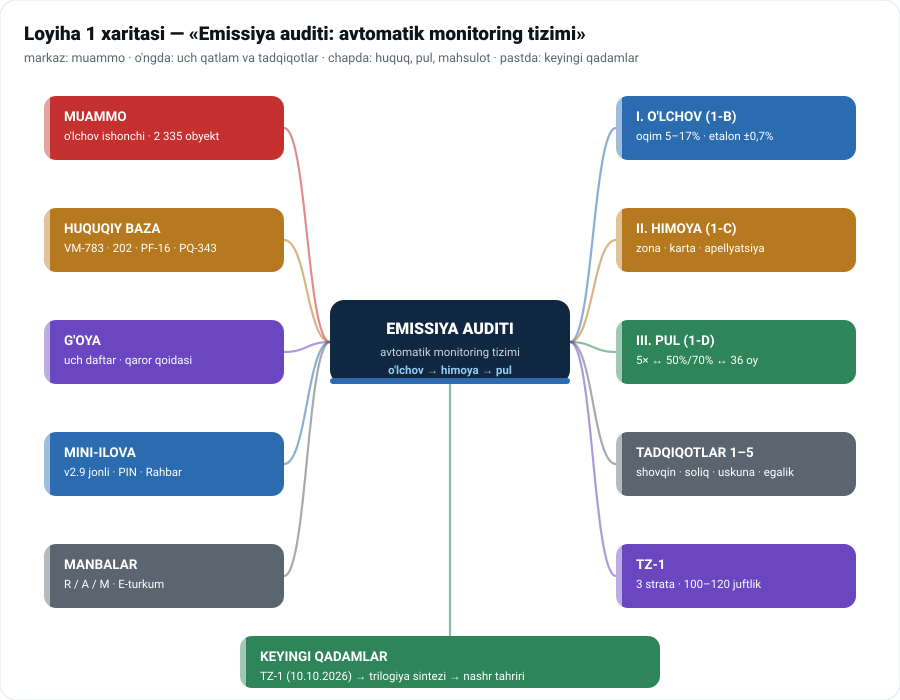

# 🗺️ LOYIHA 1 XARITASI — «EMISSIYA AUDITI: AVTOMATIK MONITORING TIZIMI»

**O'lchov ishonchi → himoya qatlami → pul oqimi**
Holat: 2026-09-26 · To'liq vizual nusxa (SVG xarita): `YAKUNIY/02-Loyiha-Xarita.html` · Obsidian canvas: `Loyiha-1-Xarita.canvas`

---

## 🎯 1. MUAMMO — nima isbotlanmoqchi

Davlat kompensatsiya to'lovini **hisob-kitob** asosida undiradi; korxona **o'lchov** asosida ishlaydi. Ikki raqam har doim bir xil bo'lavermaydi — 2026-yil 1-martdan esa bu farq **pul** bilan o'lchanadi (5× · 50% · 70%).

| Savol | Javob manbasi |
|---|---|
| Raqam qayerda xato qiladi? | Tadqiqot **1-B** — o'lchov zanjiri |
| Xato bo'lsa adolat qanday? | Tadqiqot **1-C** — Adolat paketi |
| Raqam pulga qanday aylanadi? | Tadqiqot **1-D** — moliyaviy model |
| Qamrov | **2 335** obyekt (663 I + 1 672 II) — VM-783 |

## 🔬 2. UCH QATLAM — loyihaning o'zagi

| Qatlam | Asosiy raqam | Topilma | Fayl |
|---|---|---|---|
| **I. O'LCHOV** | 5–17% (oqim) | eng zaif bo'g'in; xato **belgili** — hamma moddalarga bir yo'nalishda | `Tadqiqot-1B-Shovqin-Qavati-Davomi.md` |
| **II. HIMOYA** | 8 talabda 0 e'tiroz | platforma talablarida apellyatsiya yo'q; huquq bor, **ulanmagan** | `Tadqiqot-1C-Adolat-Paketi.md` |
| **III. PUL** | 5× ↔ 50% ↔ 70% ↔ 36 oy | jazo va rag'bat ikki hujjatda; uch bo'shliq | `Tadqiqot-1D-Moliyaviy-Model.md` |

## ⚖️ 3. HUQUQIY BAZA (faktlar)

| Hujjat | Nima beradi | Sana |
|---|---|---|
| **VM-783** | O'zMSt 194/195:2024 · TIF TN 9027/8421 · 99,5%/95%/80% · 201-band 5× · 301-band 36 oy | 25.11.2024 (tahr. 02.03.2026) |
| **202-son Nizom** | kompensatsiya: choraklik · 25-sana · +10 kun · 3 yillik qayta hisob | 12.04.2021 |
| **PF-16** | 50%/70% qaytarish · qarzdorlikdan voz kechish | 30.01.2025 |
| **VM-85** | xabarnoma DXM/YAIDPX · 15 ish kuni · xulosa | 28.02.2026 |
| **PQ-343** | muddat 01.03.2026 · 548 mlrd (8-ilova) · 8 talab (7-ilova) · platforma 01.09.2026 | 18.11.2025 |
| **PQ-347** | muddatlar: I — 01.01.2026, II — 01.07.2026 | 03.06.2025 |
| **O'RQ-457 / MJTK** | 30 ish kuni · ijro to'xtaydi · 10 kun shikoyat | amalda |

## 💰 4. PUL OQIMLARI

| Oqim | Summa / foiz | Manba |
|---|---|---|
| Jazo (o'rnatilmagan) | kompensatsiya **×5** | 202-son Nizom 201-band |
| Qaytarish 1-bosqich | **50%**igacha · 2 yil | PF-16 · VM-85 |
| Qaytarish 2-bosqich | **70%**igacha · 2 yil | PF-16 · VM-85 |
| Bo'lib to'lash | **36 oy** | 202-son Nizom 301-band |
| Budjet 2025 → 2026 | **900 → 548** mlrd so'm | PQ-343 |
| Amalda (I yarim yil 2026) | **274** mlrd + 84 mlrd («Yashil makon») | gazeta.uz 16.09.2026 |
| Uskuna (xalqaro) | CEMS $120–350k · fon stansiyasi $150–250k | Applus · ESEGAS · Clarity |

## 💡 5. G'OYA (dizayn)

- **Uch daftar** tamoyili: hisob-kitob daftari · o'lchov daftari · imtiyoz daftari — bitta raqamga bog'lanadi.
- **Uch zonali qaror qoidasi**: 🟢 / 🟡 / 🔴 (L, L+U) — JCGM 106 «guarded acceptance».
- **12 maydonli tushuntirish kartasi** — har bir qizil signal bilan birga (o'lchov, U va manbasi, norma hujjati, qoida, kalibrovka, xom ma'lumot QR, koeffitsient, summa, inson tekshiruvi, e'tiroz yo'li).
- **Choraklik Aniqlik hisoboti** — 5 metrika (signallar · 🟡 ulushi · precision · bekor qilingan qarorlar · U/L).
- **5% mustaqil qayta-o'lchov kvotasi** — ILAC-MRA laboratoriya.

## 🧪 6. TZ-1 — texnik topshiriq qoralamasi

| Element | Tarkib |
|---|---|
| Maqsad | o'lchov noaniqligini korxona kesimida o'lchash (shovqin qavati) |
| Dizayn | **3 strata** · har stratada 30–40 juftlik · jami **≈100–120 juftlik** |
| Muddat | 8–12 hafta; rasmiylashtirish — **2026-10-10** |
| Bosqichlar | T1–T7 (obyekt tanlash → ikki tomonlama o'lchov → taqqoslash → xulosa) |
| Ma'lumot almashish | anonimlashtirish rejimi · xom ma'lumot QR · kalibrovka dalillari |

## 🛠 7. MINI-ILOVA (mahsulot)

| Element | Holat |
|---|---|
| Jonli versiya | **v2.9** · `02f710b9` (Cloudflare Workers) |
| Kirish | PIN bilan (rahbar/admin) · 8 bo'lim · 4 element ko'rinishi |
| Rahbar paneli | progress/faollik/ism bo'yicha saralash · CSV · badge |
| Tadqiqot ko'rinishi | JONLI API: progress · yozuvlar · keyingi qadam |
| Manba | `jasur-ai/minds-app` HEAD `4b450e9` · testlar: v29 PIN regress ✅ · jsdom 21/21 ✅ |

## 📚 8. TADQIQOTLAR DARAXTI

`1` shovqin qavati ✅ · `1-B` to'rt bo'shliq ✅ (A varianti) · `1-C` Adolat paketi ✅ (B) · `1-D` Moliyaviy model ✅ (C) · `2` soliq siri ✓ · `3` uskunalar holati ✓ · `4` egalik modeli ✓ · `5` to'lov modeli ✓
Yo'nalish indeksi: `Tadqiqot-0-Indeks.md` (A → B → C **yopildi**, «YANGILANISH 3»).

## 📎 9. MANBALAR VA KUZATUV

**Darajalar:** R — rasmiy · A — akademik/sanoat · M — media.
**Kuzatuv ro'yxati** (manba chiqishini kutamiz, da'vo qilmaymiz): o'rnatganlar soni · 50%/70% xulosalari · 347 stansiya shartnoma summasi · kompensatsiyaning yillik hajmi · yolg'on-ijobiy statistikasi · 36 oylik imtiyozdan foydalanganlar.

## ➡️ 10. KEYINGI QADAMLAR

1. **TZ-1 rasmiylashtirish** — muddat **2026-10-10**
2. **Trilogiya sintezi** — 1-B + 1-C + 1-D → «Goya-Uch-Daftar»
3. **Maqola nashr nusxasi** — qisqartirish qarori (muallif)
4. **Kuzatuv** — ochiq savollar bo'yicha rasmiy hisobotlarni davriy tekshirish

---

**Bog'liq:** `Maqola-v3-YAKUNIY-Draft.md` (o'qish nusxasi) · `REJA-56-QADAM.md` (`00-Meta/`) · `Tadqiqot-0-Indeks.md`
