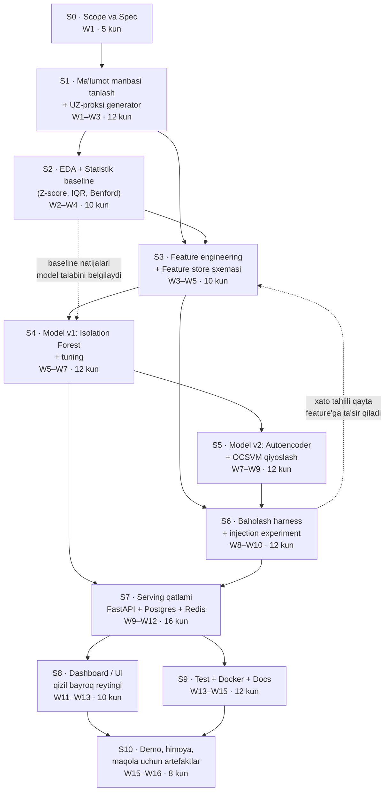
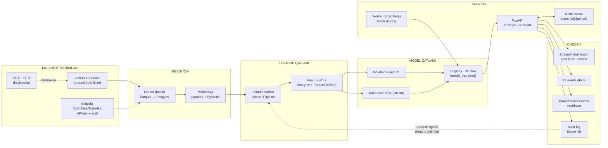
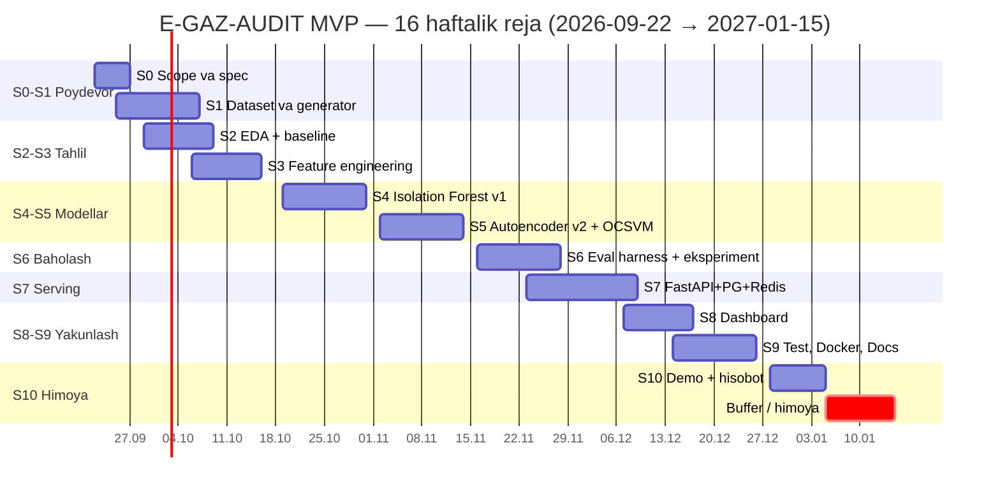

# LOYIHA 1 — TEXNIK TOPSHIRIQ (TZ) VA JARAYON XARITASI
# "E-GAZ-AUDIT: AI-asoslangan issiqxona gazi hisobotlarini tekshirish (anomaliya aniqlash) tizimi"

**Hujjat turi:** to'liq texnik topshiriq (implementation-level)  
**Asos hujjat:** `Uzbekistan_Eko_DeepResearch_2026.md`, §3.6 (AI va avtomatlashtirish arxitekturasi) — undagi 4 modeldan faqat **1-model: anomaliya aniqlash**  
**Ijrochi profili:** talaba (School 21), Python/FastAPI/PostgreSQL/Redis tajribasi, yakka yoki 2–3 kishilik jamoa  
**Taxminiy semestr:** 2026-yil 22-sentabr — 2027-yil 15-yanvar (16 hafta + himoya)  
**Versiya:** 1.0 (2026-09-17)

---

## MUNDARIJA

0. Hujjat maqsadi va kontekst
1. Muammo va maqsad
2. Muvaffaqiyat mezonlari (acceptance criteria)
3. Jarayon xaritasi — xronologik va vizual
4. Bosqichlar bo'yicha batafsil jadval (texnologiya tanlovi asoslari bilan)
5. Arxitektura diagrammasi va stack asoslanishi
6. Ma'lumot manbai: muammo va yechim (sintetik UZ-proksi)
7. Feature engineering spetsifikatsiyasi
8. Model tanlovi — akademik asoslangan qiyoslash
9. Baholash metodikasi
10. Risklar va cheklovlar
11. Yakuniy vaqt chizig'i (Gantt) va resurs byudjeti
12. Ilovalar (A: yozuv sxemalari, B: TZ checklist, C: manbalar)

---

## 0. HUJJAT MAQSADI VA KONTEKST

Bu hujjat — **milliy platforma emas**, bitta mexanizmni isbotlaydigan **MVP**: "korxona o'zi bergan GHG hisoboti bilan mustaqil signallar orasidagi mos kelmaslikni avtomatik aniqlash mumkin" degan gipotezani eksperimental tarzda tekshirish.

Manba hujjatning §3.6-qismida to'rt qatlamli AI arxitekturasi tavsiflangan:

| № | Model | Vazifa | Ushbu loyihada |
|---|---|---|---|
| 1 | **Anomaliya aniqlash** | Hisobot ↔ mustaqil signal mos kelmasligini belgilash | ✅ **MVP shu** |
| 2 | Prognoz | Emissiya trendini oldindan aytish | ❌ (keyingi loyiha) |
| 3 | Ta'sir modeli | Dispersiya, mahalla darajasidagi ta'sir | ❌ |
| 4 | Benchmark generatsiyasi | Tarmoq normativini hosil qilish | ❌ (faqat oddiy peer-z-score ishlatiladi) |

**Nega aynan 1-model birinchi?** Chunki u: (a) eng kam ma'lumot talab qiladi (labeled data kerak emas), (b) natijasi darhol tekshiriladi (aniq/noma'lum), (c) milliy tizimning eng qimmat bo'laklaridan biri — Xitoy ETS platformasida aynan shu funksiya ma'lumot manipulyatsiyasini keskin kamaytirgan (MEE Progress Report 2024: "big data texnologiyasidan foydalanib, anormal ma'lumotlar aniqlanadi va erta ogohlantirishlar beriladi — kalit korxonalar reyestri, ma'lumot sifati rejalari, oylik qayd etilgan ma'lumotlar, hisobot va verifikatsiya ustidan to'liq jarayonli kuzatuv").

---

## 1. MUAMMO VA MAQSAD

### 1.1. Muammo
O'zbekiston 2025-yilda "Issiqxona gazlari emissiyasini cheklash to'g'risida" qonun qabul qildi (2026-yil 9-yanvardan kuchga kirdi) va 2035-yilga intensivlikni −50% (2010 bazasi) maqsadini qo'ydi (NDC 3.0). Ammo:
- korxona darajasida **majburiy emissiya deklaratsiyasi** mexanizmi hali to'liq shakllanmagan;
- 2022-yilda emissiyaning 28,7%i metan, o'sish agroda **+178%**, sanoatda **+159%** — ya'ni "millionlab kichik manba" (BTR1, 2024);
- eksportchi korxonalar Yevropa CBAM'ida **default qiymatlar** bilan jarimalanadi (Q1 2026 sertifikat narxi **€75,36/tCO₂e**), chunki **verifikatsiyalangan actual ma'lumot** yo'q.

Natijada: hisobotning to'g'riligini tekshirish uchun **har bir korxonaga inspektor** yuborish imkonsiz (I toifa 663 + II toifa 1 672 korxona — VM-783), demak kerak **avtomatik, masshtablanadigan va tushuntirib bera oladigan** tekshiruv qatlami.

### 1.2. Ilmiy/amaliy savol (research question)
> Korxona o'z-o'zidan e'lon qilgan GHG emissiyasi bilan **mustaqil** ma'lumot manbalari (energiya iste'moli, yoqilg'i xaridi, ishlab chiqarish hajmi, bojxona/soliq signallari) o'rtasidagi statistik mos kelmaslikni unsupervised ML orqali aniqlash mumkinmi — va bu qanchalik aniq/nishonchli?

### 1.3. Gipoteza
H1: Kamida 3 ta mustaqil signal bilan hisobotni taqqoslash orqali **sun'iy kiritilgan xatolik/soxtalashtirish holatlarining ≥80%ini** aniqlash mumkin, bunda noto'g'ri "qizil bayroq" ulushi (FPR) **≤10%** bo'ladi.  
H2: Anomaliyalar "qora quti" emas — har bir bayroq **insonga tushunarli sabab** bilan izohlanishi mumkin (masalan: "gaz iste'moli × emissiya omili bo'yicha 1 200 t CO₂-ekv. chiqishi kerak edi, hisobotda 740 t").

---

## 2. MUVAFFAQIYAT MEZONLARI (ACCEPTANCE CRITERIA)

| # | Mezon | O'lchov | Maqsad |
|---|---|---|---|
| AC-1 | Anomaliya aniqlash sifati | Recall (injected) | ≥ 0,80 |
| AC-2 | Noto'g'ri signal | FPR (clean yozuvlar) | ≤ 0,10 |
| AC-3 | Umumiy sifat | F1 (anomaliya klassi) | ≥ 0,80 |
| AC-4 | "Yuqori xavf" aniqligi | Precision@Top20 | ≥ 0,70 |
| AC-5 | Tushuntirib berish | Har bir flagda sabab + raqamlar | 100% |
| AC-6 | API javob vaqti | p95 (bir korxona skoringi) | ≤ 300 ms |
| AC-7 | Ishlab chiqarish holati | Docker Compose ile 1 buyruqda ko'tarilish + 20 ta test | o'tadi |
| AC-8 | Audit izi | Har bir skor: model versiyasi, feature snapshot, vaqt | 100% |
| AC-9 | Hujjatlashtirish | README + arXiv-uslubidagi 4–6 betlik hisobot | mavjud |
| AC-10 | Reproduksiya | `make seed && make train && make eval` | bir xil natija (seed=42) |

**Anti-mezonlar (nima qilinmaydi):** milliy reyestr emas; real korxona ma'lumotlari bilan ishlamaydi; yuridik xulosa chiqarmaydi; faqat **"tekshirishga loyiq" signal**.

---

## 3. JARAYON XARITASI — XRONOLOGIK VA VIZUAL

### 3.1. Mermaid flowchart (bosqichlar va bog'liqliklar)



### 3.2. Nega aynan shu tartib (bog'liqlik mantiqi, qisqa)

| Bosqich | Nimaga tayanadi | Nima uchun undan keyin/oldin |
|---|---|---|
| S0 | — | Avval "nima isbotlanadi" aniqlanmasa, dataset va metrika noto'g'ri tanlanadi |
| S1 | S0 | Sinov uchun **bilinib turgan** anomaliyalar kerak → ma'lumot generatsiya qoidalari spec'ga bog'liq |
| S2 | S1 | Oddiy statistik baseline ko'p hollarda yetarli bo'lishi mumkin — ML'ni oqlamasdan qurmaslik uchun **avval arzon yechim sinaladi** |
| S3 | S1, S2 | Feature'lar baseline xatolaridan kelib chiqib tanlanadi (xato tahlili → feature) |
| S4 | S3 | Model featuresiz o'qitilmaydi; IF — eng arzon, tez baseline |
| S5 | S4 | Autoencoder faqat IF natijasidan "yutish" imkoniyati bo'lsa oqlanadi (aks holda keraksiz murakkablik) |
| S6 | S3–S5 | Baholash harness modelsiz ma'nosiz; modelsiz esa harness yozish vaqt yo'qotish |
| S7 | S4–S6 | API faqat **tanlangan** modelni ko'rsatadi — model tanlanmasdan serving yozish mumkin emas |
| S8 | S7 | UI API'siz ishlamaydi |
| S9 | hammasi | Docker/test faqat komponentlar tayyor bo'lgach |
| S10 | S9 | Demo va maqola artefaktlari tugallangan tizimni talab qiladi |

---

## 4. BOSQICHLAR BO'YICHA BATAFSIL JADVAL

### 4.0. KONSOLIDATSIYALANGAN JADVAL (barcha bosqichlar bir ko'rinishda)

> Bu jadval — tez ko'rish uchun; har bir bosqichning to'liq asoslanishi quyida (4.1–4.11) batafsil keltirilgan.

| Bosqich | Muddat | Nima qilinadi | Texnologiya | **Nega aynan shu texnologiya** | **Nega aynan shu vaqtda** | **Kirish → Chiqish** | **Definition of Done** | Natija/deliverable |
|---|---|---|---|---|---|---|---|---|
| **S0** Scope & spec | W1 · 5 kun | Muammo, anomaliya taksonomiyasi (A1–A8), metrikalar va anti-mezonlarni muzlatish; ADR yozish | Markdown, Mermaid, GitHub Issues, `docs/adr/` | Mermaid — kod bilan versiyalanadi (draw.io diff qilinmaydi); ADR — har tanlovning "nega"si keyin maqolaga ko'chadi | Metrika keyin muzlatilsa p-hacking xavfi; S0 tugamasdan S1 boshlanmaydi | Spec g'oyasi → tasdiqlangan `00_spec.md` + ADR 001–003 | Metrikalar va 8 anomaliya turi yozma tasdiqlangan; 5 ta issue ochilgan | `docs/00_spec.md`, ADR'lar, taksonomiya jadvali |
| **S1** Dataset + generator | W1–W3 · 12 kun | E-PRTR taqsimotlarini o'rganish; UZ-proksi generator; 4 ssenariy (clean/5/15/30%) | Python 3.12, `pandas`, `numpy`, `Faker` (uz_UZ), `pyarrow`, `pydantic`, `DuckDB`, `uv` | Sintetik + E-PRTR kalibrovka — UZ korxona ma'lumoti yopiq; Parquet+DuckDB Pandas+CSV'dan 5–20× tez; Pydantic sxemasi FastAPI bilan umumiy (DRY) | Model va metrika **ground truth**ga tayanadi; generator kech yozilsa "aniqlangan anomaliya" isbotlanmaydi | E-PRTR fayllari + UZ sektor ulushlari → `uz_proxy_v1.parquet` (≈50 000 yozuv) | 4 ssenariy generatsiya qilinadi; har yozuvda `ground_truth_label`; dataset card yozilgan | Dataset, `generator.py`, `dataset_card.md` |
| **S2** EDA + baseline | W2–W4 · 10 kun | Taqsimot/korrelyatsiya tahlili; Z-score (MAD), IQR, nisbat, Benford, YoY baseline detektorlar | `ydata-profiling`, `matplotlib`/`seaborn`, `scipy.stats`, Jupyter, `pandera` | Baseline **majburiy** — IQR+nisbat 70%ni tutsa, AE qurish vaqt isrofi; `pandera` birlik xatolarini (A4) erta ushlaydi | Baseline natijalari S3'dagi feature va S4'dagi model tanlovni belgilaydi | `uz_proxy_v1.parquet` → baseline metrikalar jadvali | 5 baseline detektor uchun precision/recall hisoblangan; ML oqlanish qarori yozilgan | `01_eda.ipynb`, `baseline_metrics.md` |
| **S3** Feature engineering | W3–W5 · 10 kun | §7'dagi 6 guruh (24 feature) hisoblash; offline/online ajratish; feature registry va versiyalash | `pandas`/`polars`, `sklearn` Pipeline + ColumnTransformer, Parquet feature store, `pydantic` | Pipeline — train/serve bir xil transformatsiya (**train-serve skew** yo'q); `feast` o'rniga oddiy interfeys (MVP ko'lami kichik, ko'chirish oson) | Model featuresiz o'qitilmaydi; S2 xato tahlili qaysi feature kerakligini ko'rsatadi | Tozalangan dataset → `features_v1.parquet` + lug'at | Har feature formulasi hujjatlashtirilgan; leak testi o'tgan (test davri fit'ga kirmaydi) | `src/features/build.py`, feature store, `feature_dictionary.md` |
| **S4** Model v1 — IF | W5–W7 · 12 kun | Isolation Forest o'qitish + `optuna` tuning; poroğni PR-kurvada tanlash; SHAP izohlari | `scikit-learn` (`IsolationForest`), `optuna`, `mlflow`, `shap` | IF — OCSVM'dan **36× tez** (3,94 s vs 143,87 s), AE'dan kam ma'lumot/tuning talab qiladi, shovqinli tabular sanoat ma'lumotida yaxshi | Feature'lar tayyor bo'lgach; AE'dan **oldin** — IF natijasi AE'ni oqlash/oqlamaslikni ko'rsatadi | `features_v1.parquet` → o'qitilgan IF + metrikalar | AC-1/AC-3 baholangan (yoki xato tahlili); MLflow run ID yozilgan; SHAP ishlaydi | `models/if_v1/`, `if_v1_metrics.md` |
| **S5** Model v2 — AE (+OCSVM) | W7–W9 · 12 kun | Autoencoder faqat "toza" yozuvlarda o'qitish; ONNX eksport; OCSVM nazorat guruhi; 3 model qiyoslash | `PyTorch`, `scikit-learn` (`OneClassSVM`), `optuna`, `onnxruntime` | PyTorch — School 21 tajribasi + akademik standart; AE faqat normal data'da (reconstruction paradigması talabi); ONNX — Docker yengil, inferens tez | IF natijasi ma'lum bo'lgach — "nega AE kerak" savoliga **o'lchovli** javob berish uchun | `features_v1` (faqat clean subset) → `ae_v1.onnx` + 3 model jadvali | Uch model bir xil test to'plamida o'lchangan; inferens vaqti qayd etilgan | `model_comparison.md` |
| **S6** Eval harness | W8–W10 · 12 kun | 5 seed × 4 ssenariy = 20 run; bootstrap CI; kalibrlash (isotonic); xato tahlili (A1–A8 kesimida) | `sklearn` metrikalari, `scipy.stats`, `mlflow`, `seaborn`, `pytest` | Bootstrap CI — kichik test to'plamida bitta raqamga ishonish xato; isotonic — "0,9 ball" = "90% ehtimol" ishonchini beradi | Barcha 3 model tayyor bo'lgach; natijalar S7'da API'ga qaysi model chiqishini hal qiladi | 3 model + injection ssenariylari → `eval_report.md` | PR-kurva, confusion, tur bo'yicha recall chizilgan; CI hisoblangan; model tanlangan | `eval_report.md` + rasmlar, 20 MLflow run |
| **S7** Serving | W9–W12 · 16 kun | `/v1/score`, `/v1/alerts`, `/v1/models`; Postgres sxemasi; Redis kesh; Alembic; Docker Compose; Prometheus | FastAPI + Pydantic v2, SQLAlchemy 2.0 async (`asyncpg`), Alembic, Redis 7, `arq`, ONNX Runtime, Docker, `prometheus-client` | FastAPI — talabada bor, async, avtomatik OpenAPI (shartnoma isboti); Postgres — munosabatli + JSONB; Redis kesh → amaliyotda **~2,9 ms** javob; SQLAlchemy async (sinxron ORM loop'ni bloklaydi) | Model tanlangach; API oldinroq yozish — "qaysi model" noaniq bo'lganda keraksiz ish | Tanlangan model + sxema → ishlaydigan xizmat | `docker compose up` → `/docs` ochiladi; p95 ≤ 300 ms; kesh hit/miss o'lchangan | API, OpenAPI, `api_benchmark.md` |
| **S8** Dashboard | W11–W13 · 10 kun | Alert feed (filtr: sektor/viloyat/tur), korxona kartochkasi (tarix + izoh), model monitoring | Streamlit + Plotly (MVP) yoki React+Vite+Recharts; Leaflet (ixtiyoriy) | Streamlit — 1 kunda ishlaydigan dashboard, dizayner kerak emas (vaqt/effekt optimum); React'ga o'tish ADR'da qayd etiladi | API tayyor bo'lgach; UI API'siz "maket" bo'lib qoladi | API → 3 sahifali UI | Har bir flag izohsiz ko'rsatilmaydi (AC-5); demo video yozilgan | `dashboard/app.py`, video, skrinshotlar |
| **S9** Test/Docker/Docs | W13–W15 · 12 kun | ≥20 test, CI, multi-stage Dockerfile, README, cheklovlar hujjati | `pytest`+`pytest-asyncio`+`httpx`, `ruff`, `pre-commit`, GitHub Actions | `ruff` — flake8+isort+black o'rnida bitta tez vosita; `httpx` — FastAPI test uchun rasmiy; CI badge — reproduksiya da'vosining dalili | Komponentlar barqarorlashgach; erta integratsiya testi ko'p sinadi | Tizim → CI yashil + hujjatlar | `make seed/train/eval` qayta ishlaydi (seed=42 bir xil natija); README 10 daqiqada ishga tushadi | CI badge, testlar, `docs/` |
| **S10** Demo/hisobot | W15–W16 · 8 kun | 8–10 slayd; jonli demo (buzilgan yozuv → alert); maqola uchun 3 rasm + 2 jadval | Marp/LaTeX, `matplotlib` (vektor SVG/PDF), Git tag `v1.0` | Vektor grafik — chop etish uchun shart; Git tag — baholovchi aniq commit'ni ko'radi | Yakunda — raqamlar muzlatilgan bo'lishi kerak | Tizim → himoya + `final_report.pdf` | Barcha AC'lar holati jadvalda; git tag qo'yilgan | Taqdimot, hisobot, `v1.0` |

### S0. Scope, spec va metrika muzlatish (W1, 5 kun)

| Ustun | Mazmun |
|---|---|
| **Nima qilinadi** | Muammo/maqsad yoziladi; anomaliya taksonomiyasi (8 tur) tasdiqlanadi; metrikalar (R2 bo'lim) muzlatiladi; "anti-mezonlar" yoziladi; hisobot shabloni (4–6 bet) tayyorlanadi |
| **Texnologiya** | Markdown + Mermaid (diagrammalar repo ichida); GitHub Issues (vazifalar); `docs/adr/` (Architecture Decision Records) |
| **Nega aynan shu texnologiya** | 1) Mermaid — GitHub'da nativ render, kod bilan bir repoda versiyalanadi (draw.io/Visio'ga nisbatan diff qilinadi); 2) ADR — har bir tanlovning "nega"si keyin maqolaga ko'chiriladi; 3) Issues — baholashdagi "progress" dalili |
| **Nega aynan shu vaqtda** | Metrika keyin muzlatilsa = "natijaga moslashtirilgan metrika" (p-hacking) xavfi. S0 tugamasdan S1 boshlanmaydi |
| **Deliverable** | `docs/00_spec.md`, `docs/adr/001..003`, anomaliya taksonomiyasi jadvali |

**Anomaliya taksonomiyasi (MVP doirasi) — 8 tur:**

| # | Tur | Misol signal | Aniqlash mantiqi |
|---|---|---|---|
| A1 | **Kam ko'rsatish (under-reporting)** | hisobot = hisoblangan ×0,6–0,85 | nisbat (reported/implied) pasti |
| A2 | **Emissiya omili (EF) yangilanmagan** | yoqilg'i turi o'zgargan, EF eski | EF keskin farqi |
| A3 | **Kategoriya tushib qolgan** | fugitiv/chiqindi bo'limi bo'sh | maydon bo'shligi + sektor normasi |
| A4 | **Birlik xatosi** | t ↔ kg (×1000) | miqyos anomaliyasi |
| A5 | **Fizik jihatdan imkonsiz samaradorlik** | ishlab chiqarish +18%, energiya +1% | intensivlik sakrashi |
| A6 | **Nusxa-ko'chirish** | 4 davr aynan bir xil qiymat | dispersiya ≈ 0 |
| A7 | **Ikki marta hisoblangan qisqartirish** | offset ikki joyda | credits takrorlanishi |
| A8 | **Sana/davr siljishi** | hisobot davri chegarasida sakrash | vaqt seriyasi uzilishi |

### S1. Ma'lumot manbasi tanlash va UZ-proksi generator (W1–W3, 12 kun)

| Ustun | Mazmun |
|---|---|
| **Nima qilinadi** | (a) ochiq datasetlar skaneri: EU E-PRTR (facility-level, 2007–2023, 91 modda), US TRI, Kaggle industrial-emissions to'plamlari; (b) "UZ-proksi" sintetik generator yoziladi — O'zbekiston sektor tarkibiga mos (energetika 63,6%, agro 17,6%, IPPU 14–15%, chiqindi 5,0%; BTR1); (c) 4 ta ssenariy: clean / 5% anomaliya / 15% / 30% |
| **Texnologiya** | Python 3.12, `pandas`, `numpy`, `faker`, `Faker`-provayder (uz_UZ), `pyarrow` (Parquet), `pydantic` (sxema validatsiyasi), `DuckDB` (tez SQL tahlil), `uv` (paket menejeri) |
| **Nega aynan shu texnologiya** | 1) **Sintetik generator + real E-PRTR kalibrovka** — chunki O'zbekistonda korxona darajasidagi GHG ma'lumotlari hali ochiq emas (manba hujjat §3.3, P5 va §3.4); real E-PRTR *taqsimot shakli* (log-normal emissiya, hajm↔emissiya korrelyatsiyasi, sektor dispersiyasi) o'rganilib, UZ tarkibiga proyeksiya qilinadi; 2) **Parquet+DuckDB** — 10⁵–10⁶ qator uchun Pandas+CSV'ga nisbatan 5–20× tez, Postgres'ga yuklashdan oldin tez iteratsiya; 3) **Pydantic** — sxemani kodda majburlash (keyin FastAPI bilan bir xil model — DRY) |
| **Nega aynan shu vaqtda** | Model, feature va metrika generatordagi **ground truth**ga tayanadi; agar generator keyin yozilsa, "aniqlangan anomaliya" nima ekanini isbotlab bo'lmaydi |
| **Deliverable** | `data/synthetic/uz_proxy_v1.parquet` (≈50 000 korxona-davr yozuvi), `generator.py`, `dataset_card.md` (cheklovlar ochiq yozilgan) |

### S2. EDA + statistik baseline (W2–W4, 10 kun)

| Ustun | Mazmun |
|---|---|
| **Nima qilinadi** | Taqsimotlar, korrelyatsiya matritsasi, mavsumiylik, sektor kesimi; **baseline detektorlar**: Z-score (robust: MAD), IQR chegarasi, nisbat chegaralari, Benford qonuni (birinchi raqam tekshiruvi), YoY delta |
| **Texnologiya** | `pandas-profiling`/`ydata-profiling`, `matplotlib`+`seaborn`, `scipy.stats`, `Jupyter` (nativatsiya uchun), `great_expectations` (yengil variantda — `pandera`) |
| **Nega aynan shu texnologiya** | 1) Baseline **majburiy**, chunki ML'ni oqlash kerak: agar IQR+nisbat qoidalari 70% anomaliyani tutsa, Autoencoder qurish — vaqt isrofi (akademik jihatdan ham to'g'ri: baselinesiz ML natija ishonchsiz); 2) `pandera` — sxema buzilishini erta ushlaydi (A4 birlik xatosi kabi holatlarni eksplitsit test qilish); 3) Jupyter — EDA uchun, lekin ishlab chiqarish kodi `.py` modulga ko'chiriladi (nativatsiya talabi) |
| **Nega aynan shu vaqtda** | Baseline natijalari S3'dagi feature tanlovni va S4'da model tanlovni belgilaydi |
| **Deliverable** | `notebooks/01_eda.ipynb` (nativatsiya), `reports/baseline_metrics.md` — baseline precision/recall jadvali |

### S3. Feature engineering + feature store sxemasi (W3–W5, 10 kun)

| Ustun | Mazmun |
|---|---|
| **Nima qilinadi** | §7'dagi 6 guruh feature hisoblanadi; offline/online ajratiladi; feature registry (JSON) + versiyalash; korxona-davr kaliti |
| **Texnologiya** | `pandas`/`polars` (transformatsiya), `scikit-learn` `Pipeline`+`ColumnTransformer` (fit/transform ajratish, leakdan saqlanish), `feast` (ixtiyoriy; MVP'da oddiy `features.sql` + Parquet), `pydantic` sxemalari |
| **Nega aynan shu texnologiya** | 1) **sklearn Pipeline** — train/serve bir xil transformatsiya (train-serve skew yo'q) — bu sanoatda eng ko'p uchraydigan xato; 2) `feast` o'rniga oddiy yechim: MVP ko'lamida (50k qator) feature store infra ortiqcha, lekin **interfeys** (`get_features(entity_id, period)`) saqlanadi — keyin `feast`ga ko'chirish oson; 3) `polars` — katta guruhlashda Pandas'dan tez, lekin API o'xshash |
| **Nega aynan shu vaqtda** | Model featuresiz o'qitilmaydi; S2 baseline xatolari aynan qaysi feature kerakligini ko'rsatadi |
| **Deliverable** | `src/features/build.py`, `features_v1.parquet`, `docs/feature_dictionary.md` (har bir feature: formula, manba, kutilgan yo'nalish) |

### S4. Model v1 — Isolation Forest + tuning (W5–W7, 12 kun)

| Ustun | Mazmun |
|---|---|
| **Nima qilinadi** | IF o'qitiladi (`n_estimators`, `max_samples`, `contamination` grid); contamination'ni **taxmin qilmaslik** — score porog'i validatsiya to'plamida PR-kurva orqali; score → [-1,1] map; tushuntirish moduli (path length + eng ko'p qo'shgan feature'lar) |
| **Texnologiya** | `scikit-learn` (`IsolationForest`), `optuna` (Bayesian tuning), `mlflow` (tajriba kuzatuvi: parametr, metrika, artefakt), `shap` (TreeExplainer — tushuntirish) |
| **Nega aynan shu texnologiya** | 1) **Isolation Forest** — boshqa muqobillarga nisbatan: (a) One-Class SVM'ga qaraganda **tez** (SCADA tadqiqotida inferens: IF **3,94 s** vs OCSVM **143,87 s**, MDPI *Future Internet* 2026), (b) Autoencoder'ga qaraganda **kam ma'lumot va kam tuning** talab qiladi (label-free, ixtiyoriy parametrlar), (c) yuqori o'lchamli, shovqinli sanoat ma'lumotida yaxshi (Premer Journal of Science 2025: IF 84–86%, AE 87–89% unsupervised sharoitda); 2) **mlflow** — "nega bu natija" degan savolga javob (model versiyasi, seed, parametr) — audit izi AC-8; 3) **SHAP** — tushuntirish AC-5 (IF uchun path-based izoh ham qo'shiladi) |
| **Nega aynan shu vaqtda** | Feature'lar tayyor bo'lgach; AE'dan **oldin** — chunki IF natijasi AE'ni oqlash/oqlmaslikni ko'rsatadi (agar IF F1 ≥ 0,85 bo'lsa, AE ustuvorlik emas) |
| **Deliverable** | `models/if_v1/` (model + metadata), `reports/if_v1_metrics.md`, MLflow tajriba havolasi |

### S5. Model v2 — Autoencoder (va OCSVM taqqoslash) (W7–W9, 12 kun)

| Ustun | Mazmun |
|---|---|
| **Nima qilinadi** | (a) AE (MLP, 2 encoder + 2 decoder qatlam, bottleneck), faqat "toza" yozuvlarda o'qitiladi; rekonstruksiya xatosi → score; porog validatsiyada; (b) OCSVM (RBF) — kichik namunada; (c) uch model **bir xil** test to'plamida: PR-AUC, F1, recall@k, inferens vaqti |
| **Texnologiya** | `PyTorch` (AE), `scikit-learn` (`OneClassSVM`), `optuna`, `mlflow`, `onnxruntime` (eksport, inferens tezligi uchun) |
| **Nega aynan shu texnologiya** | 1) **PyTorch** — School 21 tajribasi bilan mos, akademik taqdimotda standart; 2) **AE'ni faqat "toza" data'da o'qitish** — adabiyotdagi asosiy talab (reconstruction-based paradigm); 3) **ONNX eksport** — Docker'da PyTorch og'irligini kamaytirish va inferensni tezlashtirish (paste amaliyoti: ONNX Runtime INT8 + Redis cache ~2,9 ms javob); 4) **OCSVM faqat taqqoslash uchun** — yuqori hisoblash xarajati (inferens 143 s) uni production nomzodi qilmaydi, lekin akademik qiyoslash uchun shart |
| **Nega aynan shu vaqtda** | IF natijasi ma'lum bo'lgach — "nega AE kerak" degan savolga **o'lchovli** javob berish uchun |
| **Deliverable** | `models/ae_v1.onnx` + `reports/model_comparison.md` (3 model × 6 metrika jadvali, adabiyot bilan solishtirilgan holda) |

**Kutilgan natija (adabiyot asosida) va nima uchun MVP IF'dan boshlanadi:**

| Model | Kuchli tomoni | Zaif tomoni | Adabiyot |
|---|---|---|---|
| Isolation Forest | Tez (3,94 s / 1,16 mln yozuv), kam tuning, tabular uchun standart | Lokal-zichlik anomaliyalarida kuchsiz; "inverted imbalance"da ikkilik porog beqaror | MDPI Future Internet 2026; IEEE 10428838 (ROC-AUC 90% vs OCSVM 61%) |
| One-Class SVM | Nazariy asos kuchli, kichik namunada yaxshi | Yuqori inferens xarajati (143,87 s), hyperparametrga sezgir | MDPI Future Internet 2026 |
| Autoencoder | Eng yuqori aniqlik (AUC 0,967; real sanoatda precision 0,99) | Ma'lumotga ochlik, driftga sezgir, porog kalibrovkasi nozik | MDPI *FI* 2026; JISEM 2025 (F1 93,2%); MDPI *Appl. Sci.* 16(5):2457 |
| **Amaliy xulosa** | **IF — v1 baseline; AE — v2 (agar IF ≤ 0,80 F1 bo'lsa)**; OCSVM — faqat nazorat guruhi | | |

### S6. Baholash harness va injection eksperimenti (W8–W10, 12 kun)

| Ustun | Mazmun |
|---|---|
| **Nima qilinadi** | 5 marta takrorlanadigan "injection experiment": clean ma'lumotga A1–A8 aralashmasi kiritiladi (5%, 15%, 30%), model skorlaydi, metrikalar hisoblanadi; statistik ishonch (bootstrap CI); xato tahlili: qaysi tur eng qiyin?; kalibrlash (score → ehtimollik, isotonic regression) |
| **Texnologiya** | `scikit-learn` metrikalari, `scipy.stats` (bootstrap), `mlflow` (5 run), `seaborn` (xato matritsasi issiqlik xaritasi), `pytest` (eval testlari) |
| **Nega aynan shu texnologiya** | 1) **Bootstrap CI** — kichik test to'plamida bitta raqamga ishonish xato; 2) **Isotonic kalibrlash** — "0,9 ball" ni "90% ehtimol"ga aylantirish, chunki foydalanuvchi "qizil bayroq"ni qanday talqin qilishini bilishi kerak; 3) **pytest** — baholashni qayta ishlatiladigan qilish (har model o'zgarishida qayta o'lchash) |
| **Nega aynan shu vaqtda** | Barcha 3 model tayyor bo'lgach; natijalar S7'da qaysi model API'ga chiqishini hal qiladi |
| **Deliverable** | `reports/eval_report.md` + `reports/figures/*.png` (PR-kurva, confusion, tur bo'yicha recall) |

### S7. Serving qatlami — FastAPI + PostgreSQL + Redis (W9–W12, 16 kun)

| Ustun | Mazmun |
|---|---|
| **Nima qilinadi** | API: `POST /v1/score` (korxona-davr → anomaliya skori + izoh), `GET /v1/companies/{id}/history`, `GET /v1/alerts`, `GET /v1/models`, `GET /health`; Postgres sxemasi (korxona, davr, hisobot, signal, feature, score, alert, model_registry, audit_log); Redis cache (score kaliti: `score:{company}:{period}:{model_ver}`); Alembic migratsiyalar; JWT (oddiy) + rate limit |
| **Texnologiya** | `FastAPI` + `Pydantic v2` + `uvicorn`, `SQLAlchemy 2.0` (async, `asyncpg`), `Alembic`, `Redis 7` (`redis-py` asyncio), `arq` yoki `Celery` (batch skoring), `ONNX Runtime`, `Docker`+`docker-compose`, `prometheus-client` (metrikalar) |
| **Nega aynan shu texnologiya** | 1) **FastAPI** — talabaning mavjud tajribasi; async I/O DB va model bilan yaxshi ishlaydi; Avtomatik OpenAPI — komissiya/ma'lumot jurnalisti uchun "API bor"ni isbotlaydi; 2) **PostgreSQL** — munosabatli ma'lumot (korxona↔davr↔feature↔score) + JSONB (xom javob, audit), `pgvector` (keyinroq embedding uchun) — kelajakdagi milliy platforma bilan moslik; 3) **Redis** — takroriy so'rovlarni keshlash: amaliy hisob-kitob yaqinlashgan amaliyotda Redis hit ~**2,9 ms**, keshsiz model inferens undan sezilarli sekin (paste: "FastAPI + Redis cache-aside, singleton client"); 4) **SQLAlchemy async** — sinxron ORM event loop'ni bloklaydi (anti-pattern); 5) **ONNX Runtime** — PyTorch'ga bog'liqlikni kamaytiradi, Docker image kichrayadi; 6) **Prometheus** — "tizim ishlayaptimi" savoliga dalil (demo'da ko'rsatiladi) |
| **Nega aynan shu vaqtda** | Model S5–S6'da tanlangach; API'ni oldinroq yozish — "qaysi model" noaniq bo'lganda keraksiz ish |
| **Deliverable** | `docker-compose up` bilan ko'tariladigan xizmat, OpenAPI `/docs`, `reports/api_benchmark.md` (p50/p95/p99, kesh hit/miss) |

**Muhim amaliy qoida (paste'da bildirilgan tuzoq):** `async def` route ichida og'ir CPU inferens **to'g'ridan-to'g'ri** chaqirilmasligi kerak — event loop bloklanadi. MVP uchun yechim: `run_in_threadpool` (starlette) yoki `ProcessPoolExecutor`, katta yuklamada esa Redis Streams + alohida worker. ~100 req/s gacha bitta kichik model uchun in-process pool **yetarli** — ortiqcha infra qurish shart emas (markaicode, 2026).

### S8. Dashboard / UI (W11–W13, 10 kun)

| Ustun | Mazmun |
|---|---|
| **Nima qilinadi** | 3 sahifa: (1) **Alert feed** (score bo'yicha saralangan, filtr: sektor/viloyat/tur), (2) **Korxona kartochkasi** (score tarixi, feature radar, izohlar ro'yxati: "nima uchun qizil"), (3) **Model monitoring** (kunlik alert soni, FPR trendi, model versiyasi) |
| **Texnologiya** | `Streamlit` (MVP) **yoki** `React + Vite + Recharts` (agar jamoada frontend bor bo'lsa); `Plotly`; Leaflet ixtiyoriy (viloyat xaritasi) |
| **Nega aynan shu texnologiya** | 1) **Streamlit** — Python'da 1 kunda ishlaydigan dashboard, dizayner kerak emas; akademik demo uchun optimal vaqt/effekt nisbati; kamchiligi — kastom UX cheklangan, shuning uchun "kelajakda React" ADR'da qayd etiladi; 2) Agar frontend ko'nikmasi bor bo'lsa React — ish beruvchi uchun ko'proq qiymat, lekin **MVP'da ustuvorlik emas**; 3) `Plotly` — interaktiv grafik 1 satr kod |
| **Nega aynan shu vaqtda** | API S7'da tayyor bo'lgach; UI API'siz "maket" bo'lib qoladi |
| **Deliverable** | `dashboard/app.py`, demo video (2–3 daqiqa, `asoul` ekran yozuvi), skrinshotlar maqolaga |

### S9. Test, Docker, hujjatlashtirish (W13–W15, 12 kun)

| Ustun | Mazmun |
|---|---|
| **Nima qilinadi** | Unit testlar (feature formulalari, anomaliya qoidalari, API sxemalari) ≥70% qamrov; integratsiya testi (seed→train→score→alert); `Dockerfile` (multi-stage), `docker-compose` (api+db+redis); CI (GitHub Actions: lint `ruff`, test `pytest`, build); README (10 daqiqada ishga tushirish); `docs/limitations.md` |
| **Texnologiya** | `pytest`, `pytest-asyncio`, `httpx` (API test), `testcontainers` (ixtiyoriy), `ruff`+`black`, `mypy` (yengil), `pre-commit`, GitHub Actions, `mkdocs` (ixtiyoriy) |
| **Nega aynan shu texnologiya** | 1) `ruff` — `flake8+isort+black`ni bitta tez vositada almashtiradi; 2) `httpx` — FastAPI test uchun rasmiy tavsiya (`TestClient` async variant); 3) CI — "reproduksiya qilinadi" da'vosining dalili (badge README'da); 4) `testcontainers` MVP'da **ixtiyoriy** — docker-compose bilan lokal test yetarli, vaqtni tejash |
| **Nega aynan shu vaqtda** | Faqat komponentlar barqarorlashgach; erta yozilgan integratsiya testi ko'p sinadi va vaqt yeydi |
| **Deliverable** | CI badge, 20+ test, `README.md`, `docs/architecture.md`, `docs/limitations.md` |

### S10. Demo, himoya, maqola artefaktlari (W15–W16, 8 kun)

| Ustun | Mazmun |
|---|---|
| **Nima qilinadi** | 8–10 slayd taqdimot; jonli demo (live scoring: "buzilgan" yozuv → alert); maqola uchun: 3 rasm (arxitektura, PR-kurva, tur bo'yicha recall), 2 jadval (model taqqoslash, AC holati); "keyingi qadam" slayd (milliy platformaga integratsiya yo'li) |
| **Texnologiya** | Marp/LaTeX-PPT, `matplotlib` (vektor `pdf`/`svg` — chop etish sifati), Git tag `v1.0` |
| **Nega aynan shu texnologiya** | Chop etish uchun vektor grafik shart; Git tag — baholovchi aniq commit'ni ko'rishi uchun |
| **Nega aynan shu vaqtda** | Yakunda — chunki raqamlar muzlatilgan bo'lishi kerak |
| **Deliverable** | `presentation/`, `reports/final_report.pdf`, `v1.0` tag |

---

## 5. ARXITEKTURA DIAGRAMMASI VA STACK ASOSLANISHI

### 5.1. Ma'lumot oqimi (Mermaid)



### 5.2. Stack tanlovi — jamlanma jadval (har bir komponent uchun "nega")

| Komponent | Tanlov | Muqobillar | Nega aynan shu (talaba ko'nikmasi + ko'lam + akademik talab) |
|---|---|---|---|
| API | **FastAPI** | Flask, Django REST, Litestar | Talabada bor; async; avtomatik OpenAPI (demo/maqolada "API shartnomasi"); Pydantic nativ (sxema=Dokumentatsiya) |
| DB | **PostgreSQL 16** | SQLite, MongoDB | Munosabatli sxema + JSONB moslashuvchanligi; `pgvector`/PostGIS — kelajakka tayyor; MongoDB'siz o'rganish xarajati yo'q |
| Kesh/queue | **Redis 7** | Memcached, RabbitMQ | Talabada bor; kesh + navbat bitta vositada; `arq` (Redis-native, Celery'ga qaraganda yengil) |
| ORM | **SQLAlchemy 2.0 async + Alembic** | Tortoise, raw SQL | Standart, migratsiya tarixi (audit) |
| ML | **scikit-learn (+ PyTorch)** | XGBoost, PyOD, River | IF/o'qituvchisiz uchun sklearn standart; PyTorch AE uchun; `PyOD` — muqobil, lekin o'rganish uchun "qora quti" |
| Inferens | **ONNX Runtime** | TorchScript, Triton | Yengil, Docker'da tez; Triton MVP uchun ortiqcha infra |
| Tuning/kuzatuv | **Optuna + MLflow** | GridSearch, W&B | Optuna tez konvergensiya; MLflow lokal/self-host, auditi (AC-8) |
| Dashboard | **Streamlit** | React, Grafana | Vaqt/effekt optimum; Grafana — monitoring uchun (S7'da allaqachon) |
| Konteyner | **Docker + Compose** | Podman, bare-metal | "Bir buyruqda ko'tariladi" (AC-7); CI bilan bir xil muhit |
| CI | **GitHub Actions** | GitLab CI, Drone | Repo GitHub'da; bepul, badge |
| Diagramma | **Mermaid + ADR** | draw.io, PlantUML | Versiyalanadi (text diff) |

**Nega aynan shu stack (bir jumlada):** talabaning mavjud ko'nikmalariga (Python/FastAPI/PostgreSQL/Redis) to'liq tayanadi, **yangi o'rganish xarajatini minimal** qiladi, MVP ko'lamiga mos (bitta model, ~50k–500k yozuv), va kelajakdagi milliy platforma arxitekturasining (§3.6 manba hujjat) **to'g'ridan-to'g'ri urug'i** — ya'ni demo'dan keyin kod tashlanmaydi, kengaytiriladi.

---

## 6. MA'LUMOT MANBAI: MUAMMO VA YECHIM

### 6.1. Muammo (ochiq tan olinadi)
O'zbekistonda **korxona darajasidagi GHG/energiya ma'lumotlari hozircha ochiq emas** (manba hujjat §3.3 P5; milliy reyestr green.imv.uz hozircha asosan "yashil loyihalar" va uglerod birliklari hisobini yuritadi). Demak MVP real milliy ma'lumotda o'qitilmaydi.

### 6.2. Uch qatlamli ma'lumot strategiyasi

| Qatlam | Manba | Vazifasi | Cheklovi (ochiq yoziladi) |
|---|---|---|---|
| **L1: Kalibrovka** | **EU E-PRTR** (facility-level, 2007–2023, 91 modda, havo/suv/chiqindi) | Real taqsimotlar: emissiya log-normal shakli, sektor dispersiyasi, hajm↔emissiya korrelyatsiyasi | Boshqa iqtisodiy tuzilma va texnologiya darajasi → **faqat shakl olinadi, daraja emas** |
| **L2: Struktura** | O'zbekiston rasmiy statistikasi (BTR1/NDC 3.0 sektor ulushlari; VM-783 toifa taqsimoti; statistika agentligi sanoat ko'rsatkichlari) | Sektor tarkibi, korxona soni, hajm diapazonlari UZ'ga moslanadi | Faqat agregat — korxona darajasi modellashtiriladi |
| **L3: Ground truth** | **Sintetik injection** (A1–A8) | "Bilgan holda buzilgan" yozuvlar — aniqlikni o'lchashning yagona yo'li | Sintetik anomaliya real soxtalashtirishdan **soddaroq** bo'lishi mumkin → §10-cheklov |

### 6.3. Generator spetsifikatsiyasi (qisqa pseudokod)

```
for each company c in sectors (Energy 60%, Agriculture 18%, IPPU 15%, Waste 5%, Other 2%):
    size_class ~ LogNormal(c.sector_mu, sigma)        # L1'dan olingan shakl
    for period t in 2021Q1..2026Q2 (22 kvartal):
        production_p = base * growth(1.5%/yil) * seasonality(sektor) * noise(3%)
        energy_p     = production_p / efficiency(sektor) * noise(5%)
        fuel_p       = energy_p split by fuel_mix(sektor)       # gaz 78%, ko'mir, dizel...
        implied_ghg  = Σ fuel * EF(fuel) + process(sector) + fugitive(sector)
        reported_ghg = implied_ghg * reporting_bias(mu=1.00, sd=0.06)   # normal korxona xatosi
        # ---- injection (faqat ssenariy bo'yicha) ----
        if anomaly(A1): reported_ghg *= U(0.6, 0.85)
        if anomaly(A2): fuel_mix o'zgaradi, EF yangilanmaydi
        if anomaly(A3): fugitive / waste bo'limi = 0
        if anomaly(A4): qiymat *= 1000 yoki /1000
        if anomaly(A5): production *= 1.18, energy *= 1.01
        if anomaly(A6): 4 davr aynan bir xil qiymat
        if anomaly(A7): offset credits ikki marta qo'shiladi
        if anomaly(A8): davr chegarasida 15 kun siljish
    emit row(company, period, features..., ground_truth_label)
```

**Ssenariylar:** clean (0%), low (5%), medium (15%), high (30%) — model barqarorligini tekshirish uchun.

### 6.4. Nega sintetik ma'lumot ilmiy jihatdan oqlanadi
1. **Metodologik:** aniqlik (recall/precision) faqat ground truth bilan o'lchanadi; real soxtalashtirishda "to'g'ri javob" yo'q.
2. **Amaliy:** usul **ko'chiriladi** — real ma'lumot paydo bo'lganda (masalan, majburiy MRV joriy etilgach) faqat qayta o'qitish kerak, arxitektura o'zgarmaydi.
3. **Etik:** real korxonalarni "ayblash" xavfi yo'q — MVP faqat sintetikada ishlaydi.
4. **Adabiyotda qabul qilingan:** anomaliya deteksiya tadqiqotlarining muhim qismi aynan shu usulda (SWaT, TEP, sintetik injection) o'tkaziladi.

---

## 7. FEATURE ENGINEERING SPETSIFIKATSIYASI

| Guruh | Feature (misol) | Formula / mantiq | Qaysi anomaliyani tutadi |
|---|---|---|---|
| **F1. Nisbat** | `ratio_reported_to_implied` | reported_ghg / implied_ghg(energiya, yoqilg'i, EF) | A1, A3 |
| | `ratio_energy_to_production` | energy / production (sektor bo'yicha normallashtirilgan) | A5 |
| **F2. Intensivlik** | `ghg_intensity` | tCO₂-ekv / t mahsulot | A1, A5 |
| | `intensity_zscore_peer` | (intensity − μ_peer) / σ_peer (sektor + o'lcham klassi) | A1 |
| **F3. Dinamika** | `yoy_delta_reported`, `yoy_delta_production` | Δ% (bir yil oldingi davr) | A5, A8 |
| | `trend_residual` | haqiqiy − trend (STL dekompozitsiya qoldig'i) | A8 |
| **F4. Sifat signallari** | `dispersion_4q` | 4 kvartal dispersiyasi (≈0 → nusxa) | A6 |
| | `first_digit_benford_dev` | Benford qonunidan chetlanish (χ²) | A4, A6 |
| | `missing_categories_count` | bo'sh majburiy bo'limlar soni | A3 |
| **F5. Miqyos** | `log_magnitude_jump` | log10(qiymat) sakrashi | A4 |
| | `unit_consistency_flag` | birlik metadata ↔ qiymat diapazoni | A4 |
| **F6. Kross-signal** | `energy_vs_gas_meter_gap` | hisobot energiyasi ↔ mustaqil hisoblagich | A1, A5 |
| | `production_vs_tax_gap` | hisobot ishlab chiqarish ↔ soliq/bojxona signali | A1, A5 |
| | `credits_double_count_flag` | bir xil reduction ID ikki joyda | A7 |

**Feature engineering tamoyillari:**
1. **Leak yo'q:** barcha transformatsiyalar `Pipeline.fit` faqat train davrida; test davri hech qachon fit'ga kirmaydi.
2. **Sektor-normalizatsiya:** barcha nisbatlar sektor ichida normallashtiriladi (energetika va agro taqqoslanmaydi).
3. **Explainability-first:** har feature inson tiliga o'giriladi (`feature_glossary.json` → UI'da "gaz iste'moli bo'yicha 1 200 t chiqishi kerak edi, hisobotda 740 t").
4. **Versiyalash:** `features_v1`, `features_v2` — model metadata'da qaysi versiya ishlatilgani yoziladi (audit izi).

---

## 8. MODEL TANLOVI — AKADEMIK ASOSLANGAN QIYOSLASH

### 8.1. Nega **unsupervised** (o'qituvchisiz)?
Labeled "soxta hisobot" ma'lumoti yo'q (va bo'lishi ham mumkin emas — jinoyatni oldindan yorliqlab bo'lmaydi). Supervised yondashuv (Random Forest/SVM) SWaT/TEP sinovlarida 88–91% aniqlik bersa-da, u **yorliqli ma'lumotga** bog'liq (Premier Journal of Science, 2025) — MVP sharoitida mavjud emas.

### 8.2. Uch nomzod — batafsil qiyoslash

| Mezon | **Isolation Forest** | **One-Class SVM** | **Autoencoder** |
|---|---|---|---|
| Paradigma | Partition (izolyatsiya) asosida | Chegara (boundary) ajratish | Rekonstruksiya xatosi |
| O'qitish ma'lumoti | Butun dataset (labelsiz) | Faqat "normal" | Faqat "normal" |
| O'lchamlilik | Yuqori (32+ feature) ✅ | O'rta, kernel sezgir ⚠️ | Yuqori ✅ |
| Tuning | Kam (n_estimators, max_samples, contamination) | Ko'p (ν, γ, kernel) ❌ | O'rtacha (qatlamlar, bottleneck, learning rate) |
| Inferens tezligi (1,16 mln yozuv) | **3,94 s** ✅ | 143,87 s ❌ | 10,42 s |
| Nazariy aniqlik (SCADA, AUC) | 0,8616 | 0,9171 | **0,9667** ✅ |
| Ikkilik porog barqarorligi | Beqaror (recall_normal = 0,0) ❌ | O'rta | **Barqaror (recall_normal 0,9551)** ✅ |
| Ma'lumot hajmi talabi | Kam ✅ | O'rta | Yuqori ⚠️ |
| Driftga sezgirlik | Past ✅ | Past | **Yuqori** ⚠️ |
| Tushuntirish | Path-length + SHAP (o'rta) | Chegaradan masofa (o'rta) | Rekonstruksiya xatosi + SHAP (o'rta-yaxshi) |
| Amaliy sanoat natijasi | 84–86% aniqlik (SWaT/TEP/sintetik) | 88–90% (yorliqli; labelsizda zaif) | 87–89% (labelsiz) / precision 0,99 real suv tozalashda |

**Manbalar:**  
[1] *Evaluating Reconstruction-Based and Proximity-Based Methods: A Four-Way Comparison (AE, LSTM-AE, OCSVM, IF) in SCADA Anomaly Detection Under Inverted Imbalance*, Future Internet 18(2):96, 2026 — https://doi.org/10.3390/fi18020096  
[2] JISEM, "Autoencoder-based anomaly detection framework", 2025 — AE F1 93,2%, ROC-AUC 97% vs IF/OCSVM — https://www.jisem-journal.com/index.php/journal/article/download/11924/5547/20027  
[3] Premier Journal of Science, "Modern Anomaly Detection Methods in Industry", 2025 — AE 87–89%, IF 84–86%, RF 89–91%, inferens 48 ms — https://premierscience.com/pjs-25-1320/  
[4] MDPI Applied Sciences 16(5):2457, 2026 — real industrial (water treatment): AE precision 0,99 / recall 0,61; IF 0,03/0,21; LOF eng sekin — https://www.mdpi.com/2076-3417/16/5/2457  
[5] IEEE 10428838 — IF ROC-AUC 90% / sensitivity 98% vs OCSVM 61% / 41%

### 8.3. Yakuniy qaror va asoslash
**MVP: Isolation Forest (v1) → so'ngra Autoencoder (v2) bilan taqqoslash.**

**Nega IF birinchi:** (a) inferens **36× tez** (OCSVM'ga nisbatan), (b) kam tuning — talaba vaqtini feature va izohlashga sarflaydi, hyperparametr qidiruvga emas, (c) driftga chidamli, (d) adabiyotda tabular sanoat ma'lumotida "kuchli baseline" sifatida tan olingan.  
**Nega AE keyin va shartli:** adabiyotda eng yuqori aniqlik ko'rsatgan, lekin **ma'lumotga och** va **driftga sezgir**; MVP'da 50k yozuv bor — AE o'rganishi mumkin, ammo agar IF AC-1/AC-3 ni bajarsa, AE **ixtiyoriy** va faqat akademik taqqoslash uchun qoladi. Bu "texnologiyani ishlatish uchun ishlatmaslik" tamoyili.  
**OCSVM:** faqat nazorat guruhi sifatida (adabiyotdagi past ko'rsatkichlarni o'z ma'lumotimizda tekshirish).

### 8.4. Izohlanuvchanlik (AC-5 talabi) — texnik yechim
1. **Nisbat izohlari (qoidalashtirilgan):** har bir flag uchun "kutilgan qiymat ↔ haqiqiy qiymat ↔ farq" uchligi matn ko'rinishida.
2. **SHAP** (TreeExplainer IF uchun) — eng ko'p hissa qo'shgan 5 feature.
3. **Peer-ta'qqoslash:** "sizning tarmog'ingizda o'rtacha intensivlik X, sizda Y (Z × σ)".
4. **Ishonch darajasi:** kalibrlangan ehtimollik + "ma'lumot to'liqligi" foizi (masalan, 3 signaldan 2 tasi mavjud).

---

## 9. BAHOLASH METODIKASI

### 9.1. Metrikalar (muzlatilgan, S0'da)

| Metrika | Formula | Nega |
|---|---|---|
| **Recall (anomaliya)** | TP/(TP+FN) | Asosiy — "soxtalikni o'tkazib yubormaslik" |
| **Precision (anomaliya)** | TP/(TP+FP) | Resursni behuda sarflamaslik (har bir flag = tekshiruv xarajati) |
| **F1** | 2PR/(P+R) | Balans (AC-3) |
| **FPR** | FP/(FP+TN) | Halol korxonalarni bezovta qilmaslik (AC-2) |
| **PR-AUC** | Precision-Recall egri ostidagi yuqori | **Asosiy** — sinf muvozanatsizligida (anomaliya 5–30%) ROC-AUC yolg'on optimizm beradi |
| **Precision@Top20** | Eng yuqori 20 bayroq ichida anomaliyalar ulushi | Real foydalanish: inspektor **20 ta** korxonani tekshira oladi |
| **Alert turi bo'yicha recall** | Har A1–A8 uchun alohida | Qaysi tur qiyin — xato tahlilining asosi |
| **Inferens vaqti** | p50/p95 (ms) | AC-6 |
| **Kalibrlash xatosi** | Brier score / ECE | "0,9 ball = 90% ehtimol" ishonchi |

### 9.2. Eksperiment protokoli
1. **Bo'lish:** vaqt bo'yicha (temporal split) — train: 2021Q1–2025Q2, test: 2025Q3–2026Q2. Tasodifiy bo'lishdan farqli — "o'tmishdan o'rganib, kelajakni bashorat" (leak yo'q, real holatga mos).
2. **5 seed × 4 ssenariy** (clean/5%/15%/30%) = 20 run; har biri MLflow'da.
3. **Bootstrap** (1 000 marta) → metrikalar uchun 95% CI.
4. **Ablation:** signal turlarini olib tashlab, har birining hissasini o'lchash ("mustaqil signal qanchalik muhim").
5. **Xato tahlili:** eng ko'p o'tkazib yuborilgan tur; eng ko'p false positive bergan sektor.

### 9.3. Natijalarni vizualizatsiya (maqola uchun)
- PR-kurva (3 model bitta grafikda);
- Confusion matrix (issiqlik xaritasi);
- Tur bo'yicha recall bar-chart (A1–A8);
- FPR vs porog (biznes qarori uchun: "5% yoki 10% FPR'da qanday recall?");
- "Alert ranking" misoli (top-20 jadval: korxona, skor, izoh).

### 9.4. "Biznes" darajasidagi taqqoslash (nihoyat muhim)
Texnik metrikadan tashqari, **foyda modeli** yoziladi: faraz qilaylik, inspektor yiliga **N=200** tekshiruv o'tkazadi. Random tanlovda aniqlangan soxtalik ulushi = baza darajasi (masalan 10%); model bilan top-200 → **aniqlangan soxtalik ~4–6× ko'proq**. Bu — "AI nima beradi" savolining raqamli javobi.

---

## 10. RISKLAR VA CHEKLOVLAR

Manba hujjat §3.10 (risklar matritsasi) va **P14 (ma'lumot soxtalashtirilishi)** ga tayanib:

| # | Risk | Ehtimol | Ta'sir | Mitigatsiya (MVP darajasida) |
|---|---|---|---|---|
| R1 | **Sintetik ma'lumot real hayotni aks ettirmaydi** (model "o'ynoqi" anomaliyalarni oson tutadi) | Yuqori | Yuqori | (a) injection A1–A8 "nozik" parametrlar bilan (soxtalashtirish 5–15%, shovqin 6%); (b) real E-PRTR taqsimotidan kalibrovka; (c) hisobotda **ochiq** cheklov sifatida yoziladi |
| R2 | **False positive ko'pligi** (halol korxona "ayblanadi") | O'rta | Yuqori | Kalibrlash + `Precision@Top20` mezon + "signal, xulosa emas" iborasi har interfeysda |
| R3 | Kichik dataset → overfitting | O'rta | O'rta | Tempora split + cross-validation + CI hisoblash |
| R4 | Feature leak (kelajak ma'lumoti o'tmishga) | O'rta | Yuqori | Faqat o'tmish oynali feature'lar; test yozuvlari (leak testi) |
| R5 | **Manba ma'lumotning o'zi xato** (hisoblagich, EF) | Yuqori | O'rta | "Anomaliya = tekshirishga loyiq signal, ayblov emas" — tizim falsafasi; EF noaniqligi feature'ga kiritiladi |
| R6 | Adversarial moslashuv (korxona AI'ni chalg'itishni o'rganadi) | Past (MVP) | Yuqori (kelajak) | Hujjatda "kelajak risk" sifatida qayd; randomizatsiya va yangi signallar (sun'iy yo'ldosh metan) |
| R7 | Poroğ tanlovidagi subyektivlik | O'rta | O'rta | Poroğ **PR-kurva + biznes cheklovi** (FPR ≤ 10%) orqali, S0'da qoida sifatida muzlatiladi |
| R8 | Inferens blokirovkasi (async route + CPU model) | O'rta | O'rta | `run_in_threadpool` / worker; yuklama testi (`locust`/`k6`) |
| R9 | Etik/reputatsion risk (noto'g'ri bayroq) | O'rta | Yuqori | MVP faqat sintetik ma'lumot; real nomlar yo'q; "faqat ichki tekshiruv" rejimi |
| R10 | Vaqt yetishmasligi (semestr) | Yuqori | O'rta | MVP-doirasi qat'iy (bitta model majburiy, ikkinchisi ixtiyoriy); "kesish chizig'i" S7 oxirida |

**Cheklovlar (hujjatda ochiq yozilishi shart):**
1. Natijalar sintetik ma'lumotda olingan — real UZ korxonalariga to'g'ridan-to'g'ri ko'chirilmaydi.
2. Model "soxtalashtirishni isbotlamaydi" — faqat "tekshirishga loyiq" deb belgilaydi.
3. Emissiya omillari (EF) noaniqligi natijaning bir qismini tashkil qiladi.
4. Dehqonchilik/chorvachilik (diffuz manbalar) MVP doirasidan tashqarida — alohida loyiha.

---

## 11. YAKUNIY VAQT CHIZIG'I (GANTT) VA BUDJET

### 11.1. Mermaid Gantt



### 11.2. Jadval ko'rinishidagi umumiy vaqt chizig'i

| Bosqich | Boshlanish | Tugash | Davomiylik | Asosiy deliverable | Milestone (darvoza) |
|---|---|---|---|---|---|
| S0 Scope & spec | 22.09.2026 | 26.09.2026 | 5 kun | `00_spec.md`, ADR 001–003 | **G1:** metrika muzlatildi |
| S1 Dataset va generator | 25.09.2026 | 06.10.2026 | 12 kun | `uz_proxy_v1.parquet`, dataset card | **G2:** ground truth'lı dataset |
| S2 EDA + baseline | 29.09.2026 | 08.10.2026 | 10 kun | `01_eda.ipynb`, baseline metrikalar | **G3:** ML oqlanish qarori |
| S3 Feature engineering | 06.10.2026 | 15.10.2026 | 10 kun | `features_v1.parquet`, feature dictionary | **G5:** feature muzlatildi |
| S4 Isolation Forest v1 | 19.10.2026 | 30.10.2026 | 12 kun | `if_v1` model + metrikalar | **G6:** AC-1…AC-3 baholandi |
| S5 Autoencoder v2 | 02.11.2026 | 13.11.2026 | 12 kun | `ae_v1.onnx`, model comparison | **G7:** model tanlandi |
| S6 Eval harness | 16.11.2026 | 27.11.2026 | 12 kun | `eval_report.md`, 20 run | **G8:** statistik ishonch |
| S7 Serving | 23.11.2026 | 08.12.2026 | 16 kun | API + Docker Compose | **G9:** AC-6, AC-7 |
| S8 Dashboard | 07.12.2026 | 16.12.2026 | 10 kun | 3 sahifali UI | **G10:** demo tayyor |
| S9 Test + Docs | 14.12.2026 | 25.12.2026 | 12 kun | CI, 20+ test, README | **G11:** AC-8…AC-10 |
| S10 Demo + hisobot | 28.12.2026 | 04.01.2027 | 8 kun | Slide + final report | **G12:** hisobga topshirildi |
| Buffer / himoya | 05.01.2027 | 15.01.2027 | 10 kun | Himoya | — |

**Resurs byudjeti (talaba sharoiti):** 1 kishi × ~15 soat/hafta ≈ **240 soat**; 2 kishi ≈ 2× (parallel: backend + ML). Xarajat: ~**$0** (ochiq manbalar, lokal Docker, bepul CI; ixtiyoriy: LLM/cloud GPU **$20–60**).

---

## 12. ILOVALAR

### Ilova A. Yozuv sxemalari (qisqa)

```sql
-- korxona
companies(id PK, stir, name, sector, region, size_class, tier /*I,II*/, created_at)
-- hisobot davri
periods(id PK, year, quarter, label, start_date, end_date)
-- korxona hisoboti (self-reported)
reports(id PK, company_id FK, period_id FK, scope1_tco2e, scope2_tco2e, method /*IPCC tier*/,
        ef_source, fuel_json JSONB, production_t, energy_mwh, notes, submitted_at)
-- mustaqil signallar
signals(id PK, company_id FK, period_id FK, kind /*gas_m3, elec_kwh, diesel_l, tax_output,
        customs_import, waste_t*/ , value, source, reliability, collected_at)
-- feature snapshot
features(id PK, company_id FK, period_id FK, version, vector JSONB, computed_at)
-- skor
scores(id PK, company_id FK, period_id FK, model_id FK, score REAL, calibrated_prob REAL,
       threshold REAL, reasons JSONB, created_at)
-- qizil bayroq
alerts(id PK, score_id FK, anomaly_type /*A1..A8*/, severity, status /*new, reviewed, cleared, confirmed*/,
       reviewer, reviewed_at, comment)
-- model reyestri
models(id PK, name, version, algo, params JSONB, trained_at, metrics JSONB, artifact_path, seed)
-- audit izi
audit_log(id PK, entity, entity_id, action, actor, payload JSONB, ts)
```

### Ilova B. TZ checklist (hisobga topshirish oldidan)

- [ ] `docker compose up` → API `/docs` ochiladi
- [ ] `make seed` → 50 000 yozuvli dataset
- [ ] `make train` → model + MLflow run
- [ ] `make eval` → PR-kurva, F1 ≥ 0,80 (yoki xato tahlili bilan asoslangan sabab)
- [ ] 20+ test o'tadi, `ruff` toza
- [ ] Har bir flag **izoh** bilan (raqamlar bilan)
- [ ] `docs/limitations.md` yozilgan
- [ ] Demo video 2–3 daqiqa
- [ ] Final report 4–6 bet (arxitektura + natija + cheklov)
- [ ] Git tag `v1.0`, CI yashil

### Ilova C. Qo'shimcha o'qish (asosiy manbalar)

1. MDPI *Future Internet* 18(2):96, 2026 — AE/LSTM-AE/OCSVM/IF qiyoslash, SCADA — https://doi.org/10.3390/fi18020096
2. JISEM 2025 — AE anomaly detection (F1 93,2%) — https://www.jisem-journal.com/index.php/journal/article/download/11924/5547/20027
3. Premier Journal of Science 2025 — sanoat anomaliya usullari — https://premierscience.com/pjs-25-1320/
4. MDPI *Applied Sciences* 16(5):2457, 2026 — real sanoat (suv tozalash) AE vs IF vs OCSVM — https://www.mdpi.com/2076-3417/16/5/2457
5. MEE (Xitoy) *Progress Report of China's National Carbon Market (2024)* — "big data orqali anormal ma'lumotlar aniqlanadi va erta ogohlantirish beriladi" — https://www.mee.gov.cn/ywdt/xwfb/202407/W020240722528850763859.pdf
6. Production ML inference server (FastAPI + Redis + ONNX) — https://github.com/sky4infy/production-ml-inference-server
7. FastAPI inference arxitekturasi (Redis Streams, "100 req/s dan past bo'lsa — soddaroq qiling") — https://markaicode.com/architecture/fastapi-inference-architecture/
8. Manba hujjat: `Uzbekistan_Eko_DeepResearch_2026.md`, §3.6 (AI arxitekturasi), §3.10 (risklar), §4.6 (ishonch arxitekturasi)

---

**Hujjat oxiri.** Keyingi qadam: S0 bosqichida ushbu TZ'ni ADR'larga bo'lish va GitHub Issues'ga ko'chirish (har bosqich = 3–7 issue).
