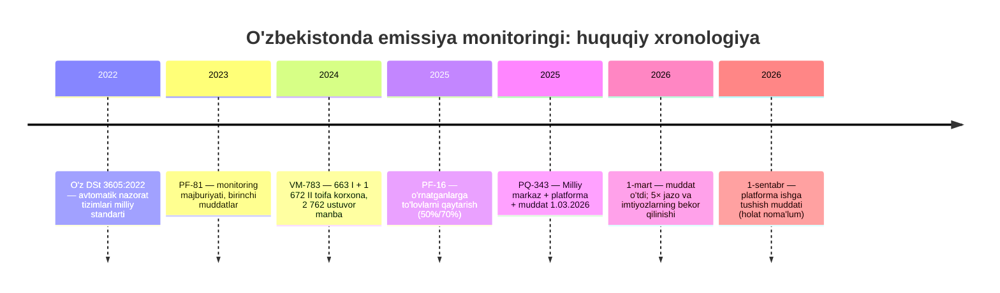

# TADQIQOT №3 — USKUNALAR AMALDAGI HOLATI
### "Ma'lumot bormi?" savoliga hujjatlar asosidagi javob — va nima o'zgargan

**Sana:** 2026-yil sentabr · **Holat:** tadqiqot, kod yo'q
**Tegishli:** `Emissiya_Goya_Mukammalligi.md` §2.1, §3, §15-savol 3

> ⚠️ **Bu tadqiqot g'oyaning bir qismini o'zgartirdi.** Ish boshida "ma'lumot yo'q" degan xavf bor edi. Hujjatlar shuni ko'rsatdi: **ma'lumot oqimi endi qonun bilan majburiy va jazo multiplikatori amalda.** Xavf boshqa joyga — **ma'lumot sifatiga** ko'chdi.

---

## 1. Huquqiy zanjir: uch hujjat, uch bosqich

| # | Hujjat | Sana | Nima belgilaydi | Muddat |
|---|---|---|---|---|
| 1 | **PF-81** "Ekologiya va atrof-muhitni muhofaza qilish sohasini transformatsiya qilish" | 31.05.2023 | I toifa korxonalar (2024-yil oxiri → keyin **1.07.2025**), II toifa (**2025-yil oxiri**) avtomatik monitoring stansiyalarini o'rnatishi; tuman/shaharlarda **347 ta avtomatlashtirilgan kichik stansiya** | 2023–2025 |
| 2 | **VM-783** "Sanoat korxonalarining atrof-muhitga salbiy ta'sirini kamaytirish" | 25.11.2024 (tahrirlar: VM-347 03.06.2025, VM-85 28.02.2026) | **2-ilova**: I toifa — **663 ta korxona, 985 ta ustuvor manba** (1.01.2026); II toifa — **1 672 ta korxona, 1 777 ta ustuvor manba** (1.07.2026). **3-ilova**: lokal suv tozalash — 31/191 ta korxona. **1-mart 2025 dan** kichik stansiyalar **yagona geoaxborot bazasiga** integratsiya qilinishi shart. O'rnatmasa — kompensatsiya to'lovlari **5 baravar** | 2026 |
| 3 | **PQ-343** "Ekologiya va iqlim o'zgarishi milliy qo'mitasi faoliyatini tashkil etish" (PF-217 ijrosi) | 18.11.2025 (tahrirlar 29.11.2025; 30.03.2026; 28.04.2026) | **Muddat qattiqlashtirildi:** I **va** II toifa — hammasi **1-mart 2026** gacha fon monitoring stansiyasini o'rnatishi va uni **Ekologik monitoring milliy markaziga** integratsiya qilishi shart. 1-mart 2026 dan **bajarganlarga ham, bajarmaganlarga ham** — kompensatsiyadan ozod qilish imtiyozi **bekor**, bajarmaganlarga **5× to'lov** | **1.03.2026** |

### 1.1 Eng muhim o'zgarish

VM-783 ikki bosqichni belgilagan edi (I toifa — 1 yanvar, II toifa — 1 iyul 2026). PQ-343 **ikkalasini birlashtirdi va oldinga tortdi: 1-mart 2026**.

> **Sabab va oqibat:** bugun (2026-yil sentabr) bu muddat **6,5 oy avval o'tgan**. Ya'ni:
> - stansiyalar **o'rnatilgan bo'lishi kerak**;
> - integratsiya **bajarilgan bo'lishi kerak**;
> - bajarmaganlar uchun **5× to'lov rejimi allaqachon ishlayapti**;
> - kompensatsiyadan **ozod qilish imtiyozi qonuniy kuchini yo'qotgan** (1.03.2026 dan).

---

## 2. Ikkita yangi institut (g'oya uchun hal qiluvchi)

### 2.1 "Ekologik monitoring milliy markazi" — davlat muassasasi

PQ-343 (2-band) bilan: Ekologiya qo'mitasining **"Atrof-muhitni muhofaza qilish sohasida ixtisoslashtirilgan tahliliy nazorat markazi" davlat muassasasi negizida "Ekologik monitoring milliy markazi" davlat muassasasi tashkil etiladi.**

> **Nega bu g'oya uchun eng muhim fakt:** korxonalar o'z stansiyalarini **aynan shu markazga** integratsiya qiladi. Bu — **kontsentratsiya nuqtasi**: 2 762 ta ustuvor manba + 347 fon stansiyasi + korxona stansiyalari + sun'iy yo'ldosh signallari bir joyga oqib keladi. G'oyaning "uchinchi daftari" (kuzatuv) va "birinchi daftari" (o'lchov) uchun **yagona qabul qiluvchi organ allaqachon mavjud**.

### 2.2 "Yagona ekologik onlayn platforma" — 8 talab

PQ-343 (4–5-bandlar): **2026-yil 1-sentabrga qadar**, Ekologiya qo'mitasi va Raqamli texnologiyalar vazirligi birgalikda, **Ekologiya jamg'armasi mablag'lari hisobidan** platformani ishga tushirishi shart. Platformaga quyidagi **asosiy talablar** (7-ilova) tasdiqlangan:

| # | Talab (hujjat matni) | G'oya bilan mosligi |
|---|---|---|
| 1 | **Ekologiya sohasidagi huquqbuzarlik holatlarini masofaviy aniqlash** imkoniyatlarini yaratish | **Aynan g'oyaning o'zi** — masofadan aniqlash |
| 2 | Masofaviy nazorat mexanizmlari orqali boshqaruv jarayonida **inson omilini qisqartirish** | Avtomatlashtirish talabi |
| 3 | Ekologik ma'lumotlar asosida tabiiy va **antropogen** holatlarni tahlil qilish | Tahlil qatlami |
| 4 | Atmosfera havosi bilan bog'liq xavfli hodisalar to'g'risida **aholini erta ogohlantirish** | Aholi qatlami |
| 5 | Sertifikat, ekspertiza va ruxsat hujjatlarini taqdim qilish | Xizmat qatlami |
| 6 | To'plangan ma'lumotlar asosida huquqbuzarlarga **onlayn ravishda ta'sir choralarini belgilash** | **Tartib (due process) qatlami** — biz taklif qilgan qavat |
| 7 | Katta hajmdagi ma'lumotlar bilan ishlash va **onlayn davlat ekologik nazorati texnologiyalari** | Miqyos talabi |
| 8 | Sohaga **sun'iy intellekt va "Big data" texnologiyalarini joriy etish** | Texnologiya talabi |

> **Sabab:** platformaning **1-, 6- va 8-talablari** bizning kontseptsiya bilan **so'zma-so'z** mos keladi: masofadan aniqlash + onlayn ta'sir chorasi + AI/Big Data. Ya'ni g'oya **homiysiz emas** — u **hujjat bilan talab qilingan**. Bu PQ-343 topilmasidan oldin noma'lum edi.

---

## 3. Amalda nima o'rnatilgan: dalillar

| Obyekt / hudud | Holat | Manba |
|---|---|---|
| **Qoraqalpog'iston (Orolbo'yi)** | **37 ta** avtomatlashtirilgan onlayn stansiya o'rnatildi (UNDP loyihasi); PM2.5, PM10, CO, NO2, O3, H2S + meteorologiya; ma'lumot **"Auris Green Tech"** tizimi orqali avtomatik yangilanadi | gazeta.uz, 20.04.2026 |
| **Toshkent sh., Sergeli tumani** | Maxsus komissiya (Prezidentning ekologiya masalalari bo'yicha maslahatchisi boshchiligida) tekshiruvi: "Procab" MChJ, "Asl Oyna" MChJ va boshqa korxonalarda **avtomatik monitoring stansiyasi o'rnatilmagan**; majburiy yozma ko'rsatmalar berilgan, o'rnatmasa — to'lovlar 5× | gov.uz, 19.01.2026 |
| **"Navoiy KMK" AJ** | Ifloslantiruvchi manbalarida **inson omilisiz** namuna olish/tahlil qilish avtomatik stansiyalarini o'rnatish — "Navoiy KMK" mablag'lari + **Ekologiya jamg'armasi** hisobidan | PF-16 dasturi, 2025 |
| **Toshkent sh. va tutash hududlar** | Majburiy avtomatik monitoring postlari o'rnatilib, **yagona geoaxborot tizimiga** integratsiya qilinadi; talabga amal qilmaganlar uchun kompensatsiya to'lovlari **keskin oshiriladi** | gov.uz, 24.03.2026 |
| **Viloyatlar/tumanlar** | **347 ta** kichik fon stansiyasi — aniq manzillar bilan (Toshkent sh. — 29, Farg'ona — 32, Xorazm — 18, Toshkent vil. — 34 va h.k.) | VM-783, 1-ilova |
| **Qurilish sektori** | Qurilish boshlanishidan oldin quruvchilar tomonidan **fon monitoring stansiyalari va onlayn kameralar** o'rnatilishi talab qilinadi — "Qurilishda ekologik faoliyat standarti talablari" ishlab chiqilmoqda | PQ-343, 6-ilova |
| **Davlat ekologik nazorati qamrovi** | Davlat monitoringi **452 ta** xo'jalik yurituvchi subyektni qamrab olgan (eski ma'lumot) | eco.gov.uz |

**Xulosa:** jarayon **boshlangan va qisman kechikkan**. Sergeli holati — bitta hujjatlashtirilgan misol; lekin bu **"ko'pchilik bajargan"** degani ham emas, **"ko'pchilik bajarmagan"** degani ham emas. Bu haqda ommaviy hisobot **yo'q** — va aynan shu **bo'shliq**.

---

## 4. Rag'bat mexanizmi (allaqachon amalda)

**PF-16 (30.01.2025)** — "O'zbekiston-2030" strategiyasi dasturi. **2025-yil 1-avgustdan** I va II toifa korxonalar uchun ikki bosqichli imtiyoz:

| Bosqich | Shart | Imtiyoz |
|---|---|---|
| **I** | Fon monitoring stansiyasi o'rnatgan korxona | (a) kompensatsiya to'lovlaridan shakllangan **qarzdorlikdan voz kechish**; (b) byudjetga yo'naltirilgan kompensatsiya to'lovlarining **50 foizigacha** qismini **ikki yil** davomida qaytarish |
| **II** | Monitoring stansiyasi o'rnatgan + keyingi **bir yil** ichida chang-gaz va lokal suv tozalash uskunalarini o'rnatgan | Shuning **70 foizigacha** qismini **ikki yil** davomida qaytarish |

Imtiyoz **Davlat xizmatlari markazlari yoki Yagona interaktiv davlat xizmatlari portali** orqali, **Ekologiya vazirligining xulosasi** asosida beriladi.

> **Sabab va muhim nuqta:** bu — **g'oyaning "ishonch zinapoyasi" (§6.4) milliy shaklda allaqachon mavjudligi**. Ya'ni "infratuzilma qurdim → maqom oldim → pul qaytarildi" zanjiri **haqiqatda ishlaydi** (imtiyoz esa qaytarish, subsidiyadan oson).
>
> Lekin **davlatning o'zi bu zinapoyani 1-mart 2026 dan yopdi**: "kompensatsiyadan ozod qilish tarzidagi imtiyozlar o'z kuchini yo'qotadi". Ya'ni **rag'bat oynasi yopilgan, majburiyat oynasi ochilgan**. G'oyaning yangi rag'bat takliflari (🟢/🔵 maqom, tekshiruv kamayishi, CBAM hisobi) aynan **shu bo'sh joyga** tushadi.

---

## 5. Nima noma'lum (ochiq ro'yxat)

| # | Savol | Nega bu muhim | Qayerdan bilish mumkin |
|---|---|---|---|
| 1 | **2 762 ta ustuvor manbaning qanchasida stansiya haqiqatda ishlayapti?** | Tizim qamrovsiz ishlamaydi | Ekologik monitoring milliy markazi (PQ-343 bo'yicha yagona qabul qiluvchi) |
| 2 | **O'lchov sifati qanday?** O'z DSt 3605:2022 talablariga muvofiqlik tekshirilganmi? | Shovqin qavati va flag ishonchliligi shunga bog'liq (1-tadqiqot) | Metrologiya agentligi + Markaz sertifikatlashtirish bo'limi |
| 3 | **Platforma ishga tushdimi?** (muddat — 1.09.2026) | G'oyaning "uyi" shu platforma | Raqamli texnologiyalar vazirligi / Qo'mita |
| 4 | **Ma'lumot rejimi:** korxona stansiyalari ma'lumoti ommaga ochiqmi yoki faqat nazorat organiga? | Oshkora bo'lmasa, aholi va NNT qatlami ishlamaydi | Platforma nizomi |
| 5 | **Namuna olish nuqtasi kim tanlaydi?** (korxona o'zi yoki nazorat organi?) | Agar korxona tanlasa, "toza nuqta" tanlash xavfi | O'z DSt 3605:2022 + texnik topshiriq |
| 6 | **Kalibrovkani kim qiladi va kim to'laydi?** | Mustaqillik qoidasining milliy shakli | Akkreditatsiyalangan laboratoriyalar reyestri |

> **Sabab:** bu olti savol — **keyingi tadqiqot predmeti**. Ularning har biri hujjat bilan javob berilishi mumkin (josuslik emas, ochiq ma'lumot), lekin ular **hozir** ochiq.

---

## 6. G'OYAGA TA'SIRI: xavf ko'chdi

| Avvalgi xavf | Hozirgi holat | Yangi xavf |
|---|---|---|
| "**Ma'lumot yo'q** — tizim ko'r boshlanadi" | Majburiyat + 5× jazo + 1.03.2026 muddati **o'tgan**; integratsiya nuqtasi (Markaz) **tashkil etilgan** | **"Ma'lumot bor, lekin sifati noma'lum"** — shovqin qavati o'lchanmagan, muvofiqlik auditi e'lon qilinmagan |
| "**Korxonalar qarshilik qiladi**" | Rag'bat mexanizmi (PF-16: 50%/70% qaytarish) **allaqachon ishlagan**; endi imtiyoz oynasi yopilgan | **"Ma'lumot uzilishi"** — stansiya bor, lekin uzatish to'xtatilgan ("texnik nosozlik" bahonasi) |
| "**Qonuniy asos yo'q**" | PQ-343 platformaga **8 talab**ni, jumladan **"masofaviy aniqlash"** va **"onlayn ta'sir chorasi"**ni belgilagan | **"Platforma nimani o'lchaydi"** — talablar **funksional**, lekin **noaniqlik va apellyatsiya talabi yo'q** |

### 6.1 Uch amaliy natija

1. **G'oya endi "taklif" emas, "to'ldirish".** PQ-343 platformaning **nima qilishini** aytadi (masofadan aniqlash, onlayn ta'sir). Lekin **qanday qilib adolatli qilishni** aytmaydi: noaniqlik chegarasi, "shartli zona", apellyatsiya, yolg'on-ijobiy darajasining oshkorligi — **yo'q**. Bizning hissa aynan shu yerda.
2. **Shovqin qavati (1-tadqiqot) endi kechiktirib bo'lmaydigan ish.** Sabab: 5× jazo **hozir ishlayapti**. Ya'ni bugun noto'g'ri chegara bilan ishlansa, **haqiqiy pul jazosi** noto'g'ri qo'llaniladi.
3. **Metrologik muvofiqlik — yangi "P0" vazifa.** O'z DSt 3605:2022 bor; uni **majburiy sertifikatlash shartiga** aylantirish (yoki hech bo'lmaganda muvofiqlik deklaratsiyasini talab qilish) — g'oyaning huquqiy himoyasi.

---

## 7. Xronologiya (bir qarashda)

---

## 8. Xulosa (to'rt jumla)

1. **Infratuzilma endi qonun bilan talab qilinadi va muddat o'tgan** — 1-mart 2026; bajarmaganlar uchun kompensatsiya to'lovlari **5 barobar**, kompensatsiyadan ozod qilish imtiyozlari **bekor qilingan**.
2. **Ikki institut tashkil etilgan**: **Ekologik monitoring milliy markazi** (integratsiya nuqtasi) va **Yagona ekologik onlayn platforma** (1.09.2026 muddati, Ekologiya jamg'armasi hisobidan) — uning **8 asosiy talabi** g'oyani so'zma-so'z takrorlaydi: masofaviy aniqlash, onlayn ta'sir chorasi, AI/Big Data.
3. **Amalda qisman bajarilgan**: 37 ta stansiya Orolbo'yida, 347 ta fon stansiyasi rejada, Navoiy KMK o'z hisobidan o'rnatmoqda — **va** Sergeli tumanida o'rnatilmagan korxonalar hujjatlashtirilgan. Umumiy qamrov statistikasi **e'lon qilinmagan**.
4. **Xavf ko'chdi**: "ma'lumot yo'q" emas, **"ma'lumot sifati noma'lum va apellyatsiya tartibi yo'q"**. Bu — g'oyaning aniq ish maydoni.

---

## MANBALAR

> *Matnda manbalar **hujjat nomi va sana** bilan ko'rsatilgan; quyidagi jadvalda ularning kodi, ishonchlilik darajasi (**R** — rasmiy, **A** — akademik, **M** — media) va havolasi keltirilgan.*

| Kod | Manba | Sana | Daraja | Havola |
|---|---|---|---|---|
| R1 | **PQ-343** — Ekologiya va iqlim o'zgarishi milliy qo'mitasi; Milliy markaz; platforma (4–5-band, 7-ilova: 8 talab); 1.03.2026 muddati va 5× tartibi (6–7-band); 8–10-ilovalar (mablag'lar, taqsimot, kengash) | 18.11.2025 (tahrirlar 2026) | R | https://lex.uz/uz/docs/-7847341 |
| R2 | PQ-343 doc-passport — "Ekologik monitoring milliy markazi" **ixtisoslashtirilgan tahliliy nazorat markazi negizida** tashkil etilishi; qo'mita Prezidentga bevosita hisobdor | 18.11.2025 | R | https://lex.uz/doc-passport/-7847341 |
| R3 | **VM-783** — 2-ilova (663 I / 1 672 II toifa; 985/1 777 ustuvor manba; muddatlar), 1-ilova (347 stansiya manzillari), 3-ilova (suv tozalash 31/191); 5× to'lov; 1.03.2025 dan geoaxborot bazasiga integratsiya | 25.11.2024 (tahrirlar 2025–2026) | R | https://lex.uz/uz/docs/-7233437 |
| R4 | **PF-81** — monitoring majburiyati, muddatlar (I toifa 1.07.2025, II toifa 2025-yil oxiri), 347 kichik stansiya | 31.05.2023 | R | https://lex.uz/uz/docs/-6479180 |
| R5 | **PF-16** — monitoring stansiyasi o'rnatganlarga qarzdorlikdan voz kechish va 50%/70% qaytarish; DXM/YAIDXP orqali | 30.01.2025 | R | https://lex.uz/uz/docs/-7369703 |
| R6 | gazeta.uz — Orolbo'yida **37 ta** onlayn stansiya, UNDP, "Auris Green Tech" | 20.04.2026 | M | https://www.gazeta.uz/oz/2026/04/20/monitoring/ |
| R7 | gov.uz — Sergeli tumanida stansiya o'rnatmagan korxonalar ("Procab", "Asl Oyna"); majburiy ko'rsatmalar | 19.01.2026 | R | https://gov.uz/oz/eco/news/view/121616 |
| R8 | gov.uz — Toshkent va tutash hududlarda majburiy postlar, yagona geoaxborot tizimi, imtiyozlar | 24.03.2026 | R | https://gov.uz/oz/news/view/145142 |
| R9 | norma.uz / gazeta.uz — PQ-343 bo'yicha umumiy sharh (muddat, 5×, imtiyozlarning bekor qilinishi) | 19.11.2025 | M | https://www.gazeta.uz/oz/2025/11/19/monitoring/ |
| R10 | O'zbekiston Tabiatni muhofaza qilish qonuni / uznature.uz — yagona geoaxborot bazasi, ixtisoslashtirilgan tahliliy nazorat markazi bazasida shakllantirilishi | amaldagi | R | https://uznature.uz/en/activity/monitoring |
| M1 | eco.gov.uz — davlat monitoringi **452 ta** xo'jalik subyektini qamrab olgan | 2019 | M | http://eco.gov.uz/en/site/news?id=197 |
| A1 | IQAir/uzgydromet ma'lumotlari (fon monitoringi tarmog'i: 61 turg'un post, 22 shahar) — milliy monitoring dasturi | 2026 | A | https://www.norma.uz/oz/qonunchilikda_yangi/2021-2025_yillarda_atrof_tabiiy_muhit_monitoringi_dasturi_tasdiqlandi |
