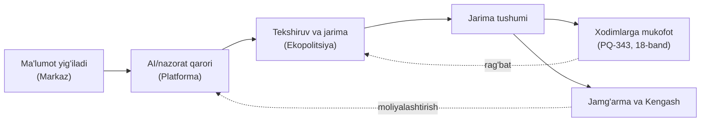

# TADQIQOT №4 — EGALIK MODELI
### Tizim kimning qo'lida bo'ladi: institutsional xarita va kontsentratsiya xavfi

**Sana:** 2026-yil sentabr · **Holat:** tadqiqot, kod yo'q
**Tegishli:** `Emissiya_Goya_Mukammalligi.md` §8, §10, §15-savol 4

---

## 0. Savol

G'oya "uch daftar"ni solishtiradi, farqni topadi, navbat tuzadi va tartibli javob talab qiladi. Savol: **bu tizim kimga tegishli bo'ladi?** Egalik — texnik tafsilot emas: u **rag'batlar muvozanatini**, **apellyatsiya mustaqilligini** va **ma'lumot rejimini** belgilaydi.

Yaxshi xabar: PQ-343 dan keyin bu savolga **hujjatlar asosida** javob berish mumkin — taxmin qilish shart emas.

---

## 1. Institutsional xarita (hujjatlar bo'yicha)

| Funksiya | Kim | Huquqiy asos | Izoh |
|---|---|---|---|
| **Siyosiy rahbarlik** | **Ekologiya va iqlim o'zgarishi milliy qo'mitasi** (Prezident huzurida) | PQ-343 (PF-217 ijrosi) | Qo'mita **to'g'ridan-to'g'ri Prezidentga hisobdor**; hududiy bo'linmalar mahalliy hokimiyat tarkibiga **kirmaydi**, Qo'mita oldida hisobdor |
| **Ma'lumot markazi (integratsiya nuqtasi)** | **"Ekologik monitoring milliy markazi"** davlat muassasasi | PQ-343, 2-band | Ixtisoslashtirilgan tahliliy nazorat markazi **negizida** tashkil etiladi. Korxona stansiyalari **aynan shu markazga** integratsiya qilinadi |
| **Platforma (front-end)** | Ekologiya qo'mitasi + **Raqamli texnologiyalar vazirligi** | PQ-343, 4–5-bandlar, 7-ilova | Muddat: **1.09.2026**; moliyalashtirish: **Ekologiya jamg'armasi**; 8 asosiy talab |
| **Nazorat va majburlash** | **Davlat ekologik nazorat inspeksiyasi (Ekopolitsiya)** | PQ-343, 3-ilova | Yangi organ; hududiy Ekopolitsiyalar bilan birlikda ishlaydi |
| **Moliyaviy boshqaruv** | **Umummilliy ekologik muammolarni bartaraf etish davlat maqsadli jamg'armasi** boshqaruv kengashi | PQ-343, 10-ilova | Kengash raisi — Qo'mita raisi; tarkibda **Senat qo'mitasi raisi**, **Qonunchilik palatasi fraksiya rahbari**, Iqtisodiyot va moliya vazirligi departament direktori va **4 ta mustaqil a'zo (jamoatchilik vakillari)** |
| **Ma'lumot infratuzilmasi** | Yagona geoaxborot ma'lumotlar bazasi (**gis.uznature.uz**) | Tabiatni muhofaza qilish qonuni / milliy monitoring dasturi | Ekologiya qo'mitasi huzuridagi ixtisoslashtirilgan tahliliy nazorat markazi bazasida shakllantirilgan |
| **Metrologik nazorat** | Metrologiya agentligi + akkreditatsiyalangan laboratoriyalar | O'z DSt 3605:2022, O'z DSt 8.009:2004 | Uskuna muvofiqligi va kalibrovka zanjiri |

**Xulosa:** g'oyaning texnik "uyi" **allaqachon qurilgan** — Markaz (qabul qiluvchi) + Platforma (ko'rsatuvchi) + Bazasi (saqlovchi). Bu **g'oyani tezlashtiruvchi** fakt.

---

## 2. Asosiy strukturaviy xavf: kontsentratsiya

### 2.1 Muammo

Bir qo'lda to'planish:

**Kritik fakt (PQ-343, 18-band):** *Ekopolitsiya xodimlari ekologiya sohasidagi qonunbuzilish holatlari yuzasidan qo'llanilgan **jarima** hamda **yetkazilgan zarar summasi** hisobidan belgilangan tartibda **pul mukofoti** bilan rag'batlantiriladi.*

> **Sabab — nega bu jiddiy:** bu — **bounty (mukofot) modeli**. U jazoni **rag'batlantiruvchi vosita** qiladi. Afzalligi: passivlikni yo'q qiladi (nazoratchi o'zi qidiradi). Xavfi: **flag sonini maksimallashtirish** illuziyasi — xuddi Goodhart qonuni (§7) nazorat organining o'zida ishlaydi.
>
> Agar AI yuqori yolg'on-ijobiy daraja bilan flag chiqarsa, mukofot tizimi **yolg'on tekshiruvlar**ni rag'batlantiradi. Bu — tizimning **eng katta ishonch xavfi**.

### 2.2 Beshta yumshatish chorasi (g'oya darajasida)

| # | Chora | Sabab |
|---|---|---|
| 1 | **Flag ≠ jazo ajratilishi** — flag navbat tuzadi, jazo **ismi bilan mas'ul inson** imzolaydi | Mukofot **jazo tushumiga** bog'liq, flag soniga emas: shunda soxta flag foyda bermaydi |
| 2 | **Yolg'on-ijobiy darajasining oshkorligi** (oylik e'lon) | Ochilgan xatolik **ishonchni saqlaydi**; yashirilgan xatolik siyosiy qurolga aylanadi (§8.2) |
| 3 | **Apellyatsiya natijalarining statistikasi** — qancha flag bekor qilindi | Apellyatsiya **haqiqiy bo'lsa**, mukofot tizimi o'z-o'zini tuzatadi |
| 4 | **Mustaqil qayta ko'rik kvotasi** — tasodifiy tanlangan flaglar ikkinchi mutaxassis tomonidan ko'riladi | Nazorat organining o'z xatolarini **o'lchash** imkoni |
| 5 | **Mukofot manbasini ajratish** — mukofot **jarimadan emas, umumiy fondan** | Aks holda nazoratchining shaxsiy daromadi korxonaning jazosiga bog'lanadi (manfaatlar to'qnashuvi) |

> **Nega 5-chora eng kuchli:** PROPER tajribasi (Indoneziya) ko'rsatdi — **faqat oshkoralik** (hech qanday mukofot va jarima bo'lmagan) BOD/COD ni **32–35%** kamaytirdi. Ya'ni rag'bat **mukofotdan** emas, **ma'lumot oshkoraligidan** olinishi mumkin va arzonroq.

---

## 3. Xalqaro taqqoslash: kim egalik qiladi va nima ajratilgan

| Mamlakat | Ega (MRV) | Ajratilgan funksiya | Olingan saboq |
|---|---|---|---|
| **Turkiya** | Climate Change Directorate (DoCC) — MRV **va** ETS bir organda; **DMS** orqali 700+ obyekt hisobot yuboradi | Akkreditatsiya — **TÜRKAK** (ISO 14065); bozor nazorati — **EMRA**; bozor operatori — **EXIST** | **"Ega + verifikator akkreditatsiyasi + bozor nazorati" uch xil organda.** Bizda akkreditatsiya Metrologiya agentligida bo'lishi kerak — bir xil mantiq |
| **Qozog'iston** | Vazirlik (Ekologiya) tartibni belgilaydi | **JSC "Zhasyl Damu"** — davlat reyestri **operatori** (mas'uliyati cheklangan jamiyat shakli) | MRV platformasini **alohida operator** yuritadi — davlat muassasasi muqobil |
| **Xitoy** | MEE + milliy platforma | Uchinchi tomon verifikatorlarining soxtalashtirishi — **jinoiy javobgarlik** (15.08.2023 dan); jarima 2 mln yuanga qadar | Ega **ekologiya organi**, lekin **javobgarlik zanjiri** verifikatorgacha cho'zilgan |
| **Yevropa Ittifoqi** | Komissiya + milliy kompetent organlar | Verifikatorni **ob'ekt to'laydi** → manfaatlar to'qnashuvi (Verra saboqi) | To'lov manbai va nazorat obyekti **ajratilmasa**, mustaqillik bo'lmaydi |

> **Umumiy qonuniyat:** hech bir mamlakatda **aniqlash + jazo + mukofot** bir qo'lda emas. Har birida **kamida bitta funksiya** tashqariga chiqarilgan (akkreditatsiya, apellyatsiya, bozor nazorati yoki javobgarlik).

---

## 4. To'rt egalik varianti (solishtirish)

| Variant | Mazmuni | Kuchli tomoni | Zaif tomoni | Moslik |
|---|---|---|---|---|
| **A. Qo'mita ichida** | Platforma va analitika Qo'mita/Markaz tarkibida | Tez, qo'shimcha qonun shart emas; PQ-343 talabi bilan **to'g'ridan-to'g'ri mos** | Kontsentratsiya xavfi; xodim almashinuvi bilan bilim yo'qoladi | **Pilot uchun eng mos** |
| **B. Markaz + alohida analitika bo'linmasi (DPO)** | Markaz ma'lumot egasi; analitika alohida davlat unitar korxonasi/xo'jalik jamiyati | Xarajat shaffof; mutaxassisni **bozor bahosida** yollash mumkin; **javobgarlik** ajratiladi | Ikkilangan boshqaruv; ma'lumot almashish shartnomasi kerak | **Sanoat bosqichi uchun** |
| **C. Alohida operator (Zhasyl Damu modeli)** | Reyestr va platforma operatori — alohida jamiyat | Xalqaro amaliyotga mos; moliyaviy hisobdorlik oson | Qo'shimcha tashkiliy qaror talab qiladi | O'rta muddat |
| **D. Davlat-xususiy hamkorlik** | Ma'lumot davlatda, texnologiya va xizmat xususiy sektorda | Texnologik tezlik; xalqaro verifikatsiya bilan integratsiya | Tijoriy sir va manfaatlar to'qnashuvi boshqaruvi talab | **Xalqaro bozor moduli (CBAM) uchun** |

### 4.1 Tanlash mezonlari (g'oya darajasida)

Variant quyidagi **to'rt mezon** bo'yicha tanlanadi — va mezonlar **bir-biriga zid** bo'lishi mumkin, shuning uchun ular ochiq yozilishi kerak:

1. **Ma'lumot egaligi davlatda qoladimi?** (agar yo'q — verifikatsiya ishonchi yo'qoladi)
2. **Analitika va jazo ajratilganmi?** (kontsentratsiya xavfi)
3. **Mutaxassisni jalb qilish mumkinmi?** (davlat ish haqi cheklovi)
4. **Huquqiy javobgarlik kimda?** (Finlyandiya talabi: **ismi bilan mas'ul shaxs**)

> **Sabab:** bu mezonlarning dastlabkisi — **ma'lumot egaligi** — eng muhim, chunki CBAM va sug'urta bozori aynan **"davlat tasdiqlagan raqam"**ga to'laydi. Agar ma'lumot xususiy operatorga o'tsa, **davlat kafolati** yo'qoladi va butun biznes-model yo'qoladi.

---

## 5. Tavsiya etiladigan tuzilma (mantiq)

> **Uch qatlamli ajratish: ma'lumot — Markazda; analitika — alohida bo'linmada; jazo — Ekopolitsiyada; apellyatsiya — Qo'mita huzuridagi Kengashda.**

| Qatlam | Kim | Nega aynan u |
|---|---|---|
| **Ma'lumot** | Ekologik monitoring milliy markazi | PQ-343 bilan **allaqachon** integratsiya nuqtasi etib belgilangan |
| **Analitika (navbat tuzish)** | Markaz qoshidagi alohida analitika bo'linmasi yoki DPO | Texnologik moslashuvchanlik; **natijaga** javobgar |
| **Jazo va tekshiruv** | Ekopolitsiya | Qonuniy vakolat **faqat** unda |
| **Apellyatsiya va audit** | Jamg'arma boshqaruv kengashi + mustaqil ekspert kengashi | Kengashda **4 ta mustaqil jamoatchilik a'zosi** allaqachon bor — bu **tayyor platforma** |

> **Nega apellyatsiyani Kengashga berish ayniqsa mos:** PQ-343, 10-ilova bo'yicha kengash tarkibida **4 ta mustaqil a'zo (jamoatchilik vakillari)** + Senat va Qonunchilik palatasi vakillari bor. Ya'ni **mustaqil ko'rib chiqish organi qonuniy jihatdan allaqachon mavjud** — uni ishlatish uchun yangi organ yaratish shart emas.

---

## 6. Halol cheklovlar

| # | Savol | Nega javob yo'q |
|---|---|---|
| 1 | **Markazning shtati va texnik quvvati** qanday? | PQ-343 tuzilmani belgilaydi, amaldagi holat e'lon qilinmagan |
| 2 | **Platforma ma'lumoti ochiq bo'ladimi?** | 7-ilova talablari **funksional**, oshkoralik rejimi yozilmagan |
| 3 | **Ekopolitsiya mukofoti mexanizmining aniq formulasi** | "Belgilangan tartibda" — tartib hujjati topilmadi |
| 4 | **Apellyatsiya organi** rasmiy bormi? | PQ-343 da alohida apellyatsiya normasi **ko'rinmadi** → bu **bo'shliq** va aynan shu bo'shliq g'oyaning hissasi bo'la oladi |

---

## 7. Xulosa (to'rt jumla)

1. **Egalik savoli allaqachon qisman yopilgan:** Markaz (ma'lumot), Platforma (front-end), Ekopolitsiya (nazorat), Jamg'arma kengashi (moliya) — PQ-343 bilan belgilangan.
2. **Asosiy xavf — kontsentratsiya:** aniqlash + jazo + **xodim mukofoti** bir zanjirda; bu **flag maksimallashtirish** rag'batini yaratadi.
3. **Ajratish yechimi taklif etiladi:** ma'lumot ≠ analitika ≠ jazo ≠ apellyatsiya; apellyatsiyani **allaqachon mavjud** bo'lgan Jamg'arma kengashiga (4 mustaqil a'zo) berish.
4. **Xalqaro amaliyot tasdiqlaydi:** hech bir mamlakatda bu to'rt funksiya bir qo'lda emas.

---

## MANBALAR

> *Matnda manbalar **hujjat nomi va sana** bilan ko'rsatilgan; quyidagi jadvalda ularning kodi, ishonchlilik darajasi (**R** — rasmiy, **A** — akademik, **M** — media) va havolasi keltirilgan.*

| Kod | Manba | Sana | Daraja | Havola |
|---|---|---|---|---|
| R1 | **PQ-343** — Qo'mita nizomi (2-ilova), Ekopolitsiya nizomi (3-ilova, shu jumladan 18-band: jarima hisobidan mukofot), platforma (4–5-band, 7-ilova), Jamg'arma kengashi tarkibi (10-ilova) | 18.11.2025 | R | https://lex.uz/uz/docs/-7847341 |
| R2 | PQ-343 doc-passport — Milliy markazning ixtisoslashtirilgan tahliliy nazorat markazi negizida tashkil etilishi; Qo'mitaning Prezidentga hisobdorligi | 18.11.2025 | R | https://lex.uz/doc-passport/-7847341 |
| R3 | uznature.uz — yagona geoaxborot ma'lumotlar bazasi, markaz bazasida shakllantirilishi, monitoring turlari | amaldagi | R | https://uznature.uz/en/activity/monitoring |
| R4 | Turkiya ETS/MRV — DoCC (ega), TÜRKAK (akkreditatsiya, ISO 14065), EMRA (bozor nazorati), EXIST (operator) | 2024–2026 | R | https://icapcarbonaction.com/en/ets/turkish-emission-trading-system |
| R5 | Qozog'iston — "Zhasyl Damu" davlat reyestri operatori; MRV platformasi (WB/PMR) | 2018–2024 | R | https://icapcarbonaction.com/system/files/ets_pdfs/icap-etsmap-factsheet-46.pdf |
| A1 | Finlyandiya Konstitutsiyaviy qo'mitasi talablari — algoritm asosida qaror, apellyatsiya, **mas'ul davlat xizmatchisi** | 2020 | A | https://link.springer.com/article/10.1007/s10506-020-09269-x |
| A2 | García, Afsah & Sterner — PROPER (Indoneziya): faqat oshkoralik BOD/COD ni 32–35% kamaytirdi | 2008–2013 | A | https://link.springer.com/article/10.1007/s10640-008-9211-2 |
| A3 | Xitoy — uchinchi tomon verifikatorlarining soxtalashtirishi jinoiy javobgarlik; MEE hisoboti | 2023–2025 | A | https://www.mee.gov.cn/ywdt/xwfb/202407/W020240722528850763859.pdf |
| R6 | gov.uz/eco — **gis.uznature.uz**: davlat ekologik monitoringining yagona geoaxborot bazasi tashkil etilgan va **tegishli vazirlik va idoralar bilan integratsiya qilingan**; ochiq ma'lumotlar portaliga muntazam chiqariladi | 28.05.2024 | R | https://gov.uz/en/eco/news/view/12655 |
| M1 | Mongabay — Verra auditorlari tadqiqoti (95 loyiha): to'lov manbai mustaqillikni yo'q qiladi | 11.09.2025 | M | https://news.mongabay.com/2025/09/independent-auditors-overvalue-credits-of-carbon-projects-study-finds/ |