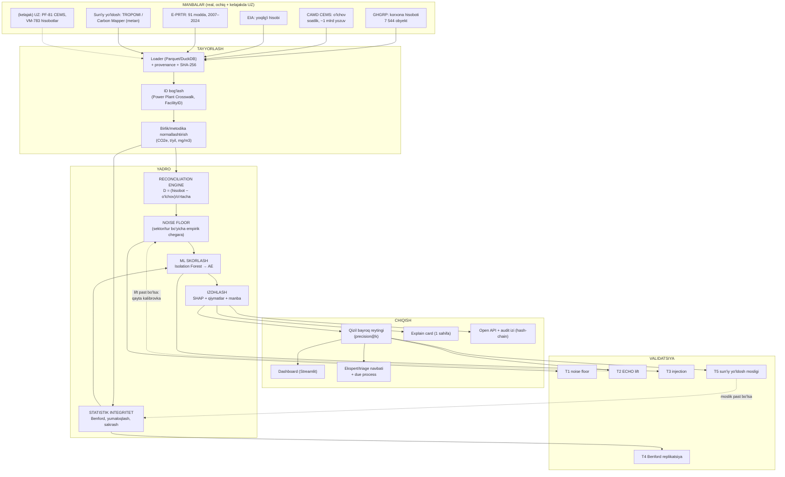

# EMISSIYA-AUDIT: MASTER REJA VA VALIDATSIYA TO'PLAMI
## Ko'lamni kengaytirish (GHG → barcha emissiyalar) + real ma'lumotda qat'iy validatsiya + eng tez yakka yo'l

**Sana:** 2026-09-18 · **Holat:** v1.0 — qaror qabul qilish uchun  
**Asos:** `Loyiha1_AI_anomaliya_TZ.md` (E-GAZ-AUDIT), `Uzbekistan_Eko_DeepResearch_2026.md`, + 12 yangi tekshirilgan manba (quyida)  
**Ijrochi rejim:** yakka, "eng tez" — 4 hafta · **Budjet:** $0 (ixtiyoriy VPS $10–20/oy)

---

## 0. BOSHQARUV XULOSASI — 6 TA QAROR

| # | Qaror | Nega hozir (bir jumlada) |
|---|---|---|
| **1** | **Ko'lam:** GHG (CO₂/CH₄/N₂O) → **barcha emissiyalar** (havo ifloslantiruvchilari: SO₂, NOx, CO, PM2.5/PM10, NMVOC, NH₃ + metan) | O'zbekistonda **PF-81** I/II toifa korxonalarda avtomatik monitoringni majburiy qildi — ya'ni CEMS ma'lumot oqimi **shu yili** paydo bo'ladi; tizim uni qabul qilmasa, imkoniyat o'tib ketadi |
| **2** | **Validatsiya pivoti:** sintetik ma'lumot → **REAL ochiq sanoat ma'lumotlari** (EPA GHGRP + CAMD CEMS + EIA + ECHO; EU E-PRTR; sun'iy yo'ldosh) | Topildi: **bir xil obyekt uchun 3 ta mustaqil emissiya bahosi** ochiq va bepul mavjud (GHGRP↔CAMD↔EIA) — bu **haqiqiy ground truth**; sintetik esa faqat zaxira |
| **3** | **"Shovqin qavati" (noise floor) kalibrovkasi** majburiy birinchi qadam | Nashr etilgan tadqiqot: CEMS vs yoqilg'i hisobi **±10,8%** (2σ) farq qiladi — bunda normal, halol farq. Usiz har bir flag **soxta** bo'ladi |
| **4** | **5 ta "oltin sinov"** (2.3-bo'lim) — oldindan e'lon qilingan mezonlar bilan | "Valid" so'zi tekshiriladigan raqamlarga aylanishi kerak: noise floor, precision@k vs huquqiy ijro, injection recall, Benford replikatsiyasi, sun'iy yo'ldosh mosligi |
| **5** | **4 haftalik yakka sprint** + 48 soatlik "tutun sinovi" (2 kunda birinchi real raqam) | "Eng tez" talabi: model yozishdan oldin **real ma'lumotda bitta gistogramma** olish — g'oya tirik yoki o'lik ekanini 2 kunda ko'rsatadi |
| **6** | **Falsifikatsiya mezonlari** (2.5) — qaysi natija bo'lsa g'oya **o'ladi** yoki qayta formulirovka qilinadi | Akademik jihatdan halol yo'l: g'oyani "himoya" emas, **sinash**; bu konferensiyada ham kuchli pozitsiya |

> **Eslatma (nima o'zgarmaydi):** O'zbekiston korxona darajasidagi GHG/emissiya ma'lumotlari hozircha ochiq emas → UZ haqidagi **yakuniy** xulosalar usul darajasida qoladi. Lekin endi da'vo kuchliroq: *"usul real sanoat ma'lumotida sinaldi va xato darajasi o'lchandi; UZ sharoitida xuddi shu uchburchak (CEMS ↔ hisobot ↔ yoqilg'i/energiya) PF-81 tufayli shakllanmoqda."*

---

## 1. KO'LAMNI KENGAYTIRISH: "FAQAT ISSIQXONA EMAS"

### 1.1. Yangi ta'rif va nom

**Eski:** "AI-asoslangan issiqxona gazi hisobotlarini tekshirish (anomaliya aniqlash) tizimi."

**Yangi:** **EMISSIYA-AUDIT** — *sanoat obyektlarining emissiyalari va ifloslantiruvchi chiqarilishlarini mustaqil signallar bilan qiyoslab, avtomatik tekshirish va qizil bayroq reytingini hosil qiluvchi tizim.*

Uch modul:

| Modul | Qamrov | Holat |
|---|---|---|
| **M1. GAZ** | GHG: CO₂, CH₄, N₂O (+HFC) — korxona hisobotlari | MVP majburiy (asos) |
| **M2. HAVO** | SO₂, NOx, CO, PM2.5/PM10, NMVOC, NH₃, HCl, og'ir metallar (WtE uchun dioksin — P2) | MVP majburiy (kengaytma) |
| **M3. METAN-KO'Z** | Sun'iy yo'ldosh orqali metan sizib chiqishi (poligon, neft-gaz) | P1 (2–3 hafta) |

### 1.2. Indikatorlar va normativlar

**A. GHG (M1):** emissiya to'g'ridan-to'g'ri o'lchanmaydi — **hisoblanadi** (faoliyat × emissiya omili). Tekshiruv mantiqi: *hisoblangan ↔ mustaqil hisoblangan ↔ o'lchangan*.

**B. Havo ifloslantiruvchilari (M2) — normativlar aniq va raqamli:**

| Indikator | Norma (O'zbekiston) | Manba |
|---|---|---|
| **PM2.5** | bir martalik **35 µg/m³**; PM10 — 500 µg/m³ | SanQvaM 0053-23 (o'zgartirish: 2024-05-27) |
| **CO** | **5 mg/m³** (bir martalik) | SanQvaM 0053-23 |
| **SO₂ / NOx** | bir martalik REM: 500 µg/m³ (SO₂), NOx — jadval bo'yicha | SanQvaM 0053-23 |
| **JSST etaloni (ikkinchi qavat)** | PM2.5 — 24 soat: **15 µg/m³**, yillik: **5 µg/m³** | JSST 2021 |

**C. Nega aynan havo ifloslantiruvchilari birinchi kengaytma (5 dalil):**

1. **Huquqiy majburiyat allaqachon bor:** PF-81 (2023) bilan I toifa korxonalarda avtomatik monitoring **2025-yil 1-iyulga**, II toifa — **2025-yil oxiriga** topshirilishi belgilangan → ma'lumot oqimi **shakllanmoqda**. Tizim uni qabul qilishga tayyor bo'lishi kerak.
2. **"Ifloslantiruvchi to'laydi" tizimi:** kompensatsiya to'lovlari va ularning ko'paytiruvchilari (2–10 baravar) aynan **chiqarilish hajmi**ga bog'langan → noto'g'ri hisobot **bevosita pul** masalasi (GHG'da esa bu hali kelmoqda).
3. **Sog'liq zarari o'lchangan:** Toshkentda PM2.5 ta'siridan **$488,4 mln/yil** (YaIMning 0,7%), mamlakat bo'yicha **6,5%**gacha — bu M2 ning to'g'ridan-to'g'ri "biznes-keysi".
4. **CBAM'ning o'zi ham kengaytirilgan qamrovni talab qiladi:** 2026-yil 1-yanvardan **verifikatsiya majburiy**; talab **reasonable assurance**, materiallik **5%**, birinchi yilda **jismoniy vizit majburiy**, verifikatorlar **NAB akkreditatsiyasi** va **CBAM Registry** ruxsatiga ega bo'lishi kerak (ruxsat 2026-yil sentyabrdan, birinchi akkreditatsiyalar 2026-yil oxirida). Ya'ni eksportchiga 2026–27 da verifikatsiyaga **tayyor** bo'lish kerak — tizim aynan shu tayyorgarlik vositasi.
5. **Texnik jihatdan bir xil arxitektura:** CEMS kanali ham, hisobot kanali ham — bitta "signal ↔ hisobot" solishtirish dvigateli. Qo'shimcha xarajat deyarli yo'q, siyosiy qiymat esa ikki barobar (iqlim + havo sifati).

### 1.3. Ko'lam intizomi — nima **KIRMAYDI** (tezlik uchun)

| Chiqarib tashlanadi | Nega |
|---|---|
| Suv/oquv suv (BOD/COD, og'ir metallar) | Boshqa ma'lumot zanjiri (laboratoriya, ruxsatnomalar); keyingi modul (P2) |
| Barcha 91 PRTR moddasi | MVP'da 8–12 indikator yetarli; qolganini keyin "konfiguratsiya" sifatida qo'shish |
| Dispersiya/ta'sir modellashtirish ("kim qancha nafas oldi") | Alohida ilmiy loyiha; meteorologik ma'lumot va model kalibrovkasi talab qiladi |
| Prognoz (forecast) moduli | Tekshiruv MVP'siga qiymat qo'shmaydi |
| LLM matn yozish | Demo uchun chiroyli, lekin tekshiruv emas; P2 |
| Real vaqtli streaming (Kafka va h.k.) | MVP'da kunlik batch yetarli; tezlikni buzadi |

---

## 2. VALIDATSIYA — ENG MUHIM QISM

### 2.1. Nima uchun sintetik ma'lumot yetarli emas (va nima o'zgaradi)

Sintetik ma'lumot uchta narsani bera olmaydi: **(a)** real ma'lumotning **shovqin darajasi** (qancha farq "normal"?), **(b)** real soxtalashtirish **naqshlari**, **(c)** tashqi tekshirish imkoni (kimdir "ha, bu to'g'ri" deyishi). Shu sababli yangi uch daraja modeli:

| Daraja | Savol | Vosita |
|---|---|---|
| **1. Ma'lumot validligi** | Manba ishonchlimi, to'liqmi, birliklar to'g'rimi? | Provenance (manba, sana, versiya), sxema testlari, takrorlanmaslik |
| **2. Algoritm validligi** | Anomaliyani **aniq** topadimi? | Injection testlar + **real backtest** + ishonch oraliqlari + baseline qiyoslash |
| **3. Institutsional validligi** | Natija **ishlatiladimi**? | Ekspert ko'rigi, huquqiy xaritalash, shadow-mode, konferensiya |

### 2.2. TOPILGAN REAL MA'LUMOTLAR (tekshirilgan, havolalari bilan)

> Bu — loyihaning eng katta yangiligi: **validatsiya uchun to'lov ham, ruxsat ham, kutish ham kerak emas.**

#### A. EPA "uchburchagi" — bir xil obyekt, 3 ta mustaqil baho ⭐ (asosiy)

| Manba | Nima beradi | Hajm / davr | Kirish |
|---|---|---|---|
| **GHGRP** (Greenhouse Gas Reporting Program) | Korxona **o'zi hisoblagan** GHG emissiyasi (CO₂e), sektor/subpart bo'yicha; **birlik va yoqilg'i darajasida** fayl ("Emissions by Unit and Fuel Type") | **7 544** bevosita chiqaruvchi obyekt; **2,578 mlrd t CO₂e** (2023 hisoboti) | `epa.gov/ghgreporting/data-sets`; REST: `data.epa.gov/efservice/PUB_DIM_FACILITY/...`; GraphQL: `data.epa.gov/dmapservice/query/graphql` |
| **CAMD CEMS** (Clean Air Markets) | **O'lchangan** soatlik CO₂, SO₂, NOx + ishlab chiqarish (gross load) | **~1 mlrd yozuv**, 1995-yildan, har chorak yangilanadi (2–3 oy kechikish) | `campd.epa.gov`; PUDL orqali Parquet: `docs.catalyst.coop/pudl` |
| **EIA** (yoqilg'i iste'moli) | Yoqilg'i hajmi × EF orqali **hisoblangan** CO₂ | Yillik | EIA-923 (ochiq) |
| **Power Plant Crosswalk** | GHGRP ID ↔ EIA ID ↔ CAMD ID **bog'lash fayli** | xlsx | GHGRP "Data Sets" sahifasi |

**Nega bu hal qiluvchi:** bitta elektr stansiyasi uchun biz **hisobot**, **o'lchov** va **yoqilg'i hisobi**ni bir-biriga solishtiramiz — va farqni **haqiqiy** o'lchaymiz. Bu — anomaliya aniqlash tadqiqotida kamdan-kam uchraydigan holat: **haqiqiy, e'lon qilingan, tekshiriladigan cross-source ground truth**.

**Muhim dalil (shovqin qavati):** 210 ta ko'mir stansiyasi bo'yicha tadqiqot (2009): CEMS va yoqilg'i hisobi orasidagi farq **±10,8%** (2σ), o'rtacha **−0,7%**; farqlar normal taqsimotga yaqin. Ya'ni **10% atrofidagi farq — normal**, va tizim aynan shu darajadan **yuqorisini** flag qilishi kerak. Bu raqam bo'lmasa, FPR nazorat qilinmaydi.

**Ikkinchi dalil:** EPA rasmiy hujjati o'zi tan oladi: *"Nega bir xil modda bo'yicha emissiyalar programmalar orasida farq qiladi? — qamrov va hisoblash metodikasi farqlari tufayli"* (ECHO Air Pollutant Report Help). Ya'ni **nomuvofiqlik — kutilgan hodisa**, savol uning **qaysi qismi "normal", qaysi qismi "signal"**.

#### B. ECHO — "tashqi mezon" (label) manbasi ⭐

| Element | Nima beradi | Hajm |
|---|---|---|
| **Air Emissions Dataset** (ECHO) | NEI + **GHGRP** + **TRI** + **Clean Air Markets** — birgalikda, **obyekt darajasida** | ZIP **150 MB** |
| **ECHO Exporter** | 1,5 mln tartibga solingan obyekt × **130+ maydon**: inspeksiya/violation/enforcement/penalty soni va sanalari | `echo.epa.gov/files/echodownloads/echo_exporter.zip` |
| **t_compliance_echo** | ECHO compliance jadvali (REST orqali) | `enviro.epa.gov/enviro/efservice/t_compliance_echo/...` |
| **Monitoring Insights** | CEMS QA: RA test natijalari, **o'rinbosar (substitute) data ulushi**, monitor mavjudligi <99% holatlar | `epa.gov/power-sector/monitoring-insights` |

**Nega bu kerak:** bizga "haqiqiy soxtalik" yorliqlari hech qachon berilmaydi. Lekin **tashqi mezon** ishlatish mumkin: *bizning flag'larimiz keyinchalik **huquqiy ijro** (enforcement) yoki **ma'lumot sifati muammosi** (substitute data, monitor uzilishi) bilan bog'liq chiqadimi?* Bu — ilmiy jihatdan to'g'ri **kriterial validlik** sinovi (yorliq emas, korrelyatsiya).

#### C. EU E-PRTR — ko'p moddali, 20 yillik, bepul

| Element | Qiymat |
|---|---|
| Fayl | **E-PRTR database v18 CSV, 56,9 MB** (ZIP) |
| Davr | **2007–2024** (yangi IED ma'lumotlari bilan) |
| Qamrov | **91 modda**, **65 faoliyat turi**, havo/suv/yer + chiqindi transferi + LCP energiya kiritmasi |
| Granularlik | **Obyekt** (facility) darajasi, yillik; `FacilityID` yillar bo'ylab barqaror |
| Kirish | EEA: `eea.europa.eu/data-and-maps/data/...e-prtr...` (v18 CSV) |
| Qo'shimcha | European Industrial Emissions Portal — ~**50 000** installyatsiya; yangilanish: hisobot yilidan keyin **15 oy** ichida |

**Nega kerak:** M2 (havo) moduli uchun **real, ko'p yillik, ko'p moddali** ma'lumot; "vaqt bo'yicha trend + tarmoq kesimi + regulyativ o'zgarishlar" testlarini o'tkazish imkoni (masalan, IED talablari kuchaygandan keyin emissiya qanday o'zgargan).

#### D. Sun'iy yo'ldosh metan — mustaqil uchinchi manba (M3)

| Manba | Nima beradi | Ochiklik |
|---|---|---|
| **TROPOMI** (+ ML deteksiya) | Global metan plumi aniqlash; 2021-yil deteksiya to'plami ochiq | Zenodo: `10.5281/zenodo.8087134`; SRON FTP |
| **Carbon Mapper** | Obyekt darajasidagi metan/CO₂ nuqtaviy manbalar | `data.carbonmapper.org` (2021–2025) |
| **GHGSat / PRISMA / Sentinel-2** | Yuqori aniqlikda manbani **obyektga bog'lash** ("tip-and-cue") | Ilmiy nashrlar + ochiq qismlar |

**Dalil (nega bu ishonchli):** *Science Advances* (2022): poligonlar **3–29 t/soat** metan chiqaradi; shahar darajasidagi emissiya inventarlardan **1,4–2,6 baravar** yuqori. Ya'ni **inventar tizimli ravishda kam ko'rsatadi** — mustaqil tekshiruv **majburiy**. O'zbekiston uchun to'g'ridan-to'g'ri tegishli: metanning **42,2%i** agroda, **16,1%i** chiqindida (BTR1).

### 2.3. "OLTIN SINOVLAR" — 5 ta aniq, oldindan e'lon qilingan test

| # | Test | Gipoteza | Ma'lumot | Metrika | Qabul darvosi |
|---|---|---|---|---|---|
| **T1** | **Shovqin qavati (noise floor)** | Halol farq chegarasi mavjud va o'lchanadi | GHGRP ↔ CAMD ↔ EIA, 5 yil, barcha stansiyalar | |D| = \|hisobot − o'lchov\| / o'rtacha; sektor va tur bo'yicha taqsimot | Tizim **"normal zona"** chegarasini e'lon qiladi (masalan, sanoat bo'yicha empirik p95); shu zona ichidagi obyektlar flag **qilinmaydi** |
| **T2** | **Tashqi mezon (kriterial) validlik** | Flag'lar keyinchalik ijro/QA muammolari bilan bog'liq | ECHO enforcement + CAMD substitute-data/RA ko'rsatkichlari | **Precision@50** va **lift** (flag'langanlar orasida ijro darajasi ÷ baza darajasi) | **lift ≥ 2×** (ya'ni tasodifiy tanlovdan 2 baravar yaxshi); aks holda g'oya **qayta formulirovka** qilinadi (§2.5) |
| **T3** | **Injection (nazorat) sinovi** | Kiritilgan soxtalikni topadi | Sintetik UZ-proksi (S0–S6) | Recall @ FPR ≤ 0,10 | **Recall ≥ 0,80** (TZ AC-1/AC-2) |
| **T4** | **Raqamli tahlil (Benford) replikatsiyasi** | Bizning quvur to'g'ri ishlaydi | Nashr etilgan CDM ma'lumoti (Xitoy EER), keyin E-PRTR/TRI | Birinchi raqamlar taqsimoti, χ²/KL, konformlik | Nashr natijasini **takrorlash** (Xitoy EER'larida konformlik yo'q), keyin o'z ma'lumotimizda hisobot |
| **T5** | **Sun'iy yo'ldosh mosligi** | Metan flag'lari haqiqiy deteksiyalar bilan mos | TROPOMI/Carbon Mapper (2021–2025) | Overlap % (satellite-detected obyektlardan nechasi bizning kuzatuv ro'yxatida) | **≥50%** (dastlabki maqsad); past bo'lsa — M3 moduli qayta kalibrovka |

**Nega aynan bu 5 ta:** ular uch xil yo'nalishni qamraydi — (1) **xato nazorati** (T1), (2) **tashqi haqiqat** (T2, T5), (3) **usulning ishlashi** (T3, T4). Uchtasi bir xil natija bersa, "valid" so'zi **asoslangan** bo'ladi.

### 2.4. Validatsiya darajalari V1–V5 — to'liq jadval

| Daraja | Kim/ nima tekshiradi | Aniq harakat | Mezon | Natija |
|---|---|---|---|---|
| **V1. Texnik** | Kod + matematika | Unit testlar, seed=42 reproduksiya, temporal split, konteyner | AC-1…AC-10 (TZ) | Texnik akt |
| **V2. Ma'lumot** | Real ochiq ma'lumot | T1 + E-PRTR trend testi + birlik/provenance testlari | T1 darvosi | Data val. hisoboti |
| **V3. Tashqi (kriterial)** | ECHO/CAMD QA/sun'iy yo'ldosh | T2 + T5 | lift ≥2×, overlap ≥50% | Kriterial validlik hisoboti |
| **V4. Operatsion** | 3–5 ekspert (sobiq inspektor/ekolog/analitik/akademik) | 20 anonim holat (10 flag + 10 nazorat) → "tekshirasanmi? nima uchun?"; FPR yuki bahosi | Kelishuv ≥ 60% + "foydali" deb baholash ≥ 70% | Ekspert bayonnomasi |
| **V5. Institutsional** | Huquq + tashkilot | Qonun xaritalash (GHG qonuni, PF-81, VM-783, CBAM/ISO 14064-3, Aarhus/PRTR) + 1 rasmiy organ bilan yozma fikr | Har bir chiqish **qaysi talabni** bajaradi — xarita | Muvofiqlik xaritasi |

### 2.5. FALSIFIKATSIYA — qaysi natija bo'lsa g'oya **o'ladi** (oldindan ro'yxatga olinadi)

| # | Shart | Ma'nosi | Keyingi qadam |
|---|---|---|---|
| **F1** | Shovqin qavatidan tashqarida ham FPR **>20%** va qo'shimcha signal (QA/sun'iy yo'ldosh) ajratib bera olmaydi | Hisobot ma'lumoti yolg'iz **yetarli emas** | Pozitsiyani o'zgartirish: "soxtalik aniqlash" → **"ma'lumot sifati ta'minoti (QA)"** vositasi |
| **F2** | Precision@k lift **<1,5×** | Tashqi validlik kuchsiz | Natijani **"prioritetlash yordamchisi"** deb qayta nomlash; sun'iy yo'ldosh moduli (M3) majburiy qilish |
| **F3** | Injection recall **<0,60** (eng yaxshi model bilan) | Usul zaif | Modelni soddalashtirish (qoidalar + noaniqlik hisoboti); "AI" da'vosini olib tashlash |
| **F4** | Ekspertlar flag'larni "ko'rinib turibdi / harakat qilib bo'lmaydi" deb baholaydi | Qiymat da'vosi buziladi | Chiqishni qayta dizayn: yangi ma'lumot signali qo'shish yoki muammoni qayta tanlash |

> **Nega bu bo'lim ilmiy jihatdan kuchli:** ishni "biz nima qildik" emas, **"qanday shartlarda noto'g'ri bo'ladi"** deb taqdim etish — konferensiyada hakamlar aynan shu narsani qadrlaydi. F1–F4 dan birortasi **haqiqatan** yuz bersa, bu **muvaffaqiyatsizlik emas, ilmiy natija**.

### 2.6. "Valid" deyish uchun zarur hujjatlar — **VALIDATSIYA DOSSIERI**

1. `DATA_PROVENANCE.md` — har bir manba: URL, versiya, yuklangan sana, litsenziya, hajm (SHA-256 bilan)
2. `NOISE_FLOOR.md` — T1 natijalari: sektor bo'yicha normal farq chegaralari (grafik + jadval)
3. `BENCHMARK.md` — 3 model (IF / AE / OCSVM) + qoidalar baselines, PR-kurvalar, ishonch oraliqlari
4. `EXTERNAL_VALIDITY.md` — T2: precision@k, lift, ECHO kesimida tahlil; T5: sun'iy yo'ldosh mosligi
5. `INJECTION.md` — T3: 20 run, ssenariylar, xato tahlili (qaysi tur qiyin)
6. `EXPERT_REVIEW.md` — V4: 20 holat bayonnomasi, kelishuv foizi, izohlar
7. `COMPLIANCE_MAP.md` — V5: har bir chiqish → qonun/standart bandi (GHG qonuni, PF-81, VM-783, ISO 14064-3, CBAM implementatsiya reglamentlari, Aarhus/PRTR)
8. `FAILURE_LOG.md` — F1–F4 natijalari va qabul qilingan qarorlar (halol jurnalı)

---

## 3. QO'SHIMCHALAR KATALOGI (P0 / P1 / P2) — "nima qo'shsa bo'ladi va nega"

### P0 — BIRINCHI 7 KUN (majburiy; tezlikka ijobiy ta'sir)

| # | Qo'shimcha | Nega kerak (dalil) | Tezlik ta'siri |
|---|---|---|---|
| P0.1 | **Real dataset pivoti:** GHGRP + CAMD + EIA + Power Plant Crosswalk yuklab olish | 3 mustaqil baho → **haqiqiy validatsiya**; sintetikdan ko'ra ishonchli va **tayyor** (yozish shart emas) | ✅ Tezlashtiradi: sintetik generator yozish (12 kun) → yuklab olish (2 kun) |
| P0.2 | **Reconciliation engine** (signal ↔ hisobot farqi dvigateli) | Butun tizimning yadrosi; E-PRTR'ga ham, UZ'ga ham ko'chadi | Asosiy ish (3–4 kun) |
| P0.3 | **Noise floor kalibrovkasi** | ±10,8% e'lon qilingan normal farq → FPR nazorati; usiz har flag shubhali | 1 kun, keyin butun baholash asoslanadi |
| P0.4 | **Benford + raqamli testlar** (birinchi raqam, ikkinchi raqam, yumaloqlash, takrorlanuvchi qiymatlar) | Nashr etilgan metodika: **CDM bo'yicha Xitoy EER'lari konformlikdan chiqqan**; mualliflar aynan shu usulni "self-reported GHG"ga tavsiya qiladi; TRI bo'yicha ham qo'llangan | 1 kun; **arzon va izohlanadigan** signal (ML'siz) |
| P0.5 | **O'zgarmas audit izi** (hash-chain: har yozuv + model versiyasi + vaqt) | Manba hujjat talabi (immutable log); "yolg'on aralashmasligi" kafolati | 0,5 kun; keyin qayta yozish kerak bo'lmaydi |
| P0.6 | **Explain card** (har flag uchun 1 sahifa: kutilgan ↔ haqiqiy ↔ farq ↔ manba) | AC-5 talabi + ekspert ko'rigi (V4) uchun kirish; FPR bo'yicha bahsni yopadi | 1 kun |

### P1 — 2–3-HAFTA (yuqori qiymat, o'rtacha xarajat)

| # | Qo'shimcha | Nega kerak (dalil) | Bosqich |
|---|---|---|---|
| P1.1 | **Tashqi mezon moduli (ECHO/CAMD QA)** | Yorliq yo'q, lekin **lift** o'lchash mumkin → T2; "AI ishlayaptimi" savoliga javob | Hafta 2 |
| P1.2 | **Noaniqlik kvantifikatsiyasi** (EF diapazoni, o'lchov xatosi, kalibrlangan ehtimollik) | Hisobot ≠ o'lchov; ISO 14064-3 materiallik **5%** — bu standart raqam, tizim ham shu tilni bilishi kerak | Hafta 2 |
| P1.3 | **CEMS real-time ingest (M2)** | PF-81 majburiyati → UZ'da shu oqim paydo bo'ladi; E-PRTR LCP + CAMD bilan sinash mumkin | Hafta 3 |
| P1.4 | **Sun'iy yo'ldosh moduli (M3, metan)** | Inventarlar 1,4–2,6× kam ko'rsatadi (Science Advances); metan — eng arzon qisqartirish (BTR1: 42,2% agro) | Hafta 3 |
| P1.5 | **Triage jarayoni + due process** (15 kunlik javob oynasi, apellyatsiya, o'zgartirmasdan tuzatish qo'shish) | Ommaviy flag **reputatsion zarar** keltirishi mumkin; huquqiy himoya va adolat (**F4** bilan bog'liq) | Hafta 3 |
| P1.6 | **E-PRTR moduli (M2 validatsiyasi)** | Ko'p moddali, 20 yillik, bepul; "tarmoq + vaqt" testlari | Hafta 3 |

### P2 — KEYIN (arzon emas yoki MVP'ga shart emas)

| # | Qo'shimcha | Nega keyin |
|---|---|---|
| P2.1 | **Standart xaritalash: ISO 14064-3 / ISO 14065 / EN 14181 / CBAM reglamentlari (2025/2546, 2025/2551)** | Kuchli qiymat, lekin hujjat ishi; P1 dan keyin (V5 uchun kerak) |
| P2.2 | **Drift monitoring** (ma'lumot taqsimoti o'zgarishi) | Ma'lumot oyiga emas, yiliga yangilanadi → keyin |
| P2.3 | **LLM press-reliz / tushunarli matn** | Demo uchun chiroyli; tekshiruvga hissa yo'q |
| P2.4 | **UZ-proksi ↔ real E-PRTR/GHGRP ko'chirish testi** (transferability) | UZ ma'lumoti ochilmaguncha "usul ko'chadi" da'vosini sinash |
| P2.5 | **Dioxin (TEQ) moduli** (WtE) | O'zbekistonda 8 zavod qurilmoqda — kuchli keys, lekin ma'lumot hali yo'q |
| P2.6 | **PRTR protokoliga moslik paketi** | Institutsional yo'nalish; konferensiyadan keyin |

---

## 4. YANGILANGAN ARXITEKTURA

**Diagrammaning asosiy g'oyasi:** o'ng tomondagi "VALIDATSIYA" bloki **mahsulotning bir qismi**, qo'shimcha ish emas. Har bir chiqish (D1–D5) kamida bitta testga ulangan.

---

## 5. 4 HAFTALIK YAKKA SPRINT (eng tez yo'l)

### Hafta 0 — 48 soatlik "TUTUN SINOVI" (model yozmasdan!)

| Soat | Harakat | Natija |
|---|---|---|
| 0–8 | GHGRP "Emissions by Unit and Fuel Type" + Power Plant Crosswalk yuklab olish; `companies`/`reports` sxemasiga joylash (DuckDB) | `reports.parquet` |
| 8–16 | CAMD CEMS: 1 shtat, 5 yil, CO₂ soatlik → yillik agregat (PUDL Parquet yoki campd API) | `cems_yearly.parquet` |
| 16–24 | Crosswalk orqali bog'lash; birlik testlari (lb→t, MMBtu) | `joined.parquet` |
| 24–32 | **D = (hisobot − o'lchov)/o'rtacha** hisoblash; taqsimot gistogrammasi, sektor kesimi | `noise_floor.png` + **birinchi REAL raqam** |
| 32–48 | Qisqa xulosa yozish: *"real ma'lumotda farq qanday taqsimlangan; ±10,8% natija takrorlanadimi?"* | `SMOKE_TEST.md` — g'oya tirik/o'lik qarori |

> **Nega bu majburiy:** agar 48 soatda ma'lumot birlashmasa yoki farq taqsimoti "foydasiz" chiqsa (masalan, barcha farqlar 0 atrofida shovqinsiz), butun reja qayta ko'riladi. **Yozilgan kod yo'qotilmaydi** (loader + engine keyin ishlatiladi).

### Hafta 1 — Yadro
- Kun 1–2: reconciliation engine + noise floor (T1) → `NOISE_FLOOR.md`
- Kun 3: Benford va raqamli testlar (P0.4) + CDM ma'lumotida **replikatsiya** (T4)
- Kun 4–5: feature engineering (12–16 feature: farq, persistensiya, belgi, QA signallari, intensivlik)
- Kun 6–7: Isolation Forest v1 + baseline qoidalar; `BENCHMARK.md` (dastlabki)

### Hafta 2 — Validatsiya-1
- Kun 8–9: ECHO + CAMD QA ma'lumotlari; **T2 lift** hisoblash (`EXTERNAL_VALIDITY.md`)
- Kun 10–11: injection sinovi (T3, 20 run, ssenariylar) → `INJECTION.md`
- Kun 12: noaniqlik kvantifikatsiyasi + kalibrlash (P1.2)
- Kun 13–14: izohlar (SHAP) + **explain card** shabloni (P0.6); audit izi (P0.5)

### Hafta 3 — Validatsiya-2 va modullar
- Kun 15–16: **V4 ekspert ko'rigi** (3–5 kishi, 20 holat) → `EXPERT_REVIEW.md`
- Kun 17–18: E-PRTR moduli + ko'p moddali test; CEMS ingest skeleti (M2)
- Kun 19–20: sun'iy yo'ldosh mosligi (T5, metan kesimida)
- Kun 21: Streamlit dashboard (alert feed + explain card)

### Hafta 4 — Yakun va "valid" paketi
- Kun 22–23: FastAPI (3 endpoint) + Docker Compose; CI
- Kun 24–25: **VALIDATSIYA DOSSIERI** (8 hujjat) yig'ish
- Kun 26: huquq xaritasi (V5): GHG qonuni / PF-81 / VM-783 / ISO 14064-3 / CBAM reglamentlari
- Kun 27–28: demo video (3 daqiqa) + 6 betlik texnik hisobot + slaydlar

**Budjet:** $0 (ma'lumot bepul, GitHub Actions, lokal Docker). Ixtiyoriy: VPS $10–20/oy (demo havolasi uchun).

**Nima qilmaslik kerak (tezlik qoidalari):** Kubernetes; Kafka; React; LLM; dispersiya modellashtirish; "mukammal" UI; 91 moddaning hammasi; real vaqtli streaming; o'z datasetini generatsiya qilishga **1 haftadan ortiq** vaqt.

---

## 6. BUGUN BOSHLASH UCHUN 12 TA VAZIFA (checkbox)

- [ ] **1.** GHGRP "Data Sets" sahifasidan *Emissions by Unit and Fuel Type* va *Power Plant Crosswalk* faylini yuklab olish — *nega: T1 uchun asos, 30 daqiqalik ish*
- [ ] **2.** CAMD CEMS'ni bitta shtat/5 yil kesimida olish (PUDL Parquet tavsiya etiladi — 1 mlrd yozuv bilan ishlash uchun) — *nega: ikkinchi mustaqil o'lchov*
- [ ] **3.** E-PRTR v18 CSV (56,9 MB) yuklab olish — *nega: M2 moduli va 20 yillik trend*
- [ ] **4.** ECHO Exporter (1,5 mln obyekt, enforcement maydonlari) yuklab olish — *nega: T2 uchun "tashqi mezon"*
- [ ] **5.** Noise floor gistogrammasini chizish (D taqsimoti, sektor kesimida) — *nega: F1/F2 testlarining kirish nuqtasi*
- [ ] **6.** `DATA_PROVENANCE.md` ochish: har fayl uchun URL, versiya, sana, SHA-256 — *nega: validatsiya dossieri 1-hujjati*
- [ ] **7.** 2013-yilgi CEMS↔EIA tadqiqotini to'liq o'qib, metodikani takrorlash rejasini yozish — *nega: ±10,8% ni o'z ma'lumotimizda tekshirish*
- [ ] **8.** Benford testini CDM datasetida (nashr etilgan) takrorlash — *nega: T4; quvur to'g'riligini mustaqil natijada sinash*
- [ ] **9.** 3–5 ekspert ro'yxatini tuzish va V4 uchun taklif matni yozish — *nega: ekspert ko'rigi vaqt talab qiladi, erta boshlash kerak*
- [ ] **10.** F1–F4 falsifikatsiya mezonlarini repoda `FALSIFICATION.md` sifatida qayd etish (sana bilan) — *nega: oldindan yozilgan mezon = halol tadqiqot belgisi*
- [ ] **11.** `COMPLIANCE_MAP.md` skeletini tuzish (GHG qonuni, PF-81, VM-783, ISO 14064-3, CBAM 2025/2546 va 2025/2551) — *nega: V5 uchun har chiqish qaysi talabga javob berishini ko'rsatish*
- [ ] **12.** Mavjud TZ'ga (Loyiha1) "P0 o'zgarishlari" patchini tayyorlash: ma'lumot bo'limi + Gantt (sintetik 12 kun → real 2 kun) — *nega: hujjatlar sinxron bo'lishi kerak*

---

## 7. YANGILANGAN RISKLAR (faqat o'zgarganlari)

| # | Risk | Ehtimol | Ta'sir | Mitigatsiya |
|---|---|---|---|---|
| R1′ | **Real ma'lumotda signal juda kuchsiz** (farq faqat shovqin) | O'rta | Yuqori | F1 mezoniga tayyor javob: pozitsiyani "QA vositasi"ga o'tkazish; shu holatda ham **qiymat bor** (ma'lumot sifati milliy muammo — research §3.3) |
| R2′ | **US/EU ma'lumotidan UZ'ga ko'chirish** asoslanmagan | O'rta | Yuqori | Uchburchak **usul** sifatida ko'chadi (CEMS↔hisobot↔yoqilg'i); UZ'da PF-81 aynan shu uchburchakni yaratadi; P2.4 orqali eksplitsit test |
| R3′ | **Reputatsion risk** — flag qilingan korxona zarar ko'radi | O'rta | Yuqori | P1.5 due process (15 kunlik javob, apellyatsiya, tuzatish qo'shish); MVP **ichki rejim** (faqat tadqiqot, ommaviy e'lon yo'q) |
| R4′ | Sun'iy yo'ldosh ma'lumoti **vaqt/joy bo'yicha mos kelmasligi** | O'rta | O'rta | Faqat metan (M3), yillik oyna bilan moslashtirish; overlap T5 da ochiq o'lchanadi |
| R5′ | "Yana bir AI loyihasi" taassuroti | O'rta | O'rta | Falsifikatsiya + noise floor + ECHO lift — **uchta raqamli dalil**; boshqa student loyihalarida bu yo'q |
| R6′ | 4 haftaga sig'maslik | Yuqori | O'rta | Hafta 0 tutun sinovi; P1/P2 ni ochiq "keyin" ro'yxatiga tashlash; majburiy minimal: T1–T3 + dashboard |

---

## 8. YANGI MANBALAR (tekshirilgan, havola bilan)

1. EPA, **GHGRP Reported Data** — 7 544 obyekt, 2,578 mlrd t CO₂e (2023) — https://www.epa.gov/ghgreporting/ghgrp-reported-data
2. EPA, **GHGRP Data Sets** — "Emissions by Unit and Fuel Type", **Power Plant Crosswalk** — https://www.epa.gov/ghgreporting/data-sets
3. EPA, **Greenhouse Gas RESTful Data Service** (+ GraphQL: `data.epa.gov/dmapservice/query/graphql`) — https://www.epa.gov/enviro/greenhouse-gas-restful-data-service
4. EPA **CAMD / CAMPD** — soatlik CEMS (CO₂, SO₂, NOx, gross load), 1995→, ~1 mlrd yozuv — https://campd.epa.gov/ ; https://www.epa.gov/air-emissions-inventories/where-can-i-obtain-hourly-data-continuous-emissions-monitors-cems
5. PUDL, **EPA Hourly CEMS** hujjati (Parquet, choraklik yangilanish, 2–3 oy kechikish) — https://docs.catalyst.coop/pudl/en/latest/data_sources/epacems.html
6. **CEMS vs yoqilg'i hisobi**: 210 ko'mir stansiyasi, farq **±10,8% (2σ)**, o'rtacha −0,7% — https://www.tandfonline.com/doi/full/10.1080/10962247.2013.833146
7. EPA **ECHO Data Downloads** — *Air Emissions Dataset* (NEI+GHGRP+TRI+CAMD, 150 MB ZIP), **ECHO Exporter** (1,5 mln obyekt, 130+ maydon) — https://echo.epa.gov/tools/data-downloads ; http://echo.epa.gov/files/echodownloads/echo_exporter.zip
8. EPA ECHO, **Air Pollutant Report Help** — "Nega bir xil modda bo'yicha raqamlar farq qiladi" (rasmiy tushuntirish) — https://echo.epa.gov/help/reports/air-pollutant-report-help
9. EPA, **Monitoring Insights** — CEMS QA: RA testlar, **substitute data**, monitor mavjudligi — https://www.epa.gov/power-sector/monitoring-insights
10. EEA, **E-PRTR v18 CSV** (56,9 MB; 2007–2024; 91 modda; 65 faoliyat) — https://www.eea.europa.eu/data-and-maps/data/member-states-reporting-art-7-under-the-european-pollutant-release-and-transfer-register-e-prtr-regulation-23
11. EEA, **Industrial Emissions Portal** — ~50 000 installyatsiya — https://industry.eea.europa.eu/industrial-emissions/about
12. **TROPOMI metan deteksiyasi** (ML, 2021 to'plami ochiq) — https://acp.copernicus.org/articles/23/9071/2023/ ; https://doi.org/10.5281/zenodo.8087134
13. **Carbon Mapper** ochiq portali (2021–2025) — https://data.carbonmapper.org
14. **Poligonlar metan super-emitteri** (3–29 t/soat; inventarlar 1,4–2,6× kam) — https://www.science.org/doi/10.1126/sciadv.abn9683
15. **Benford va emissiya da'volari** (CDM; Xitoy EER'lari konformlikdan chiqqan; "self-reported GHG"ga tavsiya) — https://link.springer.com/article/10.1007/s10584-019-02593-5
16. Benford **TRI** ma'lumotida (EPA OIG konteksti) — https://www.sc.edu/about/system_and_campuses/salkehatchie/internal/faculty_and_staff/faculty-forum/ff21.pdf
17. **CBAM verifikatsiya talablari 2026** — reasonable assurance; materiallik **5%**; jismoniy vizit; NAB akkreditatsiyasi; CBAM Registry 2026-yil sentyabrdan; birinchi akkreditatsiyalar 2026-yil oxirida; 21 NAB dan 6 tasi uchinchi davlatlarga ochiq — https://carboneer.earth/en/2026/03/verification-under-cbam-key-learnings-and-guidance-for-effective-preparation-part-1/ ; https://www.vatupdate.com/2026/08/25/european-commission-issues-cbam-verification-and-accreditation-guidance-ahead-of-definitive-regime/
18. **ISO 14064-3 / ISO 14065 / ISO/IEC 17029** — verifikatsiya metodikasi, materiallik 5%, verifikatsiya bayonnomasi elementlari — https://www.glocertinternational.com/resources/guides/iso-14064-3-verification-methodology-explained/
19. Ichki: `Uzbekistan_Eko_DeepResearch_2026.md` §3.1–3.10, Ilova C/E; `Loyiha1_AI_anomaliya_TZ.md` (AC-1…AC-10, S0–S10); SanQvaM 0053-23 (PM2.5=35 µg/m³, PM10=500, CO=5 mg/m³); PF-81; VM-783 (663/1 672).

---

## 9. BIR JUMDALI YAKUN

> **Endi loyiha "sintetik ma'lumotda ishlaydigan model" emas, balki "real sanoat ma'lumotida xato darajasi o'lchangan, tashqi mezon bilan tekshirilgan va falsifikatsiya shartlari e'lon qilingan tekshiruv usuli" — bu uni konferensiya, grant va idoraviy suhbatda himoya qilinadigan darajaga ko'taradi; 4 haftalik yakka sprintning eng muhim mahsuloti esa kod emas, VALIDATSIYA DOSSIERI.**
