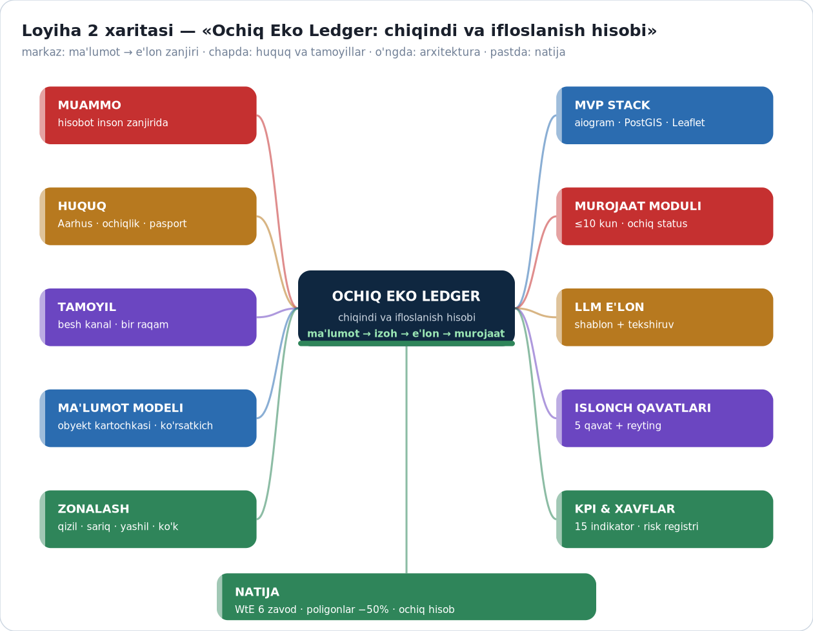

# 🗺️ LOYIHA 2 XARITASI — «OCHIQ EKO LEDGER»

**Chiqindi va ifloslanish hisobi: ma'lumot → izoh → e'lon → murojaat**

---

## 1. MUAMMO — nima isbotlanmoqchi

Huquqiy majburiyat bor (Aarhus, ochiqlik, choraklik hisobot, raqamli pasport), lekin **hisobot inson zanjiridan** o'tadi: yig'ish → tahrir → tasdiq → nashr. Har bosqichda kechikish va o'zgartirish yuz beradi — natijada raqamlar bir-biriga ishonmaydi (7,2 / 14 / 15 mln t).

**Isbotlanadigan zanjir:** ma'lumot → avtomatik izoh → **bir vaqtda besh kanalga e'lon** → fuqaro murojaati → tuzatish.

## 2. HUQUQIY BAZA (faktlar)

| Hujjat / voqea | Nima beradi | Sana |
|---|---|---|
| Aarhus konventsiyasi | axborotga kirish, ishtirok, odil sudlov | 2025-03 |
| Monitoring bazasi ochiqligi | davlat ekologik monitoringi ommaviy | 01.12.2025 |
| Xavfli chiqindi hisoboti | choraklik, keyingi oyning 20-sanasi | 01.10.2026 |
| Raqamli pasport | I–III sinf chiqindilar partiyasi | 01.01.2027 |
| Poligonlar siyosati | −32,6% (2026) → −50% (2030) | 2026 |
| Prezident farmoni | poligonlar VM qarori bilan tashkil etiladi | 2025-03 |

## 3. TAMOYIL — «bir ma'lumot, besh kanal»

| Kanal | Nima | Format |
|---|---|---|
| 1 | Veb-sayt / dashboard | xarita + jadval |
| 2 | Ochiq API | JSON, ochiq litsenziya |
| 3 | Telegram-bot | obuna + so'rov |
| 4 | Matbuot e'loni (LLM) | shablon + manba havolasi |
| 5 | Xarita qatlami | Leaflet markerlar, rang bilan |

**Shart:** barcha kanal **bir registrdan**, bir vaqtda, tahrirsiz.

## 4. MA'LUMOT MODELI (MVP)

| Qism | Maydonlar |
|---|---|
| Obyekt kartochkasi | nomi · geolokatsiya (lat/lon) · toifa · faoliyat turi · mas'ul · manba havolasi |
| Ko'rsatkichlar (MVP 3 ta) | chiqindi hajmi (t/yil) · atmosfera (t/yil) · oqova suv (m³/yil) |
| Taqqoslash qatlami | normativ · tarmoq o'rtachasi · viloyat reytingi · korxona tarixi |
| Versiya | har yozuv: sana + kim + manba (o'zgarish tarixi ochiq) |

## 5. ZONALASH QOIDASI (to'liq)

| Rang | Qoida | Ma'no |
|---|---|---|
| 🟢 yashil | ko'rsatkich ≤ normativ | norma ichida |
| 🟡 sariq | normativ × 1–2 | ogohlantirish oralig'i |
| 🔴 qizil | normativ × 2 dan yuqori | ustuvor nazorat |
| 🔵 ko'k-neytral | ma'lumot yo'q / verifikatsiya kutilmoqda | ochiq ko'rsatiladi |

Qoida **bir xil** va avtomatik — har chorak qayta hisoblanadi; ko'k zona ulushi hisobotda e'lon qilinadi.

## 6. MUROJAAT MODULI

| Holat | Mazmuni | Muddat |
|---|---|---|
| 1. yuborildi | bot yoki sayt orqali | — |
| 2. ko'rilmoqda | mas'ul tayinlangan | ≤3 kun |
| 3. javob berildi | asosli javob | **≤10 kun** |
| 4. hal qilindi | dalil bilan yopilgan | — |
| 5. ochiq arxiv | hamma ko'radi | doimiy |

Aarhus 9-modda bilan bog'liq: fuqaro **ekologik masalalar bo'yicha odil sudlovga** ega.

## 7. ISHONCH ARXITEKTURASI (5 qavat)

1. Manba va kalibrovka dalili · 2. Qarama-qarshi signal tekshiruvi · 3. Avtomatik izoh (shablon) · 4. E'tiroz va tuzatish oqimi · 5. **Ochiq Eko-Reyting** (A+…D).

## 8. MVP STACK (TZ dan qisqa)

| Qism | Texnologiya | Nega |
|---|---|---|
| Bot | aiogram | talabaning mavjud tajribasi |
| Backend | FastAPI | tez, dokumentatsiya avtomatik |
| DB | PostgreSQL + PostGIS | geolokatsiya so'rovlari |
| Xarita | Leaflet | bepul, oson |
| Izoh | LLM API | shablon ichida matn |
| Hosting | Firebase / VPS | MVP uchun yetarli |

## 9. AMALIYOT (2026)

| Natija | Raqam |
|---|---|
| WtE zavodlar | **6 ta** ($933 mln; 3,6 mln t/yil; 1,6 mlrd kVt·soat) |
| Poligonlar | −32,6% (2026) → −50% (2030) |
| Qayta yuklash stansiyalari | 28 (2026) → 70 (2030) |
| Sanitariya qamrovi | 88% (2025) → 90% (2026) |
| Ekologik datasetlar | ~1,7% (data.egov.uz) |
| Qayta ishlash | 18–19% rasmiy ↔ 5–6% amaliy |

## 10. KPI VA XAVFLAR

**KPI (15 tadan asosiylari):** e'lon kechikishi (kun) · murojaat javobi (≤10 kun) · ko'k zona ulushi · ochiq dataset ulushi · qayta ishlash % · poligon −% · WtE ishga tushish.
**Xavflar:** raqamni yashirish · reyting siyosiylashishi · WtE kuydirishga aylanib qolishi · LLM xato izohi (nazorat: shablon) · murojaat sudga to'lishi (yechim: ≤10 kun ochiq KPI).

## 11. KEYINGI QADAMLAR

1. Ochiq savollar bo'yicha rasmiy hisobotlarni kuzatish (6 ta) — `Maqola-v3-YAKUNIY-Draft.md` §10;
2. TZ ni MVP bosqichlariga bo'lish (8 hafta reja) va birinchi pilot (2 viloyat);
3. PRTR tamoyiliga o'tish taklifini tayyorlash;
4. WtE dioksin monitoringi bo'yicha ochiqlik talabini shakllantirish.
