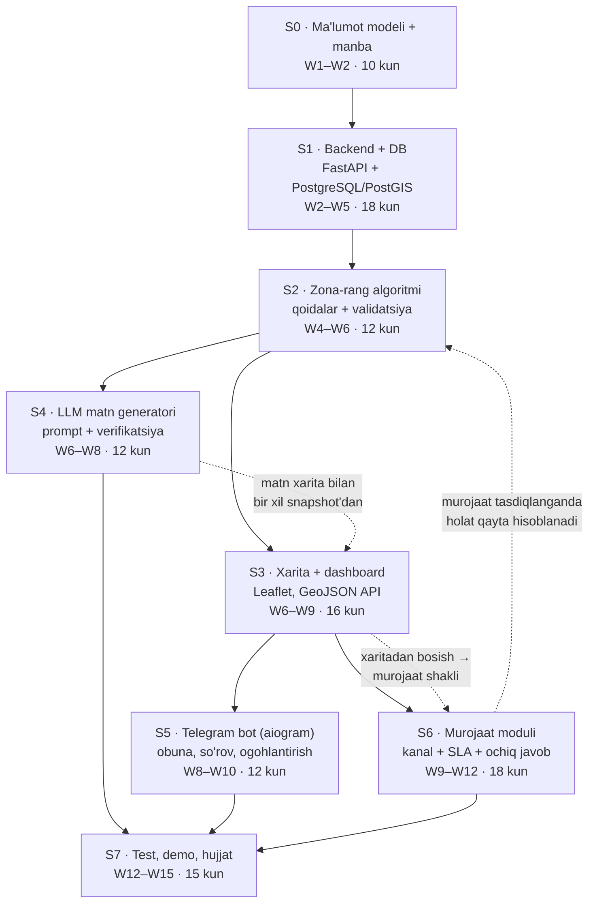
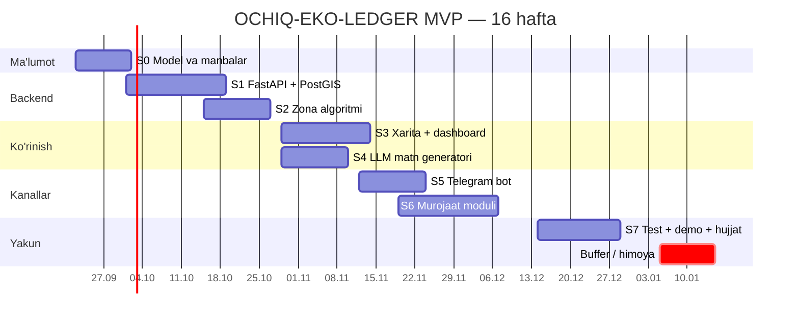
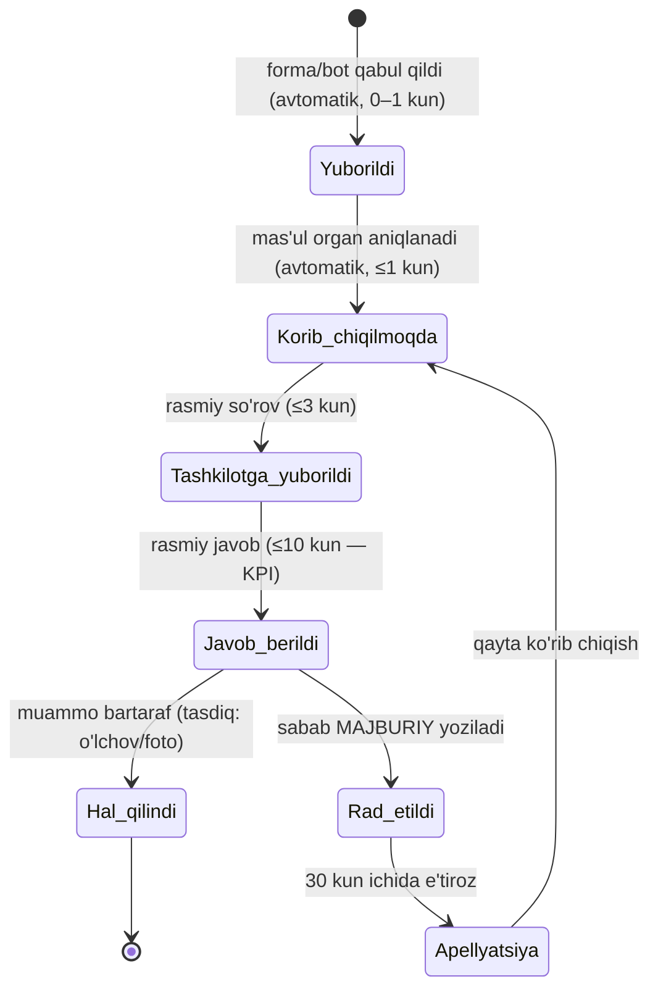
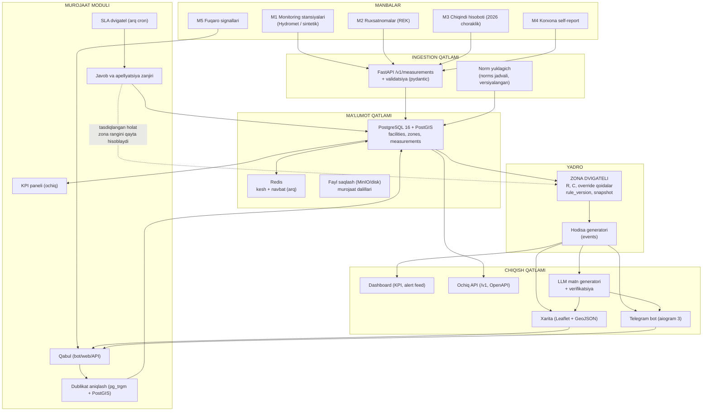

# LOYIHA 2 — TEXNIK TOPSHIRIQ (TZ) VA JARAYON XARITASI
# "OCHIQ-EKO-LEDGER MVP: zona-xaritasi (qizil/sariq/yashil/ko'k-neytral) va ochiq murojaat moduli bilan avtomatlashtirilgan chiqindi/ifloslanish e'lon platformasi"

**Hujjat turi:** to'liq texnik topshiriq (implementation-level)  
**Asos hujjat:** `Uzbekistan_Eko_DeepResearch_2026.md`, §4.1–§4.7 (OCHIQ-EKO-LEDGER kontsepsiyasi)  
**Ijrochi profili:** talaba (School 21); mavjud ko'nikmalar: Python, **aiogram** (Telegram bot), **FastAPI**, PostgreSQL/Firebase, LLM API bilan ishlash  
**Taxminiy semestr:** 2026-yil 22-sentabr — 2027-yil 15-yanvar (16 hafta)  
**Versiya:** 1.0 (2026-09-17)

> **MUHIM IZOH.** Manba hujjatda **zona-rang kodlash (qizil/sariq/yashil/ko'k-neytral)** va **fuqaro murojaati moduli** *yo'q*. Ular ushbu loyihaning **o'z qo'shimchalari** — shu sababli quyida to'liq (matematik qoidagacha) spetsifikatsiya qilinadi: §2.5 va §2.6.

---

## MUNDARIJA

0. Hujjat maqsadi va kontekst
1. Nima isbotlanadi (loyihaning ilmiy/amaliy da'vosi)
2. Jarayon xaritasi — xronologik va vizual
3. Bosqichlar bo'yicha batafsil jadval
4. Ma'lumot modeli (korxona kartochkasi, indikatorlar)
5. ZONA ALGORITMI — to'liq spetsifikatsiya
6. MUROJAAT MODULI — to'liq spetsifikatsiya
7. Arxitektura va stack asoslanishi
8. LLM orqali avtomatik matn generatsiyasi
9. Risklar va cheklovlar
10. Yakuniy Gantt va resurs byudjeti
11. Ilovalar (A: sxema, B: TZ checklist, C: manbalar)

---

## 0. HUJJAT MAQSADI VA KONTEKST

Loyiha — **milliy platforma emas**, balki ikki mexanizmni **ishlaydigan ko'rinishda** isbotlaydigan MVP:

1. **Avtomatik e'lon qilish zanjiri:** ma'lumot → normativ bilan taqqoslash → zona rangi → xarita + bot + matn — **odam qaror qabul qilmasdan**;
2. **Fuqaro ishtiroki zanjiri:** murojaat → holat kuzatuvi → SLA hisobi → ochiq javob — **o'chirib tashlanmaydigan** yozuv bilan.

Manba hujjatning besh qatlamli "ishonch arxitekturasi" (§4.6) MVP'da quyidagicha kesiladi: 5 qatlamdan **1-qatlam (ma'lumot manbasi), 3-qatlam (taqqoslash qatlami) va 4-qatlam (ochiq nashr + murojaat)** to'liq amalga oshiriladi; sun'iy yo'ldosh/verifikatsiya va rag'bat tizimi (2- va 5-qatlamlar) **loyiha doirasidan tashqarida** — ular faqat arxitekturada "stub" sifatida qoldiriladi.

**Nega aynan bu ikki zanjir?** Chunki manba hujjatdagi P1 (ma'lumot yopiqligi), P2 (e'lon qilishning odamga qaramligi), P7 (murojaat natijasizligi) va P14 (soxtalashtirish) — eng ko'p shikoyat qilingan va **eng kam xarajat bilan isbotlanadigan** muammolar. Qolganlari (emisssiya limiti, soliq instrumentlari) qonun o'zgarishini talab qiladi, MVP esa **mavjud qonunchilik ichida** ishlay oladi: 2025-yil 1-dekabrdan boshlab davlat ekologik monitoring bazasi **ochiq bo'lishi shart** (Ekologik madaniyat kontsepsiyasi) va 2026-yil 1-oktabrdan xavfli chiqindi bo'yicha **choraklik hisobot majburiyati** kuchga kiradi.

---

## 1. NIMA ISBOTLANADI (DA'VO)

> **Da'vo:** Mavjud ochiq/rasmiy ma'lumotlar (monitoring stansiyalari, oqava suv normativ ruxsatnomalari, chiqindi hisobotlari) asosida *hududlar va korxonalar uchun 4 xil rangli holat xaritasi* **avtomatik** hisoblanib, LLM yordamida *inson aralashuvisiz* ommabop tilda e'lon qilinishi mumkin — va ayni paytda fuqaro murojaati shu zanjirning ajralmas qismi bo'lib, javob muddati **ochiq hisoblanadi**.

**Isbot mezonlari (da'vo → o'lchov):**

| Da'vo | Isbot usuli | MVP mezoni |
|---|---|---|
| D1: Zona rangi **deterministik** qoidadan chiqadi | Kod + test to'plami (100 sintetik holat) | 100% test o'tadi; har rang uchun "nega" izohi mavjud |
| D2: Rang **avtomatik** yangilanadi | Cron/worker → jadval | Kunlik yangilanish 30 kun ketma-ket ishlaydi; qo'lda aralashuv 0 ta |
| D3: LLM matni **faqat kiritilgan raqamlardan** foydalanadi | Avtomatik tekshiruv (har son matnda inputda bormi) | 100% moslik; bittasi ham "uydirma" raqam yo'q |
| D4: Murojaat **o'chirilmaydi**, muddat ochiq hisoblanadi | Audit log + KPI panel | Hech bir murojaat `deleted` bo'lmaydi (faqat `moderated` belgisi); SLA % ochiq |
| D5: To'liq tsikl ishlaydi | Demo ssenariy | Yangi ma'lumot → 60 soniyada xarita rangi + bot posti yangilanadi |

**Anti-da'volar (nima isbotlanmaydi):** platforma korxonani **ayblamaydi**; natija **yuridik dalil emas**; real korxona nomlari bilan ommaviy demo **faqat sintetik ma'lumotda** ko'rsatiladi.

---

## 2. JARAYON XARITASI — XRONOLOGIK VA VIZUAL

### 2.1. Mermaid flowchart (8 bosqich)



### 2.2. Mermaid Gantt (bosqichlar)



### 2.3. Nega aynan shu tartib (bog'liqlik mantiqi)

| Bosqich | Nimaga tayanadi | Nega aynan shu o'rinda |
|---|---|---|
| S0 Model + manba | — | Rang qoidasi **maydonlarga** tayanadi; maydonlar aniqlanmasa, baza sxemasi noto'g'ri quriladi (keyin migratsiya = vaqt yo'qotish) |
| S1 Backend + DB | S0 | Barcha keyingi qism (algoritm, xarita, bot, murojaat) **bitta API**ga tayanadi; API oldin qurilsa, parallel ishlash mumkin |
| S2 Zona algoritmi | S1 | Rang — butun mahsulotning yadrosi; xarita va matn **faqat rangi bor narsani** ko'rsatadi |
| S3 Xarita/dashboard | S2 | Vizualizatsiya algoritmsiz bo'sh bo'ladi |
| S4 LLM matni | S2 | Matn "rang + raqam"dan yoziladi — bu S2 mahsuloti |
| S5 Telegram bot | S3 | Bot **xarita API'siga** va alert oqimiga tayanadi; botni oldinroq qurish = jonli ma'lumotsiz demo |
| S6 Murojaat moduli | S3, S5 | Murojaat xaritadan (nuqta tanlash) va botdan boshlanadi; ob'ekt identifikatori (facility_id) talab qilinadi |
| S7 Test/demo | hammasi | Yakuniy tekshiruv |

---

## 3. BOSQICHLAR BO'YICHA BATAFSIL JADVAL

### 3.0. KONSOLIDATSIYALANGAN JADVAL (barcha bosqichlar bir ko'rinishda)

> Bu jadval — tez ko'rish uchun; har bir bosqichning to'liq asoslanishi quyida (3.1–3.8) batafsil keltirilgan.

| Bosqich | Muddat | Nima qilinadi | Texnologiya | **Nega aynan shu texnologiya** | **Nega aynan shu vaqtda** | **Kirish → Chiqish** | **Definition of Done** | Natija/deliverable |
|---|---|---|---|---|---|---|---|---|
| **S0** Ma'lumot modeli + manba | W1–W2 · 10 kun | Korxona kartochkasi maydonlari; 3 indikator tanlash; 5 manba oqimi kartografiyasi; sintetik rejim generatori | JSON Schema, YAML (`sources.yaml`), `pydantic`, `Faker` (uz_UZ) | JSON Schema — maydonlar shartnomasi (backend/generator/LLM/bot bitta sxemadan); YAML manba reyestri — yangi manba kod o'zgarishisiz qo'shiladi | Manba/maydonlar keyin o'zgarsa, baza va API qayta yoziladi — eng qimmat xato turi | Manba ro'yxati + huquqiy hujjatlar → 2 JSON Schema + `sources.yaml` + generator | 500 sintetik korxona + 20 000 o'lchov generatsiya qilinadi; 5 manba (M1–M5) kartografiyalangan | `01_data_model.md`, 2 sxema, `sources.yaml`, `generator.py` |
| **S1** Backend + DB | W2–W5 · 18 kun | FastAPI ilova (ingestion + CRUD + geo API); PostGIS sxemasi; migratsiyalar; rollar; rate limit; audit log | FastAPI + Pydantic v2, **PostgreSQL 16 + PostGIS 3.4**, SQLAlchemy 2.0 async + Alembic, Redis 7, Docker Compose | PostGIS **kerak**: `ST_Contains` (mahalla poligoni), `ST_DWithin` (500 m radius), KNN ("eng yaqin stansiya") — Python'da O(n×m) bir necha soniya, PostGIS'da millisekund (GiST indeks); narxi — bitta `CREATE EXTENSION`. FastAPI — OpenAPI bepul = ochiq API maqsadi | Barcha keyingi qism bitta API kontraktiga tayanadi; API "muzlatilsa", xarita va bot parallel yoziladi (2 kishilik jamoada ~30% vaqt tejash) | S0 sxemalari → ishlaydigan API + seed | 15+ test o'tadi (shu jumladan PostGIS so'rovlari); `/docs` ochiq; migratsiya `up/down` ishlaydi | API, migratsiyalar, seed, testlar |
| **S2** Zona algoritmi | W4–W6 · 12 kun | §5 qoidasi: R → rang; ishonch darajasi C; 6 override (O1–O6); snapshot va `rule_version` saqlash; 100 test-holati | Sof Python (`zoning/engine.py`), `scipy.stats` (rolling median/percentile), `pydantic`, `pytest`, SQL (`zoning_runs`) | **ML emas, qoidaviy** — rangni fuqaro, jurnalist va sud tekshira olishi shart; model izohlab bo'lmaydigan bo'lsa apellyatsiyaga bardosh bermaydi | Rang — xarita, bot va LLM matnining **kirish ma'lumoti** (kritik yo'l); kech yozilsa uchta yo'nalish birga bloklanadi | S1 bazasi + normativ jadval (`norms`) → `zone_class` yozuvlari | 100 chegara-testi (±1%) o'tadi; `rules.md` inson tilida yozilgan; rang o'zgarishi jurnali ishlaydi | `engine.py`, `rules.md`, 100 test, `zoning_runs` |
| **S3** Xarita + dashboard | W6–W9 · 16 kun | Leaflet xarita (poligon + marker + popup + legenda + vaqt slayderi); zona klik → murojaat shakli; KPI paneli | Leaflet 1.9 + OSM, `leaflet.markercluster`, Chart.js, GeoJSON API, FastAPI `StaticFiles` | Leaflet — bepul, litsenziya toza (token/billing yo'q), 3G'da tez; GeoJSON — jurnalist ham yuklab oladi (ochiqlik talabi); markercluster — 10 000 marker brauzerda bloklanmaydi | Rang (S2) tayyor bo'lgach; oldin yozilgan xarita "quruq" maket bo'ladi | `zones.geojson` + `facilities` → xarita + dashboard | 10 000 marker < 3 s (3G < 8 s); mobil (≤768 px) ko'rinish ishlaydi; legenda "ko'k = toza emas" matni bilan | `web/map.html`, skrinshotlar, demo |
| **S4** LLM matn generatori | W6–W8 · 12 kun | Prompt shabloni (§8.3); 3 format (bot/press/haftalik); 6 qavatli verifikatsiya; matn arxivi | LLM API (structured output), `pydantic`, `jsonschema`, regex-tekshiruv, `jinja2` (zaxira), `httpx`, kesh | LLM API — MVP'da lokal infra yo'q; **Jinja2 zaxira** — LLM/API ishlamasa matn deterministik shablondan chiqadi; kesh — bir xil snapshot → bir xil matn (ishonch masalasi) | Raqamlar (S2) tayyor bo'lgach; LLM **oxirida** qo'shiladi — avval ishonchli faktlar, keyin til | snapshot JSON → 3 formatdagi matn + verifikatsiya natijasi | 100 holatda "uydirma raqam" testi **0 xato**; taqiqlangan so'zlar filtri ishlaydi | `prompt_v1.md`, `verify.py`, test natijalari |
| **S5** Telegram bot | W8–W10 · 12 kun | Obuna ("hudud → rang o'zgarsa xabar"), indikator so'rovi, korxona kartochkasi, murojaat yuborish, holat kuzatuvi, kunlik avto-e'lon | **aiogram 3.x** (async, FSM), webhook (FastAPI bilan bir ilovada), Redis (FSM state + rate limit) | Telegram — O'zbekistonda eng keng kanal (ilova o'rnatish/sayt kerak emas → qamrov); aiogram talabada bor, to'liq async, FSM forma uchun ideal; **webhook** long-polling'dan resursni tejaydi | Xarita va alert oqimi (S3) ishlagach; bot — mavjud ma'lumotning ikkinchi ko'rinishi, yangi manba emas | S3 API + `events` → bot oqimi | 6 ssenariy ishlaydi; obuna xabari yetib boradi; 10 test (mock Telegram); `/help` yozilgan | Bot, demo video, testlar |
| **S6** Murojaat moduli | W9–W12 · 18 kun | 3 kanal (bot/veb/API), 12 maydon, 7 holatli zanjir, SLA 10 kun + avto-eskalatsiya (7/10/15), moderator **belgisi** (o'chirish emas), dublikat, KPI panel | FastAPI CRUD, PostgreSQL (`appeals`, `appeal_events`, `sla_metrics`), `pg_trgm` (dublikat), PostGIS `ST_DWithin`, MinIO/disk, `arq`/cron, aiogram | `pg_trgm` — dublikatni ML'siz, tushunarli tutadi; `ST_DWithin` — "300 m radiusda bir xil kategoriya" (dublikat + jamoaviy signal); `appeal_events` — **append-only** (o'chirib bo'lmaydi) = "inson aralashuvisiz" tamoyilining texnik kafolati; `arq`/cron — SLA mustaqil jarayon (API o'chsa ham ishlaydi) | Bot (S5) va xarita (S3) murojaat uchun kirish nuqtalari; modul ularsiz "ko'r" | Foydalanuvchi murojaati → to'liq sikl + SLA + javob | 25+ test, shu jumladan **"o'chirishga urinish rad etiladi"** testi; 10-kun "muddati o'tdi" belgisi avtomatik chiqadi | To'liq modul, KPI paneli, testlar |
| **S7** Test + demo + hujjat | W12–W15 · 15 kun | 80+ test; `docker compose up`; 3 demo video; README, arxitektura, cheklovlar; 5–6 betlik texnik hisobot; maqola rasmlari | `pytest`+`pytest-asyncio`+`httpx`, `ruff`, GitHub Actions, Playwright (ixtiyoriy), ekran yozuvi | Playwright **ixtiyoriy** — xarita qo'lda sinaladi (vaqt tejash); CI majburiy (reproduksiya dalili) | Komponentlar barqarorlashgach; erta integratsiya testi ko'p sinadi | Tizim → CI yashil + hujjatlar + video | 1 buyruqda ko'tariladi; GeoJSON/CSV eksport ochiq; `limitations.md` yozilgan; Git tag `v1.0` | CI badge, videolar, `docs/`, hisobot |

### S0. Ma'lumot modeli va manba tanlash (W1–W2, 10 kun)

| Ustun | Mazmun |
|---|---|
| **Nima qilinadi** | §4'dagi korxona kartochkasi maydonlari aniqlanadi (MVP versiyasi); 3 indikator tanlanadi; 5 ta ma'lumot oqimi kartografiyalanadi (qaysi manba, qanday format, qanday yangilanadi, kim javobgar); "sintetik rejim" generatori yoziladi |
| **Texnologiya** | Markdown + JSON Schema (`facility_card.schema.json`, `measurement.schema.json`); `Faker` (uz_UZ) + `pydantic`; manba reyestri — YAML (`sources.yaml`) |
| **Nega aynan shu texnologiya** | 1) **JSON Schema** — maydonlar shartnomasi: backend, generator, LLM va bot **bitta sxemadan** foydalanadi (bugungi chalkashliklarning 70%i sxema kelishmovchiligidan); 2) **YAML manba reyestri** — Yangi manba qo'shish kod o'zgarishisiz (konfiguratsiya tamoyili); 3) Pydantic — FastAPI bilan bir xil validatsiya qatlami |
| **Nega aynan shu vaqtda** | Manba va maydonlar keyin o'zgarsa, baza va API qayta yoziladi — eng qimmat xato turi |
| **Deliverable** | `docs/01_data_model.md`, 2 JSON Schema, `sources.yaml`, `generator.py`, 500 ta sintetik korxona + 20 000 o'lchov |

**MVP manba kartografiyasi (5 oqim):**

| # | Manba | Turi | Format | Yangilanish | MVP'da |
|---|---|---|---|---|---|
| M1 | Aholi punktlari havosi monitoringi stansiyalari (Hydromet) | real (ochiq) | kunlik qiymat, stansiya koordinatasi | kunlik | ✅ (yoki sintetik nusxa) |
| M2 | Oqava suv tashlash ruxsatnomalari (ekologiya organi) | rasmiy | PDF/ruxsatnoma → jadval | yillik | ✅ sintetik |
| M3 | Xavfli chiqindi hisoboti (2026-yil 1-okt. dan choraklik) | rasmiy | Excel/shakl → API | choraklik | ✅ sintetik |
| M4 | Korxona o'z e'loni (self-report) | ixtiyoriy | forma | oylik | ✅ |
| M5 | Fuqaro signali (murojaat/telegram) | kraudsort | matn + foto + nuqta | real-time | ✅ |

### S1. Backend va baza (W2–W5, 18 kun)

| Ustun | Mazmun |
|---|---|
| **Nima qilinadi** | FastAPI ilova: `POST /v1/measurements` (ingestion), `GET /v1/facilities`, `GET /v1/facilities/{id}`, `GET /v1/zones?level=mahalla|tuman|viloyat`, `GET /v1/geo/zones.geojson`, `GET /v1/events`, `GET /v1/appeals`, `POST /v1/appeals`, `PATCH /v1/appeals/{id}/status`; PostGIS sxemasi; migratsiyalar; autentifikatsiya (admin/inspektor/fuqaro rollari); rate limit; audit log |
| **Texnologiya** | FastAPI + Pydantic v2, **PostgreSQL 16 + PostGIS 3.4**, SQLAlchemy 2.0 async + Alembic, Redis 7 (kesh, navbat), Docker Compose, `prometheus-client`, `pytest` |
| **Nega aynan shu texnologiya** | 1) **PostGIS vs "oddiy lat/lon"]** — baribir SQL bor, lekin PostGIS *kerak*, chunki real so'rovlar: "shu mahalla poligoni ichidagi korxonalar" (`ST_Contains`), "murojaatdan 500 m radiusdagi ob'ektlar" (`ST_DWithin`), "eng yaqin stansiya" (`<->` operatori/KNN). Bu so'rovlarni Python'da qilish O(n×m) → 10 000 nuqtada bir necha soniya; PostGIS'da **millisekundlar** (GiST indeks). Xulosa: oddiy lat/lon'dan boshlash **texnik qarz** yaratadi, narxi esa — bitta `CREATE EXTENSION postgis`; 2) **FastAPI** — talabaning mavjud tajribasi + avtomatik OpenAPI (ochiq API — loyihaning maqsadlaridan biri!); 3) **Redis** — kunlik zoning natijasini keshlash (xarita yuklanishi) va Telegram alert navbati (`arq`); 4) **Docker Compose** — PostGIS+Redis+API bir buyruqda |
| **Nega aynan shu vaqtda** | Barcha keyingi bosqichlar API kontraktiga tayanadi; API oldin "muzlatilsa", xarita va bot ustida parallel ishlash mumkin (2 kishilik jamoada 30% vaqt tejamkorligi) |
| **Deliverable** | Ishlaydigan API + `/docs`, migratsiyalar, seed skripti, 15+ test (shu jumladan PostGIS so'rovlari testi) |

### S2. Zona-rang algoritmi (W4–W6, 12 kun)

| Ustun | Mazmun |
|---|---|
| **Nima qilinadi** | §5'dagi to'liq qoida implementatsiya qilinadi: indikator darajasi → nisbat R → korxona rangi → zona rangi (agregatsiya); "ishonch darajasi" (C) hisobi; qoida versiyasi va snapshot saqlash; 100 ta test-holati; rang o'zgarishi jurnalı |
| **Texnologiya** | Sof Python (`zoning/engine.py` — barcha biznes-logika), `scipy.stats` (rolling median, percentile), `pydantic` (natija sxemasi), `pytest` (qoidaviy testlar), SQL (`zoning_runs` jadvali) |
| **Nega aynan shu texnologiya** | 1) **Sof Python, ML emas** — rang qoidasi **deterministik va tushunarli** bo'lishi shart: har bir rangni fuqaro, jurnalist va sud tekshirishi mumkin. Machine learning MVP'da o'rinsiz (izohlash qiyin, apellyatsiyaga bardosh bermaydi); 2) **Qoida versiyasi (v1.0, v1.1)** — agar qoida o'zgarsa, eski rang qanday qoida bo'yicha chiqqani saqlanadi (audit); 3) `pytest` — 100 holat (har bir chegara qiymat ±1%) |
| **Nega aynan shu vaqtda** | Rang xarita, bot va LLM matnining **kirish ma'lumoti**; algoritm kech yozilsa, uchta yo'nalish bir vaqtda bloklanadi (kritik yo'l) |
| **Deliverable** | `zoning/engine.py` + `zoning/rules.md` (inson tilida qoidalar), 100 test, `zoning_runs` tarixi |

### S3. Xarita va dashboard (W6–W9, 16 kun)

| Ustun | Mazmun |
|---|---|
| **Nima qilinadi** | Leaflet xarita: zona poligonlari (rang), korxona markerlari (`circleMarker`, radius = hajm), popup kartochka (indikatorlar, tarix, manba, "nega shu rang"), indikator almashtirgich, vaqt slayderi (30 kun), zona klik → murojaat shakli; dashboard: alert oqimi, SLA paneli, statistika |
| **Texnologiya** | Leaflet 1.9 + OpenStreetMap tayllari + `leaflet.markercluster`, `Chart.js` (tarix grafigi), vanilla JS yoki React; backend'dan **GeoJSON**; statik fayllar FastAPI `StaticFiles` orqali |
| **Nega aynan shu texnologiya** | 1) **Leaflet** — bepul, ochiq, 6 KB'lik asosiy yuklama, mobil brauzerda tez; choropleth uchun nativ qo'llab-quvvatlash (`L.geoJSON` + style funksiyasi); Mapbox'ga nisbatan token/billing yo'q — **ochiq platforma uchun litsenziya toza**; 2) **GeoJSON** — inson o'qiy oladigan standart, jurnalist ham yuklab olishi mumkin (ochiqlik talabi); katta hajmda keyin MVTB (vector tiles)ga o'tish yo'li ochiq; 3) **markercluster** — 10 000 marker brauzerda bloklanmaydi |
| **Nega aynan shu vaqtda** | Rang (S2) tayyor bo'lgach; oldin yozilgan xarita "quruq" maket bo'lib qoladi |
| **Deliverable** | `web/map.html` (prod), `docs/screenshots/`, mobil moslashuv (responsive), xarita yuklanish vaqti < 3 s (3G'da < 8 s) |

### S4. LLM matn generatori (W6–W8, 12 kun)

| Ustun | Mazmun |
|---|---|
| **Nima qilinadi** | §8'dagi prompt shabloni; JSON → matn; 6 qavatli verifikatsiya; matn arxivi (`generated_texts` jadvali: input hash, model versiyasi, tekshiruv natijasi); Telegram/veb uchun 3 format: (a) qisqa bot xabari (≤500 belgi), (b) press-reliz (1–2 bet), (c) haftalik hisobot |
| **Texnologiya** | LLM API (GPT/Claude-sinf, *structured output*), `pydantic` (output sxemasi), `jsonschema`, regex-tekshiruv moduli, `jinja2` (deterministik zaxira shablon), `httpx` (async so'rov), keshlash (bir xil input → bir xil matn, `hash` kaliti) |
| **Nega aynan shu texnologiya** | 1) **LLM API, lokal model emas** — MVP'da o'qitish/xizmat ko'rsatish infratuzilmasi yo'q; API narxi oyiga bir necha dollar; lekin **LLM fakt manbasi emas, faqat matn yozuvchi** (qat'iy cheklov); 2) **Jinja2 zaxira shablon** — LLM xato bersa (yoki API ishlamasa), matn **deterministik shablondan** chiqadi: platforma hech qachon "matnsiz" qolmaydi; 3) **Keshlash** — bir xil snapshot uchun matn bir marta yaratiladi (xarajat va izchillik) |
| **Nega aynan shu vaqtda** | Raqamlar (S2) tayyor bo'lgach. LLM'ni **oxirida** qo'shish — to'g'ri tartib: avval ishonchli faktlar, keyin til |
| **Deliverable** | `llm/prompt_v1.md`, `llm/verify.py`, 100 ta test-matn natijasi, "uydirma raqam" testi (0 ta xato) |

### S5. Telegram bot — aiogram (W8–W10, 12 kun)

| Ustun | Mazmun |
|---|---|
| **Nima qilinadi** | (a) hudud obunasi ("Toshkent, Yunusobod" → shu zona rang o'zgarsa xabar); (b) indikator so'rovi ("Chilonzorda havo qanday?"); (c) korxona kartochkasi (`/korxona 3021`); (d) murojaat yuborish (foto + lokatsiya + matn) — §6; (e) murojaat holatini kuzatish (`/holat 12345`); (f) kanal rejimi: har kuni 09:00 da avtomatik e'lon |
| **Texnologiya** | **aiogram 3.x** (async, FSM), webhook (FastAPI bilan bir ilovada), Redis (FSM state + rate limit), Telegram `ReplyKeyboard`/`InlineKeyboard`, `aiogram` scheduler yoki `arq` cron |
| **Nega aynan shu texnologiya** | 1) **Telegram — O'zbekistonda eng keng tarqalgan kanal** (fuqaro uchun ilova o'rnatish talab qilinmaydi, saytga kirish shart emas) — bu **qamrov** masalasi: veb-saytga 100 kishi kirsa, botga 10 000 obunachi yig'ish real; 2) **aiogram** — talabada bor, to'liq async (FastAPI bilan bir event loop'da), FSM murojaat formasini qadam-baqadam yig'ish uchun ideal; 3) **Webhook** (long-polling emas) — serverda resurs tejaladi, javob tezligi barqaror |
| **Nega aynan shu vaqtda** | Xarita va alert oqimi (S3) ishlagach; bot — mavjud ma'lumotning **ikkinchi ko'rinishi**, yangi ma'lumot manbasi emas |
| **Deliverable** | `@eco_ledger_bot` (test nomi), 6 ta buyruq/ssenariy, `/help`, 10 ta test (mock Telegram), demo video |

### S6. Murojaat moduli (W9–W12, 18 kun)

| Ustun | Mazmun |
|---|---|
| **Nima qilinadi** | §6'dagi to'liq spetsifikatsiya: 3 kanal (bot, veb-forma, API), 12 maydonli forma, holat zanjiri (7 holat), SLA taymeri (10 kun), avto-eskalatsiya (7/10/15-kun), moderator belgisi (o'chirish emas!), dublikat aniqlash, KPI paneli |
| **Texnologiya** | FastAPI (`/v1/appeals` CRUD + `PATCH /status`), PostgreSQL (`appeals`, `appeal_events`, `appeal_attachments`, `sla_metrics`), `pg_trgm` (matn o'xshashligi — dublikat), PostGIS (`ST_DWithin` — hududiy dublikat), S3/MinIO yoki lokal disk (fayllar), `arq`/cron (SLA tekshiruvi), aiogram (bot kanali) |
| **Nega aynan shu texnologiya** | 1) **`pg_trgm`** — dublikat murojaatlarni alohida ML'siz, trigramma o'xshashligi bilan tutadi (arzon va tushunarli); 2) **PostGIS `ST_DWithin`** — "shu nuqtadan 300 m radiusda oxirgi 24 soatda bir xil kategoriyali murojaat bormi?" — bu dublikat va **jamoaviy signal** (bir muammo bo'yicha 20 murojaat = kuchli dalil) aniqlashning asosi; 3) **Event-sourcing uslubidagi `appeal_events`** — har bir holat o'zgarishi **alohida yozuv**: hech narsa ustidan yozilmaydi (o'chirib tashlanmaydi), ya'ni "inson aralashuvisiz" tamoyilining **texnik kafolati**; 4) `arq`/cron — SLA nazorati mustaqil jarayon (API o'chsa ham ishlaydi) |
| **Nega aynan shu vaqtda** | Bot (S5) va xarita (S3) murojaat uchun kirish nuqtalari; modul ularsiz "ko'r" bo'ladi |
| **Deliverable** | Murojaat sikli to'liq ishlaydi; SLA dashboard; 25+ test (shu jumladan "o'chirishga urinish rad etiladi" testi) |

### S7. Test, demo, hujjatlashtirish (W12–W15, 15 kun)

| Ustun | Mazmun |
|---|---|
| **Nima qilinadi** | 80+ test; `docker compose up` bilan 1 buyruqda ko'tarilish; demo ssenariy videolari (3 ta: xarita, bot, murojaat sikli); README + arxitektura hujjati; cheklovlar hujjati; 5–6 betlik texnik hisobot; maqola uchun rasmlar |
| **Texnologiya** | `pytest`+`pytest-asyncio`+`httpx`, `ruff`, GitHub Actions CI, Playwright (xarita UI smoke-test, ixtiyoriy), `ffmpeg`/ekran yozuvi |
| **Nega aynan shu texnologiya** | Playwright MVP'da **ixtiyoriy** — xarita qo'lda sinaladi, vaqt tejash; CI esa majburiy (reproduksiya dalili) |
| **Nega aynan shu vaqtda** | Komponentlar barqarorlashgach; erta integratsiya testi ko'p sinadi |
| **Deliverable** | CI badge, 3 demo video, `docs/`, texnik hisobot, Git tag `v1.0` |

---

## 4. MA'LUMOT MODELI

### 4.1. Korxona kartochkasi (manba hujjat §4.4.1 → MVP uchun soddalashtirilgan)

| # | Maydon | Tur | Majburiy | MVP izohi |
|---|---|---|---|---|
| 1 | `eco_id` | TEXT (PK) | ✅ | Yagona identifikator (STIR + tur) — manba hujjatdagi "bitta ECO-ID" tamoyili |
| 2 | `name` | TEXT | ✅ | Yuridik nom |
| 3 | `stir` | CHAR(9) | ✅ | Soliq raqami (takrorlanmaslik kaliti) |
| 4 | `sector` | ENUM | ✅ | 14 tarmoq (IPPC uslubida soddalashtirilgan) |
| 5 | `region`, `district` | TEXT | ✅ | Viloyat/tuman |
| 6 | `geom` | GEOMETRY(Point,4326) | ✅ | PostGIS nuqta — xarita uchun |
| 7 | `tier` | ENUM | ⬜ | I/II toifa (VM-783) — MVP'da ixtiyoriy |
| 8 | `status` | ENUM | ✅ | `active`, `suspended`, `closed`, `unknown` |
| 9 | `permit_*` | JSONB | ⬜ | Ruxsatnoma: raqam, sana, tashlanma limiti (REK) |
| 10 | `indicators` | JSONB | ✅ | Har indikator: oxirgi qiymat, o'lchov vaqti, manba (`M1..M5`), usul |
| 11 | `zone_class` | ENUM | ✅ | `red/yellow/green/blue` + `confidence` + `rule_version` |
| 12 | `history_summary` | JSONB | ✅ | 12 oylik agregat (median, p90, trend) |
| 13 | `open_appeals_count` | INT | ✅ | Ochiq murojaatlar soni (ommaviy) |
| 14 | `data_sources` | JSONB | ✅ | Qaysi manba(lar)dan ma'lumot kelgan (ochiq ko'rsatiladi) |
| 15 | `last_updated` | TIMESTAMPTZ | ✅ | Oxirgi yangilanish — "eski ma'lumot" ko'rsatkichi |

**Manba §4.4.1 dan farq (MVP kesishi):** investitsiya/moliya ko'rsatkichlari, xodim soni, ISO sertifikatlar, to'liq texnologik sxema — **chiqarib tashlandi** (MVP maqsadi "ekologik holat", "korxona profili" emas).

### 4.2. Qaysi 2–3 indikator birinchi? (va nega aynan shular)

| Ustuvorlik | Indikator | Norma (raqamli) | Nega aynan shu birinchi |
|---|---|---|---|
| **1** | **PM2.5** (havo) | O'zbekiston: bir martalik **REM = 35 µg/m³** (SanQvaM 0053-23, 2024-yil 27-may o'zgartirishi); avvalgi kunlik me'yor 60 µg/m³, yillik ~30 µg/m³. **JSST (2021):** 24-soatlik **15 µg/m³**, yillik **5 µg/m³** | (a) **Sog'liq ta'siri eng katta** — Toshkentda havoning ifloslanishi yillik **$488 mln** zarar (≈0,7% GRP); (b) **ma'lumot bor** — avtomatik stansiyalar **real vaqtda** o'lchaydi (M1); (c) **rang o'zgarishi tez** — fuqaro darrov ko'radi, ya'ni platforma "tirik" ko'rinadi; (d) xalqaro taqqoslash imkoni (JSST etaloni bilan ikkinchi qavat) |
| **2** | **BOD₅ va KOD** (oqava suv) | **BOD (KBS): 3 mgO₂/dm³** (I toifa) / **6 mgO₂/dm³** (II toifa); **KOD (BXO): 15 mgO₂/dm³** (I) / **30 mgO₂/dm³** (II); erigan kislorod ≥6/4 mg/dm³; pH 6,0–8,5 (lex.uz, 26-son 22.11.2024) | (a) **Manba korxonaga bog'lanadi** (M2 — ruxsatnoma) → bitta korxona javobgarligini ko'rsatish mumkin; (b) **fizik-kimyoviy jihatdan aniq** — bitta raqam, izohlash oson; (c) bu — manba hujjatdagi P6 (suv ifloslanishi, kanallar/kollektorlar) bilan to'g'ridan-to'g'ri mos; (d) laboratoriya tahlili talab qilinadi → kamroq ma'lumot, lekin "o'lchov" ishonchi yuqori |
| **3** | **Chiqindi hajmi (xavfli + qattiq maishiy)** | Normativ **chiqarish limiti** yo'q → taqqoslash qavatlari: **korxona tarixi** + **sektor o'rtachasi** + **litsenziya sharti**. Me'yor o'rniga "kutilgan diapazon" (birlik mahsulotga chiqindi) | (a) **Yangilangan qonun oqimi**: 2026-yil 1-oktabrdan xavfli chiqindi bo'yicha choraklik hisobot majburiy (20-sanagacha), 2027-yil 1-yanvardan raqamli pasport → **ma'lumot o'z-o'zidan keladi**; (b) manba hujjatda eng ko'p raqamli kontradiksiya aynan shu sohada (7,2–14 mln t) → platforma qarama-qarshilikni **ko'rsatishi** kerak; (c) 2–3 indikatordan bittasi **chiqindi** bo'lishi fuqaro uchun eng tushunarli (ko'z bilan ko'riladi) |

**Xulosa (nega aynan uchta, ettita emas):** 3 ta indikator = 3 xil taqqoslash mantig'i (normativ-bir martalik; normativ-continuous; normativsiz-relative). Bu uchta **butun algoritmni** sinash uchun yetarli; 7 ta indikator qo'shish MVP qiymatini oshirmaydi, lekin integratsiya xatarini ikki barobar oshiradi.

### 4.3. Asosiy jadvallar (qisqartirilgan)

```sql
facilities(eco_id PK, stir, name, sector, region, district, geom GEOMETRY(Point,4326),
           status, tier, permit JSONB, data_sources JSONB, created_at, updated_at)

zones(zone_id PK, level /*mahalla,tuman,viloyat*/, name, parent_id, geom GEOMETRY(MultiPolygon,4326))

measurements(id PK, eco_id FK, station_id, indicator, value, unit, measured_at,
             source /*M1..M5*/, method, quality_flag, ingested_at)

norms(indicator PK, kind /*one_time,daily,annual,discharge*/, value, unit,
      basis /*SanQvaM 0053-23, lex 26-son, JSST*/, valid_from, note)

facility_classes(eco_id FK, indicator, ratio REAL, confidence REAL, zone_class,
                 rule_version, reasons JSONB, computed_at)   -- tarix saqlanadi

zoning_runs(run_id PK, scope, rule_version, input_hash, started_at, finished_at, stats JSONB)

events(id PK, kind /*class_change,spike,appeal_confirmed*/, eco_id, zone_id, severity,
       payload JSONB, created_at)  -- feed + bot push uchun

generated_texts(id PK, event_id, format /*bot,press,weekly*/, model, prompt_version,
                input_hash, text, verify_status, created_at)

appeals(...)        -- §6.6
appeal_events(...)  -- §6.6
sla_metrics(...)    -- §6.6
audit_log(id PK, entity, entity_id, action, actor, payload JSONB, ts)
```

---

## 5. ZONA ALGORITMI — TO'LIQ SPETSIFIKATSIYA

### 5.1. Umumiy mantiq: nisbat (R) → rang

Har bir **indikator** uchun nisbat hisoblanadi:

```
R = V_measured / N_reference
```

Bu yerda `V_measured` — 30-kunlik o'rtacha (spike'lar alohida hodisa sifatida chiqadi), `N_reference` — §5.2'dagi etalon.

**Asosiy rang qoidasi (v1.0):**

| Rang | Qoida | Ma'nosi (odam tilida) | Vizual |
|---|---|---|---|
| 🔴 **Qizil** | `R ≥ 2,0` | Normadan **2 baravar va undan ko'p** oshgan | To'q qizil doira/marker, 3 px qalin chegara |
| 🟡 **Sariq** | `1,0 < R < 2,0` | Normadan **oshib ketgan**, lekin 2 baravardan kam | Sariq (amber `#F5A623`) |
| 🟢 **Yashil** | `R ≤ 1,0` **va** C ≥ 0,5 | Norma ichida, **ishonchli ma'lumot** bilan | Yashil (`#2E9E5B`) |
| 🔵 **Ko'k-neytral** | `C < 0,5` **yoki** ma'lumot yo'q **yoki** tekshiruv kutilmoqda | *Ma'lumot yo'q / yetarli emas* — **"toza" degani EMAS** | Moviy-kulrang (`#6E8CA0`), usti chizilgan (dashed) chegara |

> **Kritik dizayn qarori:** "ma'lumot yo'q" ≠ "yashil". Bu **eng ko'p uchraydigan tizim xatosi** (Xitoy IPE tajribasida ham, EEA hisobotlarida ham): e'lon qilmaydigan korxona "toza" ko'rinib qoladi. Shuning uchun **ko'k-neytral** — alohida, **kamchilikni ko'rsatuvchi** holat, va uning **ulushi** alohida KPI sifatida o'lchanadi (necha % hudud "ko'r zonada").

### 5.2. "Ishonch darajasi" (C) — rangning ikkinchi o'qi

```
C = w1·f_recency + w2·f_redundancy + w3·f_method + w4·f_completeness

w = [0,30; 0,25; 0,25; 0,20]

f_recency      = 1,0 (≤7 kun) | 0,7 (≤30 kun) | 0,3 (≤90 kun) | 0  (>90 kun)
f_redundancy   = min(1, manbalar_soni / 3)            # 3 mustaqil manba = to'liq ishonch
f_method       = 1,0 avtomatik stansiya/laboratoriya (akkreditlangan)
               | 0,7 yarim avtomatik
               | 0,4 korxona o'z e'loni (self-report)
               | 0,2 fuqaro signali (tasdiqlanmagan)
f_completeness = mavjud_indikatorlar / rejaviy_indikatorlar
```

**Nega?** Bitta self-report qiymat bilan "qizil" deyish — noto'g'ri va sudda himoyasiz. `C` — bu "biz qanchalik bilamiz" o'lchovi. **Qoida:** yuqori oshib ketish + past ishonch → rang **sariq shtrixli ("tekshiruv kutilmoqda")** ko'rinishida ko'rsatiladi va birinchi navbatda **tekshiruvga** yuboriladi.

### 5.3. Kuchaytiruvchi qoidalar (override)

| # | Qoida | Mantiq | Natija |
|---|---|---|---|
| O1 | **Ko'p indikatorli oshib ketish** | 2+ indikatorda R > 1 | rang **bir pog'ona yuqoriga** (yashil→sariq, sariq→qizil) |
| O2 | **Tasdiqlangan murojaat** | Ochiq murojaat holati `tasdiqlandi` | kamida **sariq** (qizil bo'lsa qoladi) |
| O3 | **Ekstremal qiymat** | R ≥ 5 | qizil, lekin **severity = 3** (birinchi navbatda tekshiruv) |
| O4 | **Takrorlanuvchi mavsumiy oshib ketish** | 3 yil ketma-ket shu oyda R>2 | **tizimli muammo** bayrog'i → matnda "mavsumiy" deb izohlanadi, ayblov emas |
| O5 | **Tabiiy manba aniqlangan** | Chang bo'roni/transchegaraviy ko'chish (meteorologik ma'lumot) | rang **saqlanadi**, ammo izohga sabab qo'shiladi (yashilga **o'tkazilmaydi!**) |
| O6 | **Hudud chegarasi effekti** | Stansiya sanoat zonasidan uzoq | C pasayadi (aks holda "kimning ifloslanishi" noma'lum) |

### 5.4. Korxonadan zonaga agregatsiya

```
Zona rangi =
  RED    agar (birorta korxona RED va C≥0,5, severity≥2) yoki (≥2 korxona sariq)
  YELLOW agar (birorta korxona sariq) yoki (red mavjud, lekin hammasi C<0,5)
  GREEN  agar barcha monitoring qilingan ob'ektlar R≤1 VA qamrov ≥70% VA C≥0,5
  BLUE   aks holda  (jumladan: qamrov < 70%)
```

**Qamrov (coverage)** — zona ichidagi obyektlardan necha foizi **haqiqiy o'lchovga** ega. Bu raqam **har doim xaritada ochiq** ko'rsatiladi ("Yunusobod: 12/31 ob'ekt monitoringda — qamrov 39%"), shunda "yashil" rang **qanday dalilga** asoslangani ko'rinadi.

### 5.5. Manba hujjat §4.4.4 "taqqoslash qatlami"ga xaritalash

| Qatlam (manba hujjat) | MVP'dagi roli | Ko'rinishi |
|---|---|---|
| **1. Normativ (REM/REK)** | **Asosiy** — rang shu asosda | Marker rangi; popup'da "Norma: 35 µg/m³, O'lchov: 78 µg/m³, R=2,2" |
| **2. JSST / YeI etaloni** | **Ikkinchi badge** (rang emas!) | Popup'da "JSST etaloni: 15 µg/m³ → nisbat 5,2×" — ko'k-yashil yorliq. **Nega rang emas:** JSST etaloni bilan O'zbekistonning deyarli barcha shahri yil bo'yi "qizil" bo'lardi → xarita ma'nosini yo'qotadi. Shuning uchun: **yuridik asos = milliy norma (rang), sog'liq konteksti = JSST (yorliq)** |
| **3. Sektor o'rtachasi** | **Reyting yorlig'i** | "Sektor o'rtachasidan 1,8× yuqori" — korxona kartochkasida |
| **4. Korxona tarixi** | **Trend strelkasi** | ↑ 12% (so'nggi 6 oy) yoki ↓ 8% — rang o'zgarishini izohlaydi |
| **5. Mintaqaviy reyting** | **Dashboard paneli** | Viloyatlar reytingi (qizil ulushi bo'yicha), oylik |

### 5.6. Rang o'zgarishi — audit qoidasi

Har bir rang o'zgarishi **hodisa (event)** sifatida yoziladi:

```json
{
  "event_id": 88431,
  "kind": "class_change",
  "eco_id": "UZ-7001-TSH-0142",
  "zone_id": "TSH-YUN-M12",
  "from": "yellow", "to": "red",
  "rule_version": "1.0",
  "trigger": {"indicator": "PM2_5", "value": 81.4, "norm": 35.0, "ratio": 2.33,
              "window": "30d_median", "confidence": 0.72},
  "compare_layers": {"WHO": 5.43, "sector_avg": 1.81, "own_history": "+14%"},
  "data_sources": ["M1:station_12", "M4:self_report"],
  "computed_at": "2026-11-03T04:05:00+05:00"
}
```

**Nega bu muhim:** fuqaro yoki korxona "nega qizil bo'ldim?" deb so'rasa, javob **bitta yozuvda**, o'zgarmas holda turadi. Qoida versiyasi (`rule_version`) ham saqlanadi — algoritm o'zgarsa, o'tmish **qayta yozilmaydi**, yangi qoida faqat **oldinga** qo'llanadi (audit tamoyili, xuddi moliyaviy hisobotdagi kabi).

### 5.7. Vizualizatsiya spetsifikatsiyasi (Leaflet)

| Element | Texnik spetsifikatsiya |
|---|---|
| **Zona qatlami** | `L.geoJSON(zones, {style: f})` — poligon `fillColor` = rang, `fillOpacity` 0,35, `weight` 2, chegara `dashArray: '4'` (ko'k-neytral uchun) |
| **Korxona markeri** | `L.circleMarker` — `radius = 4 + 2·log10(hajm)` px (5–18 px), `color` = rang, `fillOpacity` 0,9 |
| **Klasterlash** | zoom < 12 → `markerClusterGroup` (spiderfy); zoom ≥ 12 → alohida markerlar |
| **Popup** | Kartochka: nom, indikator jadvali (qiymat/norma/R), JSST yorlig'i, trend, `confidence`, manba ro'yxati, oxirgi yangilanish, "Murojaat yuborish" tugmasi |
| **Legenda** | 4 rang + **ko'k ta'rifi majburiy matn bilan**: "Ma'lumot yo'q/tekshirilmagan — toza degani emas" |
| **Qatlamlar** | PM2.5 / suv (BOD-KOD) / chiqindi almashtirgich; "faqat o'zgarganlar" filtri (oxirgi 30 kun) |
| **Vaqt** | Slayder: oxirgi 12 oy (oylik snapshot) — rang o'zgarishi dinamikasi |
| **Telefon** | Ekran < 768 px: bosh sahifa = ro'yxat (rang bo'yicha saralangan), xarita ikkinchi tab |
| **Ochiq ma'lumot** | `GET /v1/geo/zones.geojson`, `GET /v1/export/measurements.csv` — har kim yuklab olishi mumkin (Aarhus 4-modda + PRTR ochiqlik talabi) |

---

## 6. MUROJAAT MODULI — TO'LIQ SPETSIFIKATSIYA

### 6.1. Kim, nima haqida murojaat qila oladi

| Kim | Kim haqida / nimaga | Talab |
|---|---|---|
| **Har qanday jismoniy shaxs** (18+) | Korxona, hudud (mahalla/tuman), voqea joyi | Telefon tasdiqlash (SMS/Telegram) — spam oldini olish |
| **Yuridik shaxs / NNT** | Yuqoridagi barchasi + tizimli masala | Email + tashkilot nomi |
| **Jurnalist** | Yuqoridagi barchasi + **tezlashtirilgan javob** (5 kun) | Media guvohnomasi (ixtiyoriy, tasdiqlansa "matbuot" belgisi) |
| **Anonim** | Faqat hudud darajasida (korxona nomiga emas) | Murojaat **e'lon qilinadi**, lekin rasmiy javob zanjiriga kirmaydi (ochiq belgilangan) |
| **Korxonaning o'zi** | O'z reytingiga e'tiroz (apellyatsiya) | eco_id egasi tasdiqlash |

**Muhim printsip:** *"Kim murojaat qila olmaydi"* degan to'siq **faqat** texnik (spam, dublikat) bo'lishi mumkin — **mazmuni bo'yicha** filtr yo'q. "Nomaqbul" yoki "noqulay" ekani uchun murojaat rad etilmaydi.

### 6.2. Murojaat turlari

| Tur | Tavsif | Majburiy bog'lanish |
|---|---|---|
| `T1` Ob'ektga oid | Aniq korxona/obyekt shikoyati | `eco_id` yoki xaritada nuqta |
| `T2` Hududga oid | Mahalla/kvartal (masalan, tutun, hid, chang) | `zone_id` yoki nuqta |
| `T3` Voqea (real-time) | Qachon va nima bo'ldi (yong'in, oqizish) | Nuqta + vaqt |
| `T4` Tizimli | Umumiy masala (poligon, kanalizatsiya, yo'l changi) | Hudud |
| `T5` Apellyatsiya | Korxonaning o'z kartochkasiga e'tiroz | `eco_id` + dalil |

### 6.3. Kanal(lar)

| Kanal | Texnologiya | Ustuvorlik | Nega |
|---|---|---|---|
| **Telegram bot** | aiogram 3 FSM | **Asosiy** | Qamrov; foto/lokatsiya 2 bosishda yuboriladi; javob va holat o'zgarishi **darhol** shu chatda keladi (kuzatuv "avtomatik" bo'ladi) |
| **Veb-forma** | HTML + FastAPI, xaritadan bosilganda avtomatik to'ldiriladi | Ikkinchi | Kompyuterdan ishlaydigan jurnalist/NNT uchun; fayl biriktirish qulay |
| **Ochiq API** | `POST /v1/appeals` (token bilan) | Uchinchi | NNT va tashqi tizimlar integratsiyasi (ochiqlik siyosati) |
| *SMS/telefon* | — | **MVP'dan tashqarida** | Operatsion xarajat; "kelajak" ro'yxatida |

### 6.4. Forma maydonlari (12)

| # | Maydon | Tur | Majburiy | Izoh |
|---|---|---|---|---|
| 1 | `category` | ENUM(`air`,`water`,`waste`,`noise`,`odor`,`soil`,`other`) | ✅ | Kategoriya → mas'ul organ avtomatik aniqlanadi |
| 2 | `description` | TEXT (30–2000 belgi) | ✅ | Erkin matn |
| 3 | `location` | Point (lat/lon) | ✅ | Xarita yoki bot lokatsiyasi |
| 4 | `facility_ref` | eco_id / NULL | ⬜ | Xaritadan bosilganda avtomatik |
| 5 | `occurred_at` | TIMESTAMPTZ | ⬜ | "Hozir" tugmasi bilan default |
| 6 | `attachments` | FILE[] (≤5 ta, ≤10 MB) | ⬜ | Foto/video; **EXIF tekshiriladi**, vaqt/joy saqlanadi |
| 7 | `affected_description` | TEXT (≤300) | ⬜ | "Kimga qanday zarar" (sog'liq, ekin, suv) |
| 8 | `contact_phone` | TEXT (tasdiqlangan) | ✅ (anonimda ⬜) | Tasdiqlash kodi 4 xonali |
| 9 | `contact_email` | EMAIL | ⬜ | Yuridik shaxsda ✅ |
| 10 | `publication_consent` | ENUM(`full_name`,`partial`,`anonymous`) | ✅ | Fuqaro **o'zi** tanlaydi |
| 11 | `report_to_authority` | BOOL | ✅ | "Rasmiy organlarga yuborilsinmi" (default: ha) |
| 12 | `lang` | ENUM(`uz`,`ru`) | ✅ | Javob tili |

**Anti-spam qoidalari (faqat texnik):** bitta telefon → kuniga ≤5 murojaat; bir xil matn ≥0,85 trigramma o'xshashlik + 300 m radius + 24 soat → **dublikat sifatida birlashtiriladi** (yangi murojaat **yo'qolmaydi**, "unga qo'shiladi" va `supporters_count` oshadi — bu **kuchli signal**); yangi akkauntning birinchi murojaati navbatga qo'yiladi (**post-moderatsiya**, e'lon qilinishi kechiktirilmaydi).

### 6.5. Holat zanjiri (7 holat) va SLA



| Holat | Kim o'zgartiradi | Avtomatik? | Ommaviy ko'rinishi |
|---|---|---|---|
| `yuborildi` | tizim | ✅ | "Yuborildi · 12.11.2026 14:02" |
| `ko'rib_chiqilmoqda` | tizim (organ aniqlash) | ✅ | "Mas'ul: Ekologiya boshqarmasi (Toshkent sh.)" |
| `tashkilotga_yuborildi` | operator | ⬜ | "Rasmiy so'rov yuborildi · sana" |
| `javob_berildi` | operator | ⬜ | Javob matni ochiq |
| `hal_qilindi` | operator + **tasdiq talab** (yangi o'lchov yoki foto) | ⬜ | "Bartaraf etildi · dalil: o'lchov 18 µg/m³" |
| `rad_etildi` | operator + **sabab majburiy** | ⬜ | Sabab matni ochiq |
| `apellyatsiya` | fuqaro | ✅ | "E'tiroz berildi · sana" |

**SLA (xizmat muddati) qoidasi — manba Ilova C, 14-bandga tayangan holda:**

| Hodisa | Muddat | Harakat |
|---|---|---|
| Qabul → birinchi javob | **≤10 kun** | Asosiy KPI (ochiq hisoblanadi) |
| 7-kun | ogohlantirish | mas'ul organga eslatma (tizim) |
| **10-kun o'tdi** | **muddati o'tdi** | Murojaatga **ochiq qizil "MUDDATI O'TDI" belgisi**; Telegram kanalga e'lon; KPI panelida hisobga olinadi |
| 15-kun | eskalatsiya | yuqori organga (viloyat/ministerlik) avtomatik xat + yangi hodisa |
| Jurnalist murojaati | ≤5 kun | Tezlashtirilgan rejim |

**KPI paneli (ochiq, har kim ko'radi):** organlar va hududlar bo'yicha — o'rtacha javob vaqti (median), muddatga rioya % , ochiq murojaatlar soni, "muddati o'tgan" ulushi. Reyting **ommaviy** — bu bosim mexanizmi (Xitoy IPE modeli: ochiqlik → obro' orqali majburlash).

### 6.6. Ma'lumotlar bazasida saqlash

```sql
appeals(
  appeal_id BIGSERIAL PK,
  public_code TEXT UNIQUE,          -- fuqaro ko'radigan kod (masalan "A-2026-000123")
  appeal_type ENUM /*T1..T5*/,
  category ENUM /*air,water,waste,noise,odor,soil,other*/,
  eco_id TEXT NULL REFERENCES facilities,
  zone_id TEXT NULL REFERENCES zones,
  geom GEOMETRY(Point,4326) NOT NULL,
  description TEXT NOT NULL,
  occurred_at TIMESTAMPTZ,
  status ENUM /*yuborildi, korib_chiqilmoqda, tashkilotga_yuborildi,
               javob_berildi, hal_qilindi, rad_etildi, apellyatsiya*/,
  responsible_body TEXT,
  sla_deadline TIMESTAMPTZ,          -- created_at + interval '10 day'
  first_response_at TIMESTAMPTZ,
  resolved_at TIMESTAMPTZ,
  answer_text TEXT,
  rejection_reason TEXT,             -- rad etilganda MAJBURIY
  publication_consent ENUM,
  author_hash TEXT,                  -- telefon hash (shaxsiy ma'lumot saqlanmaydi ochiq jadvalda)
  is_journalist BOOL DEFAULT FALSE,
  moderated BOOL DEFAULT FALSE,      -- faqat BELGI: so'kinish/PII uchun
  moderation_note TEXT,              -- nima uchun belgilandi (matn O'CHIRILMAYDI)
  supporters_count INT DEFAULT 0,    -- dublikatlardan yig'ilgan qo'llab-quvvatlash
  created_at TIMESTAMPTZ DEFAULT now()
);

appeal_events(                        -- event-sourcing: hech qachon UPDATE/DELETE qilinmaydi
  event_id BIGSERIAL PK,
  appeal_id FK,
  from_status, to_status,
  actor /*system, operator_id, citizen*/,
  payload JSONB,                      -- javob matni, fayl havolasi, sabab
  ts TIMESTAMPTZ DEFAULT now()
);

appeal_attachments(attachment_id PK, appeal_id FK, kind, path, sha256,
                   exif_time, exif_geom, size_bytes, uploaded_at);

sla_metrics(period DATE, body TEXT, region TEXT, total INT, on_time INT,
            median_hours NUMERIC, overdue INT);   -- materialized view / kunlik job
```

**Texnik kafolatlar (kod darajasida):**
1. `appeals` jadvalida **DELETE huquqi yo'q** (faqat `INSERT` va `UPDATE status`); o'chirishga urinish → testda rad etiladi.
2. `appeal_events` — **append-only** (trigger: `UPDATE`/`DELETE` → `EXCEPTION`).
3. `description` va `answer_text` **hash'i** saqlanadi → keyin o'zgartirilgani aniqlanadi (manipulyatsiyaga qarshi).
4. Har bir status o'zgarishi `audit_log`ga ham tushadi.

### 6.7. Aarhus bilan bog'liqlik (qisqa)

- **Aarhus Konvensiyasi 4-modda:** organlar ma'lumot so'roviga **1 oy ichida** javob berishi shart (murakkab so'rovda +1 oy). Platformaning **10 kunlik** KPI'si bundan **qat'iyroq** — bu siyosiy jihatdan kuchli pozitsiya: "biz xalqaro minimaldan yaxshiroq standart qo'ydik".
- **PRTR Protokoli (Kiev, 2003):** ma'lumotlar **bepul, internetda, ob'ekt/modda/joy bo'yicha qidiriladigan**, hisobot yilidan keyin **15 oy ichida** yangilanishi kerak. Platformaning ochiq API + GeoJSON eksporti aynan shu talabni MVP darajasida bajaradi.
- **Aarhus 3-ustun (adolatga erishish):** murojaat zanjiri + o'zgarmas audit izi fuqaroga sud uchun **dalil bazasi** beradi (o'chirilgan murojaat sudda isbotlanmaydi — shu sabab "o'chirmaslik" texnik talab).
- **Qo'shimcha:** Aarhus maxsus ma'ruzachisi (Special Rapporteur on environmental defenders, 2021) — ekologik faollar ta'qib qilinishiga qarshi tezkor mexanizm; platforma murojaatchi shaxsini **default anonim** saqlaydi (`author_hash`).

---

## 7. ARXITEKTURA VA STACK ASOSLANISHI

### 7.1. Umumiy arxitektura (Mermaid)



### 7.2. Komponentlar bo'yicha "nega aynan shu" (talaba kontekstida)

| Komponent | Tanlov | Muqobillar | Nega aynan shu | Muqobil nega emas |
|---|---|---|---|---|
| **Backend** | FastAPI | Django, Flask | Talabada bor; async; avtomatik OpenAPI = **ochiq API bepul**; Pydantic sxemalari generator bilan umumiy | Django — og'ir, admin MVP'da kerak emas; Flask — async yo'q, sxema validatsiyasi qo'lda |
| **Baza** | **PostgreSQL + PostGIS** | MySQL, MongoDB, Firebase | Fazoviy so'rovlar (ST_DWithin/ST_Contains) SQL darajasida; JSONB moslashuvchanlik; munosabatli audit; **bepul va ochiq** | MySQL — fazoviy funksiyalar zaif; Mongo — munosabatli SLA zanjiri noqulay; **Firebase** — talabada bor, lekin: (a) vendor-lock-in, (b) murakkab geo-so'rovlar yo'q, (c) **ochiq davlat platformasi uchun ma'lumot chet serverida** — siyosiy jihatdan qabul qilinmaydi |
| **Kesh/navbat** | Redis 7 | RabbitMQ, BullMQ | Talabada bor; kesh + navbat + FSM state bitta vositada | RabbitMQ — MVP uchun ortiqcha operatsion yuk |
| **Bot** | **aiogram 3** | python-telegram-bot, Telethon | Talabada bor; to'liq async; FSM murojaat formasi uchun standart | Telethon — userbot (siyosat bo'yicha xatarli), PTB — sinxron qismlar aralashadi |
| **Xarita** | **Leaflet 1.9 + OSM** | Mapbox GL, Google Maps, MapLibre | Bepul, litsenziya toza, 3G'da tez, GeoJSON nativ; **davlat platformasi uchun to'lovli token kerak emas** | Mapbox — token + billing, O'zbekiston uchun cheklovlar; Google — narx va litsenziya |
| **Matn** | LLM API + Jinja2 zaxira | lokal model, shablonsiz | Narx/pasta; zaxira shablon xatoni yopadi | Lokal model — GPU xarajati MVP'ga mos emas |
| **Fon ishlar** | `arq` (Redis) yoki APScheduler | Celery | Yengil, Redis allaqachon bor; kunlik zoning + SLA cron | Celery — broker+boshqaruv ortiqcha |
| **Fayllar** | MinIO yoki lokal disk | S3 (AWS) | Maxfiylik + xarajat 0; S3'ga o'tish interfeysi ochiq | AWS S3 — ma'lumot chet elda (siyosiy) |
| **Deploy** | Docker Compose (1 VPS) | Kubernetes, serverless | MVP: 1 server, 3 konteyner; K8s — ortiqcha | Serverless — doimiy cron (SLA) va PostGIS uchun mos emas |

### 7.3. Advisor kontekstida qo'shimcha asoslash
- **Akademik taqdimot uchun:** arxitektura **5 qatlamga** aniq bo'linadi (manba → ingestion → yadro → chiqish → murojaat) va **bitta** deterministik yadroga (zona dvigateli) tayanadi — komissiyaga "qora quti emas, qoidaviy tizim + LLM faqat til uchun" deb tushuntirish oson.
- **Talaba ko'nikmasiga mosligi:** ishlatilgan 8 texnologiyadan 6 tasi (Python, FastAPI, PostgreSQL, Telegram/aiogram, LLM API, Docker) talabada **allaqachon bor**; yangi o'rganiladigan 2 tasi — **PostGIS** (bir haftalik ish) va **Leaflet** (2–3 kun). Bu — semestr uchun real yuklama.
- **Kelajakka o'tish yo'li:** Firestore emas, Postgres tanlanganligi sababli 10 000 → 1 000 000 yozuvga o'tish **arxitektura o'zgarishisiz** (indeks va replikatsiya qo'shish) mumkin; GeoJSON → MVTB esa front-end'da bir qatlam almashtirish.

---

## 8. LLM ORQALI AVTOMATIK MATN GENERATSIYASI

### 8.1. Tamoyil (oltin qoida)
> **LLM fakt yaratmaydi — u faqat berilgan raqamlarni odam tiliga o'giradi.** Har bir son matnda **kirish JSON'da mavjud** bo'lishi shart.

### 8.2. Kirish ma'lumoti (JSON, yadro chiqaradi)

```json
{
  "snapshot_id": "2026-11-03T04:05:00+05:00_zoning_v1.0",
  "scope": {"type": "zone", "name": "Yunusobod tumani, 12-mahalla", "level": "mahalla"},
  "classification": {"color": "red", "previous": "yellow", "changed_at": "2026-11-03"},
  "indicators": [
    {"code": "PM2_5", "value": 81.4, "unit": "µg/m³", "norm": 35.0,
     "norm_basis": "SanQvaM 0053-23 (2024-05-27 o'zgartirish)", "ratio": 2.33,
     "who_ref": 15.0, "who_ratio": 5.43,
     "window": "30 kunlik mediana", "trend_6m": "+14%"},
    {"code": "BOD5", "value": 4.8, "unit": "mgO2/dm³", "norm": 3.0,
     "norm_basis": "SanQaror 26-son, 22.11.2024 (I toifa)", "ratio": 1.6}
  ],
  "confidence": 0.72,
  "data_sources": ["M1: stansiya №12 (avtomatik)", "M4: korxona e'loni"],
  "coverage": {"monitored": 12, "total": 31, "percent": 39},
  "open_appeals": 4,
  "sector_context": {"sector_avg_ratio": 1.29},
  "limitations": ["Qamrov 39% — natija butun tumanga to'liq tarqatilmaydi"]
}
```

### 8.3. Prompt shabloni (system + user)

**SYSTEM:**
```
Siz O'zbekiston ochiq ekologik ma'lumot platformasining matn yozuvchisisiz.
QAT'IY QOIDALAR:
1. FAQAT berilgan JSON'dagi raqamlardan foydalaning. Yangi son, sana yoki fakt QO'SHMANG.
2. Har bir raqam yonida uning manbasini (norma hujjati nomi yoki o'lchov manbasi) ko'rsating.
3. AYBLAMANG. "Soxtalashtirgan", "aybdor", "jinoyatchi" kabi so'zlar TAQIQLANADI.
   Faqat holatni tasvirlang: "normadan 2,3 baravar yuqori", "tekshiruv talab etiladi".
4. Korxona/shaxs nomini salbiy kontekstda TILGA OLMANG — faqat raqamlar va tasnif.
5. Ishonch darajasi (confidence) < 0,5 bo'lsa — "dastlabki ma'lumot" deb yozing.
6. Cheklovlar bo'limini har doim qo'shing (qamrov, ma'lumot to'liqligi).
7. Til: o'zbek (lotin). Uslub: xolis, rasmiy-ommabop. Uzunlik: {format} uchun belgilangan.
8. Matnda faqat JSON'da berilgan raqamlarni chiqaring; foizlarni ham o'zingiz hisoblamang —
   faqat berilganlarini yozing.
```

**USER:**
```
Quyidagi JSON asosida {format} formatida matn yozing.
Format talabi: {format_spec}

JSON:
{snapshot_json}
```

**Format turlari:** `bot` (≤500 belgi, eng muhim 2 raqam), `press` (1–2 bet, jadval bilan), `weekly` (viloyatlar kesimi, 5–7 abzats).

### 8.4. Verifikatsiya — 6 qavat (yolg'on matn kira olmasligi uchun)

| № | Qavat | Amalga oshirish | Muvaffaqiyatsiz bo'lsa |
|---|---|---|---|
| **V1** | **Struktura** | Chiqish JSON sxemasiga mos kelishi (`jsonschema`) | Qayta urinish (1 marta) |
| **V2** | **Raqam tekshiruvi** | Matndan barcha sonlar ajratiladi (regex), har biri kirish JSON'da (yoki ruxsat etilgan hosila ro'yxatida: sana, kun soni) mavjudligi tekshiriladi | **RAD ETILADI** → Jinja2 shabloni |
| **V3** | **Taqiqlangan so'zlar** | `["aybdor","soxta","jinoyat","firibgar","yolg'on", ...]` + shaxs nomi aniqlagich (NER) | Rad etiladi |
| **V4** | **Majburiy elementlar** | Manba havolasi, ishonch darajasi, cheklovlar bo'limi mavjudmi | Rad etiladi |
| **V5** | **Uzunlik va ohang** | Belgi soni chegarasi; ohang tahlili (negativ/neytral nisbati) | Ogohlantirish → navbat |
| **V6** | **Inson tanlovi (cheklangan)** | Birinchi 50 matn — 100% ko'rik; keyin har 20-matndan 1 tasi tasodifiy | Rad etilsa qayta yaratiladi |

**Muhim:** V6 — "inson aralashuvi" emas, **namuna nazorati**: e'lon qilish **to'xtatilmaydi** (matn shablon bilan chiqadi), inson faqat **sifat nazoratini** qiladi. Bu manba hujjatning "inson tamoyilisiz e'lon" talabiga mos.

### 8.5. Audit va izchillik
- Har matn uchun saqlanadi: `input_hash`, `prompt_version`, `model`, `verify_status`, `text_hash`, `created_at`.
- Bir xil `input_hash` → kesh'dan **bir xil matn** (bir xil fakt uchun ikki xil matn chiqmasligi — ishonch masalasi).
- Matn o'zgarsa (yangi model versiyasi) — **yangi yozuv**, eski matn saqlanadi (tarix).
- LLM'ning "o'z fikri" yo'q: **tavsiya, prognoz, siyosiy baho** so'ralmaydi va ruxsat etilmaydi.

---

## 9. RISKLAR VA CHEKLOVLAR

Manba hujjat §4.3 (14 pain point) va §4.6 (ishonch arxitekturasi)dan kelib chiqib:

| # | Risk | Ehtimol | Ta'sir | Mitigatsiya |
|---|---|---|---|---|
| R1 | **Yolg'on murojaat (feik shikoyat)** | Yuqori | Yuqori | Telefon tasdiqlash; dublikat aniqlash; `C` (ishonch) hisobi murojaatga past vazn beradi; murojaat **o'zi** rangni qizilga o'tkazmaydi — faqat **tekshiruvga** yuboradi (O2: minimum sariq) |
| R2 | **Ma'lumot yo'qligi "yashil"ga aylanib qolishi** | Yuqori | Yuqori | **Ko'k-neytral** kategoriyasi + qamrov foizi majburiy ko'rsatish (dizaynning eng muhim qarori) |
| R3 | **Stansiya joylashuvi noto'g'ri → noto'g'ri zona** | O'rta | Yuqori | `C` pasaytiriladi; "hudud chegarasi effekti" qoidasi (O6); ko'rsatilmagan noaniqlik yoziladi |
| R4 | **Rang o'zgarishi siyosity bosim keltiradi** ("qizilni o'chiring") | O'rta | Yuqori | `rule_version` + `zoning_runs` audit izi: qoidani yashirin o'zgartirish **uning tarixida ko'rinadi**; ochiq API'da eski snapshot'lar saqlanadi; qoidaga o'zgartirish **jamoat muhokamasi** bilan (versiya e'loni) |
| R5 | **LLM matni xato/ayblovchi bo'lib qolishi** | O'rta | Yuqori | 6 qavatli verifikatsiya (V1–V6) + Jinja2 zaxira; "ayblov" so'zlari taqiqlangan; inson namunaviy ko'rigi |
| R6 | **Manba ma'lumotining o'zi soxta (P14)** | Yuqori | Yuqori | 3 mustaqil manba (`f_redundancy`); self-report past vazn (0,4); **verifikatsiya kutilmoqda** holati; kross-signal (chiqindi hisoboti ↔ ishlab chiqarish hajmi) |
| R7 | **Spam / bot hujumi** | O'rta | O'rta | Rate limit; telefon tasdiqlash; dublikat birlashtirish (`supporters_count` sun'iy shishirilmasligi uchun **unique telefon** hisobi) |
| R8 | **Rasmiy organ javob bermaydi (SLA buziladi)** | Yuqori | Yuqori | Bu **risk emas, kutilgan holat** — tizim aynan shuni ko'rsatish uchun qurilgan: muddati o'tgan belgisi + KPI reytingi + Telegram e'loni (obro' bosimi) |
| R9 | **Maxfiylik (murojaatchi shaxsi)** | O'rta | Yuqori | `author_hash` (telefon ochiq jadvalda saqlanmaydi); `publication_consent` fuqaro tanlovi; anonim rejim default taklif |
| R10 | **Ko'k zonada ko'p hudud qolishi → xarita "foydasiz" tuyulishi** | O'rta | O'rta | Qamrovni oshirish **yo'l xaritasi** sifatida e'lon: "ko'k hudud = ma'lumot bo'shlig'i" — bu **o'zi natija** (manba hujjat P1/P5 muammosini ko'rsatadi) |
| R11 | Semestr vaqti yetishmasligi | Yuqori | O'rta | Qat'iy kesish chizig'i: **S1–S3 + S6 majburiy**, S4 (LLM) va S5 (bot) — "ikkinchi to'lqin"; MVP S3+S6 bilan ham to'liq da'voga ega |

**Cheklovlar (hujjatda ochiq yoziladi):**
1. Demo sintetik ma'lumotda ishlaydi; real korxona nomlari bilan ommaviy e'lon qilinmaydi.
2. Rang — **signal**, yuridik xulosa emas; platforma "kim aybdor" savoliga javob bermaydi.
3. LLM faqat mavjud raqamlar asosida matn yozadi, tahlil/prognoz qilmaydi.
4. Zona chegaralari (mahalla) — taxminiy; real kadastr poligonlariga o'tish keyingi bosqich.
5. PM2.5 uchun **yillik normaning o'zi bahsli** (milliy standart ~30 µg/m³, JSST 5 µg/m³) — platforma ikkalasini ham ko'rsatadi, tanlovni yashirmaydi.

---

## 10. YAKUNIY GANTT VA RESURS BYUDJETI

| Bosqich | Boshlanish | Tugash | Kun | Deliverable | Darvoza |
|---|---|---|---|---|---|
| S0 Model + manbalar | 22.09.2026 | 01.10.2026 | 10 | Sxema, `sources.yaml`, generator | **D1:** maydonlar muzlatildi |
| S1 Backend + PostGIS | 01.10.2026 | 19.10.2026 | 18 | API + `/docs` + seed | **D2:** API kontrakti tayyor |
| S2 Zona algoritmi | 15.10.2026 | 27.10.2026 | 12 | `engine.py`, 100 test, `rules.md` | **D3:** rang qoidasi tasdiqlandi |
| S3 Xarita + dashboard | 29.10.2026 | 14.11.2026 | 16 | Leaflet xarita, GeoJSON API | **D4:** xarita ishlaydi |
| S4 LLM matn | 29.10.2026 | 10.11.2026 | 12 | Prompt + verifikatsiya | **D5:** 0 uydirma raqam |
| S5 Telegram bot | 12.11.2026 | 24.11.2026 | 12 | Bot 6 ssenariy | **D6:** obuna + alert ishlaydi |
| S6 Murojaat moduli | 19.11.2026 | 07.12.2026 | 18 | To'liq sikl + SLA + KPI | **D7:** murojaat o'chirilmaydi (test) |
| S7 Test + demo | 14.12.2026 | 29.12.2026 | 15 | CI, video, hisobot | **D8:** 1 buyruqda ko'tariladi |
| Buffer / himoya | 05.01.2027 | 15.01.2027 | 10 | Taqdimot | — |

**Resurs:** 1–2 kishi × ~15 soat/hafta ≈ 240–480 soat. Xarajat: VPS **$10–20/oy**, LLM API **$5–15/oy**, domen ixtiyoriy → **~$30–70 jami**. Bepul alternativa: `fly.io`/`railway` free tier (PostGIS bilan cheklov bor) → shuning uchun **lokal Docker + demo video** asosiy yo'l.

---

## 11. ILOVALAR

### Ilova A. Dublikat aniqlash — aniq qoida

```
dublikat_hisoblanadi agar:
    trigramma_o'xshashlik(description_a, description_b) ≥ 0,55
    VA ST_DWithin(a.geom, b.geom, 300)              -- 300 metr
    VA |a.occurred_at − b.occurred_at| ≤ 24 soat
    VA a.category = b.category

→ yangi murojaat "supporters" sifatida biriktiriladi (yo'qolmaydi),
  asosiy murojaatga +1 ovoz, umumiy ro'yxatda bitta satr,
  lekin "20 ta fuqaro xabar berdi" ko'rinishida ko'rsatiladi.
```

### Ilova B. TZ checklist (himoyadan oldin)

- [ ] `docker compose up` → xarita + API + bot ishga tushadi
- [ ] 4 rang qoidasi 100 test bilan tasdiqlangan
- [ ] Xarita 10 000 markerni 3 s dan tez ko'rsatadi
- [ ] Bot orqali murojaat 6 bosishda yuboriladi
- [ ] SLA taymeri ishlaydi; 10-kun "muddati o'tdi" belgisi avtomatik chiqadi
- [ ] `appeals` jadvalidan o'chirish **texnik jihatdan imkonsiz** (test bilan tasdiqlangan)
- [ ] LLM matni 100 holatda "uydirma raqam"siz chiqdi
- [ ] KPI paneli ochiq va real ma'lumot bilan
- [ ] GeoJSON/CSV eksport ochiq (Aarhus/PRTR mos)
- [ ] `docs/limitations.md` yozilgan; demo video 3 ta; Git tag `v1.0`

### Ilova C. Manbalar (yangi qo'shilganlar)

1. **SanQvaM 0053-23** (2024-yil 27-may o'zgartirishi): PM2.5 bir martalik REM = **35 µg/m³**, PM10 = **500 µg/m³**, CO = **5 mg/m³** — Hydromet rasmiy e'lonlari: https://t.me/s/uzgydromet/18526 ; https://gov.uz/oz/hydromet/news/view/69664
2. **JSST havo sifati me'yorlari (2021):** PM2.5 — yillik **5 µg/m³**, 24-soat **15 µg/m³**; milliy standart bilan farq: https://www.gazeta.uz/oz/2025/11/25/air-pollution/
3. **Suv obyektlariga oqizish normativlari** (BOD/KBS 3 va 6 mgO₂/dm³; KOD/BXO 15 va 30 mgO₂/dm³; erigan kislorod ≥6/4; pH 6,0–8,5) — O'zbekiston Respublikasi 26-son, 22.11.2024 sanitariya qoidalari: https://lex.uz/mact/-7340751
4. **Aarhus Konvensiyasi, 4-modda** — ma'lumot so'roviga **1 oy** (murakkabda 2 oy) ichida javob: https://www.bmluk.gv.at/en/topics/climate-environment/eu-international-affairs/three-pillars-of-the-aarhus-convention.html
5. **PRTR Protokoli** — ≥86 modda; **bepul, internetda, ob'ekt/modda/joy bo'yicha qidiriladigan**; hisobot yilidan keyin **15 oy** ichida yangilash: https://unece.org/env/pp/prtrng.html
6. **Aarhus tezkor mexanizmi** (ekologik faollar uchun maxsus ma'ruzachi, 2021) — istalgan fuqaro shikoyat qilishi mumkin: https://unece.org/media/environment/Aarhus-Convention/press/361413
7. **PostGIS + Leaflet amaliy namunasi** (student-darajadagi boshlang'ich loyiha): https://github.com/pcavezzan/osm-leaflet-example ; Leaflet dashboard pattern: https://medium.com/datalab-log/how-to-build-a-dashboard-prototype-using-leaflet-d3-js-and-python-1cfda38efbb5
8. **Xavfli chiqindi 2026 rejimi** — 1-oktabrdan choraklik hisobot, 2027-yil 1-yanvardan raqamli pasport: https://yuz.uz/uz/news/prezident-qarori-2030-iilgaca-xavfli-ciqindilarni-qaita-isl
9. **Ekologik monitoring bazasi 1-dekabrdan ochiq** (Ekologik madaniyat kontsepsiyasi): norma.uz
10. Manba hujjat: `Uzbekistan_Eko_DeepResearch_2026.md`, §4.1–§4.7

---

**Hujjat oxiri.** Keyingi qadam: S0'da `zoning/rules.md` ni imzolatib (versiya 1.0), keyin S1'da PostGIS sxemasini yozish.
