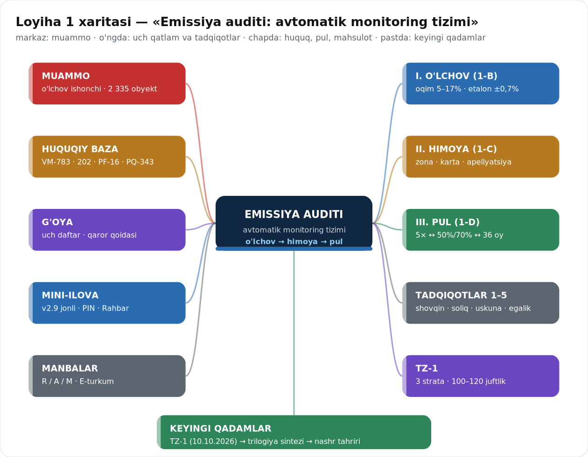

# YAKUNIY LOYIHA — IKKI G'OYA

**Bu fayl ikkala loyihani bir joyda, complete holda saqlaydi. G'oyalar aralashmaydi:**

| | 1-LOYIHA | 2-LOYIHA |
|---|---|---|
| Nomi | **Emissiya auditi** — avtomatik monitoring ishonchi | **Ochiq Eko Ledger** — chiqindi va ifloslanish hisobi |
| Savol | O'lchangan raqamga ishonish mumkinmi? | E'lon qilingan raqamga ishonish mumkinmi? |
| Zaif bo'g'in | oqim o'lchagichi (5–17% noaniqlik) | hisob metodi va qamrov (7,2/14/15 mln t) |
| Asosiy yechim | uch zona + tushuntirish kartasi + apellyatsiya + ≥5% qayta-o'lchov | besh kanal + to'rt rangli zonalash + murojaat (≤10 kun) |
| Huquqiy poydevor | VM-783 · 202-Nizom · PQ-343/347 · O'RQ-457 | Aarhus · hisobot 01.10.2026 · pasport 01.01.2027 · PQ-4291 |
| Keyingi qadam | **TZ-1** (2026-10-10) — shovqin qavatini o'lchash; AI qatlami TZ si tayyor (v1.1) | **MVP build** — yadro ~8 hafta (S1–S3 + S6), to'liq reja 16 hafta |
| Bosqichlar | A1–A26 (26 ta) | A1–A26 (26 ta) |

> **Eslatma:** bu hujjat — **g'oya (konsepsiya)**. Texnik implementatsiya ikki joyda: 1-LOYIHA uchun `Loyiha1-CarbonEmission/TZ-Anomaliya-Monitoring.md` (AI qatlami, v1.1, 59 KB) hamda `TZ-1` (10.10.2026 — o'lchov qavati); 2-LOYIHA uchun `Loyiha2-TrashOrganizer/TZ-Ochiq-Eko-Ledger-MVP.md` (hajmi 69 KB, v1.1). Maqolalar: `Maqolalar/Maqola1-CarbonEmission/Yakuniy-Maqola.md` va `Maqolalar/Maqola2-TrashOrganizer/Yakuniy-Maqola.md`.

---

# 1-LOYIHA — EMISSIYA AUDITI

## 1-LOYIHA · G'OYANING BIR JUMLASI

**«O'lchov ishonchi — pul adolatining sharti»**: agar o'lchangan raqam xato bilan kelsa, jarima ham, imtiyoz ham asossiz bo'ladi. Shu sabab g'oya uch qatlamga bo'linadi: **o'lchov → himoya → pul**.

## 1-LOYIHA · MUAMMO (A1–A3 BOSQICHLARI)

| Bosqich | G'oya natijasi |
|---|---|
| A1 | Muammo: «hisob-kitob ↔ o'lchov» tarangligi — qaror raqamga tayanadi, raqam ishonchi e'lon qilinmaydi |
| A2 | Qamrov: **2 335 obyekt** (663 I + 1 672 II); avtomatik kuzatuvda ~2% |
| A3 | Baza: VM-783 · 202-Nizom · PF-16 · VM-85 · PQ-343/347 · O'RQ-457 · MJTK |

## 1-LOYIHA · I QATLAM — O'LCHOV (A4–A6)

- **Zaif bo'g'in — oqim**: noaniqlik 5–17% (etalon ±0,7%; S-probe 5–6%; Lehigh +20% / −9…−13%).
- **Baseline dizayni**: 3 strata, 100–120 juftlik, 8–12 hafta (TZ-1 ning yadrosi).
- **Xulosa**: talab chegaralari (≥99,5% / ≥95% / ≥80%) «nuqta» emas, **noaniqlik oralig'i** bilan yozilishi kerak.

## 1-LOYIHA · II QATLAM — HIMOYA (A9–A14)

| G'oya elementi | Mazmuni |
|---|---|
| Uch zonali qoida | 🟢 yozib borish · 🟡 1–2× shartli (jazo yo'q) · 🔴 2×+ jazo + tushuntirish |
| Tushuntirish kartasi | 12 maydon: x̄, U, L, qoida, kalibrovka, akkreditatsiya, zona, QR… |
| Apellyatsiya oqimi | T+0 → T+2 → 10 kun → **soft-hold** → 30 ish kuni → sud |
| Oshkoralik metrikalari | choraklik «Aniqlik hisoboti» — 5 metrika |
| Mustaqil qayta-o'lchov | qizil signallarning **≥5%** i, ILAC-MRA laboratoriya |

## 1-LOYIHA · III QATLAM — PUL (A7, A15–A18)

- **Zanjir**: o'lchov → koeffitsient → summa → qaytarish (5× ↔ 50%→70% ↔ 36 oy).
- **Bo'shliqlar (3 ta)**: «gacha» muddati · vaqt assimetriyasi (jazo darhol, qaytarish 2 yil) · voz kechish doirasi.
- **Xarajat modeli (4 blok)**: uskuna · integratsiya · yillik xizmat · mustaqil tekshiruv (CEMS TIC $120–350k; CAAQMS $150–250k).
- **Xulosa**: imtiyoz **natijaga** bog'lanishi shart — aks holda «yashil yuvish» xavfi.

## 1-LOYIHA · BOSQICHLARNING TO'LIQ XARITASI (A1–A26)

| # | Bosqich | G'oya natijasi |
|---|---|---|
| A1–A3 | Muammo va baza | taranglik · 2 335 obyekt · 7 hujjat |
| A4–A6 | O'lchov | oqim 5–17% · strata dizayni · noaniqlik tili |
| A7–A8 | Pul va andozalar | 5× zanjiri · RATA/JCGM/ILAC |
| A9–A11 | Himoya | zonalar · karta · bo'shliqlar |
| A12–A14 | Oqim va hisobot | apellyatsiya 6 bosqich · 5 metrika · ≥5% |
| A15–A18 | Xarajat va rag'bat | 4 blok · zinapoya · 3 bo'shliq |
| A19–A21 | Tadqiqot rejasi | TZ-1 · ma'lumot rejimi · obyekt mezonlari |
| A22–A24 | Risk va kuzatuv | 5 qarshi fikr · yashil yuvish · 6 ochiq savol |
| A25–A26 | Taqdim etish | xarita (10 tugun) · R/A/M manba darajalari |

## 1-LOYIHA · TADQIQOT DAFTARLARI (G'OYANING ILMIY ASOSI)

| Daftar | Savol | Asosiy natija |
|---|---|---|
| **1-B** | O'lchov zanjirida xato qayerda? | oqim 5–17%; TZ-1 dizayni (3 strata, 100–120 juftlik) |
| **1-C** | Qanday himoya kerak? | «Adolat paketi»: JCGM 106 zona, 12-maydonli karta, 6-bosqichli apellyatsiya, ≥5% qayta-o'lchov |
| **1-D** | Pul qanday harakatlanadi? | xarajat 4 blok; 5× ↔ 50/70% ↔ 36 oy; 3 bo'shliq; C1–D16 manbalar |

## 1-LOYIHA · AMALIYOTDAGI O'RIN (2026)

- 01.03.2026 — uskuna o'rnatish majburiyati kuchga kirdi (PQ-343).
- 347 stansiya budjet hisobidan; 28 HORIBA komplekti; 69 avtostansiya / 44 korxona.
- 2026 I yarim yil: 274 mlrd so'm jamg'arma; 750 korxona tekshiruvi.

## 1-LOYIHA · KEYINGI QADAM

1. **AI qatlami TZ si** — tayyor (v1.1, 2026-09-29): `Loyiha1-CarbonEmission/TZ-Anomaliya-Monitoring.md`.
2. **TZ-1** rasmiylashtirish (2026-10-10): shovqin qavatini o'lchash — 3 strata, 100–120 juftlik, 8–12 hafta.
3. Pilot: I toifa + yuqori emissiyali tarmoqlar (energetika, sement, metallurgiya).
4. Uch zonali qoidani sinovdan o'tkazish va choraklik «Aniqlik hisoboti»ni joriy etish.
5. Natijalarni trilogiya sinteziga (1-B + 1-C + 1-D) qo'shish.

---

# 2-LOYIHA — OCHIQ EKO LEDGER

## 2-LOYIHA · G'OYANING BIR JUMLASI

**«Ma'lumot → izoh → e'lon → murojaat»** zanjiri: bitta registrdan bir vaqtda besh kanalga e'lon, har raqamga manba havolasi, har fuqaro murojaatiga ≤10 kun javob, «ma'lumot yo'q» ham ochiq ko'rsatiladi.

## 2-LOYIHA · MUAMMO (A1–A3 BOSQICHLARI)

| Bosqich | G'oya natijasi |
|---|---|
| A1 | Savol: «kim nima chiqarayotganini kim biladi?» — hisobot inson zanjirida (yig'ish → tahrir → tasdiq → nashr) |
| A2 | Qamrov: ~15 mln t/yil chiqindi; ~200 poligon; sanitariya qamrovi 88% (2025) |
| A3 | Baza: Aarhus (2025-03) · ochiqlik 01.12.2025 · choraklik hisobot 01.10.2026 · raqamli pasport 01.01.2027 · PQ-4291 |

## 2-LOYIHA · I QATLAM — HISOB (A4–A6, B15–B16)

| Muammo | Raqamlar (ziddiyat ochiq) |
|---|---|
| Hajm | 7,2 mln t (rasmiy) · 14 mln t (poligon hisobi) · 15 mln t (xalqaro baho) |
| Qayta ishlash | 18–19% (rasmiy) · 6,6% (plastik) · 5–6% (2026 baho) · 3–4% (2025 amaliy) |
| Xulosa | Ishonchsizlik — **metod va qamrov e'lon qilinmaganidan**, nazorat yetishmasligidan emas |

## 2-LOYIHA · II QATLAM — E'LON (A10–A13, A20)

| G'oya elementi | Mazmuni |
|---|---|
| Besh kanal | veb/dashboard · ochiq API · Telegram-bot · matbuot e'loni (LLM shablon) · xarita qatlami |
| Zonalash (4 rang) | 🟢 norma ichida · 🟡 1–2× · 🔴 2×+ · 🔵 **ma'lumot yo'q** (ochiq ko'rsatiladi) |
| Avtomatik izoh | LLM faqat shablon ichida; **raqamni o'zgartirmaydi**, manba havolasi bilan |
| Ma'lumot modeli | obyekt kartochkasi (geolokatsiya, toifa, manba) + 3 ko'rsatkich (MVP) |
| Ochiq datasetlar | data.egov.uz: ~170 ta ekologik dataset (≈1,7%) → maqsad 5% |

## 2-LOYIHA · III QATLAM — ISHTIROK (A12, A14)

- **Murojaat moduli**: yuborildi → ko'rilmoqda → javob berildi → hal qilindi → **ochiq arxiv**; KPI **≤10 kun**.
- **Ishonchning 5 qavati**: manba dalili · qarama-qarshi signal · avtomatik izoh · e'tiroz oqimi · ochiq Eko-Reyting.
- **Huquqiy asos**: Aarhus 9-modda — ekologik masalalar bo'yicha odil sudlov.

## 2-LOYIHA · AMALIYOT (2026) — G'OYA QAYSI VOQEALARGA TAYANADI

| Voqea | Raqam |
|---|---|
| WtE zavodlar | **6 ta**, $933 mln; 3,6 mln t/yil; 1,6 mlrd kVt·soat; poligon yuklamasi −40% |
| Poligonlar | −32,6% (2026) → −50% (2030); 47 poligon rekultivatsiya |
| Qayta yuklash stansiyalari | 28 (2026) → 70 (2030) |
| Navoiy | $260 mln xavfli chiqindi platformasi — 330 ming t/yil |
| Samarqand | 1 500 t/kun; 240 mln kVt·soat/yil; start 2027 |
| Ochiq savol | WtE **dioksin/kul** monitoringi qayerda e'lon qilinadi? |

## 2-LOYIHA · BOSQICHLARNING TO'LIQ XARITASI (A1–A26 — 2-LOYIHA KESIMI)

| # | Bosqich | G'oya natijasi |
|---|---|---|
| A1–A3 | Muammo va baza | ochiqlik majburiyati · 15 mln t · 5 hujjat/sana |
| A4–A6 | Hisob | 3 xil hajm · 4 xil qayta ishlash · chegara metodikasi |
| A7–A8 | Oqibat va andozalar | investitsiya/kompensatsiya · PRTR, E-PRTR, IPE |
| A9–A11 | Ochilish nuqtalari | ko'k zona · obyekt kartochkasi · zonalash qoidasi |
| A12–A14 | Oqim va ishonch | murojaat ≤10 kun · besh kanal · qarama-qarshi signal |
| A15–A18 | Xarajat va rag'bat | MVP (backend+hosting) · WtE barqaror qoidasi · qayta ishlash rag'bati |
| A19–A21 | Reja | MVP TZ: yadro ~8 hafta (S1–S3 + S6) / to'liq 16 hafta · ochiq API formati · hudud tanlovi |
| A22–A24 | Risk va kuzatuv | yashirish · siyosiylashish · kuydirishga aylanish; 6 ochiq savol |
| A25–A26 | Taqdim etish | xarita (10 tugun) · N-turkum manba darajalari |

## 2-LOYIHA · KEYINGI QADAM

1. **MVP build** — TZ (`TZ-Ochiq-Eko-Ledger-MVP.md`) bo'yicha: yadro (`S1–S3 + S6`) ~8 hafta; to'liq reja 16 hafta.
2. Pilot: **2 viloyat** (biri sanoat, biri agrar) — solishtirish uchun.
3. PRTR tamoyiliga o'tish taklifini tayyorlash (obyekt + modda + muddat + ochiq format).
4. WtE dioksin/kul e'loni bo'yicha ochiqlik talabini shakllantirish.
