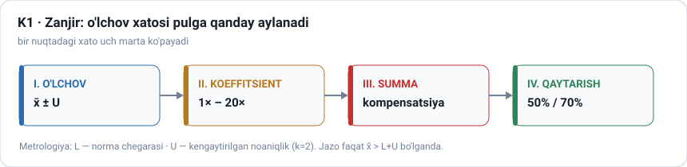
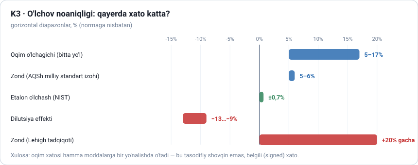
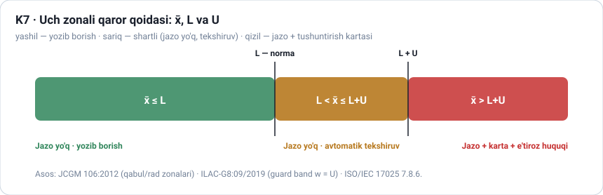
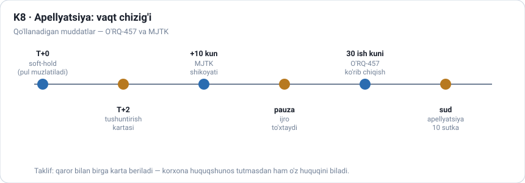
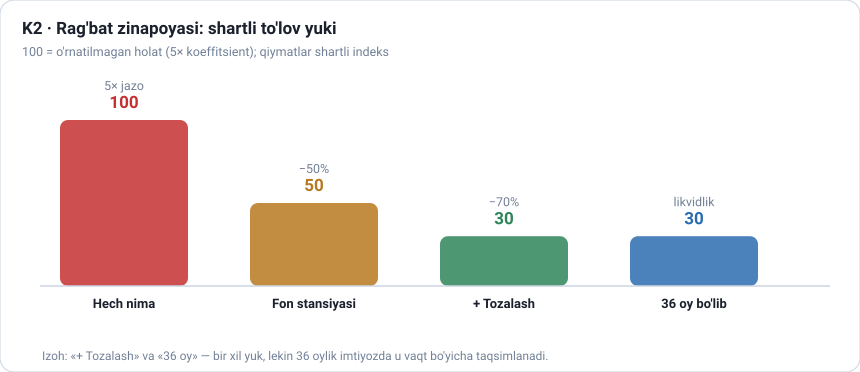
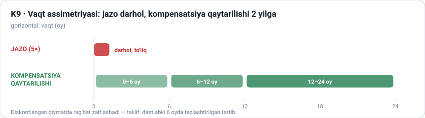
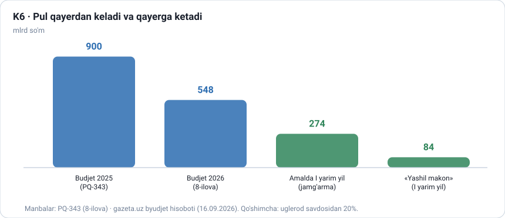
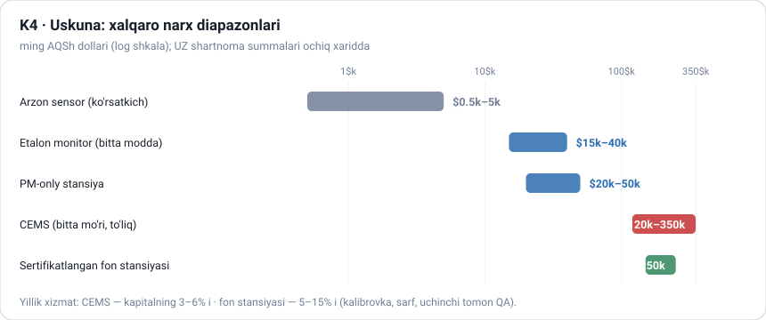
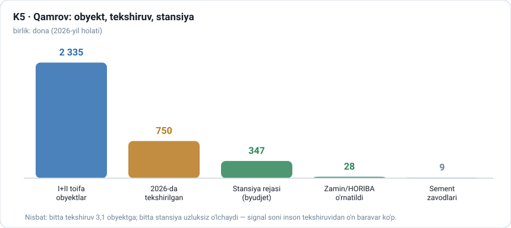
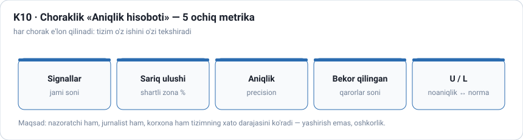

# RAQAM QIMMATGA AYLANADI
*Emissiya hisoboti to'g'ri bo'lmasa, O'zbekistonda kim to'laydi?*

**O'lchov xatosi → koeffitsient → jarima → qaytarish: uch qatlam, o'n grafik, bitta ochiq savol**

> **QORALAMA v3.0 — o'qish nusxasi.** Hujjat **ketma-ket o'qish** uchun tuzilgan: matn → raqamlar → grafik → xulosa. To'liq HTML nusxa (grafiklar bilan bir varaqda): `YAKUNIY/01-Maqola-Draft.html`. Dalillar to'plami: `Maqola-EGAZ-BALANS.md` (v1) — **o'chirilmaydi**. v2 matn skeleti: `Maqola-v2-Raqam-Qimmatga-Aylanadi.md`. Texnik implementatsiya bu maqolada yozilmaydi.

**Muallif:** [F.I.Sh.] · **Konferensiya:** MMIT'26 · **Sana:** 2026-09-26 · **Hajm:** cheklovsiz
**Kalit so'zlar:** emissiya monitoringi · o'lchov noaniqligi · kompensatsiya to'lovi · avtomatik monitoring stansiyasi (CEMS) · kompensatsiyani qaytarish · raqamli nazorat · MRV · O'zbekiston

---

## 1. KIRISH — 1-MART: RAQAM QACHON PULGA AYLANDI?

2026-yil 1-mart — sanani alohida yodda tutish kerak. Shu kundan boshlab O'zbekistonda **o'lchov xatosi pulga aylana boshladi**.

Prezidentning 2025-yil 29-oktabrdagi qaroriga ko'ra I va II toifa korxonalar **2026-yil 1-martga qadar** fon monitoring stansiyalarini joylashtirib, ularni Ekologiya qo'mitasining Ekologik monitoring milliy markazi bilan birlashtirishi lozim edi (uza.uz, 29.11.2025). VM-783-son qaror texnik shartni qat'iy qilib qo'ydi: stansiyalar **O'zMSt 194:2024** va **O'zMSt 195:2024** ga mos bo'lishi, muvofiqlikni *Davlat ekologik sertifikatlashtirish va standartlashtirish markazi* baholashi shart.

Va o'sha banddagi raqam — maqolaning kaliti: *«99,5 foizdan, modernizatsiya qilinadigan mavjud uskunalarning samaradorligi esa 95 foizdan kam bo'lmasligi»*, lokal suv tozalash uchun — *«80 foizdan kam bo'lmasligi lozim»*. Qonun talabni **foizda** qo'ydi; foiz esa o'lchov bilan aniqlanadi.

**Asosiy savol:** agar o'lchovning o'zi xato qilsa — talab bajarildimi yoki bajarilmadimi, kim hal qiladi? Va xato **kimning cho'ntagidan** chiqadi?

---

## 2. UCH QATLAM — MAQOLA NIMANI TEKSHIRADI

| Qatlam | Savol | Nima tekshiriladi | Manba tadqiqot |
|---|---|---|---|
| **I. O'LCHOV** | Raqam qayerda xato qiladi? | oqim o'lchagichi, analizator, kalibrovka, noaniqlik | Tadqiqot 1-B |
| **II. HIMOYA** | Xato bo'lsa, adolat qanday? | e'tiroz, tushuntirish, apellyatsiya, yolg'on-ijobiy | Tadqiqot 1-C |
| **III. PUL** | Raqam qanday jarima/imtiyozga aylanadi? | 5× koeffitsient, 50%/70% qaytarish, 36 oy | Tadqiqot 1-D |

*Zanjir: **o'lchov xatosi → koeffitsient → summa → qaytarish**. Bir nuqtadagi xato uch marta ko'payadi.*

> **Chegara:** maqola loyihaning *texnik* yechimini tasvirlamaydi. Bu yerda avtomatlashtirish **nimani uddalaydi, nimani uddalay olmaydi** — shu muhokama qilinadi.

---

## 3. EMISSIYA RAQAMI QANDAY HISOBLANADI

**3.1.** Kompensatsiya to'lovlari 202-son Nizom (12.04.2021) bilan tartibga solinadi: to'lov **choraklik**, hisobot chorakdan keyingi oyning **25-sanasigacha**; farq aniqlansa **+10 kun**; qayta hisob-kitob **3 yil**gacha; kelishmovchilik tuman organida.

> **Asosiy taranglik:** davlat to'lovni **hisob-kitob** asosida undiradi (sarf × koeffitsient × normativ), korxona muhandislari esa **o'lchov** asosida ishlaydi. Bu ikki raqam har doim bir xil bo'lavermaydi — va 3 yillik oyna bugungi «to'g'ri» summani ertaga «noto'g'ri» qilishi mumkin.

**3.2. Qamrov:** **663** I toifa + **1 672** II toifa = **2 335** obyekt (VM-783). Muddat: **01.03.2026**.

**3.3. Ziddiyatlar (ikkalasi ham qoldiriladi):**

| Ziddiyat | Raqam A | Raqam B | Holat |
|---|---|---|---|
| Qattiq maishiy chiqindi hajmi | 7,2 mln t/yil | 14 mln t/yil | ochiq — ~2 baravar |
| Qayta ishlash darajasi | 18–19% (rasmiy) | 6,6% (plastik amaliyoti) | ochiq |
| Apellyatsiya muddati (MPK 187) | 3 oy | 6 oy (media) | ochiq |
| CBAM sertifikati bahosi | €70–100/t (baho) | 75,36 → 75,28 €/t (rasmiy) | **hal qilindi** |

---

## 4. I QATLAM — O'LCHOV: RAQAM QAYERDA XATO QILADI?

Emissiya massasi **kontsentratsiya × oqim × vaqt**. Analizator o'rganilgan; **oqim** — eng zaif.

| Bo'g'in | Xato |
|---|---|
| Oqim o'lchagichi (bitta yo'l) | **5–17%** |
| Oqim (X-shakl, yaxshi montaj) | 0,5–1% |
| Etalon (NIST) | ±0,7% |
| Zond (AQSh milliy standart izohi) | 5–6% |
| Zond (Lehigh tadqiqoti) | +20% gacha |
| Dilutsiya effekti | −9…−13% |

> **Kalit xulosa:** oqim xatosi hamma moddalarga **bir xil yo'nalishda** o'tadi — bu tasodifiy shovqin emas, **belgili (signed) xato**; o'rtacha bilan «o'chmaydi».

**4.1. Xalqaro nazorat:** AQShda yillik **RATA** — mezon nisbiy aniqlik **≤10%**, **≤7,5%** bo'lsa chastota kamayadi; muvaffaqiyatsiz RATA → ma'lumot **«yaroqsiz»** va o'rniga qo'yiladigan usul (EPA CAMD, 2022). Bu tamoyil UZ tizimida yo'q.

---

## 5. II QATLAM — HIMOYA: PLATFORMA TALABLARIDA E'TIROZ BORMI?

PQ-343 **7-ilovasi** platformaga **8 talab** qo'yadi (masofaviy aniqlash · inson omilini qisqartirish · ekologik tahlil · erta ogohlantirish · sertifikat/ekspertiza · onlayn chora · katta ma'lumotlar · AI/Big Data). **Sakkiztalasida ham** apellyatsiya, tushuntirish yoki yolg'on-ijobiy ochiqligi haqida so'z yo'q.

**5.1. Himoya bor — lekin ulanmagan:**

| Mexanizm | Muddat / kuch |
|---|---|
| O'RQ-457 — yuqori organga e'tiroz | 30 ish kuni, **ijro to'xtatiladi**, to'liq ko'rish |
| MJTK shikoyat | 10 kun, kuchga kirishi to'xtaydi |
| Jarima to'lash | 60 kun (rad etilgandan keyin 30) |
| Murojaatga javob | 15 kun / 1 oy |
| Apellyatsiya (sud) | 10 sutka |

*Taklif (1-C): 🟢 x̄ < L yozib borish · 🟡 L ≤ x̄ ≤ L+U — jazo yo'q, avtomatik tekshiruv · 🔴 x̄ > L+U — jazo + tushuntirish kartasi. Asos: JCGM 106 «guarded acceptance», ILAC-G8, ISO/IEC 17025 7.8.6.*

**5.2. Yolg'on-ijobiy:** tibbiy signalizatsiyada **80–99%**, xavfsizlik tizimlarida **90–99%** (Axelsson 1999). Shuning uchun eng amaliy tavsiya — texnik emas, **oshkoralik**.

---

## 6. III QATLAM — PUL: 5× JAZO YOKI 70% QAYTARISH

| Holat | Oqibat | Manba |
|---|---|---|
| O'rnatilmagan | kompensatsiya **×5** | 202-son Nizom 201-band |
| Normativ yo'q (bahsli) | koeffitsient **20×**gacha | 202-son Nizom |
| Fon stansiyasi | **qarzdorlikdan voz kechish** + **50%**gacha (2 yil) | PF-16 · VM-85 |
| + chang-gaz & lokal suv | **70%**gacha (2 yil) | PF-16 · VM-85 |
| To'liq paket / 15%+ to'lov | **36 oy** bo'lib to'lash | 202-son Nizom 301-band |

**Uch bo'shliq:** (1) «**gacha**» — yakuniy foiz oldindan ma'lum emas; (2) jazo **darhol**, qaytarish **2 yilga** cho'zilgan; (3) voz kechish **faqat qarzdorlikka** tegishli.

> **Eng muhim jumla:** qaytarish foizi **o'sha hisoblangan summaning** foizidir. Hisob-kitobga xato kirsa, davlat o'z xatosini **ikki marta** to'laydi: to'la undira olmaydi, keyin ustiga qaytarib beradi.

---

## 7. XARAJAT TOMONI — KIM NIMA TO'LAYDI

To'rt blok: **uskuna** ($120–350k CEMS · $150–250k fon stansiyasi) → **o'rnatish + integratsiya** → **yillik xizmat** (3–6% / 5–15%) → **mustaqil tekshiruv** (RATA ≤10%; 1-C taklifi: qizil signallarning ≥5% i). VM-783 xarid shartida *«respublika hududida texnik servis»* talabi bor — «arzon import + servissiz» modeli yopilgan.

---

## 8. AMALIYOT — NATIJALAR BOR, SAVOLLAR HAM

| Natija | Raqam | Manba |
|---|---|---|
| Sement zavodlarida stansiyalar | **9** | uza.uz (29.11.2025) |
| «Zamin» stansiyalari | **28** (HORIBA) | Anhor (08.09.2026) |
| Byudjet rejasi | **347** stansiya | kun.uz (25.11.2025) |
| 2026-da tekshirilgan korxona | **750** | Sputnik (05.08.2026) |
| Aniqlangan zarar | **1 trln 386 mlrd so'm** | Sputnik |
| Muborak GQIZ | **10,834 mlrd so'm** | gazeta.uz (13.05.2026) |
| Boysun | **8,5 mlrd so'm** | gazeta.uz |

**Nimani bilmaymiz:** 2 335 dan nechtasi o'rnatdi · 50%/70% bo'yicha xulosalar soni · 347 stansiya shartnoma summasi · kompensatsiyaning yillik hajmi · **yolg'on-ijobiy darajasi** (chunki qaror qoidasi yo'q) · 36 oylik imtiyozdan foydalanganlar soni.

---

## 9. AVTOMATLASHTIRISH: QAYERDA KERAK, QAYERDA XAVFLI?

Matematik zaruriyat: 2 335 obyekt · 750 yillik tekshiruv · 347 stansiya · trillionlab so'm.

- **Xitoy** — big data asosida anomaliya aniqlash (MEE, 2024); MRV zaif tomoni tan olinadi (MDPI *Land*, 2025) → *tushuntirishsiz aniqlash ishlamaydi*.
- **Qozog'iston** — 13 yil «qog'ozdagi bozor» (~$1/t) → raqamli infratuzilmasiz bozor ishlamaydi.
- **Hindiston CCTS** — 8 tarmoq, 490 korxona → tarmoq kesimida bosqichma-bosqich kengaytirish.

**2026 talablari:** EU AI Act **86-modda** (tushuntirish huquqi, 02.08.2026) · OMB M-24-10 (qo'lda ko'rib chiqish) · 40 CFR 22 (30 kun).

> **Chegara:** tizim nechta signalni ushlashini aytadi; signal to'g'rimi yoki xato — faqat **noaniqlik bilan birga hisoblangan qoida** aytadi. 1-C paketi yangi apparat talab qilmaydi: bor tizimga **uch qoida** (zona · karta · e'tiroz) qo'shadi.

---

## 10. MUHOKAMA — BESHTA QARSHI FIKR

1. **«Oshkorlik yashirishga o'rgatadi»** → javob: xom ma'lumot + **qarama-qarshi signal** (yoqilg'i, energiya, ishlab chiqarish).
2. **«Hamma sariq zonaga suyanadi»** → javob: zona **bir marta** belgilansin va **ulushi** e'lon qilinsin.
3. **«Tizim siyosiylashadi»** → javob: reyting **yaxshilanish trendi** bo'yicha, metodika oldindan.
4. **«Kichik korxona yuki oshadi»** → javob: bosqichma-bosqich talablar + kvota + 36 oylik imtiyoz reklamasi.
5. **«Sudlar to'ladi»** → javob: **soft-hold** + karta → e'tiroz tushunarli asosda bo'ladi.

> **Yashil yuvish:** stansiya o'rnatildi, imtiyoz olindi — lekin ishlab chiqarish hajmi o'sdi va mutlaq emissiya **kamaymadi**. Imtiyoz **natijaga** bog'lanishi kerak.

---

## 11. XULOSA VA TAVSIYALAR

O'zbekiston ekologiya nazoratini **«jarima yig'ish»** modelidan **«rag'bat + o'lchov ishonchi»** modeliga o'tkazdi — bu yutuq. Keyingi qadam: **o'lchovning o'zini isbotlanadigan qilish**.

| # | Tavsiya | Kimga |
|---|---|---|
| 1 | Platforma talablariga **qaror qoidasi** (aniqlik zonasi) | Qo'mita / PQ-343 7-ilova |
| 2 | Har qizil signal uchun **tushuntirish kartasi** | Platforma operatori |
| 3 | **15 kunlik** e'tiroz bosqichi qonunlashtirilsin | Qonun chiqaruvchi |
| 4 | **Choraklik Aniqlik hisoboti** (5 metrika) | Qo'mita |
| 5 | Qizil signallarning **≥5%** mustaqil qayta-o'lchovi | Milliy monitoring markazi |
| 6 | Qaytarish foizi **jadval** ko'rinishida e'lon qilinsin | Qo'mita / VM-85 |
| 7 | Qaytarish **birinchi 6 oyga** tezlashtirilsin | Vazirlar Mahkamasi |
| 8 | 36 oy va 50%/70% birgalikda qo'llanish tartibi | Hujjat tuzatishi |
| 9 | Metrologik tekshiruv natijalari **ochiq reestrda** | Sertifikatlash markazi |
| 10 | O'lchov noaniqligi **TT shartlarida** majburiy maydon | VM-783 TT |

**To'qqiztasi yangi texnologiya talab qilmaydi** — ular bor tizimga qoida va oshkoralik qo'shadi.

---

## 12. MANBALAR

Darajalar: **R** — rasmiy · **A** — akademik/sanoat · **M** — media. To'liq bibliografiya: `Maqola-EGAZ-BALANS.md` §9.

| Kod | Manba | Daraja |
|---|---|---|
| E2 | VM-783 (25.11.2024, tahr. 02.03.2026) — O'zMSt 194/195:2024 · TIF TN 9027/8421 · 99,5%/95%/80% · 201-band (5×) · 301-band (36 oy) | R |
| E4 | VM-85 (28.02.2026) — 50%/70%, 15 ish kuni; gazeta.uz 02.03.2026 | R/M |
| E5 | PQ-343 (18.11.2025) — 8-ilova 548 mlrd · 7-ilova 8 talab · platforma 01.09.2026 | R |
| E7 | Sputnik 05.08.2026 — 750 korxona · 1 trln 386 mlrd so'm | M |
| E8 | gazeta.uz 13.05.2026 — Muborak 10,834 mlrd · Boysun 8,5 mlrd | M |
| E9 | 202-son Nizom (12.04.2021) | R |
| E10 | EPA CAMD (2022) — RATA ≤10% / ≤7,5% | R |
| E12 | EU AI Act 86-modda (02.08.2026); MEE Xitoy (2024); MDPI Land (2025) | R/A |
| E13 | OMB M-24-10; 40 CFR 22 | R |
| E14 | JCGM 106 · ILAC-G8 · ISO/IEC 17025 7.8.6 | A/R |
| E15 | Axelsson 1999 — alert fatigue | A |
| E16 | Clarity · ESEGAS · Applus — narxlar | A |
| E17/E20 | kun.uz 25.11.2025 (347) · Anhor 08.09.2026 (28 HORIBA) | M |
| E18 | gazeta.uz 16.09.2026 — 274 mlrd jamg'arma · 84 mlrd «Yashil makon» | M |
| 1-B/1-C/1-D | Ichki tadqiqotlar | — |

---

## 13. QORALAMA — YAKUNIY TANLOV MUALLIFGA QOLDIRILADI

**13.1. Sarlavha variantlari:** (1) **«Raqam qimmatga aylanadi»** (joriy) · (2) «O'lchov xatosi qancha turadi?» · (3) «Beshlik, elliklik va yetmishlik» · (4) «Ko'rinmaydigan hisoblagich».

**13.2. Ishlatilmagan dalillar:** 1-B (X-shakl <1%, zond 5–6%) · 1-C (12 maydonli karta to'liq ro'yxati, 6 bosqichli grafik) · 1-D (S1/S2/S3 shartli misol) · VM-783 «texnik servis» talabi · Senat SQ-844-IV (69 avtostans) · eko-sug'urta rejalari · 10 ta Toshkent stansiyasining qo'mitaga o'tkazilishi.

**13.3. Ochiq savollar:** 6 ta (yuqorida §8) — rasmiy hisobotlar chiqishi bilan yangilanadi.

**13.4. Muqobil formulirovkalar:** «Qonun foizda talab qo'ydi, lekin foizni kim tekshiradi?» · «Aniqlik — texnik tushuncha emas, fiskal tushuncha» · «Avtomatlashtirish ko'r emas — u faqat aytilgan narsani ko'radi».

---

**Hujjat holati:** QORALAMA v3.0 (2026-09-26). v1 (dalillar to'plami) va v2 (matn skeleti) **o'chirilmagan**. Ziddiyatli raqamlar ikkalasi ham ko'rsatilgan. Grafiklar `grafiklar/` papkasida (inline SVG). Yakuniy tanlov va qisqartirish — muallif (Jasur) tomonidan.
