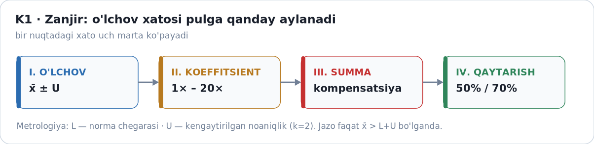
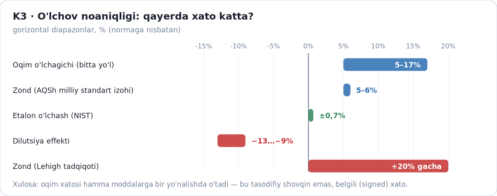
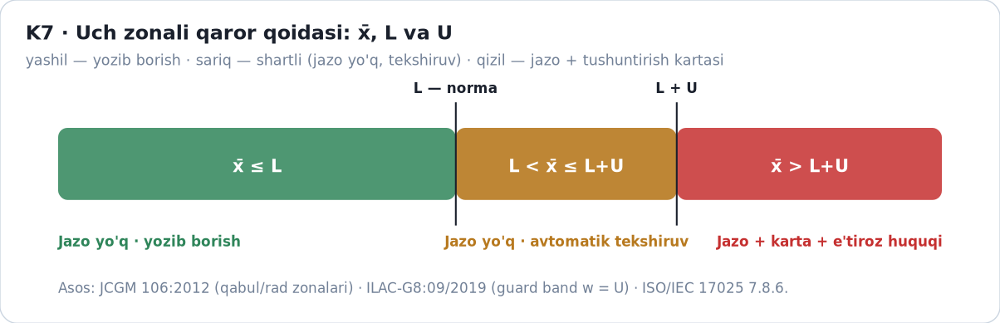
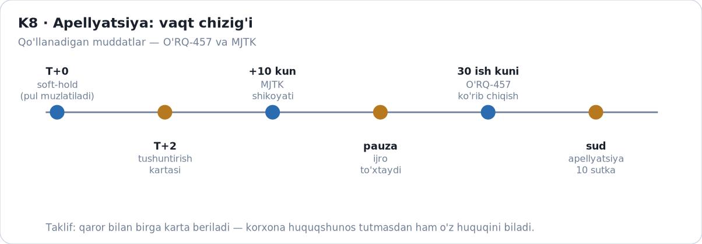
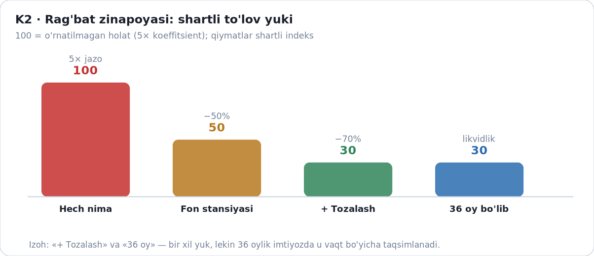
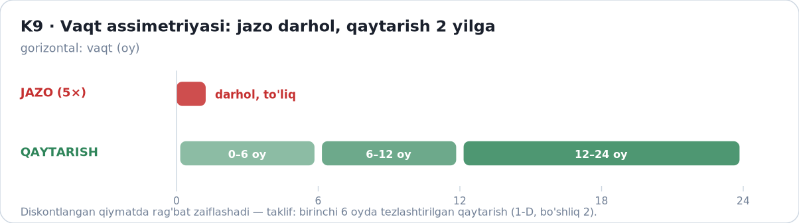
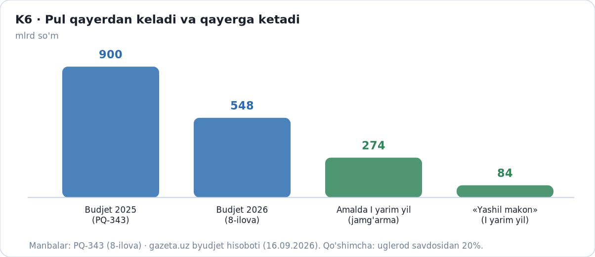
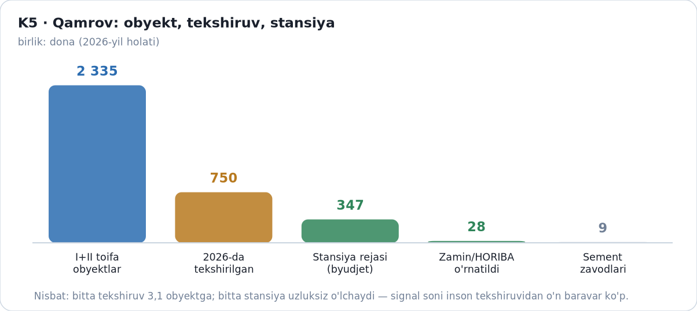
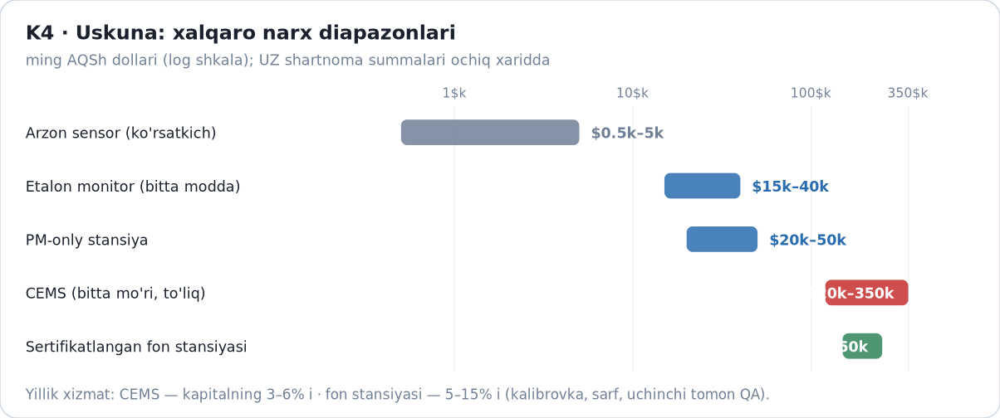
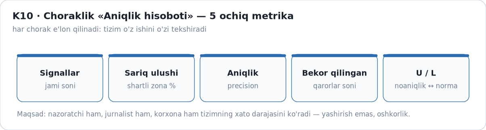

# YAKUNIY MAQOLA 1 — RAQAM ISHONCHSIZ BO'LSA, JAZO HAM ADOLATSIZ

**Emissiya o'lchovi ishonchi: 2 335 obyekt, oqim o'lchagichidagi 5–17% noaniqlik va bir chegarali jarima tizimi**

**Annotatsiya.** 2026-yil 1-martdan O'zbekistonda atrof-muhitga ta'siri bo'yicha I va II toifaga mansub sanoat korxonalari atmosfera tashlanmalarini avtomatik o'lchash stansiyalari bilan jihozlashi majburiy bo'ldi. Shu paytdan boshlab o'lchangan raqam bevosita moliyaviy oqibatga ega bo'ldi: me'yordan oshgan tashlanma uchun kompensatsiya to'lovi, rag'bat rejimida esa to'lovlarning bir qismini qaytarish. Maqola o'lchov zanjirini (kontsentratsiya × oqim × vaqt → koeffitsient → summa) bo'g'inma-bo'g'in tahlil qiladi va zanjirdagi eng katta noaniqlik oqim o'lchagichida ekanini ko'rsatadi: xalqaro adabiyotda qayd etilgan qiymatlar 5–17% (AQSh sharoitida), AQSh energetika korxonalarida o'tkazilgan sinovlarda esa ayrim hollarda 20% gacha musbat siljish aniqlangan. Amaldagi tartib esa yagona chegaraga tayanadi va o'lchov noaniqligini huquqiy jihatdan tan olmaydi; natijada chegaraga yaqin turgan korxona uchun bir xil o'lchov natijasi ikki xil xulosaga — me'yor yoki huquqbuzarlik — olib kelishi mumkin. Maqola uch qismli javob taklif qiladi: noaniqlikni e'lon qilish (I qism), xatoni jarimadan ajratuvchi himoya mexanizmi (II qism) va pul oqimini shu asosda ko'rinadigan qilish (III qism). Taklifning yadrosi — JCGM 106 va ILAC-G8 andozalariga mos uch zonali qoida hamda to'lov bazasini hisoblashda qo'llaniladigan tushuntirish kartasi.

**Kalit so'zlar:** emissiya monitoringi · o'lchov noaniqligi · oqim o'lchagichi · uch zonali qoida · kompensatsiya to'lovi · apellyatsiya · anomaliya aniqlash · mashinali o'qitish (nazoratsiz usullar) · XAI · JCGM 106 · ILAC-G8 · ISO/IEC 17025 · O'zbekiston

**Muallif:** Jasur · **Sana:** 2026-09-29

---

## 1. Kirish: 1-martdan raqam pulga aylandi

2026-yil 1-mart — O'zbekiston ekologik nazorati uchun burilish sanasi. Shu kundan boshlab atrof-muhitga ta'siri bo'yicha I va II toifaga mansub korxonalar atmosfera havosiga ustuvor tashlanmalarni tahlil qiluvchi avtomatik monitoring stansiyalarini o'rnatishi shart bo'ldi (VM-783; PQ-343). Ilgari hisob-kitob yo'li bilan to'ldirilgan hisobotlar o'rnini real vaqtda o'lchanadigan ma'lumot egallaydi.

O'lchovning pulga aylanishi bir necha kanal orqali sodir bo'ladi. Birinchidan, me'yordan oshgan tashlanma uchun kompensatsiya to'lovi hisoblanadi; 2026-yil 4-mayda qabul qilingan O'RQ-1143-son qonun bilan bunday to'lovlar besh baravargacha, ayrim hollarda jarimalar o'n baravargacha oshirildi. Ikkinchidan, VM-85-son qaror bilan rag'bat tizimi joriy etildi: monitoring stansiyasini o'rnatgan va tozalash uskunalarini ishga tushirgan korxonaga kompensatsiya to'lovlarining bir qismi ikki yil davomida qaytariladi. Uchinchidan, 2025-yil 30-yanvardagi PF-16-son farmon bilan ushbu to'lovlardan shakllangan qarzdorlikdan voz kechish mexanizmi belgilandi.

Demak, bir o'lchov natijasi bir vaqtning o'zida ham jazo, ham rag'bat manbai bo'lishi mumkin. Bu holat o'lchov sifatiga yangi talab qo'yadi: raqam nafaqat «to'g'ri», balki **tekshiriladigan va e'tiroz bildiriladigan** bo'lishi kerak. Amaliyotda esa ko'rsatkichlar boshqacha: 2026-yilda ekologik politsiya 750 ta korxonada tekshiruv o'tkazib, tabiatga yetkazilgan 1 trln 386 mlrd so'm miqdoridagi zararni hisobladi, 500 ga yaqin mansabdor shaxsga ma'muriy jarima qo'llanildi (Sputnik O'zbekiston, 05.08.2026). 2025-yil davomida ekologiya sohasida qariyb 59 ming huquqbuzarlik qayd etilgan (gazeta.uz, 01.05.2026). Hajmlar katta — shuning uchun o'lchov ishonchi masalasi nazariy emas, moliyaviy masala.

Maqolaning markaziy savoli shunday: **chegaraga yaqin turgan korxona uchun o'lchov xatosi normami yoki huquqbuzarlikmi — va buni kim, qanday mezon bilan hal qiladi?** Quyida avval o'lchov zanjiri tahlil qilinadi (I qism), so'ng xatoni jazodan ajratuvchi himoya mexanizmi taklif etiladi (II qism), oxirida pul oqimining shu asosda qanday ko'rinadigan qilinishi ko'rsatiladi (III qism). Alohida bo'lim (8-bo'lim) masshtab masalasiga bag'ishlanadi: 2 335 obyekt va o'nlab o'lchov parametri bilan ishlaydigan tizimni faqat qo'lda boshqarish amalda imkonsiz — bu savol avtomatlashtirish va anomaliya aniqlash usullariga olib keladi.

---

## 2. I qism — O'lchov zanjiri: xato qayerda to'planadi

### 2.1. Zanjirning tuzilishi

*1-rasm. O'lchov xatosining moliyaviy natijaga aylanish zanjiri (muallif ishlanmasi).*

Tashlanmaning o'lchangan massasi uchta kattalikning ko'paytmasi sifatida shakllanadi: ifloslantiruvchi moddaning kontsentratsiyasi, chiqindi gazning hajmiy sarfi va o'lchov davri. Keyin bu massa normativ koeffitsientlar va to'lov stavkalari orqali summaga aylanadi:

**kontsentratsiya × oqim × vaqt → me'yor bilan taqqoslash → koeffitsient → to'lov yoki jarima**

Zanjirning o'ziga xosligi shundaki, xato har bir bo'g'inda qo'shilib, oxirida bitta moliyaviy natijaga jamlanadi (1-rasm). Shuning uchun bo'g'inlar orasidagi hissa nisbatini bilish — qaror sifati uchun hal qiluvchi ahamiyatga ega.

### 2.2. Bo'g'inlar bo'yicha noaniqlik

Adabiyot va xalqaro amaliyotda qayd etilgan qiymatlar quyidagicha (1-jadval; 2-rasm):

| Bo'g'in | Noaniqlik / siljish | Manba |
|---|---|---|
| Gaz tahlili (kontsentratsiya) | kalibrovka siljishi ≤2,5% span | EPA PS-2 (40 CFR 60, ilova B) |
| Butun CEMS (namuna olish interfeysi bilan) | kalibrovka xatosi ≤5% span | EPA PS-2, 13.2-band |
| Etalon va kalibrovka | ±0,7% | sertifikatlangan etalon gazlar (ishlab chiqaruvchi sertifikati) |
| **Oqim o'lchagichi (USM, S-probe)** | **5–17%** (AQSh sharoitida) | Sarunac va boshq. (Lehigh University), 2004; chet el sinovlari — ⚠️ milliy ko'rsatkich emas |
| Uskuna almashtirilganda | ayrim hollarda 20% gacha musbat siljish | Sarunac va boshq. (Lehigh University), 2004 |

**1-jadval.** O'lchov zanjiri bo'g'inlaridagi noaniqlik darajalari (xalqaro manbalar asosida; ⚠️ — chet el sharoitida olingan qiymat). Birliklarga e'tibor bering: xalqaro talablar **span** (o'lchov diapazoni) qiymatiga nisbatan, manbalardagi 5–17% esa **o'qish** qiymatiga nisbatan berilgan — bu ikki kattalikni to'g'ridan-to'g'ri qo'shib bo'lmaydi.

Eng katta noaniqlik oqim bo'g'inida to'planadi — «qancha gaz o'tdi» degan savolda.

⚠️ **Metodik izoh.** Jadvaldagi qiymatlar xalqaro manbalardan olingan: ular O'zbekiston korxonalarida o'tkazilgan o'lchovlar emas, balki zanjirda xato qayerda to'planishi mumkinligini ko'rsatuvchi ma'lumot. Xususan, 5–17% diapazoni AQSh sharoitida bajarilgan sinovlarga asoslanadi. Shu sababli bu sonlar milliy fakt sifatida emas, **tekshirilishi kerak bo'lgan gipoteza** sifatida ishlatiladi: I toifa korxonalarida davriy nisbiy aniqlik sinovlari o'tkazilib, natijalari e'lon qilinsa, O'zbekiston uchun haqiqiy diapazon aniqlanadi (shu yo'nalishdagi savol — 10-bo'limning 3-bandi).

*2-rasm. O'lchov zanjiri bo'g'inlaridagi noaniqlik diapazonlari (adabiyot va xalqaro amaliyot asosida).*
 Sabablari texnik: oqim profili notekis, o'lchagichning o'rnatish burchagi va masofasi natijaga ta'sir qiladi, ishlab chiqaruvchi koeffitsientining standart qiymati haqiqiy qiymatdan farq qiladi.

### 2.3. Nima uchun bu «yomon niyat» emas

AQShda o'tkazilgan keng ko'lamli sinovlar (Sarunac, Romero, Levy va Bilirgen, Lehigh University Energy Research Center, 2004) shuni ko'rsatdiki, oqim o'lchagichlari va suyultiruvchi namuna olish zondlarida ijobiy siljish muntazam uchraydi: ayrim hollarda 20% gacha. Koeffitsientni haqiqiy qiymatga moslash va o'lchash tartibini tuzatish natijasida ortiqcha hisob-kitob 15 foiz punktdan ko'proq kamaygan, qoldiq siljish esa 1–2% darajasida baholangan. Mualliflar xulosasida bu ishlar emissiya savdosida moliyaviy yo'qotishlarning oldini olish maqsadida o'tkazilgani qayd etiladi.

Ya'ni bir xil uskuna bilan olingan ikki raqam o'rtasidagi farq ko'pincha xodimning xatosini emas, **o'lchash tizimining tabiiy siljishini** ko'rsatadi. Bu tafovutni hisobga olmaydigan huquqiy tartib esa ishonchsizlikni qaror darajasiga ko'taradi.

### 2.4. Normativ talablar bilan taqqoslash

Uskunalarga qo'yiladigan xalqaro talablar o'lchov sifati chegarasini belgilaydi: nisbiy aniqlik sinovi (RATA) oqim monitori uchun 10% dan, siljish (bias) esa to'liq shkala qiymatining 5% idan oshmasligi kerak (Kanada CEMS protokoli; EPA CAMD amaliyoti). O'zbekistonda esa chang-gaz tozalash uskunalarining samaradorligi bo'yicha talablar — ≥99,5%, ≥95% va ≥80% (VM-783, 3-band) — **nuqta qiymat** sifatida, ya'ni noaniqliksiz yozilgan.

Bu ikki ko'rsatkichni aralashtirmaslik kerak: **tozalash samaradorligi** uskuna ifloslantiruvchi moddaning qancha qismini ushlab qolishini bildiradi, **o'lchov noaniqligi** esa o'lchangan qiymatning haqiqiy qiymatdan qanchalik chetlanishi mumkinligini ko'rsatadi. Ya'ni uskuna 95% samaradorlik bilan ishlashi va ayni paytda uning natijasi 10% noaniqlik bilan o'lchanishi mumkin — biri ikkinchisini inkor etmaydi.

Muhim nuqta shunda: xalqaro andozalarda chegara qiymati bilan birga uning ishonch oralig'i ham e'lon qilinadi; mahalliy tartibda esa samaradorlik talabi nuqta sifatida berilgan. Natijada 10–20% noaniqlik sharoitida qabul qilingan qaror o'zining xato fazosini ko'rsatmaydi.

---

## 3. II qism — Himoya: xatoni jazodan ajratish

### 3.1. Uch zonali qoida

Taklifning yadrosi — o'lchov natijasini chegara (L) va kengaytirilgan noaniqlik (U) bilan birgalikda baholash. Bu yondashuv JCGM 106:2012 andozasining qabul-sohasidagi asosiy g'oyasi bo'lib, ILAC-G8:09/2019 uni himoya zonasi (guard band) shaklida amaliyotga tatbiq etadi (2-jadval; 3-rasm):

| Zona | Shart | Huquqiy oqibat |
|---|---|---|
| Yashil | o'rtacha qiymat x̄ ≤ L | jazo yo'q; ma'lumot yozib boriladi |
| Sariq | L < x̄ ≤ L + U | jazo yo'q; avtomatik qo'shimcha tekshiruv va tavsiya |
| Qizil | x̄ > L + U | jazo + tushuntirish kartasi + e'tiroz huquqi |

**2-jadval.** Uch zonali qaror qoidasi: shartlar va huquqiy oqibatlar.

Bu qoidada chegara va ishonch oralig'i aralashmaydi: yashil zona o'lchov natijasi me'yor ichida ekanini bildiradi, sariq zona xatoning mumkin bo'lgan sohasi chegarani kesib o'tishini tan oladi, qizil zona esa o'lchov aniq ko'rsatgan oshishni qamrab oladi. Zonalar orasidagi chegara ikkilanmasligi uchun shartlar qat'iy tengsizliklar bilan berilgan (x̄ ≤ L; L < x̄ ≤ L+U; x̄ > L+U). Bu zonalar o'lchov ishonchiga taalluqli; normadan oshish darajasini ko'rsatuvchi zonalash (Maqola 2) boshqa savolga javob beradi — shu sababli shartlar ham har xil.

*3-rasm. Uch zonali qaror qoidasi: chegara (L) va kengaytirilgan noaniqlik (U) asosida (JCGM 106:2012; ILAC-G8:09/2019).*

Amaldagi tizimda oraliq zona mavjud emas: VM-783 va unga bog'liq 202-son Nizom (kompensatsiya to'lovlari tartibi) talablarni bajarish/bajarmaslik shaklida tartibga soladi, o'lchov noaniqligi esa huquqiy mezon sifatida kiritilmagan. Shu sababli chegarada turgan korxona uchun yagona o'lchov natijasi ikki xil huquqiy xulosaga olib kelishi mumkin.

### 3.2. Tushuntirish kartasi

Jazo qo'llanilganda qaror bilan birga tushuntirish kartasi berilishi taklif etiladi. Karta 12 maydonni qamraydi: o'lchangan o'rtacha qiymat (x̄), kengaytirilgan noaniqlik (U), me'yor chegarasi (L), qo'llanilgan qoida, kalibrovka dalili, laboratoriya va uning akkreditatsiyasi (O'zbekiston ILAC o'zaro tan olish kelishuviga 2022-yil 14-sentabrda qo'shilgan), o'lchash uskunasi, o'lchov sanasi, aniqlangan zona, apellyatsiya yo'li va ma'lumotni tekshirish uchun havola. Bu talab ISO/IEC 17025:2017 andozasining 7.8.6-bandi bilan uyg'un: sinov natijalari hisobotida noaniqlik ko'rsatilishi shart.

Kartaning amaliy ahamiyati shundaki, u qarorni korxona mustaqil tekshira oladigan hujjatga aylantiradi. Xuddi shu mantiq xalqaro amaliyotda ham qo'llaniladi: Kanada protokoli siljish chegaradan oshsa, keyingi ma'lumotlar tuzatish koeffitsienti bilan hisoblanishini talab qiladi — ya'ni tuzatishning o'zi qonuniy jarayon sifatida tan olinadi.

### 3.3. Apellyatsiya oqimi

E'tiroz bildirish tartibi amaldagi muddatlarga tayanishi mumkin. Taklif etilayotgan oqim olti bosqichdan iborat (4-rasm): xabarnoma (T+0), korxona tushuntirishi (T+2 kun), dastlabki ko'rib chiqish (10 kun), to'lovni shartli ushlab turish — pul muzlatiladi, lekin da'vo saqlanadi, yakuniy xulosa (30 ish kuni, O'RQ-457 bo'yicha) va sud bosqichi. To'lovni to'liq undirib, keyin qaytarish yo'lini tanlash korxona uchun aylanma mablag' riskini tug'diradi; shartli ushlab turish esa ikkala tomon uchun xavfni tenglashtiradi.

*4-rasm. Apellyatsiya oqimining vaqt chizig'i va qo'llaniladigan muddatlar.*

---

## 4. III qism — Pul: jazo va rag'bat bir zinapoyada

### 4.1. Ikki rejim va ular orasidagi masofa

Ikki rejimning nisbatini 5-rasm ko'rsatadi. Amaldagi tartibda ikki rejim yonma-yon mavjud. Jazo rejimida me'yordan oshgan tashlanma uchun kompensatsiya to'lovi besh baravargacha oshiriladi (O'RQ-1143, 2026-yil 4-may). Rag'bat rejimi VM-85-son qaror (28.02.2026) bilan ikki bosqichga bo'lingan: birinchi bosqichda monitoring stansiyasini o'rnatgan korxona to'lovlardan shakllangan qarzdorlikdan voz kechish huquqini oladi, ikkinchi bosqichda esa qo'shimcha ravishda chang-gaz va lokal suv tozalash uskunalarini ishga tushirganda to'lovlarning 70 foizigacha bo'lgan qismi ikki yil davomida qaytariladi. Shu o'rinda e'tibor talab qiladigan nuqta bor: hujjat matnida ikkinchi bosqich uchun 70 foiz ko'rsatilgan, gazeta.uz tahlilida esa birinchi bosqich uchun 50 foiz, ikkinchisi uchun 70 foiz deb bayon etilgan (gazeta.uz, 02.03.2026). Bu tafovut rasmiy matn ustuvorligi bilan hal qilinishi kerak, lekin u rag'bat shartlarini ommaviy tushuntirishda noaniqlik tug'diradi.

Ikki rejim o'rtasidagi masofa katta, lekin **oraliq holatlar yozilmagan**: 50% va 70% orasidagi farq qanday mezonga bog'liq, ikki yillik muddat qaysi kundan boshlanadi va tozalash uskunasi qaysi samaradorlik darajasidan «o'rnatilgan» hisoblanadi — bu savollarga hujjatlarda aniq javob yo'q. Noaniq oraliq korxona uchun investitsiya qarorini qiyinlashtiradi.

Shu o'rinda atamalarni ajratib olish zarur: rag'bat rejimi **to'lov (kompensatsiya) bo'yicha** imtiyoz beradi, ya'ni undirilishi mumkin bo'lgan to'lovdan voz kechiladi yoki uning bir qismi qaytariladi; **jarima esa bu imtiyozga kirmaydi** — u ma'muriy jazo sifatida o'z kuchida qoladi va faqat sud tartibida, qonunda ko'rsatilgan asoslar bo'yicha bekor qilinishi mumkin. Ommaviy tushuntirishlarda bu ikki narsa ko'pincha bir gapda aytiladi va natijada korxona «jarimasini qaytarib olaman» degan noto'g'ri tasavvurga kelib qoladi; hujjat matni bunday o'qishga asos bermaydi.

*5-rasm. Jazo va rag'bat rejimlarining shartli taqqoslanishi (baza: o'rnatilmagan holat = 100).*

### 4.2. Vaqt assimetriyasi

To'lovlar rejasidagi raqamlar bu masalani yorqin ko'rsatadi (7-rasm). 2025-yil uchun sohaviy jamg'arma 900 mlrd so'm hajmida rejalashtirilgan edi; 2026-yil uchun reja 548 mlrd so'm, amalda esa birinchi yarim yillikda 274 mlrd so'm tushgan (gazeta.uz, 16.09.2026; uza.uz, 15.09.2026). Ya'ni 274 mlrd so'm — bu **yarim yillik** ko'rsatkich, uni yillikka keltirsak 274 × 2 = 548 mlrd so'm bo'ladi, bu esa 2026-yil uchun e'lon qilingan yillik reja bilan aynan mos tushadi. Demak, bu yerda ziddiyat yo'q; taqqoslashda xatolik faqat davrlar aralashtirilganda yuzaga keladi (2025-yil rejasi — 900 mlrd, 2026-yil rejasi — 548 mlrd, 2026-yilning birinchi yarmi — 274 mlrd so'm). Raqamlarning o'zi kompensatsiya to'lovlari hajmi real iqtisodiy vaznga ega ekanini ko'rsatadi.

Pul oqimining boshqa tomoni vaqtga sezgir: jazo qarori tez qo'llaniladi, to'lovning qaytarilishi esa ikki yilga cho'ziladi (6-rasm). Diskontlangan qiymatda bu rag'batni sezilarli zaiflashtiradi. Shu sababli dastlabki olti oyda tezlashtirilgan qaytarish tartibi taklif etiladi — u byudjet uchun neytral, korxona uchun esa investitsiya qarorini tezlashtiruvchi chora.

*6-rasm. Vaqt assimetriyasi: jazo darhol qo'llanadi, kompensatsiya qaytarilishi ikki yilga cho'ziladi.*

*7-rasm. Sohaviy jamg'arma hajmi: 2025-yil rejasi, 2026-yil rejasi va I yarim yillik natijasi.*

---

## 5. Qamrov, xarajat va hisobot

### 5.1. Qamrov raqamlari

VM-783-son qaror bilan I toifa bo'yicha 663 ta, II toifa bo'yicha 1 672 ta obyekt qamrab olinadi — jami 2 335 ta (VM-783, 2-ilova). Viloyatlar va tumanlarda fon monitoringi uchun 347 ta kichik avtomatik stansiya o'rnatilishi belgilangan (VM-783, 1-ilova; kun.uz, 25.11.2025). Sanoat tomonidagi amaliy ko'rsatkichlar quyidagicha: 44 ta korxonada 69 ta avtomatik stansiya ishga tushirilgani qayd etilgan (Senat ma'lumoti, SQ-844-IV, 20.12.2023); 2026-yil sentabrga kelib «Zamin» fondi ko'magida 28 ta HORIBA komplekti o'rnatilgani xabar qilingan (Anhor, 08.09.2026); I toifadagi 9 ta sement zavodida avtomatik kuzatuv stansiyalari ish boshlagan (uza.uz, 29.11.2025).

Ushbu raqamlardan oddiy nisbat kelib chiqadi (8-rasm): avtomatik stansiya o'rnatilgan korxonalar sonini I–II toifa obyektlari soniga bo'lsak, **44 / 2 335 ≈ 1,9%** ga teng bo'ladi. Bu — muallif hisob-kitobi (44 ÷ 2 335 = 0,0188) bo'lib, qamrovning boshlang'ich bosqichda ekanini ko'rsatishga xizmat qiladi.

*8-rasm. Qamrov ko'rsatkichlari: obyektlar soni, tekshiruvlar va o'rnatilgan stansiyalar.*
 Tekshiruv usuli bilan yopilayotgan qism esa yillik yuzlab korxona hajmida: 2026-yilda 750 ta korxona tekshirilgan (Sputnik O'zbekiston, 05.08.2026). Qamrov tez o'sayotgani holda o'lchov sifati mexanizmlari hali shakllanmagan — bu maqolaning asosiy dalili.

### 5.2. Xarajat tuzilishi

«Bunday tizim juda qimmat» degan e'tirozni tekshirish uchun xarajatni to'rt blokka ajratish maqsadga muvofiq:

1. **Uskuna** — tahlil qurilmasi, oqim o'lchagichi, kalibrovka gazlari;
2. **O'rnatish va integratsiya** — quvurga moslash, elektr ta'minoti, ma'lumot uzatish va platformaga ulash;
3. **Yillik xizmat** — tekshirish, kalibrovka, ehtiyot qismlar (xalqaro amaliyotda uskuna qiymatining 5–15% i, ayrim takliflarda operatsion xarajatlarning 3–6% i);
4. **Mustaqil tekshiruv** — davriy nisbiy aniqlik sinovi va qayta o'lchov.

Xalqaro bozor narxlari diapazoni keng: uzluksiz emissiya monitoringi tizimlari (CEMS) uchun 120–350 ming dollar, havo sifati monitoring stansiyalari uchun 150–250 ming dollar, chang monitoringi uchun 20–50 ming dollar, etalon uskunalar uchun 15–40 ming dollar (Applus, Clarity.io, ESEGAS, Accio — 2026-yil ochiq sahifalari; 9-rasm). O'zbekistondagi shartnoma summalari ochiq xarid tizimlarida to'liq oshkor etilmagani uchun bu raqamlar faqat yo'naltiruvchi hisoblanadi va milliy taqqoslash uchun ochiq reyestr zarur.

*9-rasm. CEMS va monitoring uskunalarining xalqaro narx diapazonlari (logarifmik shkala; vendor sahifalari, 2026).*

### 5.3. Choraklik hisobot

Tizim o'z ishining natijalarini ham o'lchashi kerak. Taklif: har chorakda besh ko'rsatkich e'lon qilinadi (10-rasm) — umumiy signallar soni, sariq zona ulushi, qayta o'lchov natijalari, e'tirozlar statistikasi va kalibrovkalar holati. Qizil signallarning kamida 5 foizi ILAC o'zaro tan olish doirasidagi mustaqil laboratoriyada qayta o'lchanadi. Bu ko'rsatkichlar nazorat organining o'z xatosini ko'rsatishga tayyorligini bildiradi.

*10-rasm. Choraklik «Aniqlik hisoboti» uchun besh ochiq ko'rsatkich.*

---

## 6. Hisoblangan misol: noaniqlik qanday summaga aylanadi

Quyidagi hisob-kitob maqolaning muallifiga tegishli bo'lib, u o'lchov noaniqligining moliyaviy oqibatini ko'rsatish maqsadida keltiriladi.

Faraz qilaylik, gaz tahlilining nisbiy standart noaniqligi 3%, oqim o'lchagichiniki esa jadvaldagi 5–17% diapazonining o'rtasiga yaqin qiymat sifatida 10%. Bu ikki komponent mustaqil bo'lgani uchun yig'indi noaniqlik kvadratlar yig'indisining ildizi bilan hisoblanadi:

- u = √(3² + 10²) = √109 ≈ **10,4%**
- kengaytirilgan noaniqlik (k = 2): U = 2 × 10,4 ≈ **21%**

Demak, o'lchov natijasi me'yor chegarasida (x̄ = L) bo'lsa ham, haqiqiy qiymat 0,79L dan 1,21L gacha oraliqda bo'lishi mumkin. Amaldagi yagona chegarali tartibda bu oraliqning yuqori qismi huquqbuzarlik sifatida qayd etiladi.

Moliyaviy oqibatni koeffitsient orqali ko'rsatish mumkin: O'RQ-1143 bo'yicha kompensatsiya to'lovi besh baravargacha oshirilgani uchun, chegarada turgan korxona uchun asossiz hisoblanishi mumkin bo'lgan to'lov miqdori taxminan

**5 × 0,21 = 1,05**. Bu yerda 5 — O'RQ-1143 bo'yicha kompensatsiya to'lovining maksimal oshirish koeffitsiyenti (besh baravar), 0,21 esa nisbiy noaniqlik (U ning L ga nisbati). Ko'paytirish ma'nosi shu: chegara atrofidagi o'lchov xatosi bazaviy to'lovga nisbatan ~21% hajm beradi, besh baravar koeffitsiyent qo'llanganda esa **asossiz hisoblanishi mumkin bo'lgan ortiqcha to'lov bazaviy to'lovning taxminan bir baravariga (1,05) aylanadi** — ya'ni korxona me'yorda turib ham ikki baravar to'lov bilan yuzlashishi mumkin.

Bu hisob-kitobning real masshtabini ko'rsatadigan misol bor: 2026-yil may oyida Muborak gazni qayta ishlash zavodiga ekologik qonunbuzarliklar uchun 10 mlrd 834 mln so'm miqdorida qo'shimcha kompensatsiya belgilangani e'lon qilindi (gazeta.uz va spot.uz, 13.05.2026). Bunday summalarda 20% noaniqlik qariyb 2,2 mlrd so'mga teng (10 834 mln × 0,20 = 2 167 mln). Albatta, har bir holatda noaniqlikning haqiqiy qiymati o'lchash tizimiga bog'liq; maqsad aniq raqamni talab qilish emas, **noaniqlik hisobga olinmagan qarorning moliyaviy narxini ko'rsatish**.

---

## 7. Muhokama

**1.** O'lchov noaniqligini qabul qilish nazoratni bo'shashtiradi, degan xavf bor. Amaliyot buni tasdiqlamaydi: sariq zona jazoni bekor qilmaydi, u tekshiruvni ko'paytiradi. Xatoni jazodan ajratish jarima tizimining o'zini ishonchli qiladi — chunki bugungi holatda e'tiroz bildirish uchun asos korxonada emas, hujjatda bo'lishi kerak.

**2.** Korxonaning xatoni yashirish imkoniyati haqida ham savol tug'iladi. Bunga qarshi vosita — **qarama-qarshi signal** (hisob-kitobni o'lchov uskunasidan mustaqil bo'lgan boshqa ko'rsatkichlar bilan solishtirish): hisoblangan massa ishlab chiqarish hajmi, xom ashyo iste'moli va energiya balansi bilan solishtiriladi. Bu nisbatlar o'lchov uskunasidan mustaqil bo'lgani uchun ular birgalikda yashirishni qimmatlashtiradi.

**3.** Ikkinchi xavf — korxonalar kesimidagi **jamlanma ko'rsatkich (reyting)** bilan bog'liq: bir martalik reyting tez siyosiylashadi, ko'rsatkichlarning o'zi rasmiyatchilikka aylanishi mumkin. Shu sababli metodika oldindan e'lon qilinishi va ko'rsatkichlar yaxshilanish **dinamikasi** bo'yicha baholanishi kerak — reyting yakuniy hukm emas, o'zgarish tendensiyasi sifatida o'qilishi lozim.

**4.** Xarajat masalasi. Maqolada keltirilgan bloklar xarajatni oshkor qiladi, lekin O'zbekiston uchun eng real yo'l — bosqichma-bosqich o'rnatish: avval I toifa va yuqori emissiyali tarmoqlar (energetika, sement, metallurgiya), keyin qolgan obyektlar. To'rt blokli tuzilma shu bosqichlashning byudjet asosi bo'lishi mumkin.

**5.** Texnologik qatlam. Sariq zona avtomatik ravishda yuzaga keladigan ma'lumotlar oqimini talab qiladi: kunlik o'lchovlar, kalibrovka yozuvlari va hisobot ma'lumotlarini qo'lda tekshirish 2 335 obyektda imkonsiz. Bu masala keyingi bo'limda alohida ko'rib chiqiladi — qaysi texnikalar ishlatiladi, ular nima qiladi va nima qilmaydi (8-bo'lim).

*(Muhokama nuqtalari 1–5; ro'yxatning davomi — Maqola 2 da, 6–10.)*

---

## 8. AI/ML qatlami: nega kerak va qaysi chegarada

Muhokamaning texnologik bandi alohida bo'limga arziydi, chunki taklif etilayotgan uch zonali tizim ma'lumot oqimini avtomatik qayta ishlashni nazarda tutadi — bu aynan sun'iy intellekt va mashinali o'qitish (ML) masalasidir.

**Miqyos.** Bir tomonda O'zbekistonning 2 335 obyekti va 347 fon stansiyasi; ikkinchi tomonda xalqaro amaliyot. Xitoyning milliy uglerod savdo tizimi 2025-yil martdagi kengayishdan keyin 3 680 ta obyektni qamraydi (2 087 energetika, 962 sement, 232 metallurgiya, 97 alyuminiy korxonasi) va bu mamlakat emissiyalarining 60 foizdan ortig'ini tashkil qiladi (ICAP, 2025; gov.cn, 27.03.2025). Yevropa Ittifoqining savdo tizimi esa qariyb 10 ming statsionar qurilmani qamraydi (Yevropa Komissiyasi; ICAP hisobida 8 704 qurilma, 2024). Bu hajmdagi tizimlarda ko'rsatkichlarni qo'lda tekshirish amaliyotda mumkin emas — yetakchi tizimlar monitoring, hisobot va verifikatsiya (MRV) jarayonini avtomatlashtirishga o'tgan. O'zbekiston ko'lami Xitoyning elektr energetikasi sektori boshlang'ich ko'rsatkichiga (2 087 obyekt) yaqin, ya'ni masala nazariy emas.

**Qaysi texnikalar mos.** Taklif etilayotgan zonalar tizimiga to'rtta aniq ML vazifasi to'g'ri keladi (3-jadval):

| Vazifa | Texnika | Nega aynan shu |
|---|---|---|
| Yuzlab obyekt orasidan birinchi navbatda tekshirilishi keraklilarini ajratish | **Isolation Forest / One-Class SVM** — nazoratsiz anomaliya aniqlash | Yorliqlangan «buzilish» holatlari yo'q; nazoratsiz usullar aynan shu sharoit uchun ishlab chiqilgan |
| Kalibrovka siljishi va uskuna eskirishi kabi sekin dreyfni aniqlash | **Vaqt qatori dekompozitsiyasi (STL) + qoldiq chegarasi; LSTM-autoencoder** | Dreyf nuqta-anomaliya emas: trend va mavsumiylikdan ajratilgan qoldiqda qidiriladi |
| Tushuntirish kartasida «nega bu qaror chiqdi»ni ko'rsatish | **Explainable AI (XAI): SHAP qiymatlari yoki feature importance** | Karta aynan shu tamoyilni amalga oshiradi — qaror asosi raqamli dalil bilan ochiladi |
| O'lchovni ishlab chiqarish hajmi va energiya balansi bilan solishtirish | **Ko'p manbali ma'lumot sintezi (data fusion) va o'zaro tekshiruv** | Mustaqil manbalar birgalikda ma'lumotni yashirishni qimmatlashtiradi |

**3-jadval.** Muammo — texnika — asos jadvali (xalqaro adabiyot asosida).

**Adabiyot nima deydi.** Xitoyning kimyoviy sanoat parkida o'tkazilgan tadqiqot (Xu va boshq., Environment International, 2025) 31 korxonaning 107 chiqindi oqimi bo'yicha 17 modelni sinab ko'rdi: eng yaxshi natijani Random Forest berdi. Muhim natija shunda: vaqt kesimida 334 ta rejim o'zgarishi 90 foiz ishonch bilan aniqlandi, ammo shulardan faqat 24 tasi nazorat organlarining rasmiy yozuvlariga to'g'ri keldi — ya'ni algoritmik aniqlash nazoratni takrorlamaydi, balki uni to'ldiradi. Xitoy uglerod savdo tizimi sharoitida CEMS ma'lumot sifati uchun ramka taklif etgan Song va boshqalar (Environmental Impact Assessment Review, 2025) anomaliya aniqlash, kalibrovkani shartga bog'lash va bo'shliqlarni to'ldirish (imputation) bosqichlarini birlashtiradi; ramka Shandun issiqlik elektr stansiyasida sinovdan o'tgan. Umumiy uslubiy asos sifatida Nassif va boshqalarning (IEEE Access, 2021) 290 tadqiqotni qamrab olgan anomaliya aniqlash sharhi keltirilishi mumkin.

**Chegara va risklar.** Model raqamni o'zgartirmaydi, faqat ishlarni tartiblaydi va tekshiruvga yo'naltiradi; qaror qabul qilish vakolati insonda qoladi. Bu ataylab shunday, chunki kamida uch turdagi risk real:

- **Yolg'on signal muvozanati.** Model chegarasi qat'iyroq bo'lsa, tekshiruv yuklamasi oshadi; yumshoqroq bo'lsa, buzilishlar o'tib ketadi. Aynan shu sababli ikkilik «jazo bor/yo'q» o'rniga uch zonali javob taklif etiladi: ehtimoliy holat jazo emas, qo'shimcha tekshiruv tug'diradi. Xitoyning sement zavodlarida o'tkazilgan amaliy tadqiqot ko'rsatadiki, 2 foiz va undan yuqori hajmdagi ma'lumot buzilishlari 90 foizdan yuqori aniqlikda topiladi, yolg'on signal darajasi esa 3 foizdan past ushlab turiladi (Wu va boshq., Processes, 2026).
- **Model dreyfi.** Uskunalar, xom ashyo tarkibi va hisobot qoidalari o'zgarishi bilan model aniqligi pasayadi; shuning uchun davriy qayta o'qitish (retraining) va uning natijalarini e'lon qilish majburiy jarayon bo'lishi kerak.
- **Tushuntirish huquqi.** Avtomatik qaror ustidan tushuntirish olish huquqi Yevropa Ittifoqining sun'iy intellekt to'g'risidagi qonuni 86-moddasida (2026-yil 2-avgustdan kuchda) mustahkamlangan; tushuntirish kartasi shu talab bilan ham uyg'un.

Model tanlash, ma'lumot sxemasi va ishlab chiqish bosqichlari ushbu maqolaning predmeti emas — bu loyiha hujjati (TZ-1) darajasidagi masala. Maqola faqat asosiy savolga javob beradi: qaysi hollarda raqam qaror uchun yetarli asos bo'ladi va bu javobni avtomatlashtirish qaysi chegarada qolishi kerak.

---

## 9. Xulosa va tavsiyalar

O'zbekistonda o'lchovga asoslangan ekologik nazorat 2024–2026-yillarda huquqiy jihatdan to'liq shakllandi: VM-783, VM-85, PF-16, PQ-343, O'RQ-1143. Keyingi masala — bu tizimning **ishonch arxitekturasi**, ya'ni raqamning qanday holatlarda qaror uchun yetarli asos bo'lishi.

*(Tavsiyalar 1–6; ro'yxatning davomi — Maqola 2 da, 7–12.)*

1. **Noaniqlikni e'lon qilish.** Har bir e'lon qilingan ko'rsatkich bilan birga uning kengaytirilgan noaniqligi (U) va hisoblash metodi ko'rsatilsin.
2. **Uch zonali qoidani huquqiy tan olish.** Yashil, sariq va qizil zonalar chegarasi x̄ ≤ L; L < x̄ ≤ L+U; x̄ > L+U shaklida qat'iy belgilansin (JCGM 106:2012, ILAC-G8:09/2019).
3. **Tushuntirish kartasini joriy etish.** Har bir jazo qarori 12 maydonli karta bilan birga berilsin (ISO/IEC 17025:2017, 7.8.6).
4. **Mustaqil qayta o'lchov kvotasi.** Qizil signallarning kamida 5 foizi ILAC o'zaro tan olish doirasidagi laboratoriyada tekshirilsin.
5. **Rag'bat zinapoyasini uzluksiz qilish.** 50% va 70% orasidagi oraliq mezonlar, muddatning boshlanish sanasi va «o'rnatilgan uskuna» tushunchasi aniq belgilansin; dastlabki olti oyda tezlashtirilgan qaytarish tartibi joriy etilsin.
6. **Choraklik aniqlik hisoboti.** Besh ko'rsatkich doimiy e'lon qilib borilsin (3-jadvaldagi avtomatik anomaliya signallari bilan birgalikda); hisobot o'lchov sifatining tashqi nazorati vazifasini o'tasin.

---

## 10. Ochiq savollar

*(Savollar 1–5; davomi — Maqola 2 da, 6–11.)*

1. 2026-yil yakunlari bo'yicha avtomatik stansiyalar soni va ularning texnik holati qanday?
2. Yagona geoaxborot tizimiga integratsiya qilingan ma'lumotlar qanday shaklda va qanday chastotada ochiq e'lon qilinadi (gazeta.uz, 24.03.2026 xabariga ko'ra bu ish rejalashtirilgan)?
3. I toifadagi korxonalarda o'tkazilgan nisbiy aniqlik sinovlarining natijalari qayd qilinadimi va e'lon qilinadimi?
4. Kompensatsiya to'lovlarining o'rtacha javob muddati va e'tiroz statistikasi qanday?
5. Kichik stansiyalar (347 ta) uchun o'lchov noaniqligi normalari belgilanganmi?

---

## 11. Manbalar

**Manbalar va usul.** Dalillar uch darajaga ajratilgan: **R** — rasmiy hujjatlar va davlat organlari ma'lumotlari; **A** — xalqaro andozalar, regulyator talablari va hakamlik ko'rigidan o'tgan tadqiqotlar; **M** — media va ochiq manbalar. Ma'lumotlar 2026-yil sentabr holatiga to'plangan. Chet el sharoitida olingan qiymatlar ⚠️ bilan belgilanadi va milliy fakt sifatida ishlatilmaydi. Muallifning o'z hisob-kitoblari matnda alohida ko'rsatilgan.

**Rasmiy hujjatlar va davlat ma'lumotlari (R)**

1. VM-783-son qaror, 25.11.2024 — «Sanoat korxonalarining atrof-muhitga salbiy ta'sirini kamaytirishni ta'minlash chora-tadbirlari to'g'risida» (1-, 2-, 3-ilovalar: 347 stansiya, toifalar, samaradorlik talablari). https://lex.uz/uz/docs/-7233437
2. VM-85-son qaror, 28.02.2026 — atrof-muhitga salbiy ta'sirni kamaytirish harakatlarini rag'batlantirish nizomi. https://lex.uz/uz/docs/-8068163
3. PF-16-son farmon, 30.01.2025 — «O'zbekiston-2030» strategiyasini amalga oshirishga oid davlat dasturi. https://lex.uz/docs/-7369703
4. PF-46-son farmon, 25.03.2026 — «Toza havo» umummilliy loyihasini amalga oshirish chora-tadbirlari. https://lex.uz/uz/docs/-8101201
5. PQ-343-son qaror, 18.11.2025 — o'rnatish muddatlari, yagona platforma va sohaviy jamg'arma parametrlari (4-, 7-, 8-ilovalar). https://lex.uz/uz/docs/-7847341
6. 202-son Nizom — kompensatsiya to'lovlari tartibi (201-band: koeffitsiyentlar; 301-band: rag'bat shartlari, 36 oy). https://lex.uz/uz/docs/-5367873
7. O'RQ-1143-son qonun, 04.05.2026 — ekologik huquqbuzarliklar bo'yicha javobgarlikni kuchaytirish. https://lex.uz/docs/8169998
8. O'RQ-457-son qonun, 08.01.2018 — «Ma'muriy tartib-taomillar to'g'risida» va MJTK — murojaat va apellyatsiya muddatlari (30 ish kuni; 10/60 kun). https://lex.uz/docs/-3492199
9. Senat ma'lumoti (SQ-844-IV), 20.12.2023 — 44 korxonada 69 avtomatik stansiya va 27 kuzatuv punkti. https://lex.uz/docs/-6733055
10. ICAP, 2025; Xitoy hukumati axborot portali (gov.cn / China Daily), 27.03.2025 — Xitoy milliy uglerod savdo tizimining kengayishi: 3 680 ta obyekt (2 087 energetika, 962 sement, 232 metallurgiya, 97 alyuminiy), emissiyalarning 60 foizdan ortig'i. https://icapcarbonaction.com/en/news/china-officially-expands-national-ets-cement-steel-and-aluminum-sectors · https://english.www.gov.cn/news/202503/27/content_WS67e508a1c6d0868f4e8f13a1.html
11. Yevropa Komissiyasi — «Scope of the EU ETS»: qariyb 10 000 statsionar qurilma; ICAP hisobida 8 704 qurilma (2024). https://climate.ec.europa.eu/eu-action/carbon-markets/eu-emissions-trading-system-eu-ets/scope-eu-ets_en

**Andozalar, regulyator talablari va tadqiqotlar (A)**

12. JCGM 106:2012 — «Evaluation of measurement data — The role of measurement uncertainty in conformity assessment» (qabul/rad zonalari).
13. ILAC-G8:09/2019 — «Guidelines on decision rules and statements of conformity» (himoya zonasi, w = U).
14. ISO/IEC 17025:2017 — sinov laboratoriyalari kompetentligi; 7.8.6-band: hisobotda noaniqlik ko'rsatilishi sharti.
15. Sarunac, N., Romero, C.E., Levy, E.K., Bilirgen, H. (2004). «Factors affecting CEM measurement accuracy and recommendations for improvement». Lehigh University Energy Research Center (AQSh); OSTI 20501708.
16. Kanadaning CEMS protokoli (Environment Canada) — oqim monitori uchun RATA ≤10%, siljish ≤5% FS; siljish chegaradan oshsa, tuzatish kiritish tartibi.
17. EPA (AQSh), 40 CFR 60, ilova B — Performance Specification 2: kalibrovka siljishi ≤2,5% span, kalibrovka xatosi ≤5% span; EPA CAMD amaliyoti. https://www.ecfr.gov/current/title-40/chapter-I/subchapter-C/part-60/appendix-Appendix%20B%20to%20Part%2060
18. Xu, Z., Shi, X., Shu, W., Xin, Y., Zan, X., Si, Z., Cheng, J. (2025). «Machine learning classifiers to detect data pattern change of continuous emission monitoring system: A typical chemical industrial park as an example». *Environment International*, 201, 109594. DOI 10.1016/j.envint.2025.109594 — 17 model sinovi; 334 rejim o'zgarishi (90% ishonch), shundan 24 tasi nazorat yozuvlariga mos kelgan.
19. Song, Y., Luo, X., Lu, Y., Qian, J., Zhang, W., Liu, L., Huang, J., Zhao, X., Zhang, D. (2025). «Improving the data quality of CO₂ continuous emissions monitoring systems: In the context of China's emissions trading scheme». *Environmental Impact Assessment Review*, 115, 108037. DOI 10.1016/j.eiar.2025.108037 — anomaliya aniqlash, kalibrovka va bo'shliqlarni to'ldirish ramkasi (Shandun issiqlik elektr stansiyasi).
20. Nassif, A.B., Abu Talib, M., Nasir, Q., Dakalbab, F.M. (2021). «Machine learning for anomaly detection: a systematic review». *IEEE Access*, 9, 78658–78700. DOI 10.1109/ACCESS.2021.3083060 — 290 tadqiqotni qamrab olgan uslubiy sharh.
21. Wu, T., Fan, J. va boshq. (2026). «An Improved Carbon Dioxide Monitoring Method Related to China's Carbon Emissions Trading System in Cement Plants». *Processes*, 14(3), 554. DOI 10.3390/pr14030554 — 2% va undan yuqori buzilishlar 90%+ aniqlikda, yolg'on signal <3%.

**Media va ochiq manbalar (M)**

22. gazeta.uz, 01.05.2026 — ekologik zarar uchun jarimalar oshirilishi; 2025-yilda qariyb 59 ming huquqbuzarlik. https://www.gazeta.uz/oz/2026/05/01/eco/
23. gazeta.uz, 05.05.2026 — O'RQ-1143: yuridik shaxslarga nisbatan jarimalar karrasiga oshirilishi. https://www.gazeta.uz/oz/2026/05/05/ekologiya/
24. gazeta.uz, 02.03.2026 — VM-85 nizomi: qarzdorlikdan voz kechish va to'lovlarning bir qismini qaytarish. https://www.gazeta.uz/oz/2026/03/02/eco/
25. gazeta.uz, 24.03.2026 — «Toza havo» loyihasi: PM2,5 bo'yicha yaxshilanish, monitoring postlari va yagona geoaxborot tizimi. https://www.gazeta.uz/oz/2026/03/24/ecology/
26. gazeta.uz, 13.05.2026 — Muborak GQIZga 10 mlrd 834 mln so'm qo'shimcha kompensatsiya. https://www.gazeta.uz/oz/2026/05/13/muborak/
27. spot.uz, 13.05.2026 — Muborak GQIZ: 10,8 mlrd so'm kompensatsiya.
28. Sputnik O'zbekiston, 05.08.2026 — 750 korxona tekshiruvi: 1 trln 386 mlrd so'm zarar, 500 ga yaqin mansabdor shaxsga jarima. https://oz.sputniknews.uz/20260805/uzbekistan-korxona-ekologiya-zarar-59509079.html
29. gazeta.uz, 16.09.2026 — 2026-yil I yarim yillikda sohaviy jamg'armaga 274 mlrd so'm. https://www.gazeta.uz/oz/2026/09/16/budget-2026/
30. uza.uz, 15.09.2026 — byudjetning yarim yillik ijrosi: ekologiya yo'nalishiga 274 mlrd so'm. https://uza.uz/oz/posts/davlat-byudjetining-yarim-yillikdagi-ijrosi-qanday-baholandi_909226
31. uza.uz, 29.11.2025 — I toifadagi 9 sement zavodida avtomatik kuzatuv stansiyalari ish boshlagani.
32. kun.uz, 25.11.2025 — 347 ta fon stansiyasi to'g'ridan-to'g'ri shartnomalar asosida xarid qilinishi; «Air Monitoring Uzbekistan» platformasi. https://kun.uz/news/2025/11/25/toshkentda-ekologik-vaziyatni-yaxshilash-uchun-maxsus-komissiya-tuzildi
33. Anhor, 08.09.2026 — «Zamin» fondi ko'magida 28 ta HORIBA stansiyasi o'rnatilishi. https://anhor.uz/uzl/ekologiya/ozbekistonda-havo-sifati-monitoring-kengaytirish
34. Applus, Clarity.io, ESEGAS, Accio — CEMS va havo monitoringi uskunalarining xalqaro narx diapazonlari (2026-yil ochiq sahifalari; yo'naltiruvchi ma'lumot).

---

## 12. Nashr variantlari

**Sarlavha alternativalari:** «Raqam ishonchsiz bo'lsa, jazo ham adolatsiz» (joriy); «Chegaradagi korxona: o'lchov xatosi va huquqiy oqibat»; «2 335 obyekt, 5–17% noaniqlik: emissiya nazoratining ishonch masalasi».

**Grafiklardan nashrda foydalanish:** asosiy matnda 1-, 2-, 3-, 4-, 6-, 7- va 10-rasmlar saqlanishi tavsiya etiladi (o'lchov zanjiri; bo'g'inlar bo'yicha noaniqlik; uch zonali qaror qoidasi; apellyatsiya oqimi; vaqt assimetriyasi; sohaviy jamg'arma; choraklik aniqlik hisoboti). 5-, 8- va 9-rasmlar ilova yoki elektron versiyaga o'tkazilishi mumkin (jazo va rag'bat rejimlari taqqoslanishi; qamrov ko'rsatkichlari; xalqaro narx diapazonlari).

**Nashr uchun rasmiy blok (inglizcha).**
**Title:** When the number is unreliable, the penalty is unfair: measurement uncertainty in Uzbekistan's industrial emission monitoring.
**Abstract.** Since 1 March 2026, category I and II industrial enterprises in Uzbekistan are required to install automated monitoring stations whose readings translate directly into financial consequences: compensation payments for exceedances of limits, or partial refunds under the incentive regime. The article analyses the measurement chain (concentration × flow × time → coefficient → payment) and shows that the largest uncertainty accumulates in the flow measurement link: figures reported in the international literature range from 5 to 17 per cent under US conditions, and a Lehigh University study recorded positive bias of up to 20 per cent in some cases. The current regime relies on a single threshold and does not recognise measurement uncertainty as a legal criterion, so an identical reading may lead either to a finding of compliance or to a finding of violation. The paper proposes a three-part response: declaring uncertainty (Part I), a protection mechanism separating error from penalty through a three-zone decision rule (Part II), and making the payment flow visible on that basis (Part III). A worked example and a discussion of the AI/ML layer — unsupervised anomaly detection, time-series drift monitoring and explainable AI — complete the analysis.
**Keywords:** emission monitoring; measurement uncertainty; flow meter; three-zone decision rule; compensation payments; appeal; anomaly detection; unsupervised machine learning; XAI; Uzbekistan.

**Juftlik:** ushbu maqolaning ikkinchi qismi — chiqindi hisobi va oshkoralik — Maqola 2 («Kim nima chiqarayotganini kim biladi?») sifatida alohida nashr etiladi. Ikki maqola bir-birini to'ldiradi: tavsiyalar (1–6 va 7–12), ochiq savollar (1–5 va 6–11) va muhokama nuqtalari (1–5 va 6–10) yagona ro'yxat sifatida raqamlangan.
