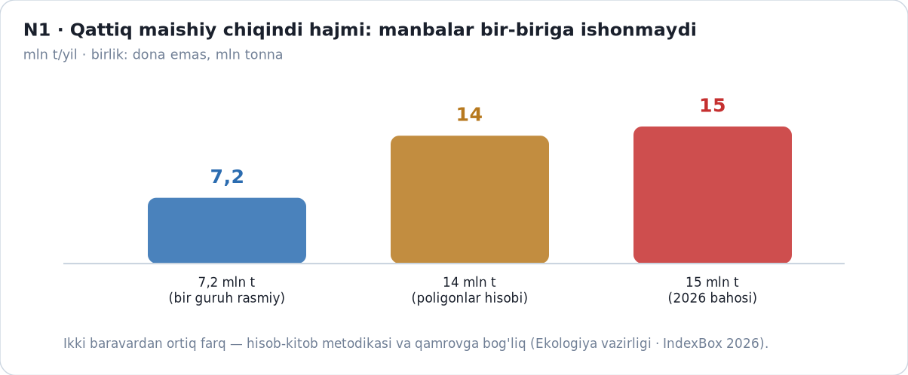
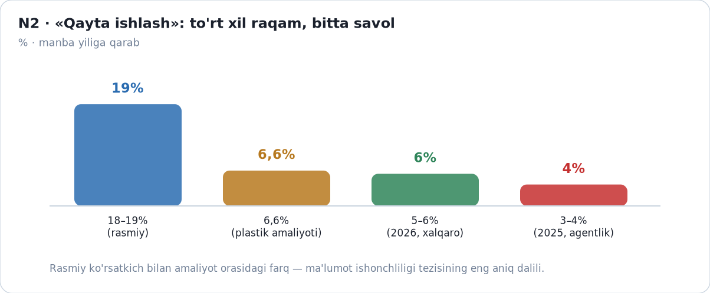
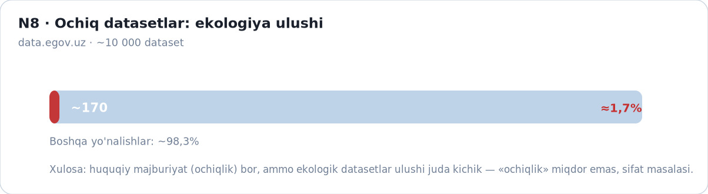
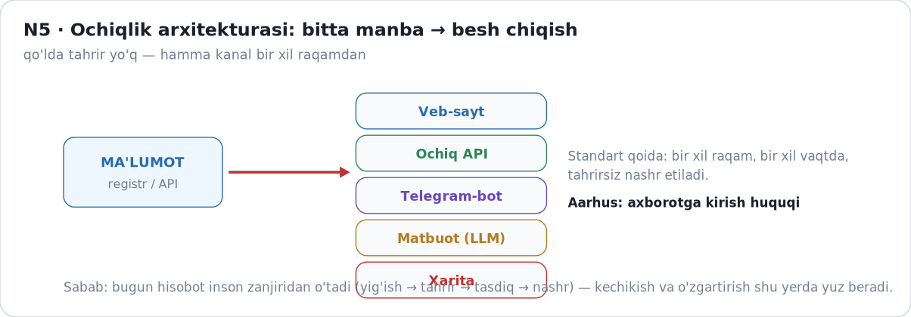
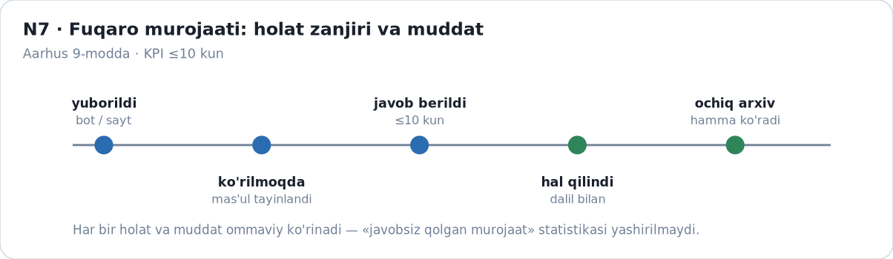
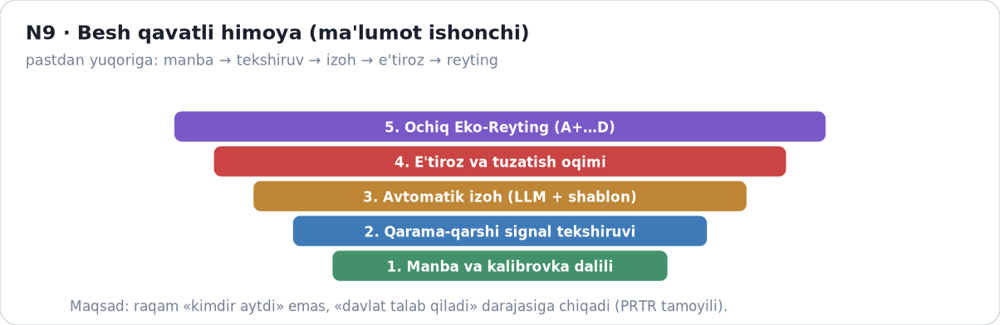
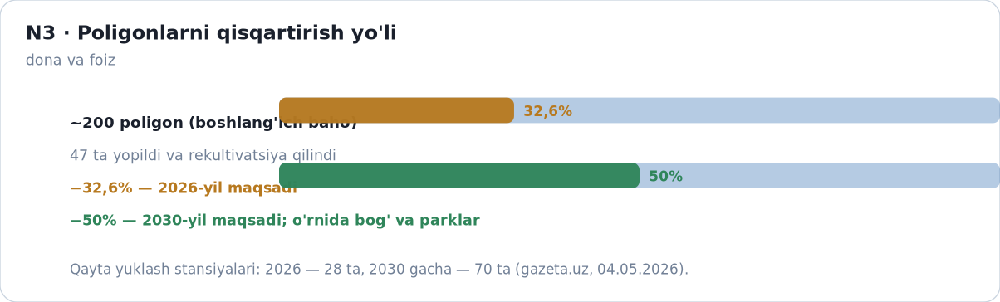
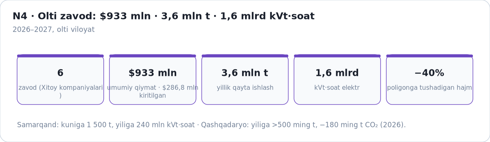
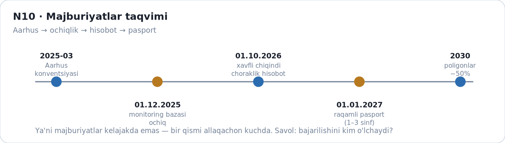

# RAQAM ISHONCHSIZ BO'LSA, QAROR HAM ADOLATSIZ

**Ikki hisob, bir savol: emissiya o'lchovi va chiqindi hisobi — O'zbekistonda ekologik haqiqatni qanday isbotlash mumkin?**

**Kalit so'zlar (12):** emissiya · o'lchov noaniqligi · avtomatik monitoring · jarima va rag'bat · apellyatsiya · chiqindi hisobi · qayta ishlash · chiqindidan energiya (WtE) · PRTR · Ochiq Eko Ledger · ochiq ma'lumot · institutsional ishonch

**Annotatsiya.** 2026-yil O'zbekiston uchun ikki muhim sana bilan boshlandi va davom etdi: 1-martdan yirik ifloslantiruvchi korxonalar uchun avtomatik o'lchov uskunalari majburiy bo'ldi, 1-oktabrdan xavfli chiqindi hosil qiluvchilar choraklik hisobot topshiradi. Ikki soha — **emissiya** va **chiqindi** — bir xil savolga kelib taqaladi: *e'lon qilinayotgan raqamga ishonish mumkinmi va u qanday qarorga aylanyapti?* Maqola ikki qismdan iborat. **I qism** o'lchov ishonchini ko'radi (noaniqlik zanjiri, himoya mexanizmlari, jarima va rag'bat, xarajat). **II qism** chiqindi hisobini va oshkoralikni ko'radi (hajm va qayta ishlash ziddiyatlari, besh kanal, zonalash, fuqaro murojaati, WtE amaliyoti). Qismlar ataylab **aralashtirilmagan**: birinchisi «o'lchov» metodologiyasi, ikkinchisi «hisob va e'lon» metodologiyasi. Umumiy xulosa bitta: **ishonch nazoratdan emas, oshkoralikdan tug'iladi** — va u o'lchanadigan, tekshiriladigan, e'tiroz bildiriladigan bo'lishi shart.

> **YAKUNIY NUSXA v5.0 (complete).** Bu hujjat ikki maqolaning yakuniy birlashtirilgan shakli: matn + raqam + grafik ketma-ketligi. Manba nusxalar (v1–v3) arxivda saqlanadi va o'chirilmaydi. Texnik implementatsiya (stack, modul, arxitektura) bu maqolada **ataylab yozilmagan** — u TZ hujjatlarida (`TZ-1`, `TZ-Ochiq-Eko-Ledger-MVP.md`).

**Muallif:** Jasur · **Konferensiya:** MMIT'26 · **Sana:** 2026-09-27

---

## 1. KIRISH — BIR YIL, IKKI HISOB, BITTA SAVOL

2026-yilning 1-martidan **avtomatik o'lchov uskunalari** o'rnatish majburiyati kuchga kirdi: shu kundan boshlab chiqindi gaz hajmi va tarkibi real vaqtda o'lchanadi. Kelasi oyning 1-oktabridan esa **xavfli chiqindi** hosil qiluvchilar har chorak hisobotini keyingi oyning 20-sanagiga qadar topshiradi. 2027-yil 1-yanvardan I–III sinf chiqindilarining har bir partiyasi **raqamli pasport** bilan yuritiladi.

Ya'ni bir yil ichida davlat ikki hisobni majburiy qildi: **o'lchov hisobi** (emissiya) va **moddiy hisob** (chiqindi). Lekin ikkalasida ham bir xil savol qoladi:

> *E'lon qilinayotgan raqam qanchalik aniq — va u asosida chiqarilgan qaror qanchalik adolatli?*

Bu savol sheriy emas. 2025-yilda ekologiya sohasida ~59 000 huquqbuzarlik qayd etildi (gazeta.uz, 01.05.2026, M). Bitta tekshiruvda 750 korxona ko'rilganda **1 trln 386 mlrd so'm** zarar va ~500 mansabdor shaxs ustidan jazo qo'llanildi (Sputnik, 05.08.2026, M). Chiqindi bo'yicha esa bir vaqtning o'zida **7,2 mln t**, **14 mln t** va **15 mln t** degan uch xil yillik hajm aytiladi (§10). Qarorlar ishlayapti — ishonch esa o'lchanmagan.

**Maqolaning shiori:** raqam ishonchsiz bo'lsa, qaror ham adolatsiz.

---

## 2. TUZILMA — IKKI QISM, BIR MANTIQ

| | **I QISM — EMISSIYA O'LCHOVI** | **II QISM — CHIQINDI HISOBI VA OCHIQLIK** |
|---|---|---|
| Savol | O'lchangan raqam qanchalik ishonchli? | Hisoblangan va e'lon qilingan raqam qanchalik ishonchli? |
| Zaif bo'g'in | **oqim** (5–17% noaniqlik) | **metod va qamrov** (hisob usuli e'lon qilinmagan) |
| Himoya taklifi | uch zonali qoida · tushuntirish kartasi · apellyatsiya | besh kanal · to'rt rangli zonalash · murojaat moduli |
| Pul o'lchovi | 5× jarima ↔ 50–70% imtiyoz ↔ 36 oy | investitsiya (WtE) va rag'bat |
| Asosiy dalil | 2 335 obyekt, ~2% avtomatik qamrov | 15 mln t chiqindi, 3–4% qayta ishlash |

**Umumiy mantiq (ikkala qismda bir xil):**

**ma'lumot → manba va noaniqlik bayoni → himoya (e'tiroz) → e'lon → tuzatish**

Qismlar ataylab aralashtirilmagan: I qism — o'lchov metodologiyasi, II qism — hisob va oshkoralik metodologiyasi. Ko'prik nuqtalari bitta: **manba havolasi** va **«ma'lumot yo'q» ham ochiq ko'rsatilishi** tamoyili.

---

## 3. I QISM — O'LCHANGAN RAQAM QAYERDAN KELADI VA QAYERDA XATO QO'SHILADI?

### 3.1. Nuqtadagi xato uch marta ko'payadi

Zanjir qisqa: **kontsentratsiya × oqim × vaqt → koeffitsient → summa**. Har bo'g'inda xato qo'shiladi, oxirida bitta summaga aylanadi.

### 3.2. Xato qayerda katta?

| Bo'g'in | Noaniqlik | Manba / daraja |
|---|---|---|
| Etalon (tayanch) | ±0,7% | 1-B tadqiqot (R) |
| **Oqim o'lchagichi (USM)** | **5–17%** | 1-B; AQSh Lehigh sinovlari (A) |
| Namuna olish (X) | ≤1% | 1-B (A) |
| S-probe | 5–6% | 1-B (A) |
| Uskuna almashganda | +20% / −9…−13% | Lehigh (A) |
| Xalqaro talab (RATA) | ≤10% / ≤7,5% | EPA CAMD (A) |

**Muhim izoh:** eng katta noaniqlik **oqim** bo'g'inida — ya'ni «qancha gaz o'tdi» degan savolda. Shuning uchun korxona va nazorat organi ko'pincha *bir xil uskunaga qarab har xil raqam* oladi; bu «yomon niyat» emas, texnik xatoning tabiiy natijasi.

### 3.3. Birinchi xulosa

Talablar (≥99,5% / ≥95% / ≥80% samaradorlik — VM-783, 3-band, R) **nuqta** sifatida yozilgan, lekin chegaraga yaqin turgan korxona uchun o'lchov xatosi «jarima» yoki «norma» degan ikki xil xulosaga olib kelishi mumkin.

---

## 4. I QISM — HIMOYA: XATONI JARIMADAN QANDAY AJRATISH MUMKIN?

### 4.1. Uch zonali qoida

Chegaralar o'lchov noaniqligidan kelib chiqadi (JCGM 106 yondashuvi, A):

- 🟢 **yashil** — L+U dan past: yozib borish, jazo yo'q;
- 🟡 **sariq** — L va L+U oralig'i: **jazo yo'q**, lekin tekshiruv va tavsiya;
- 🔴 **qizil** — L+U dan yuqori: jazo + tushuntirish kartasi.

Sariq zona — «bilmadim» zonasining rasmiy tan olinishi. Aynan shu zona bugungi tizimda yo'q: chegaraga yaqin holat ham birdaniga qizil bo'lib qoladi.

### 4.2. Tushuntirish kartasi

Qaror bilan birga **12 maydonli karta** beriladi: o'lchangan qiymat (x̄), kengaytirilgan noaniqlik (U), chegara (L), qo'llangan qoida, kalibrovka dalili, laboratoriya va uning akkreditatsiyasi (ILAC MRA, 14.09.2022, R), uskuna, sana, zona, apellyatsiya yo'li va QR havola (ISO/IEC 17025, 7.8.6, A).

> Karta korxona uchun «nega jarima oldim» degan savolga bir varaqda javob beradi. Bu — shikoyatlar sonini kamaytiruvchi eng arzon vosita.

### 4.3. Apellyatsiya oqimi

6 bosqich: **T+0** xabarnoma → **T+2 kun** korxona tushuntirishi → **10 kun** dastlabki ko'rib chiqish → **soft-hold** (pul muzlatiladi, lekin da'vo saqlanadi) → **30 ish kuni** yakuniy xulosa (O'RQ-457, R) → sud yo'li. Ayrim hujjatlarda 60 kunlik muddat ham uchraydi (MJTK — M); bu farq §10 jadvalida ochiq qoldirilgan.

---

## 5. I QISM — PUL: JAZO VA RAG'BAT QANDAY BIR TIZIMGA TUSHADI?

### 5.1. Rag'bat zinapoyasi

- o'rnatilmagan holat — **5× koeffitsient** (202-Nizom, 201-band, R);
- o'rnatilgan va hisobot ochiq — **50%**, keyin **70%** imtiyoz;
- muddat sharti — **36 oy**, pasayish **>15%** bo'lsa (202-Nizom, 301-band, R).

Demak, tizim bir vaqtda ham jazolaydi, ham rag'batlantiradi. Muammo — **oraliq holatlar yozilmagan**: 50% va 70% orasidagi farq nimaga bog'liq, kim hal qiladi, muddat qachon boshlanadi?

### 5.2. Vaqt assimetriyasi

Jazo **darhol va to'liq** qo'llanadi; qaytarish esa **2 yilga** cho'zilgan 70% imtiyoz bilan keladi. Bu assimetriya korxona uchun «o'lchov xatosi qimmat, tuzatish sekin» degan signal beradi.

### 5.3. Pul qayerdan keladi

2025-yil budjeti **900 mlrd so'm**, 2026-yil 8-ilovasi bo'yicha **548 mlrd so'm**; amalda 2026-yil I yarim yillikda jamg'arma **274 mlrd so'm** (PQ-343, R; gazeta.uz 16.09.2026, R). Raqamlar bir-biridan farq qiladi, chunki reja va amalda tushgan mablag' bir xil emas — buni ham ochiq yozish kerak.

---

## 6. I QISM — QAMROV, NARX VA HISOBOT

- **2 335 obyekt** (663 I + 1 672 II toifa — VM-783, R);
- **750 korxona** tekshirildi (2025–2026 — Sputnik, M);
- **347 stansiya** budjet hisobidan (kun.uz 25.11.2025, M); **28 HORIBA** komplekti o'rnatilgan (Anhor 08.09.2026, M); **69 avtomatik stansiya** 44 korxonada (SQ-844-IV, R).

Ya'ni 2 335 obyektdan atigi ~2% avtomatik kuzatuvda. Tekshiruv bilan yopiladigan bo'shliq esa har yili yuzlab korxona hajmida.

**«Juda qimmat» e'tirozining tekshiruvi:** CEMS (TIC) **$120–350k**, CAAQMS **$150–250k**, PM monitoring **$20–50k**, FRM/FEM **$15–40k**, BAM ≈**$30k**; yillik xizmat 5–15% / OPEX 3–6% (Applus, clarity.io, ESEGAS, Accio — 2026, M/A). UZ shartnoma summalari ochiq xaridda emas (etender/uzex login talab qiladi) — bu ham §14 ochiq savollariga kirdi.

Taklif: har chorak **5 metrika** e'lon qilinadi — signallar jami soni · sariq zona ulushi · qayta-o'lchov natijalari · apellyatsiya statistikasi · kalibrovka holati. Qizil signallarning **≥5%** i mustaqil (ILAC-MRA) laboratoriyada qayta o'lchanadi.

> **I qism xulosasi:** o'lchov ishonchini o'lchash mumkin — va kerak. Buning uchun yangi byurokratiya emas, **uch zona + karta + e'tiroz oqimi + choraklik hisobot** yetarli.

---

## 7. II QISM — CHIQINDI: NEGA TO'RT XIL RAQAM AYTILADI?

### 7.1. Hajm: ikki baravardan ortiq farq

Bir vaqtda uch xil hajm yuritiladi: rasmiy hisobotlarda **7,2 mln t/yil**, poligonlar hisobida **14 mln t/yil**, xalqaro tahlilda **15 mln t/yil** (IndexBox, 22.09.2026, M; gazeta.uz/en 05.12.2025, M). Sabab — hisob metodikasi va qamrov: nima «chiqindi», nima «ikkilamchi xom ashyo», qaysi hajm poligonga ketadi va qaysi qismi hisobga olinmaydi.

### 7.2. Qayta ishlash: to'rt xil ko'rsatkich

- rasmiy e'lonlarda **18–19%**;
- plastik bo'yicha amaliy hisobda **6,6%**;
- xalqaro bahoda **5–6%** (2026);
- agentlik rahbari 2025-yilda **3–4%** deb aytgan.

Bu «bir xil narsani to'rt xil o'lchash» holati. Farqni yashiradigan narsa bitta: **manba va metod ko'rsatilmagani**.

### 7.3. Ikkinchi xulosa

> Ishonchsizlik nazorat yetishmasligidan emas, **hisob usuli e'lon qilinmaganidan** tug'iladi. Yechim — ko'proq nazorat emas, **ko'proq oshkoralik**.

---

## 8. II QISM — OCHIQLIK: BESH KANAL, TO'RT RANG

### 8.1. Bugungi ochiqlik hajmi

`data.egov.uz` da ~10 000 dataset bor, ekologiya yo'nalishi — **~170 ta (≈1,7%)** (R). Huquqiy ochiqlik e'lon qilingan (Aarhus 2025-03; monitoring bazasi 01.12.2025 — R), miqdoriy ochiqlik esa hali kichik.

### 8.2. Bir ma'lumot — besh kanal

Bugun e'lon **inson zanjiridan** o'tadi: yig'ish → tahrir → tasdiqlash → nashr. Taklif — bir registrdan **bir vaqtda** besh kanalga chiqish: veb-sayt/dashboard · ochiq API · Telegram-bot · matbuot e'loni (LLM shablon asosida) · xarita qatlami.

Nima uchun bu **institutsional** talab? Chunki kechikish odamga emas, jarayonga xos: tahrir oynasi bo'lsa, kechikish qonuniy bo'lib qoladi. Avtomatik nashr — kechikishni yo'q qiluvchi yagona izchil vosita.

### 8.3. To'rt rangli zonalash

- 🟢 **yashil** — normativ ichida;
- 🟡 **sariq** — normativdan 1–2× oralig'ida;
- 🔴 **qizil** — 2× dan yuqori (ustuvor nazorat);
- 🔵 **ko'k-neytral** — **ma'lumot yo'q** yoki tekshiruv kutilmoqda.

Ko'k zona atayin kiritilgan: «ma'lumot yo'q» ham **ochiq ko'rsatiladi**, chunki jimjitlik yashirishga aylanmasligi kerak. Har chorak ko'k zona ulushi e'lon qilinadi.

---

## 9. II QISM — FUQARO VA ISHONCH

Murojaat besh holatdan o'tadi: **yuborildi → ko'rilmoqda → javob berildi → hal qilindi → ochiq arxiv**. KPI: **≤10 kun**; har holat va muddat ommaviy ko'rinadi; «javobsiz qolgan murojaat» statistikasi yashirilmaydi (Aarhus 9-modda — odil sudlov, R).

Ishonch arxitekturasi besh qavatdan iborat:

1. **manba va kalibrovka dalili** — har raqam qayerdan olingani;
2. **qarama-qarshi signal** tekshiruvi — hajm, transport, energiya ko'rsatkichlari bir-biriga mos keladimi;
3. **avtomatik izoh** — LLM faqat shablon ichida yozadi, **raqamni o'zgartirmaydi**;
4. **e'tiroz va tuzatish oqimi** — korxona ham, fuqaro ham;
5. **ochiq Eko-Reyting** (yaxshilanish trendi bo'yicha).

---

## 10. II QISM — 2026 AMALIYOTI: POLIGONLAR, WtE, TAQVIM

- 2025-yilda **47 poligon** yopilib rekultivatsiya qilindi; 2026 maqsadi — **−32,6%**, 2030 maqsadi — **−50%** (gazeta.uz 04.05.2026, M);
- **qayta yuklash stansiyalari** 2026 — **28 ta**, 2030 gacha — **70 ta**;
- sanitariya qamrovi 2025 — **88%**, 2026 maqsadi — **90%**.

**WtE (chiqindidan energiya) — eng katta yangi fakt:**

- **6 zavod**, umumiy qiymati **$933 mln** (Qashqadaryo, Samarqand, Toshkent, Andijon, Farg'ona, Namangan — gazeta.uz 14.09.2026, M);
- to'liq quvvatda **3,6 mln t/yil** chiqindi qayta ishlanadi, **1,6 mlrd kVt·soat** elektr olinadi;
- poligonga yuklama **−40%**; Qashqadaryo zavodi: yiliga **>500 ming t**, **−180 ming t CO₂**, ~800 ish o'rni (China Daily/Ningbo 06.05.2026, M);
- Samarqand: **1 500 t/kun**, **240 mln kVt·soat/yil** (shahar chiqindisining ~70%), start 2027-yil boshi (asiaplus 04.05.2026, M);
- Navoiy: **$260 mln** xavfli chiqindi platformasi — **330 ming t/yil** (gazeta.uz 04.05.2026, M).

**Ochiq savol:** WtE zavodlarida **dioksin va kul** monitoringi qanday e'lon qilinadi? Kuydirish **saralashdan keyin** kelishi kerak — aks holda aylanma iqtisodiyot kuydirishga aylanadi (§12.5).

---

## 11. ZIDDIYATLAR JADVALI (IKKALA QISM)

| # | Qism | Raqam A | Raqam B | Holat |
|---|---|---|---|---|
| 1 | I | 5× jazo (201-band) | amalda 50–70% imtiyoz | ochiq — oraliq holatlar yozilmagan |
| 2 | I | 30 ish kuni (O'RQ-457) | 60 kun (MJTK) | izohlangan — jarayon farqi |
| 3 | I | jazo darhol | qaytarish 2 yil | ochiq — vaqt assimetriyasi |
| 4 | I | «gacha» muddatlari | aniq sana yo'q | ochiq — §14.3 savoli |
| 5 | II | 7,2 / 14 / 15 mln t hajm | uch xil metodika | ochiq — metod e'lon qilinsin |
| 6 | II | 18–19% (rasmiy) | 3–4% / 5–6% / 6,6% | ochiq — o'lchov chegarasi |
| 7 | II | PRTR 86 modda | 91 modda (YI) | izohlangan — protokol/registr farqi |

**Qoida:** hech bir ziddiyat yashirilmagan; qoralama tamoyili bo'yicha ular ochiq qoldirilgan, yakuniy tanlov muallifga (§16).

---

## 12. MUHOKAMA — YETTI QARSHI FIKR VA JAVOB

1. **«Ochiq raqam ifloslanishni kamaytirmaydi»** (I+II) → To'g'ri, o'zi kamaytirmaydi. Lekin **javobgarlik** yaratadi: bilmagan raqam uchun hech kim javob bermaydi.
2. **«Korxona xatoni yashiradi»** (I) → Qarama-qarshi signal (hajm, transport, energiya) va ochiq e'tiroz oqimi shu uchun.
3. **«Reyting siyosiylashadi»** (I+II) → Reyting **yaxshilanish trendi** bo'yicha; metodika oldindan e'lon qilinadi.
4. **«Xarajat og'ir»** (I) → 4 blokli model va bosqichli o'rnatish: avval I toifa va yuqori emissiyali tarmoqlar.
5. **«WtE — yashil yechim emas»** (II) → To'g'ri: kuydirish saralashdan **keyin** kelishi kerak; aks holda rag'bat noto'g'ri tomonga ishlaydi.
6. **«Ko'k zona bo'shliqni yashiradi»** (II) → Aksincha: ko'k zona ochiq ko'rsatiladi va uning ulushi har chorak e'lon qilinadi.
7. **«AI izohi xato qiladi»** (II) → LLM **yangi raqam yaratmaydi**: faqat registrdagi qiymatni shablon ichida izohlaydi, har bir raqam manba havolasi bilan.

---

## 13. XULOSA VA TAVSIYALAR (12 TA)

O'zbekistonda ekologik hisob-kitob **2025–2027-yillarda institutsional sakrash** qildi: Aarhus, ochiqlik muddati, avtomatik o'lchov majburiyati, choraklik hisobot, raqamli pasport, WtE zavodlari. Endi savol **bajarilishni o'lchashda**.

| # | Tavsiya | Kimga | Qism |
|---|---|---|---|
| 1 | Har e'lon qilingan raqamga **manba + metod** qo'shilsin | Qo'mita / agentlik | I+II |
| 2 | Uch zonali qoida **rasmiy** tan olinsin (L, L+U) | Nazorat organi | I |
| 3 | Tushuntirish kartasi (12 maydon) joriy etilsin | Nazorat organi | I |
| 4 | Qizil signallarning **≥5%** mustaqil qayta-o'lchovi | Nazorat organi | I |
| 5 | Jarima va imtiyoz **bitta ko'rinadigan zinapoyaga** | Vazirlik | I |
| 6 | «Gacha» muddatlari aniq sanaga almashtirilsin | Qonunchilik | I |
| 7 | Ochiq datasetlar ulushi **1,7% → 5%** rejasi | Raqamli texnologiyalar vazirligi | II |
| 8 | Besh kanalga **bir registrdan** e'lon | Platforma operatori | II |
| 9 | Zonalash qoidasi **yagona va matematik** bo'lsin | Agentlik | II |
| 10 | Murojaat **≤10 kun** KPI ochiq kuzatilsin | Agentlik | II |
| 11 | Ko'k zona ulushi **har chorak** e'lon qilinsin | Platforma | II |
| 12 | WtE zavodlarida **dioksin/kul monitoringi** majburiy e'lon | Qo'mita / investor | II |

---

## 14. OCHIQ SAVOLLAR (KUZATUV RO'YXATI)

1. 2026 rasmiy hisobotlari: emissiya dinamikasi qanday?
2. PM2,5 trendi (2026 yanvar–fevralda pasayish qayd etilgan — gazeta.uz 24.03.2026, M) davom etdimi?
3. PQ-343 platformasi (01.09.2026) ishga tushdimi va nima e'lon qilinmoqda?
4. 347 stansiya rejasi qaysi bosqichda?
5. «Gacha» muddatlari aniqlashtirildimi?
6. WtE zavodlari ishga tushdimi va **qanday ko'rsatkichlar** bilan?
7. Dioksin/kul monitoringi kim tomonidan va qayerda e'lon qilinadi?
8. Ochiq datasetlar ulushi o'zgardi mi (1,7% dan)?
9. Murojaatlarning o'rtacha javob muddati qancha?
10. Poligonlar 2026-yilda **−32,6%** ga yetdimi?

---

## 15. MANBALAR

**I QISM (E-turkum, Maqola 1 v1–v2 dan):**

| Kod | Manba | Sana | Daraja |
|---|---|---|---|
| E1 | VM-783 (lex.uz/uz/docs/-7233437) | 2020 (tahrir 2025–26) | R |
| E2 | 202-Nizom (lex.uz/uz/docs/-5367873) — 201/301-band | — | R |
| E3 | PF-16 · VM-85 (lex.uz/uz/docs/-8068163) | 2025–2026 | R |
| E4 | PQ-343 (lex.uz/uz/docs/-7847341) · PQ-347 | 2026 | R |
| E5 | O'RQ-457 · MJTK | — | R |
| E6 | EPA CAMD — RATA; 40 CFR 22 | — | A |
| E7 | JCGM 106 · ILAC G8 · ISO/IEC 17025 7.8.6 | — | A |
| E8 | Lehigh tadqiqoti (+20% / −9…−13%) | — | A |
| E9 | Applus · clarity.io · ESEGAS · Accio (narxlar) | 2026 | M/A |
| E10 | Sputnik — 750 korxona, 1 trln 386 mlrd | 05.08.2026 | M |
| E11 | gazeta.uz — ~59 000 huquqbuzarlik (2025) | 01.05.2026 | M |
| E12 | gazeta.uz — Muborak 10,834 mlrd · Boysun 8,5 mlrd | 13.05.2026 | M |
| E13 | gazeta.uz — jamg'arma 274 mlrd (I yarim yil) | 16.09.2026 | M |
| E14 | gazeta.uz — VM-85 tartib (15 ish kuni) | 02.03.2026 | M |
| E15 | kun.uz — 347 stansiya; Anhor — 28 HORIBA; SQ-844-IV | 2025–2026 | M/R |
| E16 | uza.uz — 9 sement zavodida avtostansiya | 29.11.2025 | R |
| E17 | gazeta.uz — PM2,5 pasayishi; monitoring postlari | 24.03.2026 | M |
| E18 | IndexBox · gazeta.uz/en · akipress (WtE sarmoya) | 2025–2026 | M |

**II QISM (N-turkum, Maqola 2 v1–v3 dan):**

| Kod | Manba | Sana | Daraja |
|---|---|---|---|
| N-1 | gazeta.uz — 6 WtE zavod, $933 mln, 3,6 mln t, 1,6 mlrd kVt·soat | 14.09.2026 | M |
| N-2 | gazeta.uz — poligonlar −32,6% / −50%; 28→70 stansiya | 04.05.2026 | M |
| N-3 | spot.uz — poligonga −40%; $625 mln, 5 hudud | 14.09.2026 | M |
| N-4 | IndexBox — 15 mln t/yil; qayta ishlash 5–6% | 22.09.2026 | M |
| N-5 | China Daily/Ningbo — Qashqadaryo >500 ming t, −180 ming t CO₂ | 06.05.2026 | M |
| N-6 | asiaplus — Samarqand 1 500 t/kun, 240 mln kVt·soat/yil | 04.05.2026 | M |
| N-7 | PQ-4291 (lex.uz) — 2026–28: 70/26/1/27; ≥60% qayta ishlash | 17.04.2019 | R |
| N-8 | Aarhus konventsiyasi · monitoring 01.12.2025 · pasport 01.01.2027 | 2025–2027 | R |
| N-9 | data.egov.uz — ~10 000 dataset, ekologiya ~170 (≈1,7%) | 2026 | R |
| N-10 | UNECE PRTR protokoli · YI E-PRTR / IED 2.0 | 2003 / 2024 | R/A |

To'liq dalil to'plamlari: `Maqola1-CarbonEmission/Maqola-EGAZ-BALANS.md` (v1) va `Maqola2-TrashOrganizer/Maqola-Ochiq-Eko-Ledger.md` (v1) — **o'chirilmaydi**.

---

## 16. QORALAMA — YAKUNIY TANLOV MUALLIFGA QOLDIRILADI

**16.1. Sarlavha variantlari:**
1. **«Raqam ishonchsiz bo'lsa, qaror ham adolatsiz»** (joriy);
2. «Bir yil, ikki hisob: o'lchov va chiqindi — ishonch kim tekshiradi?»;
3. «2 335 obyekt va 15 mln tonna: ishonchning ikki kitobi»;
4. «Ko'rinmas ifloslanish, ko'rinmas raqam».

**16.2. Tuzilma qarorlari:**
- Ikki qismni **birlashtirish** (bor) yoki **ikki alohida maqola** sifatida chop etish (variant);
- 20 grafikdan qaysilari nashrda qoldirilishi (matn + 8–12 grafik variant);
- I qism va II qism sarlavhalarini umumiy shior ostida berish yoki alohida.

**16.3. Ochiq qoldirilgan savollar:** §14 (10 savol) — javoblar tashqi hisobotlarga bog'liq.

**16.4. Ishlatilmagan dalillar (arxiv):** 1 548–2 107 qoidabuzarlik (choraklik ekopolitsiya statistikasi) · ~17% ijro darajasi · Xitoy IPE 337 shahar · E-PRTR bloklangan davri · Ekologik madaniyat kontseptsiyasi.

---

**Hujjat holati:** YAKUNIY v5.0 (2026-09-27) — **complete nusxa** (I qism: 10 grafik; II qism: 10 grafik; jami 16 bo'lim). Manba maqolalar v1–v3 arxivda saqlanadi. Yakuniy tanlov — muallif (Jasur) tomonidan.
